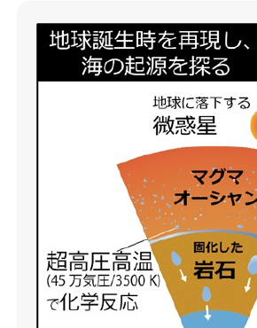
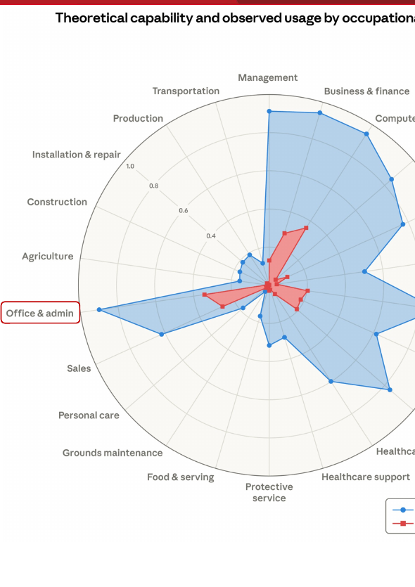
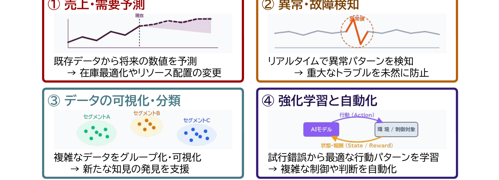
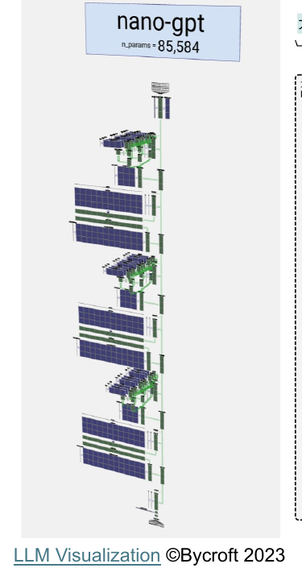
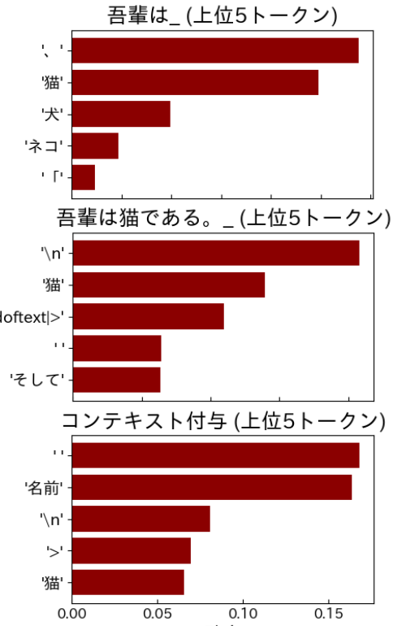
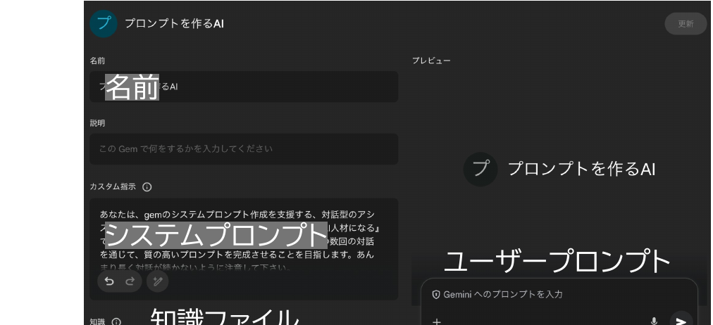

開始の前に

<b>① PCを立ち上げ、お持ちの 　 千葉大学Google Workspaceにログインして下さい</b> → 学校のGmailが立ち上がる状況ならOKです。

<b>② インタラクションツール Slidoにアクセスして下さい</b> URLを配布したり、質問やアンケートをとったりします

※お名前などの個人情報は入力しないで下さい。 ※<b>slido/ワーク</b>への入力情報のうち【個人情報や機微情報を除いた】情報をアカデミック・リンク・センター／附属図書館において、業務改善・調査研究・外部発表等に用います。個人が特定される情報や、利用されたくない情報については、入力しないようご注意ください。

スマホから

QRコードを読み取り、Slidoにアクセス

PCから
<ul><li>方法1　Google検索「Slido」→コード入力 <b>ALC-AI2-01</b></li><li>方法2　直接リンク</li></ul>
https://app.sli.do/event/iJQ71dhpuqstH3wbGSYpRD

<!--
- 始める前に。①千葉大Google Workspaceにログイン（学校のGmailが開けばOK）、②Slidoにアクセス。個人情報は入力しない。
-->

---

講師紹介

たがわ　しょう

田川　翔

オープンバッジ

<b>所属：</b>千葉大学 高等教育センター/アカデミックリンクセンター

大学教育を企画し、学生と教員を支援する仕事

①元々は理学の人

Tagawa et al. (2021) Nat. Commun.

②色々な仕事経験
<ul><li>大学のICT支援 (コロナ禍)</li><li>大規模オンライン授業の作成</li><li>民間企業での経験</li><li>AI×大学</li></ul>

③大学を学びやすく!
<ul><li>大学での教え方</li><li>生成AIの教育利活用 現在、Teaching with AIを翻訳・出版準備中</li></ul>

<!--
- 講師の田川です。元々は理学（地球科学）出身で、Nature Communicationsに論文。大学のICT支援や大規模オンライン授業、民間経験も。今は「大学での教え方」と生成AIの教育利活用を進めています。
-->

---

<!-- _class: cover-hero -->

学びを変える！研究を深める！

生成AI活用術

2026年度 第1回：<b>プロンプティング</b>と<b>生成AIの仕組み</b>の基礎

15-min or 30-min × 3 sessions

国際未来教育基幹 田川 翔

<b>学部1年生にも おすすめ</b>

<!--
- 本講座のタイトル「学びを変える！研究を深める！生成AI活用術」。第1回はプロンプティングと生成AIの仕組みの基礎。学部1年生にもおすすめです。
-->

---

今回の構成

最初の15分

講義

- AI/生成AIとは何かを理解する - プロンプティングのコツを知る - 千葉大学のGeminiの機能と利点を知る

真ん中<b style="font-size:28px;">30</b>分 (前半だけも可)

体験

- Geminiの機能を最大限使いこなしてみる - 気づきを共有してみる

最後の15分

議論・座談会

- 今日学んで面白かったことは何でしたか。 - AIの学び方って、どうすれよいと思いますか。 - 今後、どんな点を特に学んでみたいですか。

<!--
- 今回は3部構成。最初の15分が講義、真ん中30分が体験（前半だけでもOK）、最後の15分が議論・座談会です。
-->

---

<!-- _class: cover-hero -->

学びを変える！研究を深める！

生成AI活用術

2026年度 第1回： プロンプティングと生成AIの仕組みの基礎

15-min sessions

<b>Session 1：</b>プロンプティングのコツと生成AIの基礎

国際未来教育基幹 田川 翔

<!--
- ここからSession 1。「プロンプティングのコツと生成AIの基礎」をテーマに進めます。
-->

---

Session 1の目的・到達点

目的

<b>Session 1：</b> プロンプティングのコツと生成AIの基礎を知る！

目標

・ AI/生成AIとは何かを理解する 
・ プロンプティングのコツを知る 
・ 千葉大学のGeminiの機能と利点を知る

<!--
- Session 1の目的は「プロンプティングのコツと生成AIの基礎を知る」。目標は3つ：①AI/生成AIの理解、②プロンプティングのコツ、③千葉大Geminiの機能と利点。
-->

---

生成AIの学び方

<b>生成AIの利活用に、現時点で正解はあるか？</b> <b>生成AIは、学習・研究で不可欠な相棒か？</b> <b>生成AI時代は学び方を必ず変えないといけないか？</b>

▶ ？

… しかし、生成AI技術は進歩し、<b style="color:var(--tag-green);">仕事</b>や<b style="color:var(--accent-dark);">研究</b>にも影響を与えつつある

受講者の皆様が、生成AIは「相棒になるか」を<b>自ら考え</b>、 <b>必要なときに、使えるようになる</b>ことが重要

<b>生成AIとの付き合い方</b>を決めるのは<b>あなた自身</b> <b>これからの15minsでは</b>、そのための材料をお渡しします

<!--
- 生成AIに今「正解」はあるか、不可欠な相棒か、学び方を必ず変えるべきか。答えは「？」。でも技術は進歩し仕事や研究に影響しつつある。だからこそ、相棒になるかを自ら考え、必要なときに使えることが大事。付き合い方を決めるのはあなた自身です。
-->

---

生成AIの学び方

生成AIを活用するコツってなんだろう？どうすれば学べるんだろう？

✓ <b style="color:var(--accent-dark);">生成AIは単なる手段</b> ✓ 最終的には、<b style="color:var(--accent-dark);">自分がより学び、より良い人生を生きること</b> その文脈の中で、<b>生成AIを活かす方法と理由</b>を考えたい

AIリテラシー

個人がAI技術を<b>批判的に</b>評価し、AIと効果的に<b>コミュニケーションおよび協働</b>し、<b>オンライン、家庭、職場でAIをツールとして利活用でき</b>るようにするコンピテンシー(「できる」知識・スキル・態度)の集合体

Long &amp; Magerko (2020) <i>CHI</i>　／　<b>30個以上</b>のコンピテンシーが提案されている (e.g. Laupichler et al. 2022 <i>CAEAI</i>)

AI教育方法論

足場かけ体験学習

Plan-Iterate-Evaluate loop

Anders &amp; Dux Speltz (2025) <i>CAEAI</i>

コミュニティ中心方略

e.g. <i>AI cafe</i>

Hutler et al. (2025) <i>AI and Society</i>

みんなで試し、話すことで、AIリテラシを伸ばす場にしましょう！

<!--
- 生成AIを活用するコツとは何か。生成AIは単なる手段で、最終的には自分がより学び良い人生を生きること、その文脈で活かす方法と理由を考えたい。AIリテラシーは批判的評価・協働・利活用のコンピテンシー集合体で、30個以上提案。教育方法論として足場かけ体験学習とコミュニティ中心方略。みんなで試し話す場にしましょう。
-->

---

生成AIの仕事への影響

AIの仕事への影響度合い

Massenkoff and McCrory (2026) Anthropic /Economic Research

<b>時間×タスクでのAIカバレッジ指標</b> 軸：　AIを全く使ってなかった時 <b style="color:var(--tag-blue);">青</b>： AIで理論上、2倍効率化する範囲 (Eloundou et al., 2023) <b style="color:var(--accent);">赤</b>： 自動化/効率化が観察された範囲 (2025/8・11の利用実績：”暴露度”)

例 Education &amp; Library： <b style="color:var(--tag-blue);">青</b>≒60%分の時間×タスクがAIで効率化/代替可能 <b style="color:var(--accent);">赤</b>≒20%分のタスクがClaudeに実行結果がある

① いわゆる<b style="color:var(--accent);">ホワイトカラーの大半</b>に影響　　② 今後、<b style="color:var(--accent);">赤</b>が<b style="color:var(--tag-blue);">青</b>に近づく cf. 軸も変わる　　③ 現時点で雇用は影響ないが、<b>若手で変化</b>

<!--
- AIの仕事への影響。Massenkoff and McCrory (2026)、Anthropic Economic Research。時間×タスクでのAIカバレッジ指標で、青は理論上2倍効率化する範囲、赤は実際に自動化が観察された範囲。Education & Libraryでは青が約60%、赤が約20%。①ホワイトカラーの大半に影響、②今後赤が青に近づく、③雇用は現時点で影響ないが若手で変化。
-->

---

AIってなに？

<b>AI：</b> 人が知的だと感じる処理を実現するシステム

<svg viewBox="0 0 360 360" xmlns="http://www.w3.org/2000/svg" style="width:100%;">
<rect x="2" y="2" width="356" height="356" rx="20" fill="#ECECEC"/>
<text x="180" y="34" text-anchor="middle" font-size="22" font-weight="700" fill="#1a1a1a">数理・統計・DS</text>
<rect x="30" y="46" width="300" height="296" rx="18" fill="#2C6E73"/>
<text x="180" y="76" text-anchor="middle" font-size="22" font-weight="700" fill="#ffffff">人工知能 (AI)</text>
<rect x="58" y="90" width="244" height="238" rx="16" fill="#D6E8D0"/>
<text x="180" y="118" text-anchor="middle" font-size="22" font-weight="700" fill="#1a1a1a">機械学習</text>
<rect x="86" y="132" width="188" height="180" rx="14" fill="#F7E2C4"/>
<text x="180" y="160" text-anchor="middle" font-size="22" font-weight="700" fill="#1a1a1a">深層学習</text>
<rect x="116" y="180" width="128" height="110" rx="12" fill="#D89A98"/>
<text x="180" y="244" text-anchor="middle" font-size="22" font-weight="700" fill="#1a1a1a">生成AI</text>
</svg>

分類したり、予想したり、処理したり…

生成AIを使っていなくても、 <b>YouTubeのおすすめ</b>や、 <b>運転支援・お掃除ロボット</b>や、 <b>今日のスーパーの仕入れ管理</b>など、 様々なところで利用されている

機械学習
深層学習
信頼性・再現性・ 速度/費用・適合性…

日常はすでに、<b>AIアルゴリズムに囲まれて、便利になっている</b>

<!--
- AIとは「人が知的だと感じる処理を実現するシステム」。広い順に数理・統計・DS＞人工知能＞機械学習＞深層学習＞生成AIと入れ子。生成AIを使っていなくても、YouTubeのおすすめや運転支援・お掃除ロボット、スーパーの仕入れ管理など、すでにAIに囲まれて便利になっています。
-->

---

深層学習・機械学習

<b>機械学習/深層学習</b>で実現すること

統計や機械学習は、<b>未来</b>や<b>全体</b>を知ることができない人間が、 <b>世界を理解したり、作業を実行するために</b>編み出した技術

<!--
- 機械学習・深層学習で実現すること。①売上・需要予測（在庫最適化）、②異常・故障検知（トラブル未然防止）、③データの可視化・分類（新たな知見）、④強化学習と自動化（複雑な制御）。統計や機械学習は、未来や全体を知れない人間が、世界を理解し作業を実行するために編み出した技術です。
-->

---

生成AIの仕組み

<b>大規模言語モデルの中身 → ◯ 巨大な数字の塊　　✗知識集・ルール集</b>

ネクストワードプレディクション

日本の首都__→日本の首都は__→日本の首都は東京__

次の言葉(トークン)の確率を予想する問題

学習

パラメーター の函

数字の羅列

出力

入力

評価

GPT 4：アメリカ議会図書館の<b>全蔵書の約22倍</b>相当?　※書籍、記事、ウェブサイト、コードなど幅広いテキストソースを元に学習している（更新）

<!--
- 生成AIの仕組み。大規模言語モデルの中身は「巨大な数字の塊」で、知識集やルール集ではありません。やっているのはネクストワードプレディクション＝次のトークンの確率を予想する問題。パラメーターの函（数字の羅列）に入力し、出力を評価して更新する学習を繰り返す。GPT-4の学習量はアメリカ議会図書館の全蔵書の約22倍相当とも。
-->

---

生成AIの仕組み

利用 (推論・生成)

<table style="width:100%; border-collapse:collapse; table-layout:fixed; font-size:19px; text-align:center;">
<tr style="font-weight:800; font-size:22px;">
<td style="padding-bottom:3px;">計算1回目</td>
<td style="padding-bottom:3px;">計算2回目</td>
<td style="padding-bottom:3px;">計算3回目</td>
</tr>
<tr>
<td>
“吾輩は”
</td>
<td>
“吾輩は猫”
</td>
<td>
“吾輩は猫で”
</td>
</tr>
<tr><td colspan="3" style="font-size:20px; color:#5a5f66; padding:1px 0;">▲ 出力</td></tr>
<tr>
<td>
出力
</td>
<td>
出力
</td>
<td>
出力
</td>
</tr>
<tr><td colspan="3" style="font-size:20px; color:#5a5f66; padding:1px 0;">▲</td></tr>
<tr>
<td>
AI処理 (デコーダ)
</td>
<td>
AI処理 (デコーダ)
</td>
<td>
AI処理 (デコーダ)
</td>
</tr>
<tr><td colspan="3" style="font-size:20px; color:#5a5f66; padding:1px 0;">▲</td></tr>
<tr>
<td>
前処理
</td>
<td>
前処理
</td>
<td>
前処理
</td>
</tr>
<tr><td colspan="3" style="font-size:20px; color:#5a5f66; padding:1px 0;">▲</td></tr>
<tr>
<td>
入力
</td>
<td>
入力
</td>
<td>
入力
</td>
</tr>
<tr><td colspan="3" style="height:4px;"></td></tr>
<tr>
<td>
“吾輩”
</td>
<td>
“吾輩は”
</td>
<td>
“吾輩は猫”
</td>
</tr>
</table>

モデル： cyberagent/open-calm-7b

<!--
- 推論・生成のしくみ。「吾輩」→「吾輩は」→「吾輩は猫」と、前の出力を入力に戻しながら1トークンずつ計算を繰り返す（自己回帰）。
- 右は実モデル open-calm-7b で次トークンの上位5候補と確率を示したもの。文脈（コンテキスト）を足すと確率分布が変わる。
-->

---

生成AIの仕組み

# まとめ — この3つだけ

① 大規模言語モデルがしていることとは <b>次のもっともらしい単語(Token)を予測する作業</b>

② 大規模言語モデルの中身とは <b>ルール集ではなく、数字(統計的な重み)の塊</b>

③ なぜ精度が上がったり、複雑なことも出来るのか <b>繰り返し推論したり、ツール/情報を接続できるから</b>

まずは、この<b>3つ</b>だけ、覚えましょう　→詳細・体験・倫理は第4回へ

<!--
- 仕組みパートのまとめ。①次トークン予測、②中身は数字の塊、③繰り返し推論・ツール接続で高度化。まずこの3つだけ覚えればよい。
-->

---

プロンプトとは？

# プロンプトとは？

<b>プロンプト：</b>　生成AIに、<b>実行すべきタスクの生成を促す</b>、自然言語による文章のこと

<b>プロンプトエンジニアリング：</b>　生成AIから望ましい出力を得るために、指示や命令を設計、最適化すること

<b>コンテキストエンジニアリング：</b>　生成AIに読み込ませる中身を選択し、正確で関連性の高い出力を生成できるよう、タスクに必要な背景情報や前提条件（コンテキスト）を整理・最適化すること

<b>コンテキスト内学習：</b>　プロンプトに与えた文章から、生成AIがタスクの結果を生成できるようになること

<b>良いプロンプト・コンテキスト</b>を入れれば、AIがより精度の高い情報を戻すようになる

<!--
- プロンプト＝AIにタスクを促す自然言語の文章。それを設計・最適化するのがプロンプトエンジニアリング、背景情報まで整えるのがコンテキストエンジニアリング。
- 与えた文章からその場でタスクを覚えるのがコンテキスト内学習。良いプロンプト・コンテキストほど精度が上がる。
-->

---

プロンプトのコツ

# プロンプトのコツ

<b>Few-shot：</b> プロンプト内に「入力例」と「出力例」のデモを提供しより高性能な結果を得る技法。コンテキスト内学習をGPTが出来るので、実現する

Prompt Engineering Guide　https://www.promptingguide.ai/jp/techniques/fewshot

Google検索的 (単語)

これは素晴らしい! 感情?

Zero-shot

「これは素晴らしい!」と 書いた書き手の感情を教えて下さい

Few-shot

あの映画は最高だった! &gt;ポジティブ これは酷い! &gt;ネガティブ 「これは素晴らしい!」&gt;?

スキーマ ：

回答してほしいことをすべて構造化し、回答形式として指定する。 <b>※Few-shotを組み合わせ、回答を例示する</b>

例)

<b>授業のタイトル：</b> 　目的： 　到達目標： 　宿題の案：

<!--
- Few-shotは入力例と出力例のデモを与える技法。Google検索的な単語、Zero-shot（例なし指示）、Few-shot（例つき）の3段階で精度が上がる。
- スキーマは回答形式を構造化して指定する。Few-shotと組み合わせて回答例まで示すと安定する。
-->

---

複雑な処理を行う時のコツ

# 複雑な処理を行う時のコツ

図5-3　簡易プロンプト

<b>Request</b> (依頼) を出す

<b>Role</b> (役割) を決める

<b>Regulation</b> (形式) を指定する

図5-5　詳細プロンプト

<b>Request</b> (依頼) を出す

<b>Role</b> (役割) を決める

<b>Regulation</b> (形式) を決める

<b>Rule</b> (ルール) を決める

<b>Review &amp; Refine</b> (詳細・改善) を求める

図5-1　プロンプト上手になるための7つのポイント

<table style="width:100%; border-collapse:collapse; font-size:20px; line-height:1.4;">
<tr><td style="vertical-align:top; padding:3px 8px 3px 0; font-weight:800; color:var(--accent-dark); white-space:nowrap;">① 明確な質問</td><td style="padding:3px 0;">曖昧な質問でなく明確な質問をすることで、より良い回答が得られます。</td></tr>
<tr><td style="vertical-align:top; padding:3px 8px 3px 0; font-weight:800; color:var(--accent-dark); white-space:nowrap;">② 具体性</td><td style="padding:3px 0;">トピックや要求に具体的な詳細を提供することで、適切な回答を引き出すことができます。</td></tr>
<tr><td style="vertical-align:top; padding:3px 8px 3px 0; font-weight:800; color:var(--accent-dark); white-space:nowrap;">③ プロンプトの構造</td><td style="padding:3px 0;">質問を構造化して、抜け・漏れをなくします。</td></tr>
<tr><td style="vertical-align:top; padding:3px 8px 3px 0; font-weight:800; color:var(--accent-dark); white-space:nowrap;">④ 文脈の提供</td><td style="padding:3px 0;">重要な文脈や背景情報を提供します。</td></tr>
<tr><td style="vertical-align:top; padding:3px 8px 3px 0; font-weight:800; color:var(--accent-dark); white-space:nowrap;">⑤ 複数の質問</td><td style="padding:3px 0;">必要に応じて、複数の質問を連続して投げます。</td></tr>
<tr><td style="vertical-align:top; padding:3px 8px 3px 0; font-weight:800; color:var(--accent-dark); white-space:nowrap;">⑥ ステップバイステップ指示</td><td style="padding:3px 0;">段階的に考えさせます。</td></tr>
<tr><td style="vertical-align:top; padding:3px 8px 3px 0; font-weight:800; color:var(--accent-dark); white-space:nowrap;">⑦ 校正とフィードバック</td><td style="padding:3px 0;">得られた結果を評価し、精度向上を促します。</td></tr>
</table>

『ChatGPT時代の文系AI人材になる』| 野口 竜司（東洋経済新報社 2023）

困ったら、生成AIと一緒にプロンプトを作ろう

<!--
- 複雑な処理は、依頼(Request)・役割(Role)・形式(Regulation)を基本に、ルールやReview & Refineを足して詳細化する。
- 7つのポイント（明確さ・具体性・構造・文脈・複数質問・段階指示・校正）も意識。困ったら生成AIにプロンプト自体を作らせるのが早い。
-->

---

大学のGeminiのメリット

# 大学のGeminiのメリット

① 入力が学習されない！ (オプトアウト済)　※大学版のCopilotも同様

② 学習向けのチューニング (商用版よりは依存しにくい)　※名前を呼んだり馴れ馴れしくない

③ Google WSと連携できる (@マークで読み込み簡単)

以下に対処する意図でチューニングされている

・AIへの過依存（答えを全部もらう）

・認知的オフロード（自分で考えなくなる）

・受動的学習（情報を受け取るだけ）

作業自動化

返信案の作成

大学版は、個人購入版よりも安心が大きいのと連携がウリ

<!--
- 大学版Geminiの3つのメリット。①入力が学習されない（オプトアウト済）、②学習向けにチューニング（過依存しにくい）、③Google Workspaceと@で簡単連携。
- AIへの過依存・認知的オフロード・受動的学習に対処する設計。個人購入版より安心と連携が強み。
-->

---

Geminiで出来る色々

# Geminiで出来る色々

スライドの作成・修正

プログラムの対話的作成

絵・音声の文字起こし

絵/漫画の出力 ・ 図の修正

授業の解説や問題の作成

暗記の支援

曲/動画の作成

検索(DeepResearch) スプレッドシートの分析 カレンダー/ToDo書込 業務支援ワークフロー

大学全体で共有 → 授業や職務で活用しやすい / 研修も実施

<!--
- Geminiでできることは幅広い。スライド作成・修正、対話的なプログラム作成、絵/漫画の出力や図の修正、曲/動画の作成、文字起こし。
- 授業の解説・問題作成、暗記支援、DeepResearch検索、スプレッドシート分析、カレンダー/ToDo書込、業務ワークフローまで。大学全体で共有し研修も実施。
-->

---

Session 1の目的・到達目標

# 振り返り

目的

Session 1： プロンプティングのコツと生成AIの基礎を知る！

目標 ＋まとめ

AI/生成AIとは何かを理解する

次のトークンを予測する仕組み

繰り返しの推論やツール/情報を接続して性能向上

プロンプティングのコツを知る

7R法/Few shot/スキーマ利用

困ったら生成AIに書かせる

千葉大学のGeminiの機能と利点を知る

オプトアウト、学習にむけた最適化、WSとの連携

<!--
- Session 1の振り返り。目的は「プロンプティングのコツと生成AIの基礎を知る」。
- 目標とまとめ：①AI/生成AIの仕組み（次トークン予測・繰り返し推論・ツール接続）、②プロンプトのコツ（7R法・Few shot・スキーマ・困ったらAIに書かせる）、③千葉大Geminiの機能と利点（オプトアウト・最適化・WS連携）。
-->

---

<!-- _class: cover-hero -->

学びを変える！研究を深める！

生成AI活用術

2026年度 第1回： プロンプティングと生成AIの仕組みの基礎

30-min sessions

Session 2： Geminiの機能を最大限使いこなしてみる

国際未来教育基幹 田川 翔

<!--
- セッション区切り（中扉）。ここから Session 2：Geminiの機能を最大限使いこなしてみる。30分のハンズオンに入る。
-->

---

本日のワークの中身

# 本日のワークの中身

<b>どっちか：</b>　まずは、Geminiに詳しくなりたい人向け　初級編：Geminiを使い倒す　／　定型作業・マニュアルを自動化したい人向け　中級編：Gemsを作ってみる

Phase 1 仲間を作る！

<b>会場：</b> まずは、ペアか3人で集まってみましょう。3分時間を取るので、簡単に<b>自己紹介</b>を(チーム内で別々を選んでもOK)

<b>zoom：</b> <b>原則1人</b>でAIと実施です。但し、Breakoutを作ります。関心があれば、2-3人で散らばってみて下さい。

Phase 2 手順書で実践

各自、<b>実践してみる</b>。困ったら自己紹介した人に聞いてみて下さい。進行は、<b>一人も協力もOKです。</b>講師/スタッフへの質問もOKです。進行すると共に、Spreadsheetを順次、埋めて下さい。

Phase 3 評価・反省

気づいたことを、グループまたは個人でまとめて、<b>slido</b>に記入する。※グループになったところは、まずはメンバーで話してみましょう。※他の人の作品を試してみて、気付きを得るのも良い。

※slido/ワークへの入力情報のうち【個人情報や機微情報を除いた】情報をアカデミック・リンク・センター／附属図書館において、業務改善・調査研究・外部発表等に用います。個人が特定される情報や、利用されたくない情報については、入力しないようご注意ください。

<!--
- ワークは3フェーズ。Phase 1で仲間づくり（会場はペア/3人で自己紹介、zoomは原則1人）。
- Phase 2は手順書で実践しSpreadsheetを埋める。Phase 3で気づきをまとめてslidoに記入。初級＝Geminiを使い倒す、中級＝Gemsを作る。
-->

---

ワーク① Geminiの機能を使う

# ワーク① Geminiの機能を使う

<b>手順書にしたがって、Geminiの機能を使ってみよう (標準 20分)</b>

手順書内にプロンプトがあるので、それぞれやってみましょう。

<b>① Google カレンダーに予定を立てる。読み込む。</b>

アプリ連携

<b>② 概念を暗記するための4択問題を5個作ってみる。</b>

ガイド付き学習

<b>③ AIリテラシーの歌(30秒)を作ってみる。</b>

Lyria 3

<b>④ Webを検索してみる。</b>

Ground機能

<b>⑤ 文章を翻訳させたり、Geminiと共同編集してみる。</b>

Canvas機能

<b>⑥ 問題の解説をさせてみる</b>

マルチモーダル機能

<b>⑦ 英語と日本語まじりで会話してみる(スマホアプリ版必要)</b>

Live機能

やったことある分は、～(使ってる！)と書いてとばしましょう。1項目終わるごとに、ここに◯(使える！)・△(微妙)・✗(間違った)で評価を記入してみましょう。完了した人は、応用のワーク2に取り組んでみましょう。

<!--
- ワーク①は手順書に沿って20分でGeminiの機能を一通り試す。①カレンダー連携、②4択問題作成、③AIリテラシーの歌(Lyria 3)、④Web検索(Ground)。
- ⑤翻訳・共同編集(Canvas)、⑥問題解説(マルチモーダル)、⑦英日まじり会話(Live)。済みは飛ばし、各項目を◯△✗で評価。終わったらワーク2へ。
-->

---

Session 2の目的・到達目標

# 振り返り

目的

Session 2： Geminiの機能を最大限使いこなしてみる

目標 ＋まとめ

・半構造化データから役立つ情報を引き出せた

・構造化データの近未来の分析を体験できた

<!--
- Session 2の振り返り。目的は「Geminiの機能を最大限使いこなしてみる」。
- 目標とまとめ：半構造化データから役立つ情報を引き出せた／構造化データの近未来の分析を体験できた。
-->

---

Session 3

学びを変える！研究を深める！

生成AI活用術

2026年度 第1回： プロンプティングと生成AIの仕組みの基礎

15-min sessions

<b>Session 3：</b> 今日の気づきをみんなで共有してみる。

国際未来教育基幹　田川 翔

<!--
- ここからSession 3。最後の15分は、今日の気づきをみんなで共有してみます。
-->

---

Session 3の進め方

# 議論・座談会最後の15分

- 今日学んで面白かったことは何でしたか。 
- AIの学び方って、どうすれよいと思いますか。 
- 今後、どんな点を特に学んでみたいですか。

※slidoへの入力情報のうち【個人情報や機微情報を除いた】情報をアカデミック・リンク・センター／附属図書館において、業務改善・調査研究・外部発表等に用います。個人が特定される情報や、利用されたくない情報については、入力しないようご注意ください。

Slidoで進めます

スマホから

PCから

方法1　Google検索「Slido」→コード入力　ALC-AI2-01 
方法2　直接リンク　https://app.sli.do/event/iJQ71dhpuqstH3wbGSYpRD

<b>お願い：協力的な場作りが、学びの秘訣です。</b> 
敬意をもって、忌憚なく、建設的に、話し合いましょう

<!--
- 最後の15分は議論・座談会。Slidoで「面白かったこと／AIの学び方／今後学びたいこと」を共有します。協力的な場作りが学びの秘訣です。
-->

---

終了時アンケート・次回予告

次回以降も「さらにみなさんのニーズにあわせた」企画を実施するため、<b>終了時アンケート</b>へのご協力をお願いいたします。 
https://forms.gle/5sXy6f5yZkoJ8XJZ7

【お願い】アンケートへの入力情報のうち【個人情報や機微情報を除いた】情報を、アカデミック・リンク・センター／附属図書館において、業務改善・調査研究・外部発表等に用います。個人が特定される情報や、利用されたくない情報については、入力しないようご注意ください。

次回予告

学びを変える！研究を深める！

生成AI活用術

2026年度 第2回： <b>生成AIを利用した学び方 (ゲスト講師回)</b>

15-min or 30-min × 3 sessions　学部1年生にもおすすめ

● 情報・データサイエンス学部 3年の先輩と自分で進めます。 ● 学生目線の意見にも注目です！

<b>5/25 (月)</b> 16:10 - 17:10 会場(ここ)・オンライン併用

<!--
- 終了時アンケートにご協力ください。次回・第2回は「生成AIを利用した学び方」(ゲスト講師回)。情報・データサイエンス学部3年の先輩と進めます。5/25(月)16:10-17:10。
-->

---

ワーク② Gemを作る

<b>応用編 Gem：学内に共有出来るAIエキスパートを作ろう (標準 20分)</b>

<b>① Gemを作ってみましょう。作る際にプロンプト作成支援Gemsを使って見ましょう。</b>

プロンプト作成支援Gems

入力内容は作成者は見れません

● <b>名前</b>と<b>システムプロンプト</b>は必須 
● ユーザープロンプトに入力し評価 
● 悪用・個人情報入力NG

<b>② 動くまで試行錯誤してみましょう。</b> 
<b>③ 面白いものができたら、ここに共有リンクを共有して下さい。(共有範囲→学内)</b>

<!--
- ワーク②は応用編。プロンプト作成支援Gemsを使ってGemを作る。名前とシステムプロンプトは必須、入力内容は作成者には見えません。動くまで試行錯誤し、面白いものは学内に共有リンクを共有してください。
-->
