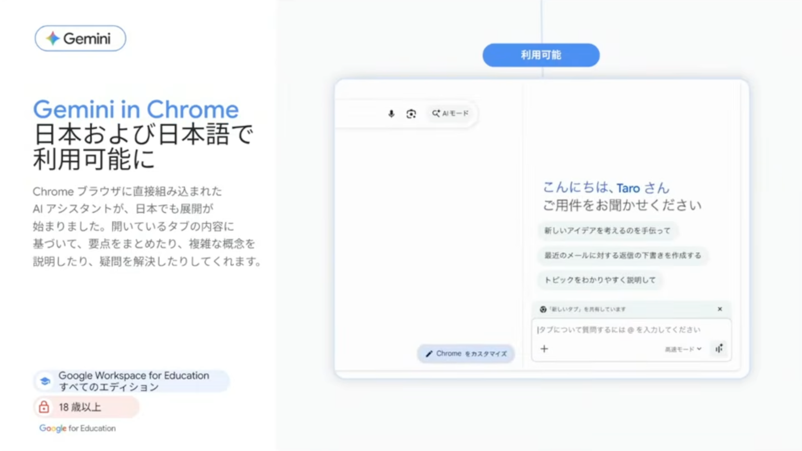
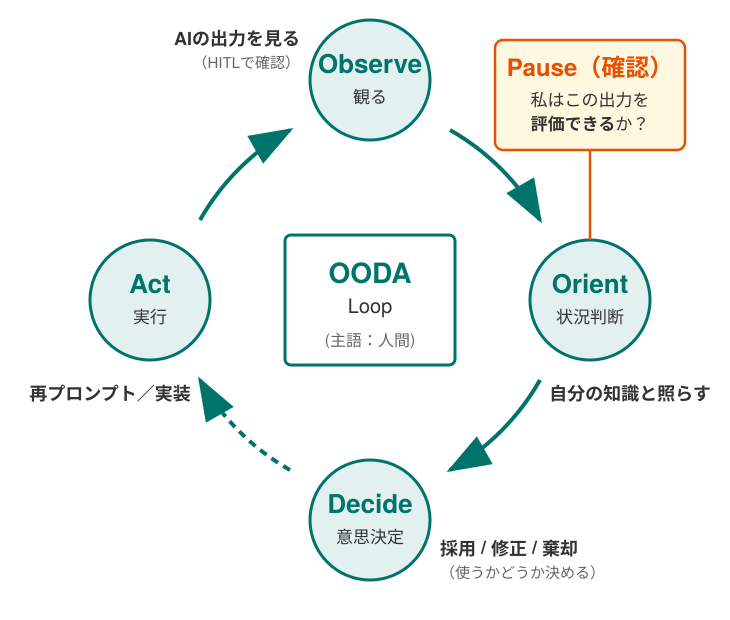

<!-- _class: cover-hero -->

明海大学 不動産学部 FD講習会

生成AIとの 向き合い方

学生の学びを守り、教育をもっと面白くするために

2026/7/2（木）13:00–14:30 ・ 浦安キャンパス

田川 翔（タガワ ショウ）

千葉大学 国際未来教育基幹 助教 博士（理学）・専門：高等教育論／地球惑星科学

Gemini in Chrome ─ 大学アカウントで使える生成AI（Google for Education）

<!--
- 本日はお招きいただきありがとうございます。千葉大学の田川と申します。専門は高等教育論と地球科学です。
- テーマは「生成AIとの向き合い方」。禁止か容認かという二択ではなく、先生方ご自身がどう"向き合う文脈"を作るか、を一緒に考える90分にしたいと思います。
- 不動産学部の先生方に向けて、不動産分野の事例も交えながらお話しします。
-->

---

<!-- _class: split -->

自己紹介

## 理学 → 民間 → 教育、その先に見た「AIの可能性」

### これまでの歩み

- **理学**：東京大学で博士（理学）。地球の中心核の組成を高圧実験で研究
- **民間**：航空貨物物流の現場でデータと意思決定に向き合う
- **教育**：現在は千葉大学で高等教育・FD/SD・AI教育工学

分野を移るたびに「学び直し」を迫られました。その経験から、<strong>生成AIは"学び直しを支える最強の伴走者"</strong>になりうると感じています。
― 自己紹介に代えて

### いま取り組んでいること

- 教科書 **『Teaching with AI』（Bowen & Watson）の翻訳**
- 千葉大学 **全学の生成AI教育・支援**の設計
  - 学生向け「生成AI活用講座」
  - 教職員向け **15分セッション**（ランチタイム研修）
  - 学生参画による大学の価値の議論
- AIと学術ライティング自己効力感の研究（JSET）

<b>翻訳中:</b> J. A. Bowen &amp; C. E. Watson, <i>Teaching with AI</i>, 2nd ed., Johns Hopkins Univ. Press (2026)／田川 訳・近刊

<!--
- 私自身、理学→民間→教育とキャリアを変えてきました。そのたびに「ゼロから学び直す」必要があり、苦労しました。
- だからこそ、生成AIが"学び直しの伴走者"になりうる可能性に強く惹かれています。
- いまは Bowen & Watson の『Teaching with AI』翻訳と、千葉大全体のAI教育の設計をしています。今日の内容もその実践から来ています。
-->

---

<!-- _class: summary -->

本日の目標

## 90分・3つのテーマ（各約20分＋体験・質問）

Session 1 ・ 13:10–13:35

関わり方

- 学生に生成AIと**どう関わってほしいか**を言葉にする
- → 匿名アンケートに記入し、会場で共有します

Session 2 ・ 13:35–14:00

業務活用

- 生成AIを**教務・業務の効率化**に活かす方法がわかる
- → 実際に会場で **Gemini** を触ってみます

Session 3 ・ 14:00–14:25

授業設計

- AI時代の**授業・評価設計**の考え方がわかる
- → 学びを損なわず、教育をもっと面白くする方法

ゴール：先生方ご自身の「生成AIとの向き合い方」を、ひとつ言葉にして持ち帰る

<!--
- 今日は講義回で、3つのテーマを各20分ずつ。間に体験・質問・休憩を5〜10分はさみます。
- Session 1は「関わり方」、2は「業務活用」、3は「授業・評価設計」。それぞれ手を動かす時間を必ず入れます。
- 完璧に覚えるのではなく、ご自身の向き合い方をひとつ言葉にして帰っていただくのがゴールです。
-->

---

<!-- _class: split -->

全体の位置づけ

## 今回は、実は「3回シリーズ」の第1回です

### 3回の構成

<strong>第1回（本日）</strong> 講義｜向き合い方・業務活用・授業設計

<strong>第2回</strong> ワーク｜AIの使い方と、授業を面白くするアイデア形成

<strong>第3回</strong> ワーク｜第2回のフォローアップとマインド形成

- 第2回以降は**自由参加**。実際に手を動かして試します

### 今日の進め方のお願い

- **Slido** で皆さまの考えを集め、その場で共有します
- **PCでのアクセス**を推奨します
- 体験パートでは、隣の方と話しながら進めます

Google for Education から、ステッカー等のノベルティもご用意しています

「聞いて終わり」ではなく、考え・手を動かし・持ち帰る90分にしましょう

<!--
- 実は今日は3回シリーズの1回目です。今日は講義中心、第2回・第3回はワーク中心で、自由参加です。
- 今日はSlidoで皆さんの考えをその場で集めて共有します。PCでのアクセスをおすすめします。
- Google for Educationからステッカーなどもお配りします。気軽に参加してください。
-->

---

<!-- _class: summary -->

準備：Slido

## はじめに ─ Slido にアクセスしてください

### アクセス方法

- 中央のQR、または右のURLから入れます
- **PCでのアクセス**を推奨します
- 質問・アンケート・意見共有に使います

<a href="https://app.sli.do/event/u7cfG5AciHocySQDbc4pJ7">app.sli.do/event/ u7cfG5AciHocySQDbc4pJ7</a>

【データ利用のお願い】Slido・ワークへの入力情報のうち、<strong>個人情報・機微情報を除いた</strong>内容を、本研修の改善・調査研究・外部発表等に利用させていただく場合があります。特定される情報・知られたくない情報は入力なさらないようご注意ください。

最初のアンケート（0-1〜0-2）に、いまのお考えで結構ですのでご回答ください

<!--
- まずSlidoに入ってください。QRかURLから。PCのほうが入力しやすいです。
- 入力データは個人情報を除き、研修改善や調査研究に使わせていただくことがあります。機微な情報は入れないでください。
- では最初のアンケート、肩の力を抜いて答えてみてください。【ここで Slido 0-1, 0-2, Pre を実施】
-->

---

<!-- _class: divider -->

SESSION 1 ・ 13:10–13:35 ・ 関わり方

# 学生に、生成AIと どう関わってほしいか

## 禁止でも放置でもなく、「文脈」を一緒に考える

<!--
- ここからSession 1です。問いは「先生方は、ご自身の授業で、学生に生成AIとどう関わってほしいか」。
- 結論を出す前に、まず生成AIの仕組みと、そこから来るリスクを正確に押さえます。
-->

---

<!-- _class: message -->

# 先生方の授業で、学生には 生成AIと「どう」関わってほしいですか？

## ── まずは、この問いを頭の片隅に置いてください

<!--
- いきなり結論は出さなくて結構です。この問いを頭の片隅に置きながら、これからの話を聞いてください。
- 最後にこの問いに戻ってきます。今日の研修の"たいのオカシラ"です。
-->

---

<!-- _class: fig -->

そもそも生成AIとは

## 正体は「次の一語」を当て続けるしくみ

「吾輩は」の次に来そうな語を確率で選ぶ ── これを繰り返して文章が生まれる

<b>仕組みの出典:</b> Vaswani et al. (2017) <i>Attention Is All You Need</i> ／ 図は千葉大「生成AIの倫理とリテラシー」教材より

「考えて答える」のではなく「もっとも"ありそう"な続きを出す」装置です

<!--
- 生成AIの正体は、ものすごく大きな「次の一語あてゲーム」です。「吾輩は」と来たら、次は「猫」が来やすい、と確率で選んでいるだけです。
- 中身はTransformerという仕組みで、文中の語と語の関係を見て、次に来やすい語を選びます。出典はVaswaniらの2017年の論文です。
- ここが今日いちばん大事です。AIは"意味を理解して考えている"のではなく、"ありそうな続き"を出している。だからこそ、次に話すリスクが構造的に生まれます。
-->

---

<!-- _class: summary -->

仕組みから来る懸念

## 「ありそうな続きを出す」装置だからこそのリスク

⚠️① 利用上の危険

<strong>ハルシネーション</strong>：もっともらしい嘘を堂々と出す <strong>知識のカットオフ</strong>：学習時点より新しいことは知らない

⚖️② 倫理的な危険

<strong>バイアス</strong>：学習データの偏りが出力に表れる。"平均的・典型的"な像に寄り、少数派が出にくい

🔒③ 無料AIの危険

<strong>個人情報の流出</strong>：入力が保存・学習に使われうる。一度入れた情報は取り戻せない

<b>出典:</b> ハルシネーション = Kalai et al. <i>Why Language Models Hallucinate</i> (Nature, 2026)／バイアス = 総務省「上手にネットと付き合おう」生成AI特集／個人情報 = 個人情報保護法（個人情報保護委員会 ppc.go.jp）

どれも「直せる不具合」ではなく、仕組みに由来する"性質"です

<!--
- 仕組みから3つのリスクが出てきます。
- ①利用上：ハルシネーション。"確からしさ"を確かめる仕組みが最初から無いので、流暢なまま堂々と間違える。さらに知識のカットオフで、学習時点より新しいことは知りません。
- ②倫理的：バイアス。学習データの偏りがそのまま出ます。"いちばんありそう"を選ぶので、典型から外れた人ほど出力に現れにくい。
- ③無料AIの危険：入力が保存・学習に使われることがあります。一度入れた個人情報は取り戻せません。これは後で安全な使い方として詳しくお話しします。
-->

---

<!-- _class: split -->

不動産・専門職の現場で

## ③「無料AIに入れてはいけないもの」を具体的に

### 起こりがちな事故

- 顧客の**氏名・住所・取引条件**をそのまま入力
- 物件の**未公開情報**や契約書ドラフトを貼り付け
- （医療現場では）患者情報、（研究では）未公開データ・査読原稿

入力＝外部サーバーへ送信。<strong>「外」に出た情報は取り戻せません</strong>

### 守るための3つの手立て

- **オプトアウト設定**：学習に使わせない設定にする
- **組織が契約したAIを使う**：個人の無料版を業務に使わない
- **規程・ポリシーを定める**：「何を入れてよいか」を組織で言語化

<b>根拠:</b> 個人情報保護法（個人情報保護委員会）<a href="https://www.ppc.go.jp/">ppc.go.jp</a>

不動産は個人情報の塊。「安全なAI」と「規程」の整備が、活用の前提になります

<!--
- 不動産分野は個人情報の宝庫です。顧客情報や取引条件、未公開物件、契約書。これらを無料のAIに入れると、保存・学習に使われるおそれがあります。
- 医療なら患者情報、研究なら未公開データや査読原稿も同じです。入力した瞬間、外部サーバーに送られ、取り戻せません。
- 対策は3つ。オプトアウト設定、組織が契約した安全なAIを使う、そして「何を入れてよいか」の規程を作ること。Session 2で安全なGeminiを具体的に紹介します。
-->

---

<!-- _class: split -->

学問の誠実さ

## アカデミック・インテグリティと、研究での制限

### 学問的誠実性 ─ 6つの価値

正直 ・ 信頼 ・ 公正 ・ 敬意 ・ 責任 ・ 勇気

- 生成物を**そのまま自分の成果**として出すのは誠実さに反する
- AIの役割は**情報収集・整理まで**。どう使うかは人間の技

<b>出典:</b> ICAI, <i>The Fundamental Values of Academic Integrity</i>／日本学術振興会『誠実な科学者の心得［第2版］』(2025)

### 研究では、媒体ごとにルールが違う

- まず**投稿先・所属学会のAIポリシー**を確認する
- 文献検索・校正は概ね可。**本文執筆・翻訳・要約は要開示**
- **図のAI生成・査読原稿の入力・引用の捏造**は原則不可

<b>出典:</b> Science Journals「Guidelines for AI use」(science.org)

「使ったかどうか」より「誠実に、説明できる形で使ったか」が問われます

<!--
- 学問の誠実さには6つの価値があります。正直・信頼・公正・敬意・責任・勇気。AIの生成物をそのまま自分の成果にするのは、この誠実さに反します。
- AIの役割は情報収集や整理まで。それをどう使うかは人間の技だ、というのは、実は明海大学の先生方が既に共有されている考え方でもあります。
- 研究では媒体ごとにルールが違います。まず投稿先や学会のポリシーを確認する。校正は概ね可、本文執筆や翻訳は要開示、図のAI生成や査読原稿の入力は原則不可。一律の正解はありません。
-->

---

<!-- _class: split -->

明海大学の現在地

## 先生方は、すでに正しく理解されています

### 学内で共有されている考え方

- 個人に関する情報は**入れない**（入れたら取り戻せない）
- 企業は**セキュアな環境の中だけ**で使っている
- 生成物の**丸ごと引用は不可**（著作権・レポートとして不適）
- AIは**情報収集まで**、使い方は人間の技

### さらに一歩、踏み込むなら

- ハルシネーションを**完全に防ぐ手段は、今のところ無い**
- だからこそ「**安全な環境**」と「**人の最終確認**」が要
- そして本題 ── **学生に何を求めるか**を言葉にする

今日は、この土台の上に「教育としてどう向き合うか」を重ねます

既にお持ちの理解は、すべて正しい。本日はその先を一緒に考えます

<!--
- ここで一度、明海大学の先生方が既に共有されている理解を確認させてください。個人情報は入れない、企業はセキュアな環境で使う、生成物の丸ごと引用は不可、AIは情報収集まで。すべて正しい理解です。
- さらに一歩踏み込むと、ハルシネーションを完全に防ぐ手段は今のところありません。だから「安全な環境」と「人の最終確認」が要になります。
- その正しい土台の上に、今日は「教育としてどう向き合うか」を重ねていきます。
-->

---

<!-- _class: split -->

問題提起

## 学生に、どんな「関わり方の文脈」を持ってほしいか

関わり方①｜タイパ・コスパの道具

- とにかく**早く・楽に**課題を終わらせる
- 答えをもらって**提出する**
- → 短期的には得。だが**学ぶ機会を明け渡す**

関わり方②｜創造性・社会貢献の道具

- 自分の考えを**広げ・鍛える**相棒として使う
- たたき台を作り、**自分で吟味して超える**
- → **学び続ける力**そのものが育つ

どちらの"文脈"を学生が持つか ── それを作れるのは、教員です

<!--
- 学生のAILの関わり方は、大きく2つに分かれます。
- ①タイパ・コスパの道具として、早く楽に終わらせ、答えを提出する。短期的には得ですが、学ぶ機会を自ら明け渡しています。
- ②創造性や社会貢献のための道具として、考えを広げ鍛える相棒にする。たたき台を作って、自分で吟味して超えていく。こちらは学び続ける力が育ちます。
- どちらの文脈を学生が持つか。それを左右できるのは、ほかでもない教員です。
-->

---

<!-- _class: split -->

放置か、禁止か

## どちらも「正しい」とは言い切れない

「放置」は正しい？

- 学習目標をAIに**代替**させてしまう危険
- 力がつかないまま卒業 ＝ **長期的な"負債"**

「禁止」は正しい？

- 社会に出れば、AIは**使う前提**になる
- 使えないまま送り出すことの**不利益**

### 社会の現実 ── 多くの職種が影響を受ける

36%

何らかの形でAIが使われる職業タスクの割合

57:43

スキル増強：自動化 のおおよその比率

不動産・事務・専門職も例外ではありません。

<b>出典:</b> Anthropic Economic Index ／ Handa et al. (2025) arXiv:2503.04761／Massenkoff &amp; McCrory (2026) "Labor market impacts of AI"

問いは「放置か禁止か」ではなく「どう正しくマネジメントするか」

<!--
- では放置すればよいかというと、それも危うい。学習目標そのものをAIに肩代わりさせ、力がつかないまま卒業する。これは長期的な"負債"です。
- 逆に全面禁止も難しい。社会に出ればAtは使う前提です。Anthropicの分析では、すでに36%の職業タスクで何らかの形でAIが使われ、用途はスキル増強と自動化がおよそ6対4。不動産も事務も専門職も例外ではありません。
- だから問いは「放置か禁止か」ではなく、「どう正しくマネジメントするか」に変わります。
-->

---

<!-- _class: summary -->

正しいマネジメント

## 「禁止/容認」を超える、3つの実践

### ① ポリシー ─ 言葉にする

- **学校レベル・授業レベル**で、どう活用してよいかを明文化する
- 「この課題ではここまで可／ここからは不可」を**事前に伝える**

### ② 透明性 ─ どこで使ったかを示す

- 学生に**使用箇所の明示**を求める（隠さない文化）
- 教員も、自分がどう使ったかを**率直に共有する**

### ③ 自分で考える価値を伝える ─ 経験で語る

- 「なぜ自分で考えるのか」を、**実感を伴って**伝える
- そうでなければ、学生は"見習いの機会"を静かに奪われる

ルールだけでは動かない。「なぜ」を語れる教員が、良い文脈を作ります

<!--
- 正しいマネジメントは3つ。
- ①ポリシー。学校レベルと授業レベルで、どこまで使ってよいかを言葉にし、課題を出すときに事前に伝える。
- ②透明性。学生には使った箇所を明示してもらう。隠さない文化です。教員も自分の使い方を率直に共有する。
- ③自分で考える価値を、経験を伴って伝える。これが無いと、学生は知らないうちに"見習いとして育つ機会"を奪われてしまいます。
- 【ここで Slido 1-1, 1-2, 1-3 を実施】先生方ご自身の考えを入れてみてください。
-->

---

<!-- _class: summary -->

千葉大での実践

## 「文脈づくり」を、現場で試しています

① 学生向け講座

- 学生が**AIエージェントを自作**し、その**限界を体感**
- 「できること／できないこと」を知り、**自分の文脈**を形成

② 15分セッション

- 教職員向けの**ランチタイム研修**
- 短く・気軽に、**理解と前向きな文脈**を広げる

③ 学生参画会議

- 学生と**大学の価値**を語り合う場
- 「大学は**失敗できる場所**」という学生の声

大学は、安心して失敗できる場所であってほしい。AIに答えをもらうより、<strong>失敗から学べることのほうが価値がある</strong>。
― 学生参画会議での学生の声

「正解の伝達」より「失敗できる場」── ここに大学の価値が残ります

<!--
- 千葉大では、文脈づくりを3つの形で試しています。
- ①学生向けの活用講座。学生自身にAIエージェントを作らせ、その限界を体感させる。できること・できないことを知って初めて、自分なりの関わり方の文脈ができます。
- ②教職員向けの15分セッション。短く気軽に、理解と前向きな文脈を広げる。
- ③学生参画会議。学生と大学の価値を語り合う。ある学生が「大学は失敗できる場所であってほしい」と言いました。AIに答えをもらうより、失敗から学べることのほうが価値がある、と。この言葉に、AI時代の大学の価値が凝縮されていると感じています。
-->

---

<!-- _class: split -->

ワーク①

## 先生の授業で、学生にどう関わってほしいですか？

### 進め方（Think-Pair-Share）

- **Think**：まず自分で考える（1分）
- **Pair**：隣の方と話してみる（2分）
- **Share**：スプレッドシートに記入し、会場で共有

「正解」を探すワークではありません。<strong>言葉にすること</strong>が目的です

### スプレッドシートに3列で記入

| 列 | 記入すること |
|---|---|
| 科目名 | 担当されている授業 |
| 関わり方 | どう関わってほしいか |
| なぜ？ | その理由・ねらい |

→ 記入用シート（会場で共有するURL／Slidoからもアクセス可）

隣の方と話したうえで、3列を埋めてみましょう（科目名・関わり方・なぜ）

<!--
- ではワークです。Think-Pair-Share。まず自分で1分考え、隣の方と2分話し、最後にスプレッドシートに記入して会場で共有します。
- 記入は3列。科目名、どう関わってほしいか、そしてなぜ。理由まで言葉にするのがポイントです。
- 正解探しではありません。言葉にすること自体が目的です。では、まず隣の方とどうぞ。
-->

---

<!-- _class: divider -->

SESSION 2 ・ 13:35–14:00 ・ 業務活用

# 生成AIを、自分の 教務・学務に活かす

## 「安全に」「具体的に」使うための勘どころ

<!--
- Session 2は業務活用です。時間が短いので、要点を絞ってテンポよくいきます。
- まず「安全なAI」の話、次に「使える3つの道具」、最後に実際に触ってみます。
- 【冒頭で Slido 2-1, 2-2, 2-3 を実施】皆さんの今の使用状況を教えてください。
-->

---

<!-- _class: split -->

安全なAIとは

## 「学校版／組織版」だから安心できる理由

### 個人の無料版との決定的な違い

- 入力が**モデルの学習に使われない**
- **組織の中に閉じる**（人間レビューなし）
- 教育機関向けの保護（**FERPA／COPPA準拠**）

成績・個人情報のような機微情報も、<strong>契約とポリシーの範囲内</strong>で安全に扱えます

### その場で確認する習慣を

- Gemini の画面**左下からプライバシーポリシー**を開いてみる
- 「私の情報はどう使われる？」と**AI自身に尋ねる**のも有効
- 同じログインでも、**サービスごとに規約は違う**

<b>出典:</b> Google for Education (BETT 2026)／Google Workspace 管理者ヘルプ <a href="https://support.google.com/a/users/answer/16430812">support.google.com</a>

「安全なAI」を選ぶこと自体が、最大のリスク対策です

<!--
- まず安全なAIの話です。学校版・組織版のGeminiは、個人の無料版と決定的に違います。入力がモデル学習に使われず、組織の中に閉じ、人間のレビューもありません。教育機関向けにFERPAやCOPPAにも準拠しています。
- だから成績や個人情報のような機微情報も、契約とポリシーの範囲内であれば安全に扱えます。
- 習慣にしてほしいのは「確認」です。Geminiの左下からプライバシーポリシーを開く。分からなければ規約を貼って「私の情報はどう使われる?」とAI自身に聞くのも有効です。
-->

---

<!-- _class: summary -->

使える3つの道具

## 明海大学で、今日から使えるもの（無料プラン）

Gemini app

<strong>対話型のAI</strong>。文章・要約・翻訳・アイデア出し。<strong>Chromeに統合</strong>され、論文や資料を開いたまま質問できる

NotebookLM

<strong>自分の資料を読ませて使う</strong>。論文・配布資料を要約・クイズ・音声解説に変換。出典つきで答える

Workspace Studio

<strong>定型作業の自動化</strong>。Gmail・Drive・Sheetsの中で、AIが読む・分類・下書きまで（ノーコード）

<b>年齢・対象:</b> Gemini 13歳以上／NotebookLM 18歳以上（大学生は対象）。表示されない場合は管理者設定を確認

「対話」「自分の資料」「自動化」── 用途で3つを使い分けます

<!--
- 明海大学で今日から使えるのは、無料プランで3つ。
- Gemini appは対話型。文章、要約、翻訳、アイデア出し。Chromeにも統合されていて、論文や資料を開いたまま横で質問できます。
- NotebookLMは、自分の資料を読み込ませて使う道具。論文や配布資料を要約・クイズ・音声解説に変換し、必ず出典つきで答えます。
- Workspace Studioは定型作業の自動化。これは時間の都合で概要だけにします。用途で使い分けてください。
-->

---

<!-- _class: fig -->

Gemini app ①

## Chromeに統合 ─ 論文・資料を「開いたまま」読む

💡 不動産研究にも： 英語論文や物件資料を<b>開いたまま</b>要約・翻訳・質問

Chromeの中でAIに質問できる ── 英語論文を開いたまま「この章の要点は？」と聞ける

<b>出典:</b> Google for Education「Gemini in Chrome 日本および日本語で利用可能に」

論文・市場レポート・契約資料の"読み込み"を、その場で支援できます

<!--
- まずGemini in Chrome。ブラウザに直接組み込まれていて、今開いているページについてその場で質問できます。
- 特に研究で便利です。英語の論文や海外の市場レポートを開いたまま、「この章の要点は?」「この表は何を示している?」と聞ける。読み込みのスピードが変わります。
- 不動産分野でも、英語論文や物件資料、長い契約書類の読み込みに使えます。日本語にも対応しました。
-->

---

<!-- _class: fig -->

Gemini app ②

## 学習・試験対策まで ─ 例：TOEIC 対策

模擬クイズ・弱点分析・フラッシュカードまで自動生成 ── 学生の自学を支える道具にもなる

<b>出典:</b> Google for Education「Gemini の試験準備機能が TOEIC 対策に利用可能に」／教育設計 = LearnLM (arXiv:2412.16429)

「教える」だけでなく「問い返す」AI ── 学生の伴走者になりつつあります

<!--
- もうひとつ。Geminiには試験準備の機能があり、たとえばTOEIC対策の模擬クイズや弱点分析、フラッシュカードまで作れます。
- 背景にはLearnLMという教育用に調整されたモデルがあります。答えを教えるのではなく、問い返して考えさせる設計です。
- これは学生の自学を支える道具になります。先生の授業の外側で、学生が一人で学ぶ時間の質を上げられるわけです。
-->

---

<!-- _class: fig -->

NotebookLM

## 自分の資料を「読ませて」使う ─ 教材づくりの相棒

<video controls src="./src/demo-gem.mov" poster="./src/demo-gem.png" width="640"></video>

配布資料・論文・シラバスを読み込ませ、要約・クイズ・音声解説・下書きへ変換（出典つき）

デモ：千葉大での Gem／NotebookLM 活用（教務支援）

「ネット上の知識」ではなく「先生の資料」に基づいて答えるのが強みです

<!--
- NotebookLMは、自分の資料を読ませて使う道具です。配布資料、論文、シラバスを入れると、それだけに基づいて要約・クイズ・音声解説・下書きを作ってくれます。
- 普通のAIと違い、ネット上のあやふやな知識ではなく「先生がアップした資料」に基づいて、しかも出典つきで答えます。だからハルシネーションを抑えられます。
- 教材づくりやFAQ対応の相棒になります。動画は千葉大での活用例です。
-->

---

<!-- _class: summary -->

Workspace Studio

## 定型作業の自動化 ＝「つなぐ自動化」＋AIの判断

これまで

<strong>人が手作業</strong> コピペ・転記・確認・通知

→

iPaaS

<strong>連携を自動化</strong> アプリ同士をノーコードで繋ぐ

→

Workspace Studio

<strong>AIエージェント</strong> 連携＋Geminiの判断

きっかけ
フォームに回答が届いたら

→

処理（AI）
内容を読み、分類・要約・下書き

→

出力
下書き保存・通知・記録

<b>定義の出典:</b> 「Gemini を使用して Workspace 全体で定型タスクを自動化（プログラミング不要）」Google Workspace 管理者ヘルプ

「きっかけ→処理→出力」を言葉で並べるだけ。コードは書きません

<!--
- Workspace Studioは時間の都合で概要だけ。要は「定型作業の自動化」です。
- これまで人が手作業でやっていたコピペや転記を、まずアプリ連携で自動化したのがiPaaS。そこにGeminiの判断を足したのがWorkspace Studioです。
- 作り方は「きっかけ→処理→出力」を言葉で並べるだけ。たとえば「フォームに回答が来たら→内容を分類して→下書きを作る」。コードは書きません。詳しくは第2回のワークで扱います。
-->

---

<!-- _class: fig -->

使いこなしの型

## AIの使い方は「OODAループ」で回す

Observe（出力を観る）→ Orient（自分の知識と照らす）→ Decide（採用・修正・棄却）→ Act（使う／再依頼）

主語は常に「人間」。AIの出力を評価できる範囲で活用する

積み上げ式ではなく「まず使い、評価し、回す」── 評価できる範囲が活用の範囲

<!--
- AIの使い方には型があります。OODAループです。元は意思決定のモデルですが、AI活用版にするとこうなります。
- Observe、AIの出力を観る。Orient、自分の知識と照らす。Decide、採用するか・直すか・捨てるかを決める。Act、使うか、もう一度頼む。
- 大事なのは、主語が常に人間だということ。そして「自分が評価できる範囲」でだけ活用する。評価できないものをそのまま使うのが、いちばん危険です。
-->

---

<!-- _class: split -->

体験ワーク

## 実際に、Gemini と NotebookLM を触ってみましょう

### やってみること（提出物なし・約10分）

- 隣の方と一緒に、**Gemini** に1つ質問してみる
- できれば **NotebookLM** に資料を1つ読ませてみる
- 「**これは便利／これは怪しい**」を口に出してみる

### おすすめの最初の一手

- 「この英語論文の要点を3つに」
- 「来週の授業のミニクイズを5問」
- 「この問い合わせメールへの返信案を」

うまくいかなくて当然。<strong>OODAで「直して再依頼」</strong>を体感してください

完璧を狙わず、まず触る。「評価しながら使う」感覚をつかみましょう

<!--
- では体験です。提出物はありません。10分ほど、隣の方と一緒にGeminiに質問してみてください。できればNotebookLMに資料を読ませるところまで。
- 最初の一手のおすすめはここに出した3つ。論文の要点、ミニクイズ、返信案。
- うまくいかなくて当然です。さっきのOODAで「直して再依頼」を体感してください。では、どうぞ。
-->

---

<!-- _class: divider -->

SESSION 3 ・ 14:00–14:25 ・ 授業設計

# AI時代の 授業・評価設計の工夫

## 学びを損なわず、教育をもっと面白くする

<!--
- 最後のSession 3。授業と評価の設計です。ここがいちばん教員の腕の見せ所です。
- 「学びを損なわない守りの設計」と「もっと面白くする攻めの設計」の両方をお話しします。
-->

---

<!-- _class: message -->

# AIが答えを出せる時代に、 「大学の価値」とは何でしょうか？

## ── 知識の伝達だけなら、AIで代替できてしまう

<!--
- AIが答えを出せる時代に、大学の価値とは何か。知識を伝達するだけなら、もうAIで代替できてしまいます。
- では何が残るのか。次のスライドで、その答えのひとつを示します。
-->

---

<!-- _class: split -->

教員の役割の変化

## 「知識の専門家」から「学びのファシリテーター」へ

### 残る価値・高まる価値

- **問いを立てる**力、議論を**深める**力
- 学生が**安心して失敗できる「場」**をつくる力
- 一人ひとりに**寄り添う**コーチング

知識の"配達"はAIに任せ、教員は<strong>学びの設計と伴走</strong>へ

### 場づくりが、これまで以上に効く

- 工業時代＝標準化・競争 → 情報化時代＝**協働・主体性**
- 「弱い教育」＝ともに、内側から知る学び
- 1対1指導の知見を、**AI＋教員**で実装できる

<b>出典:</b> Bowen &amp; Watson <i>Teaching with AI</i> (2026)／Aoun <i>Robot-Proof</i> (MIT Press)／インゴルド『教育とは何か』(2025)

Teaching に加え、Coaching へ ── 教員にしかできない部分が、むしろ際立ちます

<!--
- 答えのひとつが、教員の役割の変化です。知識の専門家から、学びのファシリテーターへ。
- 残る価値、むしろ高まる価値は、問いを立てる力、議論を深める力、安心して失敗できる場をつくる力、一人ひとりに寄り添うコーチングです。
- 知識の"配達"はAtに任せて、教員は学びの設計と伴走へ。AounのRobot-Proofやインゴルドの「弱い教育」も、同じ方向を指しています。教えることに加えて、コーチすること。教員にしかできない部分が、むしろ際立つ時代です。
-->

---

<!-- _class: fig -->

なぜ「場」が効くのか

## ブルームの「2シグマ問題」── 個別指導の威力

1対1指導の平均は、一斉授業の上位2%に届く（＝2標準偏差ぶん上）。これを AI＋教員で近づけられる

<b>出典:</b> Bloom, B. S. (1984) "The 2 Sigma Problem", <i>Educational Researcher</i> 13(6), 4–16.／能力ギャップ図 = Anthropic

かつて「実現不可能」だった個別最適が、AIで現実味を帯びてきました

<!--
- なぜ場づくりや個別の伴走が効くのか。教育学の有名な発見、ブルームの2シグマ問題です。
- 1対1の個別指導を受けた生徒の平均は、普通の一斉授業の上位2%、つまり2標準偏差ぶん上に来る。偏差値でいえばプラス20です。効果は絶大なのに、全員に家庭教師はつけられない。これがずっと「実現不可能な理想」でした。
- ところがAIと教員を組み合わせれば、この個別最適に近づける可能性が出てきました。ここにAI時代の教育の希望があります。なお図は、AIの能力と現場の活用のギャップを示したものです。
-->

---

<!-- _class: split -->

守りの設計

## 学びを損なわないために ─ 授業の目標は守る

### 原則

- **科目の到達目標は、絶対に動かさない**
- 目標を達成する"過程"を、AIに肩代わりさせない
- 「どこまでAIを使ってよいか」を**課題ごとに明示**する

守るべきは目標。手段（AI可否）は目標から逆算して決める

### 足場かけ・足場はずし

- 序盤は**足場かけ**（AIで理解を支える）
- 終盤は**足場はずし**（AIなしで到達を確認）
- 「いつ・どこで使うか」を**学習段階で変える**

学部生か大学院生か、最初からか後半か ── 文脈で判断は変わる

目標を守れば、AIは「敵」ではなく「足場」になります

<!--
- まず守りの設計です。大原則は、科目の到達目標を絶対に動かさないこと。目標を達成する過程そのものをAIに肩代わりさせてはいけません。
- そのうえで「どこまで使ってよいか」を課題ごとに明示する。守るべきは目標で、AIの可否は目標から逆算して決めます。
- 使い方の工夫が足場かけ・足場はずしです。序盤はAIで理解を支え、終盤はAIなしで到達を確認する。学部生か院生か、最初からか後半か。文脈で判断は変わります。
-->

---

<!-- _class: summary -->

評価の判断軸

## 「AIを使ったか」ではなく、6つの軸で考える

① 学習目標の達成

育てたい力が、その利用で損なわれていないか

② 思考の主体性

考える過程を学生自身が担っているか

③ 評価の妥当性

提出物が到達度を正しく反映しているか

④ 学問的誠実性

作成過程を説明でき、欺瞞を含まないか

⑤ 文脈依存性

科目特性・到達段階・目的で判断は変わる

⑥ 評価の公平性

使う学生・使わない学生に同じ基準は妥当か

大学教育学会での議論より（田口先生まとめ）。④以外は、教員自身が考えないと判断が難しい軸です

「使用の有無」で線を引かず、学びが起きたかで評価する

<!--
- 評価です。「AIを使ったかどうか」で線を引くのは、もう限界です。代わりに6つの軸で考えます。
- 学習目標の達成、思考の主体性、評価の妥当性、学問的誠実性、文脈依存性、評価の公平性。これは大学教育学会での議論、田口先生のまとめです。
- 注目してほしいのは、4番の学問的誠実性以外は、教員自身が考えないと判断できない軸だということ。だからこそ、評価設計は教員の専門性そのものなのです。
-->

---

<!-- _class: split -->

評価対象を広げる

## 完成物「だけ」では、学びの質は測れない

### 何を評価対象にするか

成果物
最終レポート

＋

対話記録
AIとのやりとり

＋

振り返り
学びの自己説明

完成物に、**過程**と**省察**を加えて評価する。

### 理論的な背骨

- 評価軸は「使ったか」ではなく、**本人の中に学びが起きたか**
- 学び＝**つながりの形成・維持**（コネクティビズム）

<b>出典:</b> 大学教育学会・中島先生の発表より／コネクティビズム = G. Siemens

「成果物＋AIとの対話記録＋振り返り」を、ひとそろいで評価する

<!--
- 評価対象も広げます。完成物だけを見ても、学びの質は測れません。
- そこで「成果物＋AIとの対話記録＋振り返り」をひとそろいで評価します。最終レポートに、AIとどうやりとりしたかの記録と、何を学んだかの自己説明を加えるわけです。
- 背骨にあるのは、評価軸は「使ったか」ではなく「本人の中に学びが起きたか」だという考え方。学びとは、つながりの形成と維持だ、というコネクティビズムです。大学教育学会の中島先生の発表に基づいています。
-->

---

<!-- _class: split -->

攻めの設計

## 課題を「作り変える」── 想像力が要る課題へ

1
<strong>到達目標</strong>を確認する

→

2
課題を<strong>AIに解かせて</strong>みる

→

3
AIが<strong>代替する部分</strong>を特定

→

4
<strong>人にしかできない</strong>所を中心に

→

5
<strong>過程と省察</strong>を評価に入れる

AIに解かせて満点が出る課題は、作り変えのサイン。<strong>現場・対話・判断・創造</strong>を課題の中心へ

<b>参考:</b> 課題リデザインの考え方（MIT 等の実践／Bowen &amp; Watson <i>Teaching with AI</i>）。Session 3 ワークで実際に試します

「AIで解けない課題」より「AIを使ってこそ深まる課題」を目指す

<!--
- 守りの次は攻めです。課題そのものを作り変えます。フローはこの5ステップ。
- 到達目標を確認し、まず課題をAIに解かせてみる。AIが代替できる部分を特定し、人にしかできない部分を課題の中心に据える。そして過程と省察を評価に入れる。
- AIに解かせて満点が出るなら、それは作り変えのサインです。現場の観察、対話、判断、創造を課題の中心に。「AIで解けない課題」を探すより、「AIを使ってこそ深まる課題」を目指すのが、前向きで現実的です。これはこのあとのワークで実際に試します。
-->

---

<!-- _class: split refs-sm -->

不動産教育×生成AI

## 周辺分野では、実践研究が始まっています

### 何がわかっているか

- **都市計画・参加型設計**では、理解の深化・議論の活性化・批判的思考の促進が報告
- 不動産教育そのものでは、**シナリオ分析・利害関係者対話**が有望
- ただし**定量的な学習効果の実証はまだ薄い**

＝ 都市計画・参加型設計の知見を、<strong>不動産教育に応用できる段階</strong>

### 代表的な事例

<table class="lit">
<tr><th>事例</th><th>効果</th></tr>
<tr><td class="tag">利害関係者対話のLLMシミュレーション</td><td>都市空間の批判的解釈を促す</td></tr>
<tr><td class="tag">シリアスゲーム（AI支援）</td><td>理解深化・批判的思考の向上（実証）</td></tr>
<tr><td class="tag">参加型ワークショップ×GenAI</td><td>技能差をならし議論を活性化</td></tr>
</table>

Lozano-Paredes (2026)／Ahmed et al. (2023)／von Brackel-Schmidt et al. (2024) ほか（Scopus）

不動産分野は「これから」。先生方の実践が、研究の最前線になりえます

<!--
- 不動産教育に引きつけます。文献を調べると、隣接する都市計画や参加型設計では、AIを使った教育の実践研究が始まっています。
- 利害関係者の対話をAIでシミュレーションして批判的解釈を促す。AI支援のシリアスゲームで理解と批判的思考を高める。参加型ワークショップで技能差をならし議論を活性化する。こうした効果が報告されています。
- ただし不動産教育そのものでの定量的な実証はまだ薄い。逆に言えば、先生方の実践が、この分野の研究の最前線になりえます。
-->

---

<!-- _class: summary -->

未来の可能性

## 生成AIで、教育は「もっと面白く」できる

### ① 2シグマ問題の解消へ

- AI＋教員で、**一人ひとりに合った学び**を現実に近づける

### ② 協働的な学びの高度化

- 個別作業はAIが支え、**人は対話・協働・創造**に時間を使える

### ③ 真正な課題による深い学びへ

- 現場・社会とつながる**本物の課題**に挑戦できる

守るべき学びは守り、空いた時間で「もっと深く・面白く」へ

<!--
- まとめると、生成AIは教育をもっと面白くできます。
- ①2シグマ問題の解消へ。一人ひとりに合った学びを現実に近づける。
- ②協働的な学びの高度化。個別作業はAIが支え、人は対話・協働・創造に時間を使える。
- ③真正な課題による深い学びへ。現場や社会とつながる本物の課題に挑戦できる。守るべき学びは守り、空いた時間で「もっと深く、もっと面白く」を目指しましょう。
-->

---

<!-- _class: split -->

ワーク③

## 普段の課題を、AIの視点で「作り変えて」みよう

### やってみること

- ご自身の**普段の課題**を1つ思い浮かべる
- それを **Gemini に解かせて**みる（シナリオ問題でも可）
- 先ほどの**5ステップ**で、どう作り変えるか考える

### 問い

- AIはどこまで解けましたか？
- **人にしかできない部分**はどこでしたか？
- どうすれば、**もっと良い課題**になりますか？

気づきや結果を、Slido で会場全体に共有してください

「AIに解かせてみる」が、課題を磨く最短の方法です

<!--
- 最後のワークです。普段出している課題を1つ思い浮かべて、実際にGeminiに解かせてみてください。シナリオ問題でも構いません。
- そして問うてください。AIはどこまで解けたか。人にしかできない部分はどこか。どうすればもっと良い課題になるか。さっきの5ステップで考えます。
- 気づきや結果はSlidoで会場全体に共有してください。【ここで Slido 3-1, 3-2, 3-3 を実施】
-->

---

<!-- _class: wrap -->

まとめ①

## 今日の3つのテーマを振り返る

- **関わり方**：禁止でも放置でもなく、「文脈」を作る ── ①ポリシー ②透明性 ③価値を語る
- **業務活用**：「安全なAI」を選び、OODAで「評価しながら使う」
- **授業設計**：目標は守り、評価は6軸で。完成物＋対話記録＋振り返りを見る
- **未来**：2シグマ問題の解消、協働の高度化、真正な課題による深い学びへ
- いちばんの要点 ── **学生に良い"文脈"を作れるのは、教員です**

<!--
- 振り返ります。関わり方は、禁止でも放置でもなく文脈を作る。ポリシー、透明性、価値を語る、の3つ。
- 業務活用は、安全なAIを選び、OODAで評価しながら使う。
- 授業設計は、目標を守り、評価は6軸で。完成物だけでなく対話記録と振り返りも見る。
- そして未来は、2シグマ問題の解消、協働の高度化、真正な課題へ。いちばんの要点は、学生に良い文脈を作れるのは教員だ、ということです。
-->

---

<!-- _class: message -->

# 最初の問いに戻ります ── 学生に、どう関わってほしいですか？

## 今日いちばん持ち帰ってほしい、ひとつの言葉

<!--
- 最初の問いに戻ります。先生方は、ご自身の授業で、学生に生成AIとどう関わってほしいですか。
- 今日の話を踏まえて、ご自身の言葉でひとつ、答えを持ち帰ってください。それが今日いちばんのお土産です。
- "たいのオカシラ"、最初の問題提起をここで回収しました。一本の研修として、つながったでしょうか。
-->

---

<!-- _class: split -->

次回のご案内

## 第2回・第3回（ワーク・自由参加）

### 第2回｜つくってみる

生成AIの使い方レクチャー＋<strong>授業を面白くするアイデア形成</strong>。実際に手を動かします

### 第3回｜続ける

第2回のフォローアップと<strong>マインド形成</strong>。様々なアイデアを試します

### お持ち帰り

- Google for Education の**ステッカー等**をどうぞ
- 本日のスライド・参考リンクは**後日共有**します
- 学内での相談・実践に、いつでもお声がけください

「まず1つ、試してみる」── そこから始まります

第2回・第3回は自由参加。気になる回だけのご参加で結構です

<!--
- 次回のご案内です。第2回は実際に手を動かして、授業を面白くするアイデアを形にします。第3回はそのフォローアップとマインド形成です。どちらも自由参加です。
- Google for Educationのステッカーもお持ち帰りください。今日のスライドと参考リンクは後日共有します。
- まず1つ試してみる。そこからすべて始まります。今日はありがとうございました。
-->

---

<!-- _class: qa -->

# ありがとうございました

## ご質問・ご相談を、どうぞ

<!--
- ありがとうございました。残りの時間で、ご質問やご相談を受けます。どんな小さなことでも結構です。
-->

---

<!-- _class: refs -->

参考文献・出典 ①

## 参考文献・出典 ①（仕組み・リスク・影響）

- Vaswani, A. et al. (2017). *Attention Is All You Need*. NeurIPS.
- Kalai, A. et al. (2026). *Why Language Models Hallucinate*. Nature. https://www.nature.com/articles/s41586-026-10549-w
- 総務省「上手にネットと付き合おう」生成AI特集. https://www.soumu.go.jp/use_the_internet_wisely/special/generativeai/
- 個人情報保護委員会. https://www.ppc.go.jp/
- ICAI (2021). *The Fundamental Values of Academic Integrity* (3rd ed.). academicintegrity.org
- 日本学術振興会 (2025).『科学の健全な発展のために ─ 誠実な科学者の心得［第2版］』. https://www.jsps.go.jp/j-kousei/rinri.html
- Science Journals. *Guidelines for AI use*. science.org
- Handa, K. et al. (2025). *Which Economic Tasks are Performed with AI?* (Anthropic Economic Index). arXiv:2503.04761
- Massenkoff, M. & McCrory, J. (2026). *Labor market impacts of AI*. Anthropic. https://www.anthropic.com/research/labor-market-impacts

<!--
- 参考文献は配布資料にも載せます。気になるものは後で辿ってください。
-->

---

<!-- _class: refs -->

参考文献・出典 ②

## 参考文献・出典 ②（教育・授業設計・ツール）

- Bloom, B. S. (1984). The 2 Sigma Problem. *Educational Researcher*, 13(6), 4–16. https://doi.org/10.3102/0013189X013006004
- Bowen, J. A. & Watson, C. E. (2026). *Teaching with AI* (2nd ed.). Johns Hopkins Univ. Press.（田川 翔 訳・近刊）
- Aoun, J. E. (2017/2024). *Robot-Proof: Higher Education in the Age of AI*. MIT Press.
- T. インゴルド (2025).『教育とは何か』古川不可知 訳. 亜紀書房.（原題 *Anthropology and/as Education*, 2018）
- レイヴ & ウェンガー (1993).『状況に埋め込まれた学習 ─ 正統的周辺参加』産業図書.
- Wiley (2025). *ExplanAItions* 研究者調査. wiley.com
- Google for Education (BETT 2026). https://blog.google/products-and-platforms/products/education/bett26-premium-ai/
- Google Workspace 管理者ヘルプ（Workspace Studio）. https://support.google.com/a/users/answer/16430812
- LearnLM. arXiv:2412.16429
- 不動産教育×生成AI：Lozano-Paredes (2026); Boyce et al. (2026); Ahmed et al. (2023); von Brackel-Schmidt et al. (2024) ほか（Scopus）

<!--
- こちらは教育と授業設計、ツール関連の出典です。Teaching with AIは私が翻訳中の本です。
- 不動産教育の文献は、ご関心があれば個別にPDFをお送りします。本日はありがとうございました。
-->
