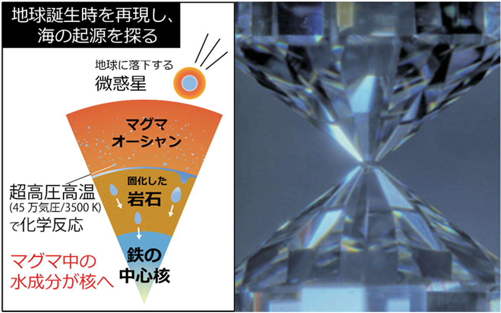
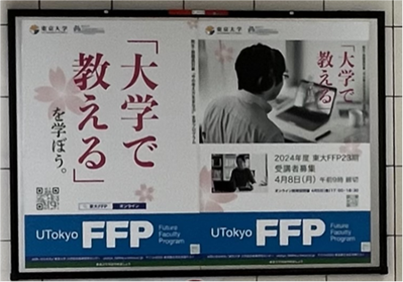
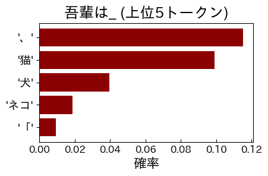
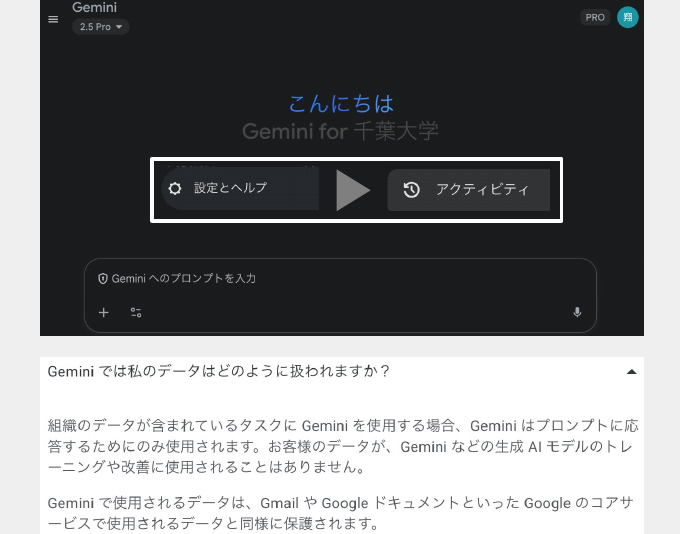
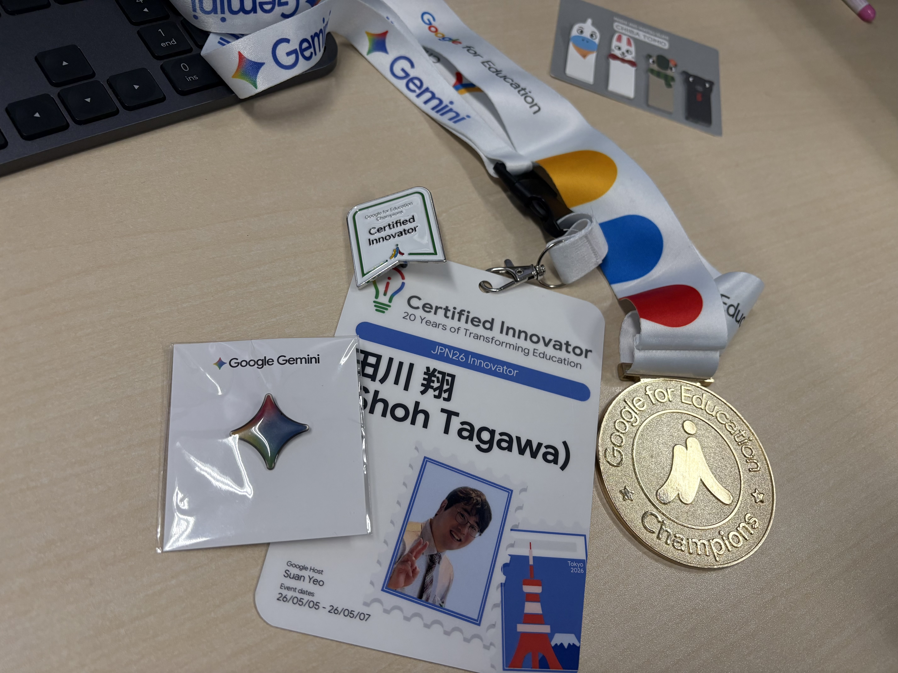
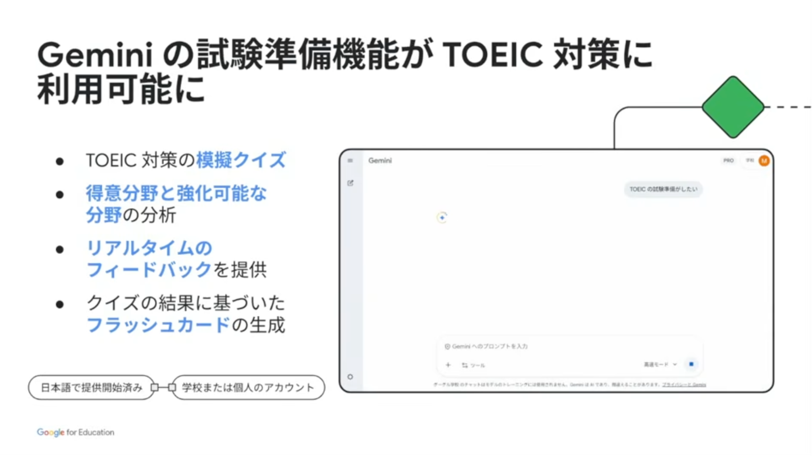
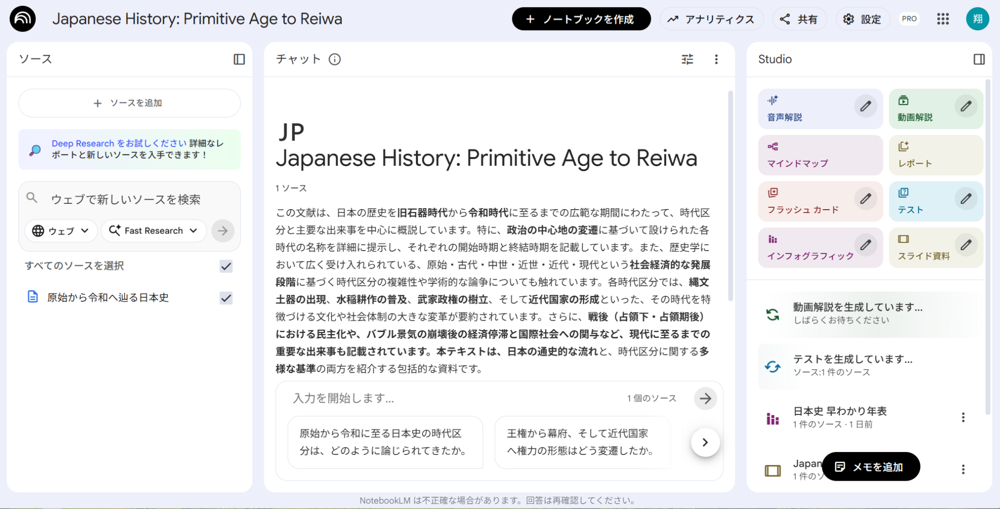

<!-- _class: cover-hero -->

明海大学 不動産学部 FD講習会

学生の学びを守り、教育をもっと面白くするために

生成AIとの向き合い方

明海大学 不動産学部 FD講習会 #1　｜　浦安キャンパス

2026/7/2（木）13:00–14:30

千葉大学 国際未来教育基幹 助教　田川 翔（タガワ ショウ） 博士（理学）・専門：高等教育論／地球惑星科学

<!--
- 本日はお招きいただきありがとうございます。千葉大学の田川と申します。専門は高等教育論と地球科学です。
- テーマは「生成AIとの向き合い方」。禁止か容認かという二択ではなく、先生方ご自身がどう"向き合う文脈"を作るか、を一緒に考える90分にしたいと思います。
- 不動産学部の先生方に向けて、不動産分野の事例も交えながらお話しします。
-->

---

<!-- _class: split jtop -->

自己紹介

## 理学 → 民間 → 教育 ── 分野を越えて実感している「生成AIの可能性」

理学

地球の中心を、実験で再現

博士（理学）。45万気圧・3500Kの超高圧高温で<strong>地球の核から海の起源</strong>に挑む。

→

民間

航空貨物物流の最前線へ

世界を結ぶ貨物便の現場で、<strong>データと意思決定</strong>に世界と向き合う。

→

教育

千葉大学で高等教育・AI教育工学

東大FFPで「PreFD」を学んだことで、いまは<strong>高等教育論・生成AI教育</strong>に従事。

分野を移るたびに「学び直し」を迫られました。その経験から、<strong>生成AIは"学びや仕事を支える道具・伴走者"</strong>になりうると感じています。学生・教職員にとって、生成AIとの良い文脈を作るのが自分の仕事です。
― 自己紹介に代えて

<!--
- 私自身、理学→民間→教育とキャリアを変えてきました。地球の中心核を高圧実験で再現する研究から、航空貨物物流の現場、そして大学教育へ。
- そのたびに「ゼロから学び直す」必要があり、苦労しました。だからこそ、生成AIが"学び直しの伴走者"になりうる可能性に強く惹かれています。
-->

---

<!-- _class: split -->

いま取り組んでいること

## 大学で「教える・学ぶ」を、生成AIでアップデートする

### 千葉大学での実践

- アメリカ・カレッジ大学協会の教科書の翻訳
 **『Teaching with AI』（Bowen & Watson）**
- 千葉大学 **全学の生成AI教育・支援**の設計
  - 学生向け「生成AI活用講座」
  - 教職員向け **15分セッション**（1回60分、体験型）
  - 学生参画による大学の価値の議論
- 教育における研究
  - 大学のUXをアプリと大学基盤
  - AIクロス型の教育カリキュラムの比較
  

  今日お話しすることは、<strong>現場の実践</strong>から来ています。

翻訳中：J. A. Bowen &amp; C. E. Watson <i>Teaching with AI</i>（原著 2nd ed.）／ 邦題『AI時代の大学教育』技術評論社・近刊（田川 訳）

<!--
- いまは Bowen & Watson の『Teaching with AI』翻訳（邦題『AI時代の大学教育』）と、千葉大全体のAI教育の設計をしています。
- 右が訳書のカバー。「学生がAIを使ってレポートを書いてきたら?」という問いは、まさに今日の本題です。今日の内容もこの実践から来ています。
-->

---

<!-- _class: summary -->

本日の目標

## 90分・3つのテーマ（各約20分＋体験・質問）

Session 1 ・  13:10–13:35

文脈づくり

- 学生が生成AIと**どう関わってほしいか**を言葉にする

✍️匿名アンケートに記入し、会場で共有します

Session 2 ・  13:35–14:00

業務活用

- 教職員の皆様が、生成AIを**教務・業務の効率化**に活かす方法がわかる

🖐️実際に会場で <strong>Gemini</strong> を触ってみます

Session 3 ・  14:00–14:25

授業設計

- AI時代の**授業・評価設計**の考え方がわかる

💡学びを損なわず、教育をもっと面白くする方法

ゴール：先生方ご自身の「生成AIとの向き合い方」を、ひとつ言葉にして持ち帰る

<!--
- 今日は講義回で、3つのテーマを各20分ずつ。間に体験・質問・休憩を5〜10分はさみます。
- Session 1は「関わり方」、2は「業務活用」、3は「授業・評価設計」。それぞれ手を動かす時間を必ず入れます。
- 完璧に覚えるのではなく、ご自身の向き合い方をひとつ言葉にして帰っていただくのがゴールです。
-->

---

<!-- _class: split -->

全体の位置づけ

## 今回は、実は「3回シリーズ」の第1回です

### 3回の構成

<strong>第1回（本日）</strong> 講義 向き合い方・業務活用・授業設計

<strong>第2回</strong> ワーク AIの使い方と、授業を面白くするアイデア形成

<strong>第3回</strong> ワーク 第2回のフォローアップとマインド形成

- 第2回以降は**任意参加ワークショップ**。

### 今日の進め方のお願い

- **Slido** で皆さまの考えを集め、その場で共有します
- **PCでのアクセス**を推奨します
- 体験パートでは、隣の方と話しながら進めます

第二回目ご参加の先生へ Google for Education から、ステッカー等のノベルティもご用意しています

「聞いて終わり」ではなく、考え・手を動かし・持ち帰る90分にできると嬉しいです

<!--
- 実は今日は3回シリーズの1回目です。今日は講義中心、第2回・第3回はワーク中心で、自由参加です。
- 今日はSlidoで皆さんの考えをその場で集めて共有します。PCでのアクセスをおすすめします。
- Google for Educationからステッカーなどもお配りします。気軽に参加してください。
-->

---

<!-- _class: summary -->

グランド・ルール

## 双方向で実施：互いに学び合う、協力的な「学びの場」を一緒につくる

K①　敬意を持って

- 相手の**意見・経験**を尊重し傾聴
- 否定から入らず、まず**受けとめる**

K②　忌憚なく

- 気がねせず、**率直に**出し合う
- **職位に関係なく**、ざっくばらんに
- 呼び方は「さん付け」で

K③　建設的に

- 否定で終わらせず、**提案・改善**を
- 「では、どうする」を一緒に考える

合言葉は <strong>3K</strong> ──「敬意を持って」「忌憚なく」「建設的に」。どうぞ<strong>積極的に</strong>ご参加ください

<b>出典:</b> 東京大学・プレFD講座 グランド・ルール

今日は、安心して発言でき、気づきのある、楽しい場を全員でつくっていきましょう

<!--
- ここで一つだけ、今日の「学びの場」のグランドルールをお願いします。東京大学のプレFD講座から拝借した「3K」です。
- K①敬意を持って。相手の意見や経験、立場を尊重して聴く。K②忌憚なく。職位に関係なく、遠慮せず率直に。K③建設的に。否定で終わらせず、提案や改善につなげる。
- 今日は聞くだけでなく手を動かし、話し合う場です。安心して発言でき、失敗できる場をつくるのは、ここにいる私たち全員です。どうぞ積極的にご参加ください。
-->

---
<!-- _class: summary -->

準備：Slido

## はじめに ─ Slido にアクセスしてください（方法は、2通り）

### ① QR・URL から

- **QR**、または隣の **URL** から入れます
- **PC** からのアクセスを推奨
- 質問・アンケート・意見共有に使います

<a href="https://app.sli.do/event/u7cfG5AciHocySQDbc4pJ7">app.sli.do/event/ u7cfG5AciHocySQDbc4pJ7</a>

### ② 検索＋コードで入る

<ol class="astep">

- <b>slido</b>」で検索 →　<b>slido.com/jp</b> を開き、下の青いバーの欄にコードを入力

</ol>

イベントに 参加する？

#
make-ai1
→

【データ利用のお願い】Slido・ワークへの入力情報のうち、<strong>個人情報・機微情報を除いた</strong>内容を、本研修の改善や報告に用いる可能性があります。機密情報・特定される情報・知られたくない情報は入力なさらないようご注意ください。

最初のアンケート（0-1〜0-2）に、いまのお考えで結構ですのでご回答ください

<!--
- まずSlidoに入ってください。QRかURLから。PCのほうが入力しやすいです。
- 入力データは個人情報を除き、研修改善や調査研究に使わせていただくことがあります。機微な情報は入れないでください。
- では最初のアンケート、肩の力を抜いて答えてみてください。【ここで Slido 0-1, 0-2, Pre を実施】
-->

---

<!-- _class: summary -->

最初のアンケート

## 始める前に、3つだけ Slido でうかがいます

0-1

いま、生成AIで「ある程度」なら、どこまで出来ると思いますか？複数選択

① シラバスの確認・作成支援
② 問題の作成支援
③ 学生の質問対応
④ スライド作成
⑤ 演習課題の作成
⑥ メール返信案・ToDoリストへの書き込み

0-2

生成AIは、大学教育にどちらの影響を及ぼすと感じますか？3択

① 良い影響のほうが大きい
② 悪い影響のほうが大きい
③ どちらとも言えない・場合による

0-3

今日の研修が終わったとき、どうなっていたい・何を持ち帰りたいですか？自由記述

例：「ひとつ使えそうな使い方を持ち帰りたい」「学生への伝え方のヒントがほしい」など、いまのお気持ちで結構です。

正解を当てるものではありません。いまのお考えのまま、お気軽にご回答ください

<!--
- ここで最初のSlido。0-1は「ある程度ならどこまで出来そうか」、当てはまると思うものを複数選んでください。あとで実際にいくつか触ります。
- 0-2は大学教育への影響を3択で。今日の終わりに同じ質問にもう一度答えてもらい、変化を見ます。
- Preは自由記述。今日のゴール・期待を一言で。終了時のPostと対にします。肩の力を抜いてどうぞ。
-->

---

<!-- _class: divider -->

SESSION 1 ・ 13:10–13:35 ・ 関わり方

# 学生に、生成AIと どう関わってほしいか

## 禁止でも放置でもなく、「文脈」を一緒に考える

<!--
- ここからSession 1です。問いは「先生方は、ご自身の授業で、学生に生成AIとどう関わってほしいか」。
- 結論を出す前に、まず生成AIの仕組みと、そこから来るリスクを正確に押さえます。
-->

---

<!-- _class: message -->

# 先生方の授業で、学生には 生成AIと「どう」関わってほしいですか？

## ── まずは、この問いを頭の片隅に置いてください

<!--
- いきなり結論は出さなくて結構です。この問いを頭の片隅に置きながら、これからの話を聞いてください。
- 最後にこの問いに戻ってきます。今日の研修の"たいのオカシラ"です。
-->

---

<!-- _class: fig -->

AIとは／AIの分類

## AI＝人が知的だと感じる処理を実現するシステム

<svg viewBox="0 0 990 400" width="100%" style="max-height:430px">
  <g text-anchor="middle">
    <rect x="95" y="14" width="235" height="82" rx="14" fill="#E3F1EF" stroke="#00736B" stroke-width="2"/>
    <text x="212" y="50" font-size="25" font-weight="800" fill="#004D45">Artificial</text>
    <text x="212" y="80" font-size="22" fill="#5B6068">人工的な</text>
    <text x="362" y="68" font-size="36" font-weight="800" fill="#5B6068">＋</text>
    <rect x="395" y="14" width="235" height="82" rx="14" fill="#E3F1EF" stroke="#00736B" stroke-width="2"/>
    <text x="512" y="50" font-size="25" font-weight="800" fill="#004D45">Intelligence</text>
    <text x="512" y="80" font-size="22" fill="#5B6068">知能</text>
    <text x="662" y="64" font-size="34" font-weight="800" fill="#5B6068">→</text>
    <rect x="695" y="17" width="200" height="76" rx="12" fill="#00736B" stroke="#004D45" stroke-width="2.5"/>
    <text x="795" y="51" font-size="26" font-weight="800" fill="#fff">AI</text>
    <text x="795" y="79" font-size="21" fill="#E3F1EF">人工知能</text>
    <text x="495" y="143" font-size="23" font-weight="700" fill="#5B6068">AIの実現方法は、大きく2つ</text>
    <line x1="495" y1="158" x2="285" y2="186" stroke="#9aa5a2" stroke-width="2"/>
    <line x1="495" y1="158" x2="705" y2="186" stroke="#9aa5a2" stroke-width="2"/>
    <rect x="95" y="188" width="380" height="150" rx="14" fill="#EDEEF0" stroke="#5B6068" stroke-width="2"/>
    <text x="285" y="238" font-size="25" font-weight="800" fill="#5B6068">ルールベース</text>
    <text x="285" y="277" font-size="21" fill="#5B6068">人がルール・知識を書く</text>
    <text x="285" y="312" font-size="20" fill="#7a8085">例：エキスパートシステム</text>
    <rect x="515" y="188" width="380" height="150" rx="14" fill="#E3F1EF" stroke="#00736B" stroke-width="2.5"/>
    <text x="705" y="238" font-size="25" font-weight="800" fill="#004D45">機械学習</text>
    <text x="705" y="277" font-size="21" fill="#5B6068">データから自分で学ぶ</text>
    <text x="705" y="312" font-size="21" font-weight="800" fill="#00736B">★ 現在の主流</text>
    <text x="495" y="382" font-size="18" fill="#8a8f96">※「AI」は1956年のダートマス会議で命名。AIは“知能”を指し、ロボット（“体”）とは別物。</text>
  </g>
</svg>

「猫を見分けるルール」を完璧に書くのは不可能。だからデータから学ばせる。

---

<!-- _class: fig -->

AI技術の全体像

## AI概念の全体像 ── 「生成AI」は、AIの全体のごく一部

<svg viewBox="0 0 560 470" width="100%" style="flex:0 0 43%; max-height:430px" text-anchor="middle">
  <rect x="10" y="20" width="540" height="432" rx="22" fill="#ECEDEF" stroke="#C7CACE" stroke-width="2"/>
  <text x="280" y="56" font-size="25" font-weight="800" fill="#5B6068">数理・統計・DS</text>
  <rect x="54" y="80" width="452" height="364" rx="20" fill="#E3F1EF" stroke="#2E8A80" stroke-width="2"/>
  <text x="280" y="116" font-size="25" font-weight="800" fill="#004D45">人工知能（AI）</text>
  <rect x="98" y="140" width="364" height="296" rx="18" fill="#CDE7E2" stroke="#00736B" stroke-width="2"/>
  <text x="280" y="176" font-size="24" font-weight="800" fill="#004D45">機械学習</text>
  <rect x="142" y="200" width="276" height="228" rx="16" fill="#A9D4CD" stroke="#004D45" stroke-width="2"/>
  <text x="280" y="236" font-size="24" font-weight="800" fill="#00413A">深層学習</text>
  <rect x="186" y="262" width="188" height="158" rx="14" fill="#00736B" stroke="#00413A" stroke-width="2.5"/>
  <text x="280" y="350" font-size="28" font-weight="800" fill="#fff">生成AI</text>
</svg>

<b>数理・統計・DS</b>：データを扱う数学・統計

<b>AI</b>：人が知的だと感じる処理を実現するシステム 機械学習のほか、ルールベース・探索・推論 なども含む

<b>機械学習</b>：データから自動でパターンを学ぶAI

<b>深層学習</b>：多層ネットワークで学ぶ。生成AIの土台 リコメンデーション・自動運転なども含む

<b>生成AI</b>：文章・画像などを“つくる”AI（この講義の主役）

※ 生成AIの手法は Transformer・GAN・拡散モデル など複数。

AIの範囲はきわめて広く、生成AIがその一部でしかない。AIは既に環境になった。

---

<!-- _class: summary -->

機械学習

## 機械学習型のAIの学び方(Training方法)は3種類

① 教師あり学習

- 正解（教師データ）付きで学ぶ
- 例：分類・予測・回帰
- 「この画像は猫」と教える

<svg viewBox="0 0 320 124" width="100%" style="max-height:132px">
  <text x="151" y="9" font-size="9" font-weight="800" fill="#5B6068" text-anchor="middle">① 学習（正解つきで覚える）</text>
  <rect x="92" y="14" width="56" height="24" rx="4" fill="#fff" stroke="#00736B" stroke-width="1.2"/>
  <text x="106" y="31" font-size="15" text-anchor="middle">🐱</text>
  <rect x="120" y="20" width="22" height="12" rx="2.5" fill="#00736B"/>
  <text x="131" y="29" font-size="8.5" font-weight="800" fill="#fff" text-anchor="middle">ネコ</text>
  <rect x="152" y="14" width="56" height="24" rx="4" fill="#fff" stroke="#00736B" stroke-width="1.2"/>
  <text x="166" y="31" font-size="15" text-anchor="middle">🐶</text>
  <rect x="180" y="20" width="22" height="12" rx="2.5" fill="#00736B"/>
  <text x="191" y="29" font-size="8.5" font-weight="800" fill="#fff" text-anchor="middle">イヌ</text>
  <line x1="120" y1="38" x2="142" y2="54" stroke="#00736B" stroke-width="2"/>
  <line x1="180" y1="38" x2="160" y2="54" stroke="#00736B" stroke-width="2"/>
  <rect x="120" y="56" width="62" height="40" rx="10" fill="#00736B" stroke="#004D45" stroke-width="1.5"/>
  <text x="151" y="80" font-size="13" font-weight="800" fill="#fff" text-anchor="middle">モデル</text>
  <text x="50" y="58" font-size="9" font-weight="800" fill="#5B6068" text-anchor="middle">② 予測する画像</text>
  <rect x="16" y="62" width="64" height="50" rx="6" fill="#fff" stroke="#5B6068" stroke-width="1.5"/>
  <text x="48" y="99" font-size="34" text-anchor="middle">🐱</text>
  <text x="100" y="86" font-size="20" fill="#00736B" text-anchor="middle">→</text>
  <text x="198" y="86" font-size="20" fill="#00736B" text-anchor="middle">→</text>
  <rect x="214" y="62" width="96" height="46" rx="8" fill="#fff" stroke="#00736B" stroke-width="1.5"/>
  <text x="262" y="84" font-size="12" fill="#333" text-anchor="middle">これは猫</text>
  <text x="262" y="102" font-size="14" font-weight="800" fill="#00736B" text-anchor="middle">80%</text>
</svg>

② 教師なし学習

- 正解なしで構造を見つける
- 例：クラスタリング・次元削減
- 似たもの同士をまとめる

<svg viewBox="0 0 320 116" width="100%" style="max-height:116px">
  <rect x="6" y="12" width="96" height="92" rx="8" fill="#fff" stroke="#5B6068" stroke-width="1.5"/>
  <circle cx="28" cy="34" r="7" fill="#00736B"/><circle cx="72" cy="30" r="7" fill="#1A6BB0"/>
  <circle cx="52" cy="56" r="7" fill="#E0A53F"/><circle cx="30" cy="78" r="7" fill="#1A6BB0"/>
  <circle cx="80" cy="72" r="7" fill="#00736B"/><circle cx="58" cy="90" r="7" fill="#E0A53F"/>
  <text x="120" y="62" font-size="20" fill="#00736B" text-anchor="middle">→</text>
  <ellipse cx="178" cy="40" rx="28" ry="22" fill="none" stroke="#00736B" stroke-dasharray="3 3"/>
  <circle cx="170" cy="36" r="7" fill="#00736B"/><circle cx="186" cy="42" r="7" fill="#00736B"/><circle cx="172" cy="50" r="7" fill="#00736B"/>
  <ellipse cx="244" cy="40" rx="28" ry="22" fill="none" stroke="#1A6BB0" stroke-dasharray="3 3"/>
  <circle cx="236" cy="36" r="7" fill="#1A6BB0"/><circle cx="252" cy="42" r="7" fill="#1A6BB0"/><circle cx="238" cy="50" r="7" fill="#1A6BB0"/>
  <ellipse cx="210" cy="90" rx="28" ry="20" fill="none" stroke="#E0A53F" stroke-dasharray="3 3"/>
  <circle cx="202" cy="86" r="7" fill="#E0A53F"/><circle cx="218" cy="92" r="7" fill="#E0A53F"/><circle cx="204" cy="99" r="7" fill="#E0A53F"/>
</svg>

③ 強化学習

- 報酬を最大化する試行錯誤
- 例：ゲームAI・自動運転
- 良い行動に“ほうび”を与える

<svg viewBox="0 0 320 116" width="100%" style="max-height:116px">
  <polygon points="10,48 10,64 24,56" fill="#00736B"/>
  <polyline points="26,56 66,56 66,30 116,30 116,84 172,84 172,46 214,46" fill="none" stroke="#1A6BB0" stroke-width="4"/>
  <circle cx="66" cy="30" r="6" fill="#E0A53F" stroke="#B97E1E"/>
  <circle cx="116" cy="84" r="6" fill="#E0A53F" stroke="#B97E1E"/>
  <circle cx="172" cy="46" r="6" fill="#E0A53F" stroke="#B97E1E"/>
  <g stroke="#aab0b6" stroke-width="2"><line x1="92" y1="52" x2="100" y2="60"/><line x1="100" y1="52" x2="92" y2="60"/><line x1="146" y1="28" x2="154" y2="36"/><line x1="154" y1="28" x2="146" y2="36"/></g>
  <circle cx="214" cy="46" r="10" fill="#00736B" stroke="#004D45" stroke-width="1.5"/>
  <polygon points="266,28 272,43 288,43 275,53 280,69 266,59 252,69 257,53 244,43 260,43" fill="#E0A53F" stroke="#B97E1E" stroke-width="1.5"/>
  <text x="266" y="88" font-size="11" font-weight="700" fill="#5B6068" text-anchor="middle">報酬（ゴール）</text>
</svg>

正解の一部だけを使う「半教師あり学習」も。実務ではこれらを組み合わせます。

---

<!-- _class: split -->

ニューラルネット

## 脳のニューロンを真似た“層”の重ね合わせ

<svg viewBox="0 0 380 330" width="100%" style="max-height:380px">
  <g>
    <text x="60" y="35" text-anchor="middle" font-size="16" font-weight="800" fill="#00736B">入力層</text>
    <text x="190" y="35" text-anchor="middle" font-size="16" font-weight="800" fill="#5B6068">隠れ層</text>
    <text x="320" y="35" text-anchor="middle" font-size="16" font-weight="800" fill="#004D45">出力層</text>
    <g stroke="#BBDAD4" stroke-width="1">
      <line x1="60" y1="90" x2="190" y2="80"/><line x1="60" y1="90" x2="190" y2="150"/><line x1="60" y1="90" x2="190" y2="220"/>
      <line x1="60" y1="160" x2="190" y2="80"/><line x1="60" y1="160" x2="190" y2="150"/><line x1="60" y1="160" x2="190" y2="220"/>
      <line x1="60" y1="230" x2="190" y2="80"/><line x1="60" y1="230" x2="190" y2="150"/><line x1="60" y1="230" x2="190" y2="220"/>
      <line x1="190" y1="80" x2="320" y2="120"/><line x1="190" y1="80" x2="320" y2="190"/>
      <line x1="190" y1="150" x2="320" y2="120"/><line x1="190" y1="150" x2="320" y2="190"/>
      <line x1="190" y1="220" x2="320" y2="120"/><line x1="190" y1="220" x2="320" y2="190"/>
    </g>
    <g>
      <circle cx="60" cy="90" r="16" fill="#E3F1EF" stroke="#3E988E" stroke-width="2"/>
      <circle cx="60" cy="160" r="16" fill="#E3F1EF" stroke="#3E988E" stroke-width="2"/>
      <circle cx="60" cy="230" r="16" fill="#E3F1EF" stroke="#3E988E" stroke-width="2"/>
      <circle cx="190" cy="80" r="16" fill="#EDEEF0" stroke="#5B6068" stroke-width="2"/>
      <circle cx="190" cy="150" r="16" fill="#EDEEF0" stroke="#5B6068" stroke-width="2"/>
      <circle cx="190" cy="220" r="16" fill="#EDEEF0" stroke="#5B6068" stroke-width="2"/>
      <circle cx="320" cy="120" r="16" fill="#00736B" stroke="#004D45" stroke-width="2.5"/>
      <circle cx="320" cy="190" r="16" fill="#00736B" stroke="#004D45" stroke-width="2.5"/>
    </g>
    <text x="190" y="300" text-anchor="middle" font-size="16" fill="#00736B" font-weight="700">結線の“重み”を学習で調整</text>
  </g>
</svg>

学習(Training) と 推論(Inference) 

- 学習：データで<b>重みを調整 ＝育てる</b>（計算が重い・1回）
- 推論：育てた<b>重みで答えを出す ＝使う</b>（重みは固定・軽い）

- 隠れ層を深く重ねたものが深層学習
- 画像・音声・言語の処理に強い

生成AIの“中核”も、この<strong>ニューラルネット</strong>

- ✕ 厳密なルール集でも、回答例集でもない
- ◯ 正体は学習で調整した数字（重み）の塊

学習 (Training)＝“重みという数字を調整し、回答を当てにいく”地道な作業です。

---

<!-- _class: split jtop -->

生成AIとは

## “認識・分類”から“生成”へ

<svg viewBox="0 20 380 285" width="100%" style="max-height:300px">
  <g text-anchor="middle">
    <text x="190" y="35" font-size="16" font-weight="800" fill="#5B6068">従来のAI</text>
    <rect x="35" y="55" width="100" height="46" rx="8" fill="#fff" stroke="#5B6068" stroke-width="1.8"/>
    <text x="85" y="83" font-size="16" font-weight="700" fill="#5B6068">入力</text>
    <text x="155" y="84" font-size="20" font-weight="800" fill="#5B6068">→</text>
    <rect x="185" y="55" width="160" height="46" rx="8" fill="#EDEEF0" stroke="#5B6068" stroke-width="1.8"/>
    <text x="265" y="83" font-size="16" font-weight="700" fill="#5B6068">分類ラベル</text>
    <line x1="30" y1="135" x2="350" y2="135" stroke="#BBDAD4" stroke-width="1.5"/>
    <text x="190" y="175" font-size="16" font-weight="800" fill="#00736B">生成AI</text>
    <rect x="35" y="195" width="100" height="46" rx="8" fill="#fff" stroke="#00736B" stroke-width="2"/>
    <text x="85" y="223" font-size="16" font-weight="700" fill="#004D45">入力</text>
    <text x="155" y="224" font-size="20" font-weight="800" fill="#00736B">→</text>
    <rect x="185" y="185" width="160" height="66" rx="8" fill="#E3F1EF" stroke="#00736B" stroke-width="2.5"/>
    <text x="265" y="212" font-size="16" font-weight="700" fill="#004D45">新しい文章</text>
    <text x="265" y="234" font-size="16" font-weight="700" fill="#004D45">・画像を生成</text>
    <text x="190" y="295" font-size="16" fill="#5B6068">識別する → 作り出す へ</text>
  </g>
</svg>

- 従来のAIは識別・予測が中心
- 生成AIは尤もらしい続き（＝それらしい続き）を作る
- 次に来る語を一つ選び、入力に戻して繰り返す
- 文章を扱うものがLLM（大規模言語モデル）

推論モデル（reasoning model）

- Transformerの一度の生成だけでは十分に賢くならない
- 答える前に考える過程を生成し、繰り返し考えることで精度が上がる

AI agent（エージェント）： 目標を与えると計画→ツール実行→確認を自分で繰り返し、タスクを最後までやり遂げるAI

---

<!-- _class: fig -->

学習（Training）

## 重みを「育てる」── 膨大な「次の一語あて」の練習

学習（Training）── 大量の文で「次の一語」を予測し、外すたびに重み（数字）を少しずつ直す

<svg viewBox="0 0 980 240" width="100%" style="max-height:250px">
  <defs>
    <marker id="tah" markerWidth="10" markerHeight="10" refX="7" refY="4" orient="auto"><polygon points="0,0 8,4 0,8" fill="#00736B"/></marker>
  </defs>
  <g font-family="sans-serif" text-anchor="middle">
    <rect x="20" y="36" width="278" height="120" rx="12" fill="#E3F1EF" stroke="#00736B" stroke-width="2"/>
    <text x="159" y="64" font-size="20" font-weight="800" fill="#004D45">① 次の一語を予測</text>
    <rect x="40" y="84" width="100" height="44" rx="6" fill="#fff" stroke="#5B6068" stroke-width="1.5"/>
    <text x="90" y="112" font-size="18" font-weight="700" fill="#33373b">吾輩は…</text>
    <text x="160" y="113" font-size="22" fill="#00736B">→</text>
    <rect x="184" y="84" width="94" height="44" rx="6" fill="#fff" stroke="#00736B" stroke-width="1.8"/>
    <text x="231" y="112" font-size="18" font-weight="800" fill="#00736B">「犬」？</text>
    <line x1="298" y1="96" x2="352" y2="96" stroke="#00736B" stroke-width="2.5" marker-end="url(#tah)"/>
    <rect x="355" y="36" width="278" height="120" rx="12" fill="#EDEEF0" stroke="#5B6068" stroke-width="2"/>
    <text x="494" y="64" font-size="20" font-weight="800" fill="#33373b">② 正解と比べる</text>
    <text x="446" y="104" font-size="18" fill="#5B6068">予測「犬」</text>
    <text x="446" y="132" font-size="18" font-weight="800" fill="#00736B">正解「猫」</text>
    <text x="568" y="119" font-size="18" font-weight="800" fill="#C0392B">→ ズレ</text>
    <line x1="633" y1="96" x2="687" y2="96" stroke="#00736B" stroke-width="2.5" marker-end="url(#tah)"/>
    <rect x="690" y="36" width="270" height="120" rx="12" fill="#E3F1EF" stroke="#00736B" stroke-width="2"/>
    <text x="825" y="64" font-size="20" font-weight="800" fill="#004D45">③ 重みを少し直す</text>
    <text x="825" y="100" font-size="17" fill="#33373b">つなぎ目の「重み」</text>
    <text x="825" y="128" font-size="17" font-weight="800" fill="#00736B">＝数字を微調整</text>
    <path d="M825 156 L825 200 Q825 214 811 214 L173 214 Q159 214 159 200 L159 156" fill="none" stroke="#00736B" stroke-width="2.5" stroke-dasharray="7 5" marker-end="url(#tah)"/>
    <rect x="402" y="198" width="176" height="32" rx="16" fill="#00736B"/>
    <text x="490" y="220" font-size="17" font-weight="800" fill="#fff">膨大に反復</text>
  </g>
</svg>

この「予測 → ずれを直す」を“膨大なテキスト × 何百万回”繰り返して、重みが定まる

重みは数百億個におよぶ。学習が終わると重みは固定され、以降の生成（推論）では変化しない

学習＝データから「重み」という無数の数字を、少しずつ調整して決めること

---

<!-- _class: fig -->

言語モデルの正体

## 「次の一語」を選び、足し直す ＝ 生成AIの「推論（Inference）」

推論（Inference）── 学習済みの重みは固定のまま、「次の一語を選んで足す」をひたすら反復

① 次の一語を<b>確率からサンプリング</b>

② 出力を入力に足して<b>繰り返す</b>（自己回帰）

<svg viewBox="0 0 990 430" width="100%" style="max-height:380px">
  <defs>
    <marker id="arh" markerWidth="10" markerHeight="10" refX="7" refY="4" orient="auto"><polygon points="0,0 8,4 0,8" fill="#00736B"/></marker>
  </defs>
  <g font-family="sans-serif" text-anchor="middle">
    <text x="165" y="22" font-size="17" font-weight="800" fill="#5B6068">計算1回目</text>
    <text x="495" y="22" font-size="17" font-weight="800" fill="#5B6068">計算2回目</text>
    <text x="825" y="22" font-size="17" font-weight="800" fill="#5B6068">計算3回目</text>
    <rect x="75" y="32" width="180" height="40" rx="6" fill="#fff" stroke="#004D45" stroke-width="1.5"/>
    <text x="165" y="58" font-size="18" font-weight="700" fill="#004D45">“吾輩は”</text>
    <rect x="405" y="32" width="180" height="40" rx="6" fill="#fff" stroke="#004D45" stroke-width="1.5"/>
    <text x="495" y="58" font-size="18" font-weight="700" fill="#004D45">“吾輩は猫”</text>
    <rect x="735" y="32" width="180" height="40" rx="6" fill="#fff" stroke="#004D45" stroke-width="1.5"/>
    <text x="825" y="58" font-size="18" font-weight="700" fill="#004D45">“吾輩は猫で”</text>
    <rect x="90" y="90" width="150" height="40" rx="7" fill="#00736B" stroke="#004D45" stroke-width="1.5"/>
    <text x="165" y="116" font-size="18" font-weight="800" fill="#fff">出力</text>
    <rect x="420" y="90" width="150" height="40" rx="7" fill="#00736B" stroke="#004D45" stroke-width="1.5"/>
    <text x="495" y="116" font-size="18" font-weight="800" fill="#fff">出力</text>
    <rect x="750" y="90" width="150" height="40" rx="7" fill="#00736B" stroke="#004D45" stroke-width="1.5"/>
    <text x="825" y="116" font-size="18" font-weight="800" fill="#fff">出力</text>
    <rect x="90" y="148" width="150" height="58" rx="7" fill="#1F9488" stroke="#14655B" stroke-width="1.5"/>
    <text x="165" y="174" font-size="17" font-weight="800" fill="#fff">AI処理</text>
    <text x="165" y="195" font-size="14" fill="#fff" opacity="0.95">（デコーダ）</text>
    <rect x="420" y="148" width="150" height="58" rx="7" fill="#1F9488" stroke="#14655B" stroke-width="1.5"/>
    <text x="495" y="174" font-size="17" font-weight="800" fill="#fff">AI処理</text>
    <text x="495" y="195" font-size="14" fill="#fff" opacity="0.95">（デコーダ）</text>
    <rect x="750" y="148" width="150" height="58" rx="7" fill="#1F9488" stroke="#14655B" stroke-width="1.5"/>
    <text x="825" y="174" font-size="17" font-weight="800" fill="#fff">AI処理</text>
    <text x="825" y="195" font-size="14" fill="#fff" opacity="0.95">（デコーダ）</text>
    <rect x="90" y="224" width="150" height="38" rx="7" fill="#EDEEF0" stroke="#5B6068" stroke-width="1.5"/>
    <text x="165" y="248" font-size="16" font-weight="700" fill="#33373b">前処理</text>
    <rect x="420" y="224" width="150" height="38" rx="7" fill="#EDEEF0" stroke="#5B6068" stroke-width="1.5"/>
    <text x="495" y="248" font-size="16" font-weight="700" fill="#33373b">前処理</text>
    <rect x="750" y="224" width="150" height="38" rx="7" fill="#EDEEF0" stroke="#5B6068" stroke-width="1.5"/>
    <text x="825" y="248" font-size="16" font-weight="700" fill="#33373b">前処理</text>
    <rect x="90" y="280" width="150" height="40" rx="7" fill="#00736B" stroke="#004D45" stroke-width="1.5"/>
    <text x="165" y="306" font-size="18" font-weight="800" fill="#fff">入力</text>
    <rect x="420" y="280" width="150" height="40" rx="7" fill="#00736B" stroke="#004D45" stroke-width="1.5"/>
    <text x="495" y="306" font-size="18" font-weight="800" fill="#fff">入力</text>
    <rect x="750" y="280" width="150" height="40" rx="7" fill="#00736B" stroke="#004D45" stroke-width="1.5"/>
    <text x="825" y="306" font-size="18" font-weight="800" fill="#fff">入力</text>
    <rect x="75" y="338" width="180" height="40" rx="6" fill="#fff" stroke="#5B6068" stroke-width="1.5"/>
    <text x="165" y="364" font-size="18" font-weight="700" fill="#33373b">“吾輩”</text>
    <rect x="405" y="338" width="180" height="40" rx="6" fill="#fff" stroke="#5B6068" stroke-width="1.5"/>
    <text x="495" y="364" font-size="18" font-weight="700" fill="#33373b">“吾輩は”</text>
    <rect x="735" y="338" width="180" height="40" rx="6" fill="#fff" stroke="#5B6068" stroke-width="1.5"/>
    <text x="825" y="364" font-size="18" font-weight="700" fill="#33373b">“吾輩は猫”</text>
    <path d="M165 338 L165 322" fill="none" stroke="#00736B" stroke-width="2" marker-end="url(#arh)"/>
    <path d="M165 280 L165 264" fill="none" stroke="#00736B" stroke-width="2" marker-end="url(#arh)"/>
    <path d="M165 224 L165 208" fill="none" stroke="#00736B" stroke-width="2" marker-end="url(#arh)"/>
    <path d="M165 148 L165 132" fill="none" stroke="#00736B" stroke-width="2" marker-end="url(#arh)"/>
    <path d="M165 90 L165 74" fill="none" stroke="#00736B" stroke-width="2" marker-end="url(#arh)"/>
    <path d="M495 338 L495 322" fill="none" stroke="#00736B" stroke-width="2" marker-end="url(#arh)"/>
    <path d="M495 280 L495 264" fill="none" stroke="#00736B" stroke-width="2" marker-end="url(#arh)"/>
    <path d="M495 224 L495 208" fill="none" stroke="#00736B" stroke-width="2" marker-end="url(#arh)"/>
    <path d="M495 148 L495 132" fill="none" stroke="#00736B" stroke-width="2" marker-end="url(#arh)"/>
    <path d="M495 90 L495 74" fill="none" stroke="#00736B" stroke-width="2" marker-end="url(#arh)"/>
    <path d="M825 338 L825 322" fill="none" stroke="#00736B" stroke-width="2" marker-end="url(#arh)"/>
    <path d="M825 280 L825 264" fill="none" stroke="#00736B" stroke-width="2" marker-end="url(#arh)"/>
    <path d="M825 224 L825 208" fill="none" stroke="#00736B" stroke-width="2" marker-end="url(#arh)"/>
    <path d="M825 148 L825 132" fill="none" stroke="#00736B" stroke-width="2" marker-end="url(#arh)"/>
    <path d="M825 90 L825 74" fill="none" stroke="#00736B" stroke-width="2" marker-end="url(#arh)"/>
    <path d="M240 110 L335 110 L335 300 L416 300" fill="none" stroke="#00736B" stroke-width="2" marker-end="url(#arh)"/>
    <path d="M570 110 L665 110 L665 300 L746 300" fill="none" stroke="#00736B" stroke-width="2" marker-end="url(#arh)"/>
    <text x="375" y="200" font-size="13" font-weight="700" fill="#00736B">出力を</text>
    <text x="375" y="218" font-size="13" font-weight="700" fill="#00736B">次の入力へ</text>
    <text x="705" y="200" font-size="13" font-weight="700" fill="#00736B">出力を</text>
    <text x="705" y="218" font-size="13" font-weight="700" fill="#00736B">次の入力へ</text>
  </g>
</svg>

<b>仕組みの出典:</b> Vaswani et al. (2017) <i>Attention Is All You Need</i> ／ 　※線形代数的には毎回すべてを計算せず、洗練された式で高速に出せる

「考えて答える」のではなく「もっとも"ありそう"な続きを反復する」装置です

---

<!-- _class: split -->

だから“それっぽい”

## 流暢に書けることと、中身が正しいことは別物

<svg viewBox="0 0 360 300" width="100%" style="max-height:320px">
  <g text-anchor="middle">
    <text x="180" y="28" font-size="17" fill="#004D45" font-weight="700">左から1トークンずつ確定していく</text>
    <rect x="30" y="46" width="74" height="46" rx="8" fill="#E3F1EF" stroke="#00736B" stroke-width="2"/>
    <text x="67" y="76" font-size="22" font-weight="800" fill="#00736B">吾輩</text>
    <text x="124" y="76" font-size="22" fill="#bbb">は…？</text>
    <rect x="30" y="108" width="74" height="46" rx="8" fill="#E3F1EF" stroke="#00736B" stroke-width="2"/>
    <text x="67" y="138" font-size="22" font-weight="800" fill="#00736B">吾輩</text>
    <rect x="108" y="108" width="120" height="46" rx="8" fill="#E3F1EF" stroke="#00736B" stroke-width="2"/>
    <text x="168" y="138" font-size="22" font-weight="800" fill="#00736B">は猫で</text>
    <text x="248" y="138" font-size="22" fill="#bbb">…？</text>
    <text x="180" y="186" font-size="26" fill="#00736B" font-weight="800">↓</text>
    <rect x="20" y="200" width="320" height="80" rx="10" fill="#fff" stroke="#5B6068" stroke-width="2" stroke-dasharray="5 4"/>
    <text x="180" y="232" font-size="18" font-weight="700" fill="#333">流暢な文は必ず完成する</text>
    <text x="180" y="260" font-size="18" fill="#004D45" font-weight="700">— だが中身が正しい保証はない</text>
  </g>
</svg>

- 言語系の生成AIは、ルール集や、正しいデータ集ではなく、流暢さを鍛えたモデルである。
- 文法的に滑らかでも、事実かどうかは別問題。断定口調で堂々と誤りうる

ハルシネーションは構造上の帰結

- なぜ起きる：「尤もらしさ」を最大化する仕組みは真偽を直接は照合しないから
- なぜ“原理的に”残る：訓練も評価も<b>“当てずっぽう”を褒めてしまう</b>から（正直な「分かりません」より、当てにいく方が得!）

流暢さが指標。中身が正しいかは、最後に人が必ず確かめることで、騙されない。

---

<!-- _class: summary -->

仕組みから来る懸念：3点

## 「ありそうな続きを出す」装置だからこそのリスク

⚠️① 利用上の危険

<strong>ハルシネーション</strong>：もっともらしい嘘を堂々と出す <strong>知識のカットオフ</strong>：学習時点より新しいことは知らない

⚖️② 倫理的な危険

<strong>バイアス</strong>：学習データの偏りが出力に表れる。"平均的・典型的"な像に寄り、少数派が出にくい

🔒③ 無料AIの危険

<strong>個人情報の流出</strong>：入力が保存・学習に使われうる。一度入れた情報は取り戻せない

<b>出典:</b> ハルシネーション = Kalai et al. <i>Why Language Models Hallucinate</i> (Nature, 2026)／バイアス = 総務省「上手にネットと付き合おう」生成AI特集／個人情報 = 個人情報保護法（個人情報保護委員会 ppc.go.jp）

どれも「直せる不具合」ではなく、仕組みに由来する"性質"

<!--
- 仕組みから3つのリスクが出てきます。
- ①利用上：ハルシネーション。"確からしさ"を確かめる仕組みが最初から無いので、流暢なまま堂々と間違える。さらに知識のカットオフで、学習時点より新しいことは知りません。
- ②倫理的：バイアス。学習データの偏りがそのまま出ます。"いちばんありそう"を選ぶので、典型から外れた人ほど出力に現れにくい。
- ③無料AIの危険：入力が保存・学習に使われることがあります。一度入れた個人情報は取り戻せません。これは後で安全な使い方として詳しくお話しします。
- 進め方：この後はまず①を実演で体感→②をAIの画像で確認→③は次章で不動産の個人情報として詳しく。原理的に残る理由は前の「だから“それっぽい”」と巻末の参考スライドで。
-->

---

<!-- _class: split -->

① ハルシネーション

## 例えば、実在しない文献を、書式まで完璧に“作って”しまう

<svg viewBox="0 0 420 290" width="100%" style="max-height:290px">
  <rect x="6" y="6" width="408" height="278" rx="10" fill="#fff" stroke="#cdd1d6" stroke-width="1.5"/>
  <rect x="6" y="6" width="408" height="34" rx="10" fill="#EDEEF0"/>
  <circle cx="24" cy="23" r="5" fill="#3E988E"/><circle cx="40" cy="23" r="5" fill="#d7dbe0"/><circle cx="56" cy="23" r="5" fill="#d7dbe0"/>
  <text x="210" y="28" text-anchor="middle" font-size="16" fill="#5B6068" font-weight="700">「重要論文を、著者・年・DOI付きで」</text>
  <g font-family="Menlo,Consolas,monospace">
    <text x="24" y="74" font-size="18" fill="#1c2733">K. Smith (2018)</text>
    <text x="24" y="100" font-size="16" fill="#5B6068">DOI: 10.1007/s00521-…</text>
  </g>
  <rect x="18" y="128" width="384" height="120" rx="9" fill="#E3F1EF" stroke="#00736B" stroke-width="3"/>
  <text x="36" y="166" font-size="20" fill="#004D45" font-weight="800">この論文もDOIも</text>
  <text x="36" y="196" font-size="20" fill="#004D45" font-weight="800">存在しない（架空）</text>
  <text x="36" y="228" font-size="16" fill="#00736B" font-weight="700">→ DBで検索しても見つからない</text>
  <text x="210" y="272" text-anchor="middle" font-size="16" fill="#5B6068">書式は完璧。中身は裏取りしないと分からない</text>
</svg>

何が起きているか

- 架空の<b>著者・年・DOI</b>を、書式まで完璧に出力（DOI＝論文ごとの識別番号）
- 専門的な話題ほど“それっぽさ”が増し、詳しくない分野ほど見抜けない
- 引用・数値・固有名は、原典やDB（一次情報）で一件ずつ裏取り

なぜ消えない？＝AIは“正しさ”を直接照合しないから。<strong>「不確実なら『わかりません』、確信度も添えて」</strong>と頼むと多少減る（完全には消えない／最後は人が確認）

引用・数値・固有名は、出典を自分で確認してから使う。

<!--
- ①利用上の危険＝ハルシネーションを、まず実物で。「重要論文を著者・年・DOI付きで」と頼むと、実在しない論文を書式まで完璧に作ってしまいます。
- 専門的な話題ほど“それっぽく”なり、詳しくない分野ほど見抜けません。だから引用・数値・固有名は一次情報で一件ずつ裏取りを。
- なぜ消えないか：AIは“正しさ”を直接照合する仕組みを持たないから。「不確実なら『わかりません』、確信度も添えて」と頼むと多少減りますが、完全には消えません。最後は人が確認。
- 仕組み（訓練・評価が推測を優遇する理由）に関心がある方は、巻末の〔参考・質疑用〕スライドで詳しく。
- 次は②、AIの画像で同じ“平均を当てにいく”性質を見ます。
-->

---

<!-- _class: fig -->

② バイアス

## “平均”を当てにいく性質は、画像でもバイアスを生む

🎯仕組み

いちばん<b>“ありそう”な像</b>を出す ＝ 学習データの<b>「典型」</b>に寄る

↓

👥結果

典型から外れた人ほど<b>出にくい</b>（年齢・体型・装い・背景…）＝<b>多様性が痩せる</b>

↓

⚠️だから注意

教材・広報に使う画像が、知らぬ間に<b>ステレオタイプを強化</b>しうる

出典: <a href="https://www.soumu.go.jp/use_the_internet_wisely/special/generativeai/">総務省「上手にネットと付き合おう」生成AI特集</a>

「もっともらしさ」の最大化は、多様性・少数事例・外れ値を取りこぼす。

---

<!-- _class: split jtop -->

③ 機密の保持

## 「無料AIに入れてはいけないもの」

⚠ 入れてはいけない情報（ありそうな例）

- 顧客の**氏名・住所・取引条件**をそのまま入力
- 物件の**未公開情報**・契約書ドラフトを貼り付け
- （医療）**患者情報** ／（研究）**未公開データ・査読原稿**
- （学校）名簿、成績、レポート

✓ 守るための3つの手立て

- **オプトアウト設定**：学習に使わせない
- **組織が契約したAI**を使う（個人の無料版を業務に使わない）
- **規程・ポリシー**を定める：「何を入れてよいか」を組織で言語化

入力＝外部サーバーへ送信。<strong>「外」に出た情報は取り戻せません</strong>

<b>根拠:</b> 個人情報保護委員会「生成AIサービスの利用に関する注意喚起等について」（令和5年6月2日） <a href="https://www.ppc.go.jp/news/careful_information/230602_AI_utilize_alert/">ppc.go.jp/news/careful_information/230602_AI_utilize_alert</a>

実務は、個人情報の塊。「安全なAI」と「規程」の整備が、活用の前提になります

<!--
- 不動産分野は個人情報の宝庫です。顧客情報や取引条件、未公開物件、契約書。これらを無料のAIに入れると、保存・学習に使われるおそれがあります。
- 医療なら患者情報、研究なら未公開データや査読原稿も同じです。入力した瞬間、外部サーバーに送られ、取り戻せません。
- 対策は3つ。オプトアウト設定、組織が契約した安全なAIを使う、そして「何を入れてよいか」の規程を作ること。Session 2で安全なGeminiを具体的に紹介します。
-->

---

<!-- _class: split -->

学生の自己判断を創る

## 「なぜ今は、AIを使わないか」を学生は言葉にできるか

AIで“場所ジャンプ”すると、経験値ゼロのまま強敵に直面 ──  力がつかない

<strong>学習目標を損なう形では、AIを使わない</strong>

- 身につけたい力は、あえて自分でやる
- AIは「到達を**速める**道具」と割り切る
- 使う／使わない場面を先に決める

「ここでAIを使わないのは、<strong>〇〇する力</strong>を自分で育てたいから」― と説明できる学生を育てたい

- 学びで、基礎から積み上げる点は今も必要
  - 高次の仕事や創造で発想できない
- 仕事でも、「見習い」部分のAIによる代替が課題
 

実際に自分が社会に出てからをイメージ → 成績よりも社会での実力を優先

<!--
- リスクを並べてきましたが、ゴールは「AIを禁止する」ことではありません。学生が「なぜ今この場面ではAIを使わないのか」を、自分の言葉で説明できるようになることです。
- 比喩で言うと、AIはRPGの"場所ジャンプ"。便利ですが、ジャンプし続けると経験値がたまらず、いざ自分の足で進もうとしても動けない。
- 持ってほしい判断軸はシンプルです。「学習目標を損なう形ではAIを使わない」。身につけたい力はあえて自分でやる、AIは到達を速める道具と割り切る、使う・使わない場面を先に決める。
- 「ここで使わないのは、〇〇する力を育てたいから」と言える学生こそ、AIを正しく使いこなせる学生です。
-->

---

<!-- _class: fig -->

学問の誠実さ

## アカデミック・インテグリティ ── AIの有無によらない、普遍的な倫理

<svg viewBox="0 0 990 330" width="100%" style="max-height:340px">
  <!-- definition band -->
  <rect x="120" y="6" width="750" height="46" rx="10" fill="#004D45"/>
  <text x="495" y="38" text-anchor="middle" font-size="20" font-weight="800" fill="#fff">学問における誠実さ（Academic Integrity）── 6つの価値</text>
  <line x1="495" y1="52" x2="495" y2="68" stroke="#004D45" stroke-width="2"/>
  <polygon points="495,72 489,62 501,62" fill="#004D45"/>
  <!-- six pillars (ICAI fundamental values) — 3×2 grid, JP/EN on separate lines -->
  <g text-anchor="middle">
    <!-- row 1 -->
    <rect x="60"  y="82" width="282" height="98" rx="12" fill="#E3F1EF" stroke="#00736B" stroke-width="2"/>
    <text x="100" y="120" font-size="30">🔍</text>
    <text x="201" y="118" font-size="22" font-weight="800" fill="#004D45">① 正直</text>
    <text x="201" y="142" font-size="18" font-weight="700" fill="#00736B">Honesty</text>
    <text x="201" y="166" font-size="16" fill="#5B6068">事実を曲げず負も隠さない</text>
    <rect x="354" y="82" width="282" height="98" rx="12" fill="#E3F1EF" stroke="#00736B" stroke-width="2"/>
    <text x="394" y="120" font-size="30">🤝</text>
    <text x="495" y="118" font-size="22" font-weight="800" fill="#004D45">② 信頼</text>
    <text x="495" y="142" font-size="18" font-weight="700" fill="#00736B">Trust</text>
    <text x="495" y="166" font-size="16" fill="#5B6068">手順を開示し検証できる</text>
    <rect x="648" y="82" width="282" height="98" rx="12" fill="#E3F1EF" stroke="#00736B" stroke-width="2"/>
    <text x="688" y="120" font-size="30">⚖️</text>
    <text x="789" y="118" font-size="22" font-weight="800" fill="#004D45">③ 公正</text>
    <text x="789" y="142" font-size="18" font-weight="700" fill="#00736B">Fairness</text>
    <text x="789" y="166" font-size="16" fill="#5B6068">貢献を正しく配分する</text>
    <!-- row 2 -->
    <rect x="60"  y="190" width="282" height="98" rx="12" fill="#E3F1EF" stroke="#00736B" stroke-width="2"/>
    <text x="100" y="228" font-size="30">🙇</text>
    <text x="201" y="226" font-size="22" font-weight="800" fill="#004D45">④ 敬意</text>
    <text x="201" y="250" font-size="18" font-weight="700" fill="#00736B">Respect</text>
    <text x="201" y="274" font-size="16" fill="#5B6068">引用で先人に謝意を示す</text>
    <rect x="354" y="190" width="282" height="98" rx="12" fill="#E3F1EF" stroke="#00736B" stroke-width="2"/>
    <text x="394" y="228" font-size="30">📌</text>
    <text x="495" y="226" font-size="22" font-weight="800" fill="#004D45">⑤ 責任</text>
    <text x="495" y="250" font-size="18" font-weight="700" fill="#00736B">Responsibility</text>
    <text x="495" y="274" font-size="16" fill="#5B6068">道具任せにせず引き受ける</text>
    <rect x="648" y="190" width="282" height="98" rx="12" fill="#CFE6E1" stroke="#004D45" stroke-width="2"/>
    <text x="688" y="228" font-size="30">💪</text>
    <text x="789" y="226" font-size="22" font-weight="800" fill="#004D45">⑥ 勇気</text>
    <text x="789" y="250" font-size="18" font-weight="700" fill="#00736B">Courage</text>
    <text x="789" y="274" font-size="16" fill="#5B6068">声を上げ誤りを正す</text>
  </g>
  <text x="495" y="316" text-anchor="middle" font-size="17" font-weight="700" fill="#5B6068">行動の原則 ── ⑥勇気は後の版で追加</text>
</svg>

生成物を<b>そのまま自分の成果</b>として出すのは、この誠実さに反する ── 成績・成果は、学生自身の力でないと公正ではない

<b>出典:</b> ICAI, <i>The Fundamental Values of Academic Integrity</i> (3rd ed.)／日本学術振興会『誠実な科学者の心得［第2版］』(2025)

この6つの価値は、AIの有無によらず不変。土台が崩れば高等教育は成り立たない

<!--
- 学問の誠実さには6つの価値があります。正直・信頼・公正・敬意・責任・勇気。これはAIがあろうとなかろうと変わらない、研究と教育の土台です。
- 生成物をそのまま自分の成果として出すのは、この誠実さに反します。AIの役割は情報収集や整理まで。それをどう使うかは人間の技だ、というのは、実は明海大学の先生方が既に共有されている考え方でもあります。
- この土台が崩れれば、そもそも研究も教育も成り立ちません。だからAIの議論の前に、まずここを確認しておきたいのです。
-->

---

<!-- _class: split -->

[参考]卒論・研究での制限

## 研究では、媒体ごとに「AIの使ってよい範囲」が違う

### まず確認 ── 投稿先・学会のポリシー

- 媒体ごとにルールが違い、**一律の正解はない**
- **文献検索・校正**は概ね可
- **本文執筆・翻訳・要約は要開示**（使ったら明記）

<b>出典:</b> Science Journals「Guidelines for AI use」(PDF) <a href="https://www.science.org/cms/asset/6eaae64d-ccef-41b2-acbf-72a77649def1/science_journals_guidelines_for_ai_use.pdf">science.org</a>

### 越えてはならない一線

- **図のAI生成・査読原稿の入力・引用の捏造**は原則不可
- 研究不正の三類型＝<b>捏造・改ざん・盗用（FFP）</b>はAIでも同じ
- 生成物を**そのまま自分の成果**にしない

AIを使ったか否かより、<strong>誠実に・説明できる形で</strong>使ったかが問われる

「使ったかどうか」より「誠実に、説明できる形で使ったか」が問われます

<!--
- 研究では、媒体ごとにルールが違います。まず投稿先や学会のAIポリシーを確認する。これが出発点です。
- 大まかには、文献検索や英文校正は概ね可。一方で本文執筆・翻訳・要約は「使ったら開示」が原則です。
- 越えてはならない一線もあります。図のAI生成、査読原稿の入力、引用の捏造は原則不可。捏造・改ざん・盗用というFFPは、AIを使ったかどうかに関係なく研究不正です。
- 問われるのは「使ったか否か」ではなく、「誠実に、説明できる形で使ったか」です。
-->

---

<!-- _class: split -->

問題提起

## 学生に、どんな「関わり方の文脈」を持ってほしいか

関わり方①｜タイパ・コスパの道具

- とにかく**早く・楽に**課題を終わらせる
- 答えをもらって**提出する**
- → 短期的には得。だが**学ぶ機会を明け渡す**

関わり方②｜創造性・社会貢献の道具

- 自分の考えを**広げ・鍛える**相棒として使う
- たたき台を作り、**自分で吟味して超える**
- → **学び続ける力**そのものが育つ

どちらの"文脈"を学生が持つか ── それを作れるのは、教員です

<!--
- 学生のAILの関わり方は、大きく2つに分かれます。
- ①タイパ・コスパの道具として、早く楽に終わらせ、答えを提出する。短期的には得ですが、学ぶ機会を自ら明け渡しています。
- ②創造性や社会貢献のための道具として、考えを広げ鍛える相棒にする。たたき台を作って、自分で吟味して超えていく。こちらは学び続ける力が育ちます。
- どちらの文脈を学生が持つか。それを左右できるのは、ほかでもない教員です。
-->

---

<!-- _class: split -->

放置か、禁止か

## どちらも「正しい」とは言い切れない

「放置」は正しい？

- 学習目標をAIに**代替**させてしまう危険
- 力がつかないまま卒業 ＝ **長期的な"負債"**

「禁止」は正しい？

- 社会に出れば、AIは**使う前提**になる
- 使えないまま送り出すことの**不利益**

「平均」の先に、人の仕事がある

- AIだけの出力は、昔の<strong>「C評価」</strong>＝<strong>平均点の仕事</strong>
- <strong>平均の先</strong>にこそ、人にしかできない仕事がある
- <strong>学びを積み上げ</strong>ないと、平均の先へは行けない

<svg xmlns="http://www.w3.org/2000/svg" xmlns:xlink="http://www.w3.org/1999/xlink" version="1.1" baseProfile="full" viewBox="0 0 880 680"><rect width="880" height="680" x="0" y="0" fill="none"></rect><path d="M440 292.4L426.6 294.3L414.3 300L404 308.8L396.7 320.2L392.9 333.2L392.9 346.8L396.7 359.8L404 371.2L414.3 380L426.6 385.7L440 387.6L453.4 385.7L465.7 380L476 371.2L483.3 359.8L487.1 346.8L487.1 333.2L483.3 320.2L476 308.8L465.7 300L453.4 294.3L440 292.4L440 340ZM440 197.2L399.8 203L362.8 219.9L332.1 246.5L310.1 280.7L298.7 319.7L298.7 360.3L310.1 399.3L332.1 433.5L362.8 460.1L399.8 477L440 482.8L480.2 477L517.2 460.1L547.9 433.5L569.9 399.3L581.3 360.3L581.3 319.7L569.9 280.7L547.9 246.5L517.2 219.9L480.2 203L440 197.2L440 244.8L466.8 248.7L491.5 259.9L511.9 277.7L526.6 300.5L534.2 326.5L534.2 353.5L526.6 379.5L511.9 402.3L491.5 420.1L466.8 431.3L440 435.2L413.2 431.3L388.5 420.1L368.1 402.3L353.4 379.5L345.8 353.5L345.8 326.5L353.4 300.5L368.1 277.7L388.5 259.9L413.2 248.7L440 244.8ZM440 102L372.9 111.6L311.3 139.8L260.1 184.1L223.5 241.1L204.4 306.1L204.4 373.9L223.5 438.9L260.1 495.9L311.3 540.2L372.9 568.4L440 578L507.1 568.4L568.7 540.2L619.9 495.9L656.5 438.9L675.6 373.9L675.6 306.1L656.5 241.1L619.9 184.1L568.7 139.8L507.1 111.6L440 102L440 149.6L493.6 157.3L542.9 179.8L583.9 215.3L613.2 260.9L628.5 312.9L628.5 367.1L613.2 419.1L583.9 464.7L542.9 500.2L493.6 522.7L440 530.4L386.4 522.7L337.1 500.2L296.1 464.7L266.8 419.1L251.5 367.1L251.5 312.9L266.8 260.9L296.1 215.3L337.1 179.8L386.4 157.3L440 149.6Z" fill="#fbfbfa" class="zr0-cls-0"></path><path d="M440 244.8L413.2 248.7L388.5 259.9L368.1 277.7L353.4 300.5L345.8 326.5L345.8 353.5L353.4 379.5L368.1 402.3L388.5 420.1L413.2 431.3L440 435.2L466.8 431.3L491.5 420.1L511.9 402.3L526.6 379.5L534.2 353.5L534.2 326.5L526.6 300.5L511.9 277.7L491.5 259.9L466.8 248.7L440 244.8L440 292.4L453.4 294.3L465.7 300L476 308.8L483.3 320.2L487.1 333.2L487.1 346.8L483.3 359.8L476 371.2L465.7 380L453.4 385.7L440 387.6L426.6 385.7L414.3 380L404 371.2L396.7 359.8L392.9 346.8L392.9 333.2L396.7 320.2L404 308.8L414.3 300L426.6 294.3L440 292.4ZM440 149.6L386.4 157.3L337.1 179.8L296.1 215.3L266.8 260.9L251.5 312.9L251.5 367.1L266.8 419.1L296.1 464.7L337.1 500.2L386.4 522.7L440 530.4L493.6 522.7L542.9 500.2L583.9 464.7L613.2 419.1L628.5 367.1L628.5 312.9L613.2 260.9L583.9 215.3L542.9 179.8L493.6 157.3L440 149.6L440 197.2L480.2 203L517.2 219.9L547.9 246.5L569.9 280.7L581.3 319.7L581.3 360.3L569.9 399.3L547.9 433.5L517.2 460.1L480.2 477L440 482.8L399.8 477L362.8 460.1L332.1 433.5L310.1 399.3L298.7 360.3L298.7 319.7L310.1 280.7L332.1 246.5L362.8 219.9L399.8 203L440 197.2Z" fill="#f4f4f2" class="zr0-cls-0"></path><path d="M440 340M440 292.4L426.6 294.3L414.3 300L404 308.8L396.7 320.2L392.9 333.2L392.9 346.8L396.7 359.8L404 371.2L414.3 380L426.6 385.7L440 387.6L453.4 385.7L465.7 380L476 371.2L483.3 359.8L487.1 346.8L487.1 333.2L483.3 320.2L476 308.8L465.7 300L453.4 294.3L440 292.4M440 244.8L413.2 248.7L388.5 259.9L368.1 277.7L353.4 300.5L345.8 326.5L345.8 353.5L353.4 379.5L368.1 402.3L388.5 420.1L413.2 431.3L440 435.2L466.8 431.3L491.5 420.1L511.9 402.3L526.6 379.5L534.2 353.5L534.2 326.5L526.6 300.5L511.9 277.7L491.5 259.9L466.8 248.7L440 244.8M440 197.2L399.8 203L362.8 219.9L332.1 246.5L310.1 280.7L298.7 319.7L298.7 360.3L310.1 399.3L332.1 433.5L362.8 460.1L399.8 477L440 482.8L480.2 477L517.2 460.1L547.9 433.5L569.9 399.3L581.3 360.3L581.3 319.7L569.9 280.7L547.9 246.5L517.2 219.9L480.2 203L440 197.2M440 149.6L386.4 157.3L337.1 179.8L296.1 215.3L266.8 260.9L251.5 312.9L251.5 367.1L266.8 419.1L296.1 464.7L337.1 500.2L386.4 522.7L440 530.4L493.6 522.7L542.9 500.2L583.9 464.7L613.2 419.1L628.5 367.1L628.5 312.9L613.2 260.9L583.9 215.3L542.9 179.8L493.6 157.3L440 149.6M440 102L372.9 111.6L311.3 139.8L260.1 184.1L223.5 241.1L204.4 306.1L204.4 373.9L223.5 438.9L260.1 495.9L311.3 540.2L372.9 568.4L440 578L507.1 568.4L568.7 540.2L619.9 495.9L656.5 438.9L675.6 373.9L675.6 306.1L656.5 241.1L619.9 184.1L568.7 139.8L507.1 111.6L440 102" fill="none" pointer-events="visible" stroke="#e3e6ea" class="zr0-cls-0"></path><path d="M440.5 340L440.5 102" fill="none" pointer-events="visible" stroke="#d6d9dd" stroke-linecap="round" class="zr0-cls-0"></path><path d="M-41 -15l82 0l0 14l-82 0Z" transform="translate(440 87)" fill="none" pointer-events="visible" class="zr0-cls-0"></path><text dominant-baseline="central" text-anchor="middle" style="font-size:14px;font-family:sans-serif;font-weight:bold;" y="-8" transform="translate(440 87)" fill="#E0483A">Management</text><path d="M440 340L372.9 111.6" fill="none" pointer-events="visible" stroke="#d6d9dd" stroke-linecap="round" class="zr0-cls-0"></path><path d="M-90.6 -7l90.6 0l0 14l-90.6 0Z" transform="translate(368.7217 97.2483)" fill="none" pointer-events="visible" class="zr0-cls-0"></path><text dominant-baseline="central" text-anchor="end" style="font-size:14px;font-family:sans-serif;" transform="translate(368.7217 97.2483)" fill="#6b7177">Transportation</text><path d="M440 340L311.3 139.8" fill="none" pointer-events="visible" stroke="#d6d9dd" stroke-linecap="round" class="zr0-cls-0"></path><path d="M-67.2 -7l67.2 0l0 14l-67.2 0Z" transform="translate(303.2179 127.1629)" fill="none" pointer-events="visible" class="zr0-cls-0"></path><text dominant-baseline="central" text-anchor="end" style="font-size:14px;font-family:sans-serif;" transform="translate(303.2179 127.1629)" fill="#6b7177">Production</text><path d="M440 340L260.1 184.1" fill="none" pointer-events="visible" stroke="#d6d9dd" stroke-linecap="round" class="zr0-cls-0"></path><path d="M-120.3 -7l120.3 0l0 14l-120.3 0Z" transform="translate(248.7954 174.3202)" fill="none" pointer-events="visible" class="zr0-cls-0"></path><text dominant-baseline="central" text-anchor="end" style="font-size:14px;font-family:sans-serif;" xml:space="preserve" transform="translate(248.7954 174.3202)" fill="#6b7177">Installation &amp; repair</text><path d="M440 340L223.5 241.1" fill="none" pointer-events="visible" stroke="#d6d9dd" stroke-linecap="round" class="zr0-cls-0"></path><path d="M-78.8 -7l78.8 0l0 14l-78.8 0Z" transform="translate(209.8631 234.9)" fill="none" pointer-events="visible" class="zr0-cls-0"></path><text dominant-baseline="central" text-anchor="end" style="font-size:14px;font-family:sans-serif;" transform="translate(209.8631 234.9)" fill="#6b7177">Construction</text><path d="M440 340L204.4 306.1" fill="none" pointer-events="visible" stroke="#d6d9dd" stroke-linecap="round" class="zr0-cls-0"></path><path d="M-67.1 -7l67.1 0l0 14l-67.1 0Z" transform="translate(189.5752 303.9943)" fill="none" pointer-events="visible" class="zr0-cls-0"></path><text dominant-baseline="central" text-anchor="end" style="font-size:14px;font-family:sans-serif;" transform="translate(189.5752 303.9943)" fill="#6b7177">Agriculture</text><path d="M440 340L204.4 373.9" fill="none" pointer-events="visible" stroke="#d6d9dd" stroke-linecap="round" class="zr0-cls-0"></path><path d="M-92.1 -7l92.1 0l0 14l-92.1 0Z" transform="translate(189.5752 376.0057)" fill="none" pointer-events="visible" class="zr0-cls-0"></path><text dominant-baseline="central" text-anchor="end" style="font-size:14px;font-family:sans-serif;font-weight:bold;" xml:space="preserve" transform="translate(189.5752 376.0057)" fill="#E0483A">Office &amp; admin</text><path d="M440 340L223.5 438.9" fill="none" pointer-events="visible" stroke="#d6d9dd" stroke-linecap="round" class="zr0-cls-0"></path><path d="M-35.1 -7l35.1 0l0 14l-35.1 0Z" transform="translate(209.8631 445.1)" fill="none" pointer-events="visible" class="zr0-cls-0"></path><text dominant-baseline="central" text-anchor="end" style="font-size:14px;font-family:sans-serif;font-weight:bold;" transform="translate(209.8631 445.1)" fill="#E0483A">Sales</text><path d="M440 340L260.1 495.9" fill="none" pointer-events="visible" stroke="#d6d9dd" stroke-linecap="round" class="zr0-cls-0"></path><path d="M-86.7 -7l86.7 0l0 14l-86.7 0Z" transform="translate(248.7954 505.6798)" fill="none" pointer-events="visible" class="zr0-cls-0"></path><text dominant-baseline="central" text-anchor="end" style="font-size:14px;font-family:sans-serif;" xml:space="preserve" transform="translate(248.7954 505.6798)" fill="#6b7177">Personal care</text><path d="M440 340L311.3 540.2" fill="none" pointer-events="visible" stroke="#d6d9dd" stroke-linecap="round" class="zr0-cls-0"></path><path d="M-138.3 -7l138.3 0l0 14l-138.3 0Z" transform="translate(303.2179 552.8371)" fill="none" pointer-events="visible" class="zr0-cls-0"></path><text dominant-baseline="central" text-anchor="end" style="font-size:14px;font-family:sans-serif;" xml:space="preserve" transform="translate(303.2179 552.8371)" fill="#6b7177">Grounds maintenance</text><path d="M440 340L372.9 568.4" fill="none" pointer-events="visible" stroke="#d6d9dd" stroke-linecap="round" class="zr0-cls-0"></path><path d="M-94.5 -7l94.5 0l0 14l-94.5 0Z" transform="translate(368.7217 582.7517)" fill="none" pointer-events="visible" class="zr0-cls-0"></path><text dominant-baseline="central" text-anchor="end" style="font-size:14px;font-family:sans-serif;" xml:space="preserve" transform="translate(368.7217 582.7517)" fill="#6b7177">Food &amp; serving</text><path d="M440.5 340L440.5 578" fill="none" pointer-events="visible" stroke="#d6d9dd" stroke-linecap="round" class="zr0-cls-0"></path><path d="M-55.4 1l110.7 0l0 14l-110.7 0Z" transform="translate(440 593)" fill="none" pointer-events="visible" class="zr0-cls-0"></path><text dominant-baseline="central" text-anchor="middle" style="font-size:14px;font-family:sans-serif;" xml:space="preserve" y="8" transform="translate(440 593)" fill="#6b7177">Protective service</text><path d="M440 340L507.1 568.4" fill="none" pointer-events="visible" stroke="#d6d9dd" stroke-linecap="round" class="zr0-cls-0"></path><path d="M0 -7l118.7 0l0 14l-118.7 0Z" transform="translate(511.2783 582.7517)" fill="none" pointer-events="visible" class="zr0-cls-0"></path><text dominant-baseline="central" text-anchor="start" style="font-size:14px;font-family:sans-serif;" xml:space="preserve" transform="translate(511.2783 582.7517)" fill="#6b7177">Healthcare support</text><path d="M440 340L568.7 540.2" fill="none" pointer-events="visible" stroke="#d6d9dd" stroke-linecap="round" class="zr0-cls-0"></path><path d="M0 -7l148.3 0l0 14l-148.3 0Z" transform="translate(576.7821 552.8371)" fill="none" pointer-events="visible" class="zr0-cls-0"></path><text dominant-baseline="central" text-anchor="start" style="font-size:14px;font-family:sans-serif;" xml:space="preserve" transform="translate(576.7821 552.8371)" fill="#6b7177">Healthcare practitioners</text><path d="M440 340L619.9 495.9" fill="none" pointer-events="visible" stroke="#d6d9dd" stroke-linecap="round" class="zr0-cls-0"></path><path d="M0 -7l80.4 0l0 14l-80.4 0Z" transform="translate(631.2046 505.6798)" fill="none" pointer-events="visible" class="zr0-cls-0"></path><text dominant-baseline="central" text-anchor="start" style="font-size:14px;font-family:sans-serif;" xml:space="preserve" transform="translate(631.2046 505.6798)" fill="#6b7177">Arts &amp; media</text><path d="M440 340L656.5 438.9" fill="none" pointer-events="visible" stroke="#d6d9dd" stroke-linecap="round" class="zr0-cls-0"></path><path d="M0 -7l117.9 0l0 14l-117.9 0Z" transform="translate(670.1369 445.1)" fill="none" pointer-events="visible" class="zr0-cls-0"></path><text dominant-baseline="central" text-anchor="start" style="font-size:14px;font-family:sans-serif;" xml:space="preserve" transform="translate(670.1369 445.1)" fill="#6b7177">Education &amp; library</text><path d="M440 340L675.6 373.9" fill="none" pointer-events="visible" stroke="#d6d9dd" stroke-linecap="round" class="zr0-cls-0"></path><path d="M0 -7l34.4 0l0 14l-34.4 0Z" transform="translate(690.4248 376.0057)" fill="none" pointer-events="visible" class="zr0-cls-0"></path><text dominant-baseline="central" text-anchor="start" style="font-size:14px;font-family:sans-serif;" transform="translate(690.4248 376.0057)" fill="#6b7177">Legal</text><path d="M440 340L675.6 306.1" fill="none" pointer-events="visible" stroke="#d6d9dd" stroke-linecap="round" class="zr0-cls-0"></path><path d="M0 -7l93.5 0l0 14l-93.5 0Z" transform="translate(690.4248 303.9943)" fill="none" pointer-events="visible" class="zr0-cls-0"></path><text dominant-baseline="central" text-anchor="start" style="font-size:14px;font-family:sans-serif;" xml:space="preserve" transform="translate(690.4248 303.9943)" fill="#6b7177">Social services</text><path d="M440 340L656.5 241.1" fill="none" pointer-events="visible" stroke="#d6d9dd" stroke-linecap="round" class="zr0-cls-0"></path><path d="M0 -7l134.3 0l0 14l-134.3 0Z" transform="translate(670.1369 234.9)" fill="none" pointer-events="visible" class="zr0-cls-0"></path><text dominant-baseline="central" text-anchor="start" style="font-size:14px;font-family:sans-serif;" xml:space="preserve" transform="translate(670.1369 234.9)" fill="#6b7177">Life &amp; social sciences</text><path d="M440 340L619.9 184.1" fill="none" pointer-events="visible" stroke="#d6d9dd" stroke-linecap="round" class="zr0-cls-0"></path><path d="M0 -7l165.6 0l0 14l-165.6 0Z" transform="translate(631.2046 174.3202)" fill="none" pointer-events="visible" class="zr0-cls-0"></path><text dominant-baseline="central" text-anchor="start" style="font-size:14px;font-family:sans-serif;" xml:space="preserve" transform="translate(631.2046 174.3202)" fill="#6b7177">Architecture &amp; engineering</text><path d="M440 340L568.7 139.8" fill="none" pointer-events="visible" stroke="#d6d9dd" stroke-linecap="round" class="zr0-cls-0"></path><path d="M0 -7l110 0l0 14l-110 0Z" transform="translate(576.7821 127.1629)" fill="none" pointer-events="visible" class="zr0-cls-0"></path><text dominant-baseline="central" text-anchor="start" style="font-size:14px;font-family:sans-serif;" xml:space="preserve" transform="translate(576.7821 127.1629)" fill="#6b7177">Computer &amp; math</text><path d="M440 340L507.1 111.6" fill="none" pointer-events="visible" stroke="#d6d9dd" stroke-linecap="round" class="zr0-cls-0"></path><path d="M0 -7l119.6 0l0 14l-119.6 0Z" transform="translate(511.2783 97.2483)" fill="none" pointer-events="visible" class="zr0-cls-0"></path><text dominant-baseline="central" text-anchor="start" style="font-size:14px;font-family:sans-serif;font-weight:bold;" xml:space="preserve" transform="translate(511.2783 97.2483)" fill="#E0483A">Business &amp; finance</text><polyline points="440 121 429.3 303.5 416.8 304 416.6 319.7 424.8 333.1 416.4 336.6 239.8 368.8 349.1 381.5 423.8 354 432.3 352 432 367.4 440 387.6 458.1 401.7 510.8 450.1 583.9 464.7 552.6 391.4 663.8 372.2 553.1 323.7 574.2 278.7 562.3 234 542.9 179.8 500.3 134.5 440 121" fill="none" pointer-events="visible" stroke="#3B7DD8" stroke-width="2.5" stroke-linejoin="round" ecmeta_series_index="0" ecmeta_data_index="0" ecmeta_ssr_type="chart" class="zr0-cls-1"></polyline><polygon points="440 121 429.3 303.5 416.8 304 416.6 319.7 424.8 333.1 416.4 336.6 239.8 368.8 349.1 381.5 423.8 354 432.3 352 432 367.4 440 387.6 458.1 401.7 510.8 450.1 583.9 464.7 552.6 391.4 663.8 372.2 553.1 323.7 574.2 278.7 562.3 234 542.9 179.8 500.3 134.5 440 121" fill="rgb(59,125,216)" fill-opacity="0.154" ecmeta_series_index="0" ecmeta_data_index="0" ecmeta_ssr_type="chart" class="zr0-cls-2"></polygon><polyline points="440 275.7 436 326.3 433.6 330 431 332.2 435.7 338 432.9 339 352.8 352.5 390.2 362.7 434.6 344.7 437.4 344 438 346.9 440 356.7 448.7 369.7 454.2 362 468.8 364.9 455.2 346.9 470.6 344.4 451.8 338.3 455.2 333.1 461.6 321.3 497.9 249.9 466.8 248.7 440 275.7" fill="none" pointer-events="visible" stroke="#E0483A" stroke-width="2.5" stroke-linejoin="round" ecmeta_series_index="1" ecmeta_data_index="0" ecmeta_ssr_type="chart" class="zr0-cls-1"></polyline><polygon points="440 275.7 436 326.3 433.6 330 431 332.2 435.7 338 432.9 339 352.8 352.5 390.2 362.7 434.6 344.7 437.4 344 438 346.9 440 356.7 448.7 369.7 454.2 362 468.8 364.9 455.2 346.9 470.6 344.4 451.8 338.3 455.2 333.1 461.6 321.3 497.9 249.9 466.8 248.7 440 275.7" fill="rgb(224,72,58)" fill-opacity="0.21" ecmeta_series_index="1" ecmeta_data_index="0" ecmeta_ssr_type="chart" class="zr0-cls-3"></polygon><path d="M1 0A1 1 0 1 1 1 -0.1A1 1 0 0 1 1 0" transform="matrix(2.5,0,0,2.5,440,121.04)" fill="#3B7DD8" ecmeta_series_index="0" ecmeta_data_index="0" ecmeta_ssr_type="chart" class="zr0-cls-4"></path><path d="M1 0A1 1 0 1 1 1 -0.1A1 1 0 0 1 1 0" transform="matrix(2.5,0,0,2.5,429.2716,303.4625)" fill="#3B7DD8" ecmeta_series_index="0" ecmeta_data_index="0" ecmeta_ssr_type="chart" class="zr0-cls-4"></path><path d="M1 0A1 1 0 1 1 1 -0.1A1 1 0 0 1 1 0" transform="matrix(2.5,0,0,2.5,416.8389,303.9607)" fill="#3B7DD8" ecmeta_series_index="0" ecmeta_data_index="0" ecmeta_ssr_type="chart" class="zr0-cls-4"></path><path d="M1 0A1 1 0 1 1 1 -0.1A1 1 0 0 1 1 0" transform="matrix(2.5,0,0,2.5,416.6171,319.7386)" fill="#3B7DD8" ecmeta_series_index="0" ecmeta_data_index="0" ecmeta_ssr_type="chart" class="zr0-cls-4"></path><path d="M1 0A1 1 0 1 1 1 -0.1A1 1 0 0 1 1 0" transform="matrix(2.5,0,0,2.5,424.8455,333.0792)" fill="#3B7DD8" ecmeta_series_index="0" ecmeta_data_index="0" ecmeta_ssr_type="chart" class="zr0-cls-4"></path><path d="M1 0A1 1 0 1 1 1 -0.1A1 1 0 0 1 1 0" transform="matrix(2.5,0,0,2.5,416.4422,336.6129)" fill="#3B7DD8" ecmeta_series_index="0" ecmeta_data_index="0" ecmeta_ssr_type="chart" class="zr0-cls-4"></path><path d="M1 0A1 1 0 1 1 1 -0.1A1 1 0 0 1 1 0" transform="matrix(2.5,0,0,2.5,239.7591,368.7903)" fill="#3B7DD8" ecmeta_series_index="0" ecmeta_data_index="0" ecmeta_ssr_type="chart" class="zr0-cls-4"></path><path d="M1 0A1 1 0 1 1 1 -0.1A1 1 0 0 1 1 0" transform="matrix(2.5,0,0,2.5,349.0732,381.5249)" fill="#3B7DD8" ecmeta_series_index="0" ecmeta_data_index="0" ecmeta_ssr_type="chart" class="zr0-cls-4"></path><path d="M1 0A1 1 0 1 1 1 -0.1A1 1 0 0 1 1 0" transform="matrix(2.5,0,0,2.5,423.8118,354.0271)" fill="#3B7DD8" ecmeta_series_index="0" ecmeta_data_index="0" ecmeta_ssr_type="chart" class="zr0-cls-4"></path><path d="M1 0A1 1 0 1 1 1 -0.1A1 1 0 0 1 1 0" transform="matrix(2.5,0,0,2.5,432.2796,352.0131)" fill="#3B7DD8" ecmeta_series_index="0" ecmeta_data_index="0" ecmeta_ssr_type="chart" class="zr0-cls-4"></path><path d="M1 0A1 1 0 1 1 1 -0.1A1 1 0 0 1 1 0" transform="matrix(2.5,0,0,2.5,431.9537,367.4031)" fill="#3B7DD8" ecmeta_series_index="0" ecmeta_data_index="0" ecmeta_ssr_type="chart" class="zr0-cls-4"></path><path d="M1 0A1 1 0 1 1 1 -0.1A1 1 0 0 1 1 0" transform="matrix(2.5,0,0,2.5,440,387.6)" fill="#3B7DD8" ecmeta_series_index="0" ecmeta_data_index="0" ecmeta_ssr_type="chart" class="zr0-cls-4"></path><path d="M1 0A1 1 0 1 1 1 -0.1A1 1 0 0 1 1 0" transform="matrix(2.5,0,0,2.5,458.1041,401.657)" fill="#3B7DD8" ecmeta_series_index="0" ecmeta_data_index="0" ecmeta_ssr_type="chart" class="zr0-cls-4"></path><path d="M1 0A1 1 0 1 1 1 -0.1A1 1 0 0 1 1 0" transform="matrix(2.5,0,0,2.5,510.7699,450.1201)" fill="#3B7DD8" ecmeta_series_index="0" ecmeta_data_index="0" ecmeta_ssr_type="chart" class="zr0-cls-4"></path><path d="M1 0A1 1 0 1 1 1 -0.1A1 1 0 0 1 1 0" transform="matrix(2.5,0,0,2.5,583.8947,464.6855)" fill="#3B7DD8" ecmeta_series_index="0" ecmeta_data_index="0" ecmeta_ssr_type="chart" class="zr0-cls-4"></path><path d="M1 0A1 1 0 1 1 1 -0.1A1 1 0 0 1 1 0" transform="matrix(2.5,0,0,2.5,552.5761,391.4118)" fill="#3B7DD8" ecmeta_series_index="0" ecmeta_data_index="0" ecmeta_ssr_type="chart" class="zr0-cls-4"></path><path d="M1 0A1 1 0 1 1 1 -0.1A1 1 0 0 1 1 0" transform="matrix(2.5,0,0,2.5,663.7986,372.1774)" fill="#3B7DD8" ecmeta_series_index="0" ecmeta_data_index="0" ecmeta_ssr_type="chart" class="zr0-cls-4"></path><path d="M1 0A1 1 0 1 1 1 -0.1A1 1 0 0 1 1 0" transform="matrix(2.5,0,0,2.5,553.0772,323.742)" fill="#3B7DD8" ecmeta_series_index="0" ecmeta_data_index="0" ecmeta_ssr_type="chart" class="zr0-cls-4"></path><path d="M1 0A1 1 0 1 1 1 -0.1A1 1 0 0 1 1 0" transform="matrix(2.5,0,0,2.5,574.2253,278.7014)" fill="#3B7DD8" ecmeta_series_index="0" ecmeta_data_index="0" ecmeta_ssr_type="chart" class="zr0-cls-4"></path><path d="M1 0A1 1 0 1 1 1 -0.1A1 1 0 0 1 1 0" transform="matrix(2.5,0,0,2.5,562.3105,234.0173)" fill="#3B7DD8" ecmeta_series_index="0" ecmeta_data_index="0" ecmeta_ssr_type="chart" class="zr0-cls-4"></path><path d="M1 0A1 1 0 1 1 1 -0.1A1 1 0 0 1 1 0" transform="matrix(2.5,0,0,2.5,542.938,179.8253)" fill="#3B7DD8" ecmeta_series_index="0" ecmeta_data_index="0" ecmeta_ssr_type="chart" class="zr0-cls-4"></path><path d="M1 0A1 1 0 1 1 1 -0.1A1 1 0 0 1 1 0" transform="matrix(2.5,0,0,2.5,500.3471,134.4766)" fill="#3B7DD8" ecmeta_series_index="0" ecmeta_data_index="0" ecmeta_ssr_type="chart" class="zr0-cls-4"></path><path d="M-1 -1l2 0l0 2l-2 0Z" transform="matrix(3,0,0,3,440,275.74)" fill="#E0483A" ecmeta_series_index="1" ecmeta_data_index="0" ecmeta_ssr_type="chart" class="zr0-cls-5"></path><path d="M-1 -1l2 0l0 2l-2 0Z" transform="matrix(3,0,0,3,435.9769,326.2984)" fill="#E0483A" ecmeta_series_index="1" ecmeta_data_index="0" ecmeta_ssr_type="chart" class="zr0-cls-5"></path><path d="M-1 -1l2 0l0 2l-2 0Z" transform="matrix(3,0,0,3,433.5664,329.9891)" fill="#E0483A" ecmeta_series_index="1" ecmeta_data_index="0" ecmeta_ssr_type="chart" class="zr0-cls-5"></path><path d="M-1 -1l2 0l0 2l-2 0Z" transform="matrix(3,0,0,3,431.0066,332.2072)" fill="#E0483A" ecmeta_series_index="1" ecmeta_data_index="0" ecmeta_ssr_type="chart" class="zr0-cls-5"></path><path d="M-1 -1l2 0l0 2l-2 0Z" transform="matrix(3,0,0,3,435.6702,338.0226)" fill="#E0483A" ecmeta_series_index="1" ecmeta_data_index="0" ecmeta_ssr_type="chart" class="zr0-cls-5"></path><path d="M-1 -1l2 0l0 2l-2 0Z" transform="matrix(3,0,0,3,432.9327,338.9839)" fill="#E0483A" ecmeta_series_index="1" ecmeta_data_index="0" ecmeta_ssr_type="chart" class="zr0-cls-5"></path><path d="M-1 -1l2 0l0 2l-2 0Z" transform="matrix(3,0,0,3,352.8363,352.5322)" fill="#E0483A" ecmeta_series_index="1" ecmeta_data_index="0" ecmeta_ssr_type="chart" class="zr0-cls-5"></path><path d="M-1 -1l2 0l0 2l-2 0Z" transform="matrix(3,0,0,3,390.2067,362.7398)" fill="#E0483A" ecmeta_series_index="1" ecmeta_data_index="0" ecmeta_ssr_type="chart" class="zr0-cls-5"></path><path d="M-1 -1l2 0l0 2l-2 0Z" transform="matrix(3,0,0,3,434.6039,344.6757)" fill="#E0483A" ecmeta_series_index="1" ecmeta_data_index="0" ecmeta_ssr_type="chart" class="zr0-cls-5"></path><path d="M-1 -1l2 0l0 2l-2 0Z" transform="matrix(3,0,0,3,437.4265,344.0044)" fill="#E0483A" ecmeta_series_index="1" ecmeta_data_index="0" ecmeta_ssr_type="chart" class="zr0-cls-5"></path><path d="M-1 -1l2 0l0 2l-2 0Z" transform="matrix(3,0,0,3,437.9884,346.8508)" fill="#E0483A" ecmeta_series_index="1" ecmeta_data_index="0" ecmeta_ssr_type="chart" class="zr0-cls-5"></path><path d="M-1 -1l2 0l0 2l-2 0Z" transform="matrix(3,0,0,3,440,356.66)" fill="#E0483A" ecmeta_series_index="1" ecmeta_data_index="0" ecmeta_ssr_type="chart" class="zr0-cls-5"></path><path d="M-1 -1l2 0l0 2l-2 0Z" transform="matrix(3,0,0,3,448.7168,369.6867)" fill="#E0483A" ecmeta_series_index="1" ecmeta_data_index="0" ecmeta_ssr_type="chart" class="zr0-cls-5"></path><path d="M-1 -1l2 0l0 2l-2 0Z" transform="matrix(3,0,0,3,454.154,362.024)" fill="#E0483A" ecmeta_series_index="1" ecmeta_data_index="0" ecmeta_ssr_type="chart" class="zr0-cls-5"></path><path d="M-1 -1l2 0l0 2l-2 0Z" transform="matrix(3,0,0,3,468.7789,364.9371)" fill="#E0483A" ecmeta_series_index="1" ecmeta_data_index="0" ecmeta_ssr_type="chart" class="zr0-cls-5"></path><path d="M-1 -1l2 0l0 2l-2 0Z" transform="matrix(3,0,0,3,455.1545,346.9208)" fill="#E0483A" ecmeta_series_index="1" ecmeta_data_index="0" ecmeta_ssr_type="chart" class="zr0-cls-5"></path><path d="M-1 -1l2 0l0 2l-2 0Z" transform="matrix(3,0,0,3,470.6251,344.4032)" fill="#E0483A" ecmeta_series_index="1" ecmeta_data_index="0" ecmeta_ssr_type="chart" class="zr0-cls-5"></path><path d="M-1 -1l2 0l0 2l-2 0Z" transform="matrix(3,0,0,3,451.7789,338.3065)" fill="#E0483A" ecmeta_series_index="1" ecmeta_data_index="0" ecmeta_ssr_type="chart" class="zr0-cls-5"></path><path d="M-1 -1l2 0l0 2l-2 0Z" transform="matrix(3,0,0,3,455.1545,333.0792)" fill="#E0483A" ecmeta_series_index="1" ecmeta_data_index="0" ecmeta_ssr_type="chart" class="zr0-cls-5"></path><path d="M-1 -1l2 0l0 2l-2 0Z" transform="matrix(3,0,0,3,461.5842,321.2972)" fill="#E0483A" ecmeta_series_index="1" ecmeta_data_index="0" ecmeta_ssr_type="chart" class="zr0-cls-5"></path><path d="M-1 -1l2 0l0 2l-2 0Z" transform="matrix(3,0,0,3,497.9026,249.9017)" fill="#E0483A" ecmeta_series_index="1" ecmeta_data_index="0" ecmeta_ssr_type="chart" class="zr0-cls-5"></path><path d="M-1 -1l2 0l0 2l-2 0Z" transform="matrix(3,0,0,3,466.8209,248.6563)" fill="#E0483A" ecmeta_series_index="1" ecmeta_data_index="0" ecmeta_ssr_type="chart" class="zr0-cls-5"></path></svg>

<b style="color:#3B7DD8;">青＝理論上「できる」範囲</b>（管理・事務・専門職まで広く届く）／<b style="color:#E0483A;">赤＝実際に「している」範囲</b>（今は一部に集中だが急拡大中）。<b style="color:#E0483A;">赤ラベルの4軸＝不動産に関わる職種</b>（管理・財務／鑑定・営業・事務）＝<b>影響大</b>。 出典: Anthropic「Labor market impacts of AI」（<a href="https://www.anthropic.com/research/labor-market-impacts">Massenkoff &amp; McCrory, 2026</a>）

問いは「放置か禁止か」ではなく「どう正しくマネジメントするか」

<!--
- では放置すればよいかというと、それも危うい。学習目標そのものをAIに肩代わりさせ、力がつかないまま卒業する。これは長期的な"負債"です。
- 逆に全面禁止も難しい。社会に出ればAtは使う前提です。Anthropicの分析では、すでに36%の職業タスクで何らかの形でAIが使われ、用途はスキル増強と自動化がおよそ6対4。不動産も事務も専門職も例外ではありません。
- だから問いは「放置か禁止か」ではなく、「どう正しくマネジメントするか」に変わります。
-->

---

<!-- _class: summary -->

活用を正しくマネジメント

## 「禁止/容認」を超える、3つの実践

### ① ポリシー ─ 言葉にする

- **学校レベル・授業レベル**で、どう活用してよいかを明文化する
- 「この課題ではここまで可／ここからは不可」を**事前に伝える**

### ② 透明性 ─ どこで使ったかを示す

- 学生に**使用箇所の明示**を求める（隠さない文化）
- 教員も、自分がどう使ったかを**率直に共有する**

### ③ 自分で考える価値を伝える ─ 経験で語る

- 「なぜ自分で考えるのか」を、**実感を伴って**伝える
- そうでなければ、学生は"見習いの機会"を静かに奪われる

ルールだけでは動かない。「なぜ」を教員が語るコミュニケーションが大切

<!--
- 正しいマネジメントは3つ。
- ①ポリシー。学校レベルと授業レベルで、どこまで使ってよいかを言葉にし、課題を出すときに事前に伝える。
- ②透明性。学生には使った箇所を明示してもらう。隠さない文化です。教員も自分の使い方を率直に共有する。
- ③自分で考える価値を、経験を伴って伝える。これが無いと、学生は知らないうちに"見習いとして育つ機会"を奪われてしまいます。
- 【ここで Slido 1-1, 1-2, 1-3 を実施】先生方ご自身の考えを入れてみてください。
-->

---

<!-- _class: summary -->

千葉大での自分の実践

## 「文脈づくり」を、現場で試しています

① 学生向け「生成AI活用講座」

- 学生が**AIエージェントを自作**し**限界を体感**
- 「できること／できないこと」を知り、AIとの関わり方について**自分の文脈**を形成
- 生成AIを学ぶ道具に活用する

② 15分セッション

- 大学院生・教職員向けの**ランチタイム研修**
- 短く・気軽に**理解と前向きな文脈**を広げる

③ 学生参画会議

- 学生と**大学の価値**を語り合う場
- 学長を含む教員と学生の対話
- 「大学は**失敗できる場所**」という学生の声

大学は、安心して失敗できる場所であってほしい。AIに答えをもらうより、<strong>失敗から学べることのほうが価値がある</strong>。
― 学生参画会議での学生の声

私はAIを、思考をブラッシュアップするためのツールだと考える。なので、私自身が主体的に「意図」を考え、その意図をアウトプットする手助けをしてもらう道具としてAIと関わっていきたい。</strong>
― 生成AI活用講座を受講した学生の声

「正解の伝達」より「一緒に考えて、失敗できる場」── ここに大学の価値が残るかも

<!--
- 千葉大では、文脈づくりを3つの形で試しています。
- ①学生向けの活用講座。学生自身にAIエージェントを作らせ、その限界を体感させる。できること・できないことを知って初めて、自分なりの関わり方の文脈ができます。
- ②教職員向けの15分セッション。短く気軽に、理解と前向きな文脈を広げる。
- ③学生参画会議。学生と大学の価値を語り合う。ある学生が「大学は失敗できる場所であってほしい」と言いました。AIに答えをもらうより、失敗から学べることのほうが価値がある、と。この言葉に、AI時代の大学の価値が凝縮されていると感じています。
-->

---

<!-- _class: summary -->

Slido：文脈づくり

## 「文脈づくり」について、3つ Slido でうかがいます

1-1

学生は、生成AIを“学び”に使えている気がしますか？3択

① 使えている気がする
② あまり使えていない気がする
③ わからない・場合による

1-2

どんな“文脈”を、学生自身に築いてほしいですか？自由記述

例：「AIを“考える相棒”として使ってほしい」「答えより“問い”を大事にしてほしい」など。

1-3

どうすれば、学生に“良い文脈”を作れると思いますか？自由記述

例：「最初に方針を共有する」「AIと一緒に考える課題を出す」など、アイデアを一言で。

正解はありません。ここで出た言葉を、次のワーク①で“自分の言葉”にしていきましょう

<!--
- 千葉大の実践を踏まえて、ここで一度 Slido で先生方の実感をうかがいます。
- 1-1は3択。学生がAIを“学び”に使えている実感があるか。1-2・1-3は自由記述で、どんな文脈を築いてほしいか／どうすればそれを作れるか。
- 正解はありません。ここで出た言葉を、次のワーク①で深めます。【ここで Slido 1-1, 1-2, 1-3 を実施】
-->

---

<!-- _class: split work -->

ワーク①

## 先生の授業で、学生にどう関わってほしいですか？

💭 進め方　Think · Pair · Share⏱ 計 約7分

T<b>Think</b>：まず自分で考える2分

P<b>Pair</b>：隣の方と話してみる3分

S<b>Share</b>：シートに記入し会場で共有2分

「正解」を探すワークではありません。<strong>言葉にすること</strong>が目的です

### 記入シート（行＝事例ごとに1行）

| 　 | 科目名 | 関わり方 | なぜ？ |
|:--:|:--|:--|:--|
| **事例1** |  |  |  |
| **事例2** |  |  |  |
| **事例3** |  |  |  |

科目名＝担当の授業／関わり方＝どう関わってほしいか／なぜ？＝理由・ねらい

→ 記入用シート（Slidoからもアクセス可）：<a href="https://docs.google.com/spreadsheets/d/1FNMAe3nQoXdk0sFN6Cb2u1fASufPK0S-64WBcqvk_t4/edit?usp=sharing">Googleスプレッドシートを開く</a>

隣の方と話したうえで、3列を埋めてみましょう（科目名・関わり方・なぜ）

<!--
- ではワークです。Think-Pair-Share。まず自分で1分考え、隣の方と2分話し、最後にスプレッドシートに記入して会場で共有します。
- 記入は3列。科目名、どう関わってほしいか、そしてなぜ。理由まで言葉にするのがポイントです。
- 正解探しではありません。言葉にすること自体が目的です。では、まず隣の方とどうぞ。
-->

---

<!-- _class: divider -->

SESSION 2 ・ 13:35–14:00 ・ 業務活用

# 生成AIを、自分の 教務・学務に活かす

## 「安全に」「具体的に」使うための勘どころ

<!--
- Session 2は業務活用です。時間が短いので、要点を絞ってテンポよくいきます。
- まず「安全なAI」の話、次に「使える3つの道具」、最後に実際に触ってみます。
- 【冒頭で Slido 2-1, 2-2, 2-3 を実施】皆さんの今の使用状況を教えてください。
-->

---

<!-- _class: split -->

安全なAIとは

## 「学校版／組織版」だから安心できる理由

### 個人の無料版との決定的な違い

- 入力が**モデルの学習に使われない**
- **組織の中に閉じる**（人間レビューなし）
- 教育機関向けの保護（**FERPA／COPPA準拠**）
  - 企業内に閉じたAIと同様に厳しい契約

成績・個人情報のような機微情報も、<strong>契約とポリシーがあれば</strong>、安全に扱えます

### その場で確認する習慣を

- Gemini の**左下からプライバシーポリシー**を開く
- 同じGmailでも、**サービスごとに規約は違う**
  - 個人有料版は学習される
- ChatGPTはオプトアウト必須(デフォルトで学習)

<b>出典:</b> Google for Education (BETT 2026)／Google Workspace 管理者ヘルプ <a href="https://support.google.com/a/users/answer/16430812">support.google.com</a>

「安全なAI」を選ぶこと自体が、最大のリスク対策です

<!--
- まず安全なAIの話です。学校版・組織版のGeminiは、個人の無料版と決定的に違います。入力がモデル学習に使われず、組織の中に閉じ、人間のレビューもありません。教育機関向けにFERPAやCOPPAにも準拠しています。
- だから成績や個人情報のような機微情報も、契約とポリシーの範囲内であれば安全に扱えます。
- 習慣にしてほしいのは「確認」です。Geminiの左下からプライバシーポリシーを開く。分からなければ規約を貼って「私の情報はどう使われる?」とAI自身に聞くのも有効です。
-->

---

<!-- _class: fig -->

オプトアウト確認の習慣

## 「私のデータはどう扱われる？」を確かめる

組織版では「入力は<strong>モデルの学習に使われない</strong>／Gmail 等と同等に保護」と明記

「組織版を使う」＋「その場で確認する」── これが安全活用の二本柱です

<!--
- 安全なAIを、実際の画面で確かめてみましょう。これは千葉大の契約環境のGeminiですが、明海大学の組織版でも考え方は同じです。
- ホーム画面の左下「設定とヘルプ」から、データの取り扱いを開けます。そこには「組織のデータを含むタスクで使っても、入力がモデルの学習や改善に使われることはない」「GmailやGoogleドキュメントと同等に保護される」と明記されています。
- 分からなければ、AI自身に「私のデータはどう扱われる?」と聞くのも有効です。組織版を選ぶことと、その場で確認すること。この二つが、安全活用の柱です。
-->

---

<!-- _class: summary -->

使える3つの道具

## 貴学で、既に使えるもの（Google for eduの無料プラン）

Gemini app

<strong>対話型のAI</strong>。文章・要約・翻訳・アイデア出し。<strong>Chromeに統合</strong>され、webも質問できる

NotebookLM

<strong>自分の資料を読ませて使う</strong>。論文・配布資料を要約・クイズ・音声解説に変換。出典つきで答える

Workspace Studio

<strong>定型作業の自動化</strong>。Gmail・Drive・Sheetsの中で、AIが読む・分類・下書きまで（ノーコード）

💡 <strong>実は…</strong> 講師は <strong>Google for Edu｜Champion</strong>＋<strong>Certified Innovator</strong>・JPN26）。現場で実践しています。

<b>年齢・対象:</b> Gemini 13歳以上／NotebookLM 18歳以上（大学生は対象）。表示されない場合は管理者設定を確認

「対話・タスク」「資料読解」「自動化」──3つの機能が安全に使えます 

<!--
- 明海大学で今日から使えるのは、無料プランで3つ。
- Gemini appは対話型。文章、要約、翻訳、アイデア出し。Chromeにも統合されていて、論文や資料を開いたまま横で質問できます。
- NotebookLMは、自分の資料を読み込ませて使う道具。論文や配布資料を要約・クイズ・音声解説に変換し、必ず出典つきで答えます。
- Workspace Studioは定型作業の自動化。これは時間の都合で概要だけにします。用途で使い分けてください。
-->

---

<!-- _class: split -->

より良いプロンプトの書き方

## Google検索の「キーワード」ではなく、人に教える文体で

図. おすすめな簡易プロンプト

### 良いプロンプトの型（Google 4要素）

- **ペルソナ**：AIに何者として振る舞ってほしいか
- **タスク**：何をしてほしいか
- **背景情報**：判断に必要な前提・参考資料
- **形式**：文字数・構造・語調

<small>出所：[Google プロンプト初級ガイド](https://support.google.com/a/users/answer/14200040)</small>

「マニュアルで人に教えるように」プロンプトを打つと、回答品質が一段上がる

<!--
- 多くの人がGoogle検索の延長でAIに「○○ ○○ ○○」とキーワードを投げている。これだとAIは推測で動くので、品質が落ちる。
- ファイル（PDF、画像、スプレッドシート）をそのまま添付できるので、文脈を渡すのが容易。
- 「人にマニュアルを書く」感覚を意識すると、自然と背景・タスク・制約が揃う。
-->

---

<!-- _class: split -->

ケース①：Chrome連携

## Chromeに統合 ─ 論文・規程を「開いたまま」読む

<video controls src="./src/fig13-browser-extension.mov" poster="./src/fig13-browser-extension.png" title="Gemini ブラウザ拡張：開いているページに質問" style="width:100%;border-radius:10px;box-shadow:0 3px 12px rgba(0,0,0,.18)"></video>

図. ブラウザ拡張：いま開いているページに質問（千葉大環境の例）

### こんな読み込みを“その場で”

- ブラウザ右上から**今開いているページ／PDF**に質問
  -  複数ページ選択すると、論文間比較も可能
- 長い**文章**から該当箇所を**引用付き**で抽出
- 様々なユースケース
  - 英語論文・市場レポートを**開いたまま**「要点は？」
  - 法律などからの該当箇所の検索

<b>出典:</b> Google for Education「Gemini in Chrome 日本および日本語で利用可能に」（デモは千葉大環境の例）

論文・市場レポート・契約資料・学内規程の“読み込み”を、その場で支援できます

<!--
- まずGemini in Chrome。ブラウザに組み込まれ、今開いているページについてその場で質問できます。これは千葉大の画面ですが、明海の皆さんのGoogleアカウントでも同じことができます。
- 研究では英語論文や市場レポートを開いたまま「この章の要点は?」、事務でも長い学内規程やマニュアルを開いて「この場合の手続きは?」と聞くと、該当箇所を引用付きで返してくれます。
- 動画は30秒ほど、規程ページで実演します。
-->
---
<!-- _class: split -->

ケース②：Canvas編集

## 「キャッチーに」「短く」「論理的に」を即時反映、AIと"協働"編集

<video controls src="src/fig11-canvas-editing.mov" poster="src/fig11-canvas-editing.png" style="max-height:386px;max-width:100%;border-radius:8px;display:block;margin:0 auto" title="Title"></video>

図. AIと協働で編集する

### 使い方

- 草稿をCanvasに出す
- 「**もっとキャッチーに**」「**論理を強化**」と指示
- Geminiがその指示に従って書き換える
- 人間側も同じ文章を編集可能
  - 差分が見えるので**苦手な点に気づける**
- 更に、**スライド作成**、インフォグラフ作成も可能
  - 配置のアイデア出しに便利
  - 簡単な説明ならそのまま利用可能

「編集プロセス」を伴走することが生成AIで可能

<!--
- これは「文章を書く」のではなく「文章を磨く」AIの使い方。
- Canvasは差分が見えるので、添削の理由が学べる。指導の補助として有用。
- 学生に「自分で書き、AIに磨いてもらう」習慣をつけてもらうのに最適。
-->

---

<!-- _class: split -->

ケース②：マルチメディア生成

## テキストから、画像も音楽も ── 教材づくりの幅が広がる

図. Gemini 画像生成（通称 Nano Banana）で作成した概念図

### 画像生成 （Nanobanana）

- 図解・ポンチ絵・スライド挿絵を**テキスト指示で一発**
- スライドや配布資料の**挿絵づくりが速くなる**

### 音楽生成

- **30秒の短曲**（暗記ソング・授業BGM）も作れる
  - マニュアルを歌っている大学もあるとか…

<video controls class="mm-video" src="./src/fig06-music-generation.mp4" poster="./src/fig06-music-generation.png" title="30秒の音楽生成（学校アカウント）"></video>

※ 類似曲がある場合、著作権・商用利用は要確認

文章だけでなく、音・画像まで ── 教材づくりの「小ネタ」が一気に増える

<!--
- 生成AIはテキストだけでなく、画像も音楽も作れる。
- 画像：Geminiの画像生成（通称Nano Banana）。手描き風の概念図・ポンチ絵もテキスト指示で出せるので、スライドや配布資料の挿絵づくりが速い。左の図もその一例。
- 音楽：学校アカウントなら30秒の短曲。暗記ソングや授業BGMの小ネタに。公開・商用は著作権に注意。
-->

---

<!-- _class: split -->

ケース④：マルチメディア分析

## 音声・OCRの処理 → m4aもJPEGも、そのまま投げ込むだけ

<video controls src="src/fig12-audio-ocr.mov" poster="src/fig12-audio-ocr.png" style="max-height:386px;max-width:100%;border-radius:8px;display:block;margin:0 auto" title="Title"></video>

図. 音声・画像をテキスト化

### できること

- **議事録**：会議録音→構造化要約
- **手書きノート**：撮影→OCR→検索可能化
- **板書**：写真→学生配布用テキスト
  - 課題の添削理由を理解するのに、学生も使える

### 注意

- 動画処理は、以下の点で微妙
  - 秒数がずれる、要約される
  - 動画の画面の認識と合わない

「アナログ素材を一気にデジタル化」する入口としても機能する

<!--
- 音声・画像から構造化テキストを出せる。研究のインタビュー文字起こしに非常に強い。
- 板書の写真をOCRして配布資料化、研究室の手書きノートをアーカイブ化、など応用が広い。
- 個人情報を含む場合は、必ずコアサービス内で完結させ、外部に出さないこと。
-->
---

<!-- _class: split -->

ケース⑤：アプリ連携

## ＠でClassroom・Drive・Gmailを呼び出し、書き込む

図. ＠で呼び出せるGoogleカレンダー

### 事前にONにする2つのスイッチ

- Gemini設定の**外側＋内側の連携ボタン** 
- Gmailの**スマート機能をON**

### できること

- 授業日程を**Classroomに一括投入**/予定確認
- Driveから「○○のスライド/ファイルある？」で検索
- **件名・本文を過去返信例から学習**して下書き

連携を一度ONにすれば、Geminiが「執事」のように振る舞い始める

<!--
- ＠マークを押すと、Google Workspaceの全アプリが呼び出せる。これが連携の入口。
- Classroom投入：シラバスから抽出した日程を一括登録できる。出てきた灰色の枠が「成功」のサイン。
- Drive検索：ファイル名を覚えていなくても、内容から見つけてくれる。
- Gmail下書き：これまでの返信スタイル（署名・文字数・敬語レベル）を学習して、自分らしい返信案を出してくれる。これだけで業務時間がかなり減る。
-->
---
<!-- _class: split -->

ケース⑥：範囲指定検索

## URLスコープを指定して、信頼できる範囲だけ読ませる

<video controls src="src/fig08-domain-scoped-search.mov" poster="src/fig08-domain-scoped-search.png" style="max-height:386px;max-width:100%;border-radius:8px;display:block;margin:0 auto" title="Title"></video>

図. ドメイン指定で根拠の出所を縛る

### 使い方

- **ドメインを指定**して情報源を縛る
  - 例：千葉大の各学科のDP本文を取得
- 参照可能なGoogle doc/slideなども引用できる。
  - URLを貼るだけ
  - PDFなどで出力して再アップデートするのは不要
- コンテキストを充実でき、性能を引き出しやすい
  - クロール不可などで一部参照できない場合がある

「どこから取ったか」を制御できれば、AIの出力が利用しやすくなる

<!--
- URLやドメインを指定すると、AIはそこだけを読みに行く。出所が分かるので、引用としても使える。
- Claudeの例：千葉大全学科のディプロマポリシーをURLスコープで指定し、各学科の文字数を一気に比較したらすぐ表になって出てきた。これは衝撃。
- 「あの情報、どこから？」が分かるだけで、AI出力の信頼度が変わる。
-->

---

<!-- _class: split -->

ケース⑦：LearnLMで学習

## 答えを「教えず」「学びを支援する」ようにチューニングされたAI

<video controls src="src/fig05-learnlm-demo.mov" poster="src/fig05-learnlm-demo.png" style="max-height:386px;max-width:100%;border-radius:8px;display:block;margin:0 auto" title="Title"></video>

図. LearnLM：教えるのではなく問い返す

### LearnLMの5原則

- **能動学習**を促す
- **認知負荷**を管理する
- **学習者に適応**する
- **好奇心を刺激**する
- **メタ認知**を深める

Arizona State Univ.等で**教育効果を実証** 
<small>※[Google DeepMindによるLearnLM論文 (arXiv:2412.16429)](https://arxiv.org/abs/2412.16429)</small>

「答え」ではなく「考え方」を引き出すモード

<!--
- LearnLMはGoogleが教育向けに開発した特殊AI。教育研究者が5つの原則に基づいてチューニング。
- アリゾナ州立大などで効果検証され、実際に論文が出ている。
- 普通のAIに「答え教えて」と言うと答える。LearnLMは「まず何が分からない？」と返してくる。
- 学生に「依存しない使い方」を覚えてもらうための入口として最適。
-->

---

<!-- _class: split -->

試験対策（LearnLMの応用）

## 学習・試験対策まで ─ 例：TOEIC 対策

図. Geminiの試験準備機能（TOEIC対策）

### 例：TOEIC 対策まで自動で

- 模擬クイズ・弱点分析・**フラッシュカード**を自動生成
  - PDFを導入後、問題作成依頼でインタラクティブな問題・回答パネルになる

TOEIC問題のプロンプトの書き方 
「TOEICの練習問題を作成して下さい。<strong>大問◯</strong>を中心に。」

※ 章の指定や機能の指定は不要　／　リスニングはまだ対応していないらしい

<b>出典:</b> Google for Education「Gemini の試験準備機能が TOEIC 対策に利用可能に」

「教える」だけでなく「問い返す」AI ── 学生の自学の伴走者になりつつあります

<!--
- ケース③ LearnLM の応用です。Geminiの試験準備機能では、たとえばTOEIC対策の模擬クイズ・弱点分析・フラッシュカードまで自動で作れます。
- 背景にあるのがLearnLM。答えを教えるのではなく、問い返して考えさせる設計です。
- 学生が授業の外側で一人で学ぶ時間＝自学・学び直しを支えます。これは千葉大の例ですが、明海でも同じです。
-->

---

<!-- _class: split -->

ケース⑧:Gems（教務の実演）

## よく使うプロンプトを「Gem」にして固定化 ── シラバス点検

<video controls src="./src/fig20-gem-syllabus.mov" poster="./src/fig20-gem-syllabus.png" title="シラバスチェッカーGemのデモ" style="width:100%;border-radius:10px;box-shadow:0 3px 12px rgba(0,0,0,.18)"></video>

図. シラバスチェッカーGem（千葉大の記入規則の例）

### 役割を固定した“自分専用AI”

- シラバスをアップ→**記入規則に照らして解析・評価**
- 学内で**共有**でき、使うほど精度が育つ
- 同じ要領で様々なGemも作成可能
  - 授業ワーク伴走Gem
  - スライド作成Gem
  - Gemを創るGem

Gem＝Geminiの機能の一つ。役割を固定した“自分専用AI”エキスパート 組織内で共有・配布可能

毎回打つ指示はGem化して固定 ── 教務の定型作業がチームの資産になります

<!--
- 最後に教務の実演です。Geminiには「Gem」という、役割を固定した自分専用AIを作る機能があります。シラバスをアップすると記入規則に照らして解析・評価してくれるシラバスチェッカー。
- これは千葉大の記入規則で作った例ですが、明海の記入規則に読み替えれば同じように使えます。学内で共有すればチームの資産に。
- 同じ要領で4択問題を出すGem、授業ワークの伴走Gemも作れます。動画は30秒ほど。
-->

---
<!-- _class: fig -->

NotebookLM

## 自分の資料を「読ませて」使う ─ 教材づくりの相棒

左＝読み込ませた資料、中央＝<strong>出典つき</strong>の回答、右＝要約・クイズ・音声解説・マインドマップ等への変換

「AI/ネット上の知識」ではなく「与えた資料」に基づいて答えるのが強み

<!--
- NotebookLMは、自分の資料を読ませて使う道具です。配布資料、論文、シラバスを入れると、それだけに基づいて要約・クイズ・音声解説・下書きを作ってくれます。
- 普通のAIと違い、ネット上のあやふやな知識ではなく「先生がアップした資料」に基づいて、しかも出典つきで答えます。だからハルシネーションを抑えられます。
- 教材づくりやFAQ対応の相棒になります。画面は千葉大での活用例で、左に資料・中央に出典つき回答・右に変換メニューが並びます。
-->

---

<!-- _class: split -->

NotebookLM 応用

## 事務マニュアルを「対話で引ける」状態に ── マニュアル参照Bot

<video controls src="./src/fig16-manual-bot.mov" poster="./src/fig16-manual-bot.png" title="NotebookLMで事務マニュアルをFAQ Bot化" style="width:100%;border-radius:10px;box-shadow:0 3px 12px rgba(0,0,0,.18)"></video>

図. マニュアルBot（千葉大の事務マニュアルの例）

### 作り方は3ステップ

- ① マニュアルPDF/Webを**ソース登録**
- ② テスト質問で精度確認
- ③ **共有リンク**で部署内に配布
- 回答は**引用付き**で根拠ページを表示／更新はソース差し替えだけ

💡 研究なら：公募要領＋審査基準＋自分の論文を入れ「審査委員視点の質問10個」（科研費）

「マニュアルを読む」から「マニュアルに訊く」へ ── 引用付きで根拠も示せます

<!--
- NotebookLMの実演です。事務マニュアルのPDFを読み込ませると「この場合の手続きは?」と対話で引ける状態になります。しかも引用付きで、どのページが根拠かを示すので学内利用の信頼性を担保できます。
- これは千葉大の事務マニュアルの例ですが、明海でも同じです。新人の問い合わせが減り、更新はソースを差し替えるだけ。
- 研究者なら、公募要領と審査基準と自分の論文を入れて「審査委員視点の質問を10個」という科研費の使い方も。動画は30秒ほど。
-->

---

<!-- _class: split -->

NotebookLMの教材利用

## 「先生のスライド」が、学生の自学教材になる ── リメディアルにも

<svg viewBox="0 0 430 330" width="100%" style="max-height:330px" xmlns="http://www.w3.org/2000/svg"><defs><marker id="arrN" markerWidth="11" markerHeight="11" refX="4" refY="5" orient="auto"><path d="M1,1 L1,9 L9,5 Z" fill="#00736B"/></marker></defs><rect x="65" y="14" width="300" height="68" rx="12" fill="#EDEEF0" stroke="#5B6068" stroke-width="2"/><text x="215" y="44" font-size="19" font-weight="800" fill="#5B6068" text-anchor="middle">先生のスライド・配布資料</text><text x="215" y="68" font-size="16" fill="#5B6068" text-anchor="middle">講義資料・シラバス・過去問</text><line x1="215" y1="84" x2="215" y2="120" stroke="#00736B" stroke-width="3" marker-end="url(#arrN)"/><rect x="65" y="124" width="300" height="64" rx="12" fill="#00736B" stroke="#004D45" stroke-width="2.5"/><text x="215" y="153" font-size="20" font-weight="800" fill="#fff" text-anchor="middle">NotebookLM</text><text x="215" y="177" font-size="16" fill="#E3F1EF" text-anchor="middle">資料に基づき・出典つきで答える</text><line x1="215" y1="190" x2="215" y2="226" stroke="#00736B" stroke-width="3" marker-end="url(#arrN)"/><rect x="35" y="230" width="360" height="86" rx="12" fill="#E3F1EF" stroke="#00736B" stroke-width="2"/><text x="215" y="258" font-size="19" font-weight="800" fill="#004D45" text-anchor="middle">学生が自分のペースで復習</text><text x="215" y="284" font-size="16" fill="#3a4744" text-anchor="middle">要約・クイズ・音声解説・質問</text><text x="215" y="306" font-size="15" fill="#3a4744" text-anchor="middle">＝ 高校範囲の学び直し（リメディアル）にも</text></svg>

図. 先生の資料 → NotebookLM → 学生の自学

### こんな広がり方も

- 大学によっては、**高校範囲の学び直し（リメディアル）** にNotebookLMを提供
- 先生の**講義スライド・配布資料**を読ませれば、**出典つきで答える自学教材**に
  - マインドマップで構造化できるのが秀逸
- 学生は**要約・クイズ・音声解説・質問**で、自分のペースで復習できる

<strong>既存の資料</strong>が、そのまま「問いかけられる教材」に

先生の資料が、学生が“対話して個別最適に学べる教材”に変わります

<!--
- NotebookLMの広がり方をもう一つ。大学によっては、入学後の学び直し＝リメディアル、高校範囲の復習にNotebookLMを提供しているところもあります。
- ポイントは、特別な教材を新しく作り込まなくていいこと。先生がいま持っている講義スライドや配布資料を読ませるだけで、出典つきで答える自学教材になります。
- 学生はそれを使って、要約・クイズ・音声解説・質問で、自分のペースで復習できる。先生の資料が、学生が対話して学べる教材に変わります。
-->

---

<!-- _class: summary -->

Workspace Studioの概要

## 定型作業の自動化 ＝「つなぐ自動化(iPaaS)」＋ Geminiの判断

1自動化方法の変化

これまで

<strong>人が手作業</strong> コピペ・転記・確認・通知

→

iPaaS

<strong>連携を自動化</strong> アプリ同士をノーコードで繋ぐ

→

Workspace Studio

<strong>AIエージェント</strong> 連携＋Geminiの判断

2設定すること（部品を選んで並べるだけ）

きっかけ（スターター）メール受信フォーム回答予定・時刻チャット／ファイル追加

処理（AI）要約・抽出分類（決定）条件分岐Gemini／Gem に相談

出力メール下書き・ラベルChat 通知Sheets 行追加Drive 保存／タスク

<b>定義の出典:</b> 「Gemini を使用して Workspace 全体で定型タスクを自動化（プログラミング不要）」Google Workspace 管理者ヘルプ <a href="https://support.google.com/a/users/answer/16430812">support.google.com/a/users/answer/16430812</a>

ノーコード、Geminiで分岐・自動抽出、WSと連携

<!--
- Workspace Studioは、Workspaceの中の定型作業をAIに肩代わりさせる道具です。
- 位置づけは、手作業 → アプリ連携の自動化(iPaaS) → そこにGeminiの判断が加わったAIエージェント、という進化形。
- 部品は「きっかけ（スターター）→処理→出力」を言葉で並べるだけ。ノーコードで、Gmail・Drive・Sheets・Chatの中で完結し、頭脳はGeminiです。
-->

---

<!-- _class: summary -->

Workspace Studioの利用例

## 立場別の「これ、自動化したい」── 例

🏢 事務・教務

- 問い合わせに**回答ドラフト**＋対応表に記録
- 会議記録から**ToDo（担当・期限）を抽出**→Chat通知・ToDoに追加
- 授業評価の自由記述を**分類＋感情分析**→サマリー
- 打合せ候補日を**Calendarに反映**

🔬 研究

- 論文PDFを**目的・手法・結果に要約**→管理表に追記
- 音声メモを**実験記録・アイデアに清書**→ノート
- ゼミ・会議で学生が進捗を報告すると、**学びのログ**を書き出し

🎓 学生（参考）

- 課題・締切を**Tasks登録＋リマインド**
- 長文メールを**3点に要約**→Chat
- 目上への**メール下書き**を自動生成

作り方は<strong>「言葉でたのむ」</strong>だけ。良い自動化は<strong>"コピー用リンク"</strong>で学内に共有できます

💡 特に便利だった自動化（おすすめ）

<b>✅ ToDoの自動作成</b>会議メモなどから課題を抽出

<b>📰 毎朝のAIニュース</b>要約して Chat に自動配信

<b>📅 カレンダー自動作成</b>予定・日程を自動で登録

<b>📚 論文の書誌情報</b>フォルダに入れると自動抽出

毎週くり返す「ちょっと面倒」を、ひとつずつ自動化

<!--
- ユースケースを立場別に。事務・教務では、問い合わせの回答ドラフト、会議記録からのToDo抽出、授業評価の自由記述の分類・感情分析、日程のCalendar仮反映。
- 研究では、論文PDFの要約を管理表に追記、音声メモの清書、Meetログから学びのログ。
- 学生も参考に。締切リマインド、長文メールの3点要約、メール下書き。どれも「きっかけ→処理→出力」で書け、最終判断・送信は人が行います。
-->

---

<!-- _class: split -->

使いこなし方・学び方の型

## AI活用は、「OODAループ」で回すのはどうでしょう

<svg xmlns="http://www.w3.org/2000/svg" viewBox="-70 0 730 620" preserveAspectRatio="xMidYMid meet" style="max-height:382px;max-width:100%;height:auto;display:block;margin:0 auto" font-family="'Helvetica Neue', 'Hiragino Sans', sans-serif"><defs><marker id="ooda-arrow" markerWidth="12" markerHeight="12" refX="10" refY="4" orient="auto"><path d="M0,0 L0,8 L11,4 z" fill="#00736B"/></marker></defs><rect x="215" y="235" width="170" height="130" rx="6" ry="6" fill="#fff" stroke="#00736B" stroke-width="3"/><text x="300" y="283" text-anchor="middle" font-size="28" font-weight="700" fill="#00736B">OODA</text><text x="300" y="313" text-anchor="middle" font-size="20" fill="#333">Loop</text><text x="300" y="345" text-anchor="middle" font-size="16" fill="#666">(主語：人間)</text><path d="M 380 130 A 240 240 0 0 1 470 220" fill="none" stroke="#00736B" stroke-width="4" marker-end="url(#ooda-arrow)"/><path d="M 470 380 A 240 240 0 0 1 380 470" fill="none" stroke="#00736B" stroke-width="4" marker-end="url(#ooda-arrow)"/><path d="M 220 470 A 240 240 0 0 1 130 380" fill="none" stroke="#00736B" stroke-width="4" stroke-dasharray="8,6" marker-end="url(#ooda-arrow)"/><path d="M 130 220 A 240 240 0 0 1 220 130" fill="none" stroke="#00736B" stroke-width="4" marker-end="url(#ooda-arrow)"/><circle cx="300" cy="80" r="60" fill="#E2F1EF" stroke="#00736B" stroke-width="3"/><text x="300" y="73" text-anchor="middle" font-size="26" font-weight="700" fill="#00736B">Observe</text><text x="300" y="103" text-anchor="middle" font-size="17" fill="#333">観る</text><text x="230" y="45" text-anchor="end" font-size="18" font-weight="600" fill="#333">AIの出力を見る</text><text x="230" y="68" text-anchor="end" font-size="15" fill="#666">（HITLで確認）</text><circle cx="520" cy="300" r="60" fill="#E2F1EF" stroke="#00736B" stroke-width="3"/><text x="520" y="293" text-anchor="middle" font-size="26" font-weight="700" fill="#00736B">Orient</text><text x="520" y="323" text-anchor="middle" font-size="17" fill="#333">状況判断</text><text x="560" y="400" text-anchor="middle" font-size="18" font-weight="600" fill="#333">自分の知識と照らす</text><circle cx="300" cy="520" r="60" fill="#E2F1EF" stroke="#00736B" stroke-width="3"/><text x="300" y="513" text-anchor="middle" font-size="26" font-weight="700" fill="#00736B">Decide</text><text x="300" y="543" text-anchor="middle" font-size="17" fill="#333">意思決定</text><text x="370" y="555" text-anchor="start" font-size="18" font-weight="600" fill="#333">採用 / 修正 / 棄却</text><text x="370" y="578" text-anchor="start" font-size="15" fill="#666">（使うかどうか決める）</text><circle cx="80" cy="300" r="60" fill="#E2F1EF" stroke="#00736B" stroke-width="3"/><text x="80" y="293" text-anchor="middle" font-size="26" font-weight="700" fill="#00736B">Act</text><text x="80" y="323" text-anchor="middle" font-size="17" fill="#333">実行</text><text x="40" y="400" text-anchor="middle" font-size="18" font-weight="600" fill="#333">再プロンプト／実装</text><g><rect x="425" y="40" width="190" height="110" rx="8" ry="8" fill="#fff8e1" stroke="#e65100" stroke-width="2.5"/><text x="520" y="76" text-anchor="middle" font-size="24" font-weight="700" fill="#e65100">Pause（確認）</text><text x="520" y="106" text-anchor="middle" font-size="17" fill="#333">私はこの出力を</text><text x="520" y="130" text-anchor="middle" font-size="17" fill="#333"><tspan font-weight="700">評価できる</tspan>か？</text><line x1="520" y1="150" x2="520" y2="240" stroke="#e65100" stroke-width="2.5"/></g></svg>

OODAループを“AI活用版”に修正。主語は常に「人間（先生ご自身）」

### 先生のAI活用サイクル

- **Observe**：AIの出力を、まず観る
- **Orient**：ご自身の**専門知識**と照らす
- **Decide**：採用／修正／棄却を決める
- **Act**：授業準備・業務に使う、または再依頼

### 「積み上げ式」より「回す」

- 完璧に理解してから、ではなく**まず使う**
- 活用は**自分が評価できる範囲**で
- 出力は一歩**立ち止まって確認**（幻覚・偏りは残る）
- この姿勢こそ、学生に見せたい<b>“良い文脈”</b>

「まず使う → 評価する → 工夫する」サイクルが、先生自身のAI活用力を高める鍵

<!--
- AIの使い方には型があります。OODAループ。主語は常に人間、ここでは先生ご自身です。
- Observe観る、Orient専門知識と照らす、Decide採用か修正か棄却か、Act使うか再依頼か。
- 完璧に理解してからではなく、まず使って評価する。評価できる範囲で活用する。そしてこの姿勢こそ、学生に見せたい“良い文脈”そのものです。
-->

---

<!-- _class: split work -->

体験ワーク

## 実際に、Gemini と NotebookLM を触ってみましょう

### やってみること（10分ほど）

- 先ほど**紹介した機能**をもとに、Geminiを**横の先生**と一緒に試してみましょう
- **Gemini** に1つ質問する／できれば **NotebookLM** に資料を1つ読ませる
- 「**これは便利／これは怪しい**」を確認

→ <a href="https://gemini.google.com/">Gemini（gemini.google.com）</a> ／  <a href="https://notebooklm.google.com/">NotebookLM（notebooklm.google.com）</a>

### おすすめの最初の一手

- 「◯◯のワークを実施するGemを作って」
- 来週の授業のPDFを与え、「ミニクイズを5問」
- Canvasをonにして「この内容のスライド案を」

一発目は高い精度の回答は出ません <strong>OODAで「直して再依頼」</strong>を体感してください

💬 終わったら、<strong>感想を全体で共有</strong>いただけますと幸いです（可能性を感じた点・引っかかった点など）

完璧を狙わず、まず触る。「評価しながら使う」感覚をつかみましょう

<!--
- では体験です。提出物はありません。10分ほど、隣の方と一緒にGeminiに質問してみてください。できればNotebookLMに資料を読ませるところまで。
- 最初の一手のおすすめはここに出した3つ。論文の要点、ミニクイズ、返信案。
- うまくいかなくて当然です。さっきのOODAで「直して再依頼」を体感してください。では、どうぞ。
-->

---

<!-- _class: summary -->

Slido：業務活用

## 使ってみた実感を、3つ Slido でうかがいます

2-1

AIを、日頃どのくらい活用されていますか？5択

① ほぼ毎日
② 週に数回
③ 月に数回
④ ほとんど使わない
⑤ 使ったことがない

2-2

教務・雑務でどのような内容が、AIで“簡単になってほしい”ですか？自由記述

例：「テスト・小テストの作成」「メール返信」「議事録の要約」「英文の校正」など、一言で。

2-3

今日、ワークで実際に使ってみてどうでしたか？3択

① 期待が持てそう
② まだ何とも言えない・分からない
③ 自分の業務には難しそう

実感はいかがでしたか。AIが先生の支援ツールなると嬉しいです。

<!--
- 体験のあと、Session 2のまとめとして3つ Slido でうかがいます。
- 2-1は5択で、日頃のAI活用頻度。2-2は自由記述で、何が簡単になってほしいか。2-3は3択で、今日触ってみた手応え。
- ここでの実感を踏まえて、最後のSession 3、授業・評価の設計に進みます。【ここで Slido 2-1, 2-2, 2-3 を実施】
-->

---

<!-- _class: divider -->

SESSION 3 ・ 14:00–14:25 ・ 授業設計

# AI時代の 授業・評価設計の工夫

## 学びを損なわず、教育をもっと面白くする

<!--
- 最後のSession 3。授業と評価の設計です。ここがいちばん教員の腕の見せ所です。
- 「学びを損なわない守りの設計」と「もっと面白くする攻めの設計」の両方をお話しします。
-->

---

<!-- _class: message -->

# AIが答えを出せる時代に、 「大学の価値」とは何でしょうか？

## ── 知識の伝達だけなら、AIで代替できてしまう

<!--
- AIが答えを出せる時代に、大学の価値とは何か。知識を伝達するだけなら、もうAIで代替できてしまいます。
- では何が残るのか。次のスライドで、その答えのひとつを示します。
-->

---

<!-- _class: fig -->

枠組み：学習目標とAIの関係

## Bloomの学習目標分類から考える ──  学びを再デザインする指標

<svg viewBox="0 36 880 310" style="width:100%;height:auto;max-width:1160px;display:block;margin:0 auto" xmlns="http://www.w3.org/2000/svg"><defs><marker id="arrB" markerWidth="10" markerHeight="10" refX="8" refY="3" orient="auto"><path d="M0,0 L8,3 L0,6 Z" fill="#5B6068"/></marker></defs><line x1="20" y1="44" x2="860" y2="44" stroke="#5B6068" stroke-width="2" marker-end="url(#arrB)"/><g><rect x="20" y="70" width="135" height="220" rx="6" fill="#E4E6E9"/><text x="87" y="100" font-size="18" fill="#222" font-weight="bold" text-anchor="middle">記憶</text><text x="87" y="176" font-size="15" fill="#5B6068" text-anchor="middle">事実や概念を</text><text x="87" y="198" font-size="15" fill="#5B6068" text-anchor="middle">暗記している</text><text x="87" y="244" font-size="13" fill="#8a3f12" text-anchor="middle">例：用語・法令</text></g><g><rect x="160" y="70" width="135" height="220" rx="6" fill="#C9D6E3"/><text x="227" y="100" font-size="18" fill="#222" font-weight="bold" text-anchor="middle">理解</text><text x="227" y="176" font-size="15" fill="#5B6068" text-anchor="middle">学習内容を</text><text x="227" y="198" font-size="15" fill="#5B6068" text-anchor="middle">説明できる</text><text x="227" y="244" font-size="13" fill="#8a3f12" text-anchor="middle">例：制度の説明</text></g><g><rect x="300" y="70" width="135" height="220" rx="6" fill="#9FBDD8"/><text x="367" y="100" font-size="18" fill="#222" font-weight="bold" text-anchor="middle">応用</text><text x="367" y="176" font-size="15" fill="#1A6BB0" text-anchor="middle">他の場面・状況に</text><text x="367" y="198" font-size="15" fill="#1A6BB0" text-anchor="middle">使用できる</text><text x="367" y="244" font-size="13" fill="#1A6BB0" text-anchor="middle">例：他物件へ適用</text></g><g><rect x="440" y="70" width="135" height="220" rx="6" fill="#1A6BB0"/><text x="507" y="100" font-size="18" fill="#fff" font-weight="bold" text-anchor="middle">分析</text><text x="507" y="176" font-size="15" fill="#fff" text-anchor="middle">要素に分け</text><text x="507" y="198" font-size="15" fill="#fff" text-anchor="middle">関係性を指摘</text><text x="507" y="244" font-size="13" fill="#dbe7f3" text-anchor="middle">例：市場要因の分解</text></g><g><rect x="580" y="70" width="135" height="220" rx="6" fill="#C0344A"/><text x="647" y="100" font-size="18" fill="#fff" font-weight="bold" text-anchor="middle">評価</text><text x="647" y="176" font-size="15" fill="#fff" text-anchor="middle">事物・判断を</text><text x="647" y="198" font-size="15" fill="#fff" text-anchor="middle">比較し評価する</text><text x="647" y="244" font-size="13" fill="#f5d6db" text-anchor="middle">例：物件比較の良否</text></g><g><rect x="720" y="70" width="140" height="220" rx="6" fill="#C8611C"/><text x="790" y="100" font-size="18" fill="#fff" font-weight="bold" text-anchor="middle">創造</text><text x="790" y="176" font-size="15" fill="#fff" text-anchor="middle">学習を応用し</text><text x="790" y="198" font-size="15" fill="#fff" text-anchor="middle">新しい価値を作る</text><text x="790" y="244" font-size="13" fill="#f6ddca" text-anchor="middle">例：新しい活用提案</text></g><text x="440" y="330" font-size="17" fill="#222" text-anchor="middle">左から全部ないと、右に到達しない/AIが得意・悪影響を与えるレイヤーがある/授業の到達点はどこ？</text></svg>

※改訂版ブルーム・タキソノミー（Anderson &amp; Krathwohl, 2001／原著 Bloom 1956）。左の整理は栗田&amp;中村(2023)を参考

出口から考える → 評価・創造は人×AIで出来ることが必要

<!--
- 役割の変化を、学びの「目標」の側から裏づけます。さきほどの2シグマとは別の、同じブルームによる『学習目標分類』、1956年の原著・2001年の改訂版です。
- 記憶・理解・応用・分析・評価・創造の6段階を横一本に並べました。端の記憶・理解はAIに聞けば一瞬で、人が抱え込む意味は薄れます。逆に評価・創造はAIに丸投げできない。
- 誤解しないでほしいのは、思いつきをポンとAIに投げて出力させる、あれは本当の創造ではありません。深く考え抜いた人がいて、その先で人とAIが練り上げる共創こそが創造です。真ん中の応用・分析は、人とAIが分担する『あいだの領域』。
- 不動産でいえば、評価＝複数物件を比べて良否を判断、創造＝新しい活用や再生のプランを提案。ここが人の領域です。気をつけたいのは、効率化それ自体が目的になること。空いた時間を右側＝人にしかできない所へ回せて、はじめて意味があります。
- ※直前の『2シグマ問題』は Bloom (1984) の別研究です。混同しないように。
-->
---

<!-- _class: split -->

守りの設計：課題と評価を考える

## 学びを損なわないために ─ 授業の目標について、学生が思考することを担保する

🤔 <b>中学生に聞かれたらどうします？</b>　「AIの方が英語を書くのが上手いのに、英語を学ぶ必要があるの？」

### 考え方の例
- **到達目標までの思考/試行の"過程"** を、 AIに肩代わりさせない
  - 学生が自ら思考する部分をAIが代替するのはNG
  - 非本質・既習の部分に、道具として使うのは許容
  - 課題をより面白くする上で使うのは許容

守るべきは目標に至るまでの思考。 手段（AI可否）は目標から逆算して決める。

### 足場かけ・足場はずし

- 序盤は**足場かけ**（AIで理解を支える）
- 終盤は**足場はずし**（AIなしで到達を確認）
- 「いつ・どこで使うか」を**学習段階で変える**
  - どこまでAIを使ってよいかを**授業・課題毎に明示**
  
### 目標達成
- 到達目標や評価を再考すべき場合もある
  - より遠くまで行ける可能性

学部生か大学院生か、最初からか後半か ── 文脈で判断は変わる

AIは良いか悪いか、では無く、デザインの問題

<!--
- まず守りの設計です。大原則は、科目の到達目標を絶対に動かさないこと。目標を達成する過程そのものをAIに肩代わりさせてはいけません。
- そのうえで「どこまで使ってよいか」を課題ごとに明示する。守るべきは目標で、AIの可否は目標から逆算して決めます。
- 使い方の工夫が足場かけ・足場はずしです。序盤はAIで理解を支え、終盤はAIなしで到達を確認する。学部生か院生か、最初からか後半か。文脈で判断は変わります。
-->
---

<!-- _class: summary -->

既存評価への影響

## テキストで完結する既存評価ほど、生成AIの影響が大きい

<table class="ev2">
<tr><th class="lbl"></th><th>知識・ 理解</th><th>思考・ 判断</th><th>技能</th><th>関心・ 意欲</th><th>態度</th></tr>
<tr><td class="m">筆記試験</td><td class="hot bt bl">◎</td><td class="hot bt br">○</td><td></td><td></td><td></td></tr>
<tr><td class="m">論述課題</td><td class="hot bl">○</td><td class="hot br">◎</td><td></td><td></td><td></td></tr>
<tr><td class="m">レポート課題</td><td class="hot bb bl">○</td><td class="hot bb br">◎</td><td>○</td><td>○</td><td>◎</td></tr>
<tr><td class="m">観察法</td><td>○</td><td>○</td><td>◎</td><td>◎</td><td>○</td></tr>
<tr><td class="m">口述（面接）試験</td><td>◎</td><td>◎</td><td></td><td>◎</td><td>○</td></tr>
<tr><td class="m">実技・実演</td><td></td><td>○</td><td>◎</td><td>○</td><td>○</td></tr>
<tr><td class="m">ポートフォリオ</td><td></td><td></td><td>○</td><td>○</td><td>○</td></tr>
<tr><td class="m">自己評価</td><td></td><td></td><td></td><td>◎</td><td>○</td></tr>
</table>

🟥 赤枠＝生成AIのインパクト大

⚠ 既存評価ほど“まずい”テキストで完結する <b>筆記・論述・レポート</b>（知識・思考）は、生成AIが最も得意な領域＝<b>そのままでは代替されやすい</b>

✓ だから評価を広げるAIの影響が小さい <b>観察・口述・実技・ポートフォリオ・自己評価</b>（技能・関心・態度）を組み合わせる

中島 (2016) を 吉田 (2023) が生成AIの影響を加えて更新

テキストで完結する既存評価はAIの影響大 ── 課題と評価の再設計が必要

<!--
- 守りの設計に続けて、評価方法の地図を一枚。評価は「目標の性質」に合わせて選ぶのが基本です（中島2016）。
- 知識は客観試験・論述で測れますが、技能や態度はレポート・発表・口述・観察・実演でこそ測れる。
- AIで「完成物」だけを見ると知識（高次）に偏りがち。発表・口述・観察を足すと、AIに任せにくい技能・態度まで評価でき、これが次の「評価対象を広げる」につながります。
-->
---

<!-- _class: fig -->

MITの科目改善フロー

## MIT式、AIの課題改善フロー ── 課題を「AI対応に」作り変える

<strong style="color:var(--accent-dark);">重要な原則</strong> 
・AI利用ポリシーと根拠を<strong>事前に</strong>学生へ明確に伝える 
・全学生への<strong>公平なAIアクセス</strong>とプライバシー配慮を担保する  
類似の情報は阪大HPにも： <a href="https://www.tlsc.osaka-u.ac.jp/project/generative_ai/assessment_ai.html" style="color:var(--accent); word-break:break-all;">tlsc.osaka-u.ac.jp/project/generative_ai/assessment_ai.html</a>

「AIで解けない課題」探しより、「AIを使ってこそ深まる課題」へ作り変える

<!--
- 守りの次は攻めです。課題そのものを作り変えます。これがMITの『科目改善フロー』。
- 上の4ステップ：授業計画の開始から、①まず既存の課題をAIに入力して解かせる、②その回答を分析・評価する、③AIと対話してさらに深掘り、④課題の限界と必要性を把握して、課題を見直す。
- 見直しの選択肢が下の3つ。①課題自体にAIをどう組み込むか（事前はAIなし・本課題は可否と引用を明確化・事後はリフレクション）、②週1の低負荷な小テストで補う、③反転授業にする。
- AIに解かせて満点が出るなら作り変えのサインです。さきほどのBloomでいう評価・創造＝人の領域へ寄せる。不動産なら、利害関係者の対話、現場の判断、新しい活用提案。これを次のワークで実際に試します。
-->

---

<!-- _class: summary -->

AI利用ポリシーの共有

## 課題に「AIをどこまで使ってよいか」を書く ── 学生と事前に共有する7つの問い

事前に、授業での<strong>生成AI利用ポリシー</strong>を学生と共有しておく

1AIの使用が<strong>許可／禁止されるのはいつ・なぜ</strong>か？

2AIとの<strong>ブレインストーミング</strong>はカンニングにあたるのか？

3AIはこの授業で学習を<strong>強化／妨げ</strong>うるのか？

4許可する場合、学生は<strong>使ったプロンプトを提出</strong>すべきか？

5AIの使用は、どのように<strong>クレジット（明記）</strong>すべきか？

6AIの<strong>限界</strong>についての注意喚起

7<strong>AI検出ツール</strong>の使用方針 ── <strong>検出率は100%ではない</strong>ため、結果を盲信せず参考にとどめる

<b>出典:</b> Bowen &amp; Watson, AAC&amp;U 2024 ／訳書『AI時代の大学教育（Teaching with AI）』

「禁止／許可」を曖昧にしない ── 課題ごとに、AIの使い方を言葉にして示す

<!--
- 守りの設計を具体化します。Bowen & Watsonが挙げる「課題に書いておくべき7つの問い」です。
- いつ・なぜ許可/禁止するのか、ブレストはカンニングか、プロンプトの提出を求めるか、どうクレジットするか、AIの限界、検出ツールの扱い。
- 大事なのは、これを事前に・課題ごとに、言葉にして学生と共有しておくことです。
-->

---

<!-- _class: summary -->

ポリシーの文例

## そのまま使える ── シラバスに載せる「生成AIポリシー」の例

このコースの目標の一つは、<strong>効果的に書き、伝える力</strong>を学ぶことです。これは練習が要ります。AIで素早く生産することも期待しますが、<strong>そもそも質の高い文章を自分で作り、直し、見分ける力</strong>も必要です。AIが自分を介さずに仕上げられるなら、それは「雇われるに値するスキルを持っていない」ということ。だから、練習しよう。

そのため<strong>コースの前半は、AIのサポートを一切禁止</strong>します。この苦労やもどかしさは、ゲームのレベル上げの訓練のようなもの。自分の手で取り組む人が、力を得ます。

一方<strong>後半は、特定の状況下でAIの使用を認める</strong>ことがあります。その際は、使ったプロンプトと応答の提出を求める場合があります。

AIリテラシーは重要な新しいスキルです。ただしAIは<strong>「幻覚」── 事実のように見えるものを生成</strong>することに注意。利点と危険の両方を、批判的に考える必要があります。※ 最終的な成果物、およびAIの制限・バイアスの可能性については、学生本人が責任を負う。このポリシーは必要に応じて変更する。

<b>出典:</b> Bowen &amp; Watson, AAC&amp;U 2024（課題における記載例）

前半は「足場」を外して鍛え、後半は使い方を学ぶ 、など── 設計段階で線を引く

<!--
- これは、そのままシラバスに載せられるポリシーの文例です。Bowen & Watsonの例を訳したもの。
- 前半はAIを一切禁止して、自分の手で書く力を鍛える。後半は状況次第で許可し、使ったプロンプトの提出を求める。
- AIの幻覚に注意し、最終的な責任は学生本人が負う。先生方の科目に合わせて、文言を調整して使ってください。
-->

---

<!-- _class: summary -->

[参考] 評価のアップデート

## 「使ったかどうか」で線を引かない ── 大学教育学会 2026.6 の議論から

① 判断は「6つの軸」で

① 学習目標の達成

育てたい力が損なわれていないか

② 思考の主体性

考える過程を学生が担っているか

③ 評価の妥当性

提出物が到達度を反映するか

④ 学問的誠実性

過程を説明でき、欺瞞がないか

⑤ 文脈依存性

科目・到達段階・目的で変わる

⑥ 評価の公平性

使う/使わない学生に同じ基準か

② 評価対象を広げる

<b>成果物</b>：最終レポート

<b>＋ 対話記録</b>：AIとのやりとり

<b>＋ 振り返り</b>：学びの自己説明

完成物だけでなく<strong>過程と省察</strong>も。評価軸は「使ったか」でなく<strong>本人の中に学びが起きたか</strong>＝つながりの形成（コネクティビズム）

大学教育学会 2026.6 の議論より（田口先生・中島先生 ほか）／コネクティビズム = G. Siemens

「使用の有無」で線を引かず、"成果物＋過程＋省察"で「学びが起きたか」を評価する

---
<!-- _class: split -->

攻めの設計：真正な課題を創る

## 現実の「真正な課題」を中心に ── AIで高次の学びへ

### 真正な課題が満たす5原理（メリル）

①<b>問題</b>：現実に起こりそうな問題に挑む

②<b>活性化</b>：すでに知っている知識を動員する

③<b>例示</b>：Tell me でなく <b>Show me</b>

④<b>応用</b>：やってみる機会がある（<b>Let me</b>）

⑤<b>統合</b>：現場で活かし、振り返る

### 課題中心型の授業設計

- 現実社会の課題を**学習の中心**に据える（課題中心型）
  - 真正な課題とも言われる
  - 通常は、手間がかかりすぎて実施が難しい
- **「指令書」**を渡せば、教科書＋AIで**自習**できる
  - （RPGの設計者の発想）
- **AIの伴走やシナリオ提示**があるからこそ、これまで難しかった**本質的な課題**が成立 → **早期に高次目標**へ
- 講義が「知識を伝授する」から「学びを実践する」に

出典: メリルの第一原理（鈴木克明 2015『研修設計マニュアル』北大路書房）／課題中心型インストラクション（ライゲルース 他／ブランチ＝メリル 2013）

「解ける課題」より、現実的な“真正な課題”を ── AIは課題を創り・支える側に

<!--
- 攻めの設計の核心。学びの中心に「真正な課題（現実に起こりそうな問題）」を置く課題中心型の設計です。
- 良い課題はメリルの第一原理を満たす：問題・活性化・例示(Show me)・応用(Let me)・統合。
- ここでAIが効く。指令書（手順）を渡せば学生は教科書＋AIで自習でき、追加の知識もAIが補う。だから講義しなくても、早期に高次の目標へ到達できる。教員の仕事は「教える」から「真正な課題を設計する」へ。
-->

---

<!-- _class: split refs-sm -->

不動産教育×生成AI

## 調べたところ、実践研究が始まっています

### 既存研究

- **都市計画・参加型設計**では、 理解の深化・議論の活性化・批判的思考の促進が報告
- 不動産教育そのものでは、 **シナリオ分析・利害関係者対話**が有望
- ただし**定量的な学習効果の実証はまだ薄い**

 経済・都市計画などの知見を、<strong>不動産教育に応用できる段階</strong>

### 代表的な事例

<table class="lit">
<tr><th>事例</th><th>効果</th></tr>
<tr><td class="tag">利害関係者対話のLLMシミュレーション</td><td>都市空間の批判的解釈を促す</td></tr>
<tr><td class="tag">シリアスゲーム（AI支援）</td><td>理解深化・批判的思考の向上（実証）</td></tr>
<tr><td class="tag">参加型ワークショップ×GenAI</td><td>技能差をならし議論を活性化</td></tr>
</table>

Lozano-Paredes (2026)／Ahmed et al. (2023)／von Brackel-Schmidt et al. (2024) ほか（Scopus）

この後の <strong>第2回・第3回のFD</strong> では、これらの事例を題材に <strong>実際に皆さんで作って、試してみます</strong>

不動産分野は「これから」。先生方の実践が、研究の最前線になります

<!--
- 不動産教育に引きつけます。文献を調べると、隣接する都市計画や参加型設計では、AIを使った教育の実践研究が始まっています。
- 利害関係者の対話をAIでシミュレーションして批判的解釈を促す。AI支援のシリアスゲームで理解と批判的思考を高める。参加型ワークショップで技能差をならし議論を活性化する。こうした効果が報告されています。
- ただし不動産教育そのものでの定量的な実証はまだ薄い。逆に言えば、先生方の実践が、この分野の研究の最前線になりえます。
-->
---

<!-- _class: summary -->

学生が自ら学ぶを支援する

## 効果のある学習方法 ── 「効果が高い」ほど一人では難しい ※個人差はあります

<table class="lit">
<tr><th style="width:14%">テクニック</th><th style="width:34%">内容・方法</th><th style="width:9%">効果</th><th style="width:43%">主な理由</th></tr>
<tr><td>実力テスト</td><td>記憶から情報を引き出すテストを行う（練習問題等）</td><td class="eff">高</td><td>学習効果が高く幅広い教材・年齢層に有効。<strong>フィードバックがあると効果的</strong>。</td></tr>
<tr><td>分散学習</td><td>一気に学習せず、スケジュールを分散させる</td><td class="eff">高</td><td>長期的な記憶保持に有効。一夜漬けより遥かに効率が良い。</td></tr>
<tr><td>精緻化的質問</td><td>「なぜ成り立つか」を自問し、説明を考える</td><td class="eff">中</td><td>事実の学習に有効だが、ある程度の予備知識が必要。</td></tr>
<tr><td>自己説明</td><td>新情報が既知の情報とどう関連するかを自分に説明</td><td class="eff">中</td><td>論理的思考を要する問題解決に有効だが、時間がかかる。</td></tr>
<tr><td>交互練習</td><td>異なる種類の問題を混ぜて練習する</td><td class="eff">中</td><td>数学などで劇的な効果（区別がつかなくなるのを防ぐ）。</td></tr>
<tr><td>要約・再読・ ハイライト</td><td>要点をまとめる／繰り返し読む／線を引く</td><td class="eff">低</td><td>最も一般的だが、時間対効果が低く、深い理解につながりにくい。</td></tr>
</table>

効果の高い方法は、<strong>準備コストが高く一人では難しい</strong> → だからこそ AIが伴走できる（＝学生が「自分で学ぶ」リメディアルを後押し）

<b>出典:</b> Dunlosky, J. et al. (2013). <i>Improving Students' Learning With Effective Learning Techniques</i>. Psychological Science in the Public Interest (PSPI).

効果の高い学び方ほど一人では続かない ── AIが「自分で学ぶ」を支える

<!--
- 個別最適の話を、もう一段。教育心理学の有名なレビュー、Dunloskyたちの2013年の論文が、『生徒はどう勉強すべきか』を効果の高低で整理しています。
- 効果が高いのは、自分の記憶から引き出す実力テスト、特にフィードバック付き。そして学習を分散させること。中くらいが精緻化的質問・自己説明・交互練習。逆に、みんながやりがちな要約・再読・ハイライトは、時間のわりに効果が低い。
- ここが肝心です。効果の高い方法ほど、準備の手間がかかって、一人では続きにくい。テストを作る、フィードバックを返す、スケジュールを分散させて管理する——ここをAIが伴走できる。学生が一人で学ぶ局面こそ、AIが効果の高い学び方を支えられます。
- なお効果量は元の論文では標準化効果量で報告されますが、ここでは高・中・低の3段階で示しています。
-->

---

<!-- _class: fig -->

個別最適な学びの実現

## ブルームの「2シグマ問題」── 個別指導の威力

<svg viewBox="0 0 760 340" style="height:330px;width:auto;max-width:96%" xmlns="http://www.w3.org/2000/svg"><defs><linearGradient id="gL" x1="0" y1="0" x2="0" y2="1"><stop offset="0" stop-color="#E8772A" stop-opacity="0.9"/><stop offset="1" stop-color="#E8772A" stop-opacity="0.05"/></linearGradient><linearGradient id="gM" x1="0" y1="0" x2="0" y2="1"><stop offset="0" stop-color="#C0344A" stop-opacity="0.85"/><stop offset="1" stop-color="#C0344A" stop-opacity="0.05"/></linearGradient><linearGradient id="gT" x1="0" y1="0" x2="0" y2="1"><stop offset="0" stop-color="#1FA89C" stop-opacity="0.9"/><stop offset="1" stop-color="#1FA89C" stop-opacity="0.06"/></linearGradient><marker id="a1" markerWidth="10" markerHeight="9" refX="7" refY="3" orient="auto"><path d="M0,0 L9,3 L0,6 Z" fill="#5B6068"/></marker><marker id="a2" markerWidth="10" markerHeight="9" refX="2" refY="3" orient="auto"><path d="M9,0 L0,3 L9,6 Z" fill="#5B6068"/></marker></defs><text x="14" y="26" font-size="18" fill="#8a8f96">達成度スコア</text><line x1="30" y1="300" x2="615" y2="300" stroke="#d6d9dd" stroke-width="1.5"/><line x1="235" y1="74" x2="235" y2="300" stroke="#cfd2d6" stroke-width="1.4" stroke-dasharray="5 5"/><path d="M45,300 C149.5,300 149.5,185 235,185 C374.5,185 374.5,300 545,300 Z" fill="url(#gL)" stroke="#E8772A" stroke-width="2.5"/><path d="M165,300 C255.75,300 255.75,140 330,140 C426.75,140 426.75,300 545,300 Z" fill="url(#gM)" stroke="#C0344A" stroke-width="2.5"/><path d="M290,300 C364.25,300 364.25,72 425,72 C485.75,72 485.75,300 560,300 Z" fill="url(#gT)" stroke="#1FA89C" stroke-width="3"/><line x1="235" y1="50" x2="425" y2="50" stroke="#5B6068" stroke-width="2" marker-start="url(#a2)" marker-end="url(#a1)"/><text x="330" y="42" text-anchor="middle" font-size="17" font-weight="800" fill="#8f3f12">＋2σ ＝ 偏差値+20</text><g text-anchor="middle" font-weight="800" font-size="15"><text x="175" y="320" fill="#B0651F">一斉 (50%ile)</text><text x="350" y="320" fill="#C0344A">完全習得 (84%ile)</text><text x="500" y="320" fill="#157F76">1対1 (98%ile)</text></g></svg>

1対1指導（緑）の平均は、一斉授業（橙）の上位2%に届く ── 2標準偏差＝偏差値+20。これを AI＋教員で近づけられる

<b>出典:</b> Bloom, B. S. (1984) "The 2 Sigma Problem", <i>Educational Researcher</i> 13(6), 4–16.／図は千葉大「大学のAI変革」教材より

しかし、かつて「実現不可能」だった教育の個別最適が、AIで現実味を帯びてきました

<!--
- なぜ場づくりや個別の伴走が効くのか。教育学の有名な発見、ブルームの2シグマ問題です。
- 1対1の個別指導を受けた生徒の平均は、普通の一斉授業の上位2%、つまり2標準偏差ぶん上に来る。偏差値でいえばプラス20です。効果は絶大なのに、全員に家庭教師はつけられない。これがずっと「実現不可能な理想」でした。
- ところがAIと教員を組み合わせれば、この個別最適に近づける可能性が出てきました。ここにAI時代の教育の希望があります。図の橙が一斉授業、緑が1対1指導。緑が橙より2σ＝偏差値20ぶん右にずれているのが見えます。
-->

---

<!-- _class: summary -->

未来の可能性

## 生成AIで、教育を「もっと面白く」できる

### ① 2シグマ問題の解消へ

- AI＋教員で、**一人ひとりに合った学び**を現実に近づける

### ② 協働的な学びの高度化

- 個別作業はAIが支え、**人は対話・協働・創造**に時間を使える

### ③ 真正な課題による深い学びへ

- 現場・社会とつながる**本物の課題**に挑戦できる

守るべき学びは守り、空いた時間で「もっと深く・面白く」へ

<!--
- まとめると、生成AIは教育をもっと面白くできます。
- ①2シグマ問題の解消へ。一人ひとりに合った学びを現実に近づける。
- ②協働的な学びの高度化。個別作業はAIが支え、人は対話・協働・創造に時間を使える。
- ③真正な課題による深い学びへ。現場や社会とつながる本物の課題に挑戦できる。守るべき学びは守り、空いた時間で「もっと深く、もっと面白く」を目指しましょう。
-->

---
<!-- _class: split -->

教員の役割の変化

## 「知識の専門家」から「学びのファシリテーター」へ

### 残る価値・高まる価値

- **問いを立てる**力、議論を**深める**力
- 学生が **安心して失敗できる「場」** をつくる力
- 経験から語る、学ぶ価値や成長の方法

教えなくても、学びは作れる 教員は<strong>学びの設計と伴走</strong>へ

### 場づくりが、これまで以上に効く

- 工業時代＝標準化・競争 → 
情報化時代＝**協働・主体性**
- 「弱い教育」＝学生と教員が、同じ方向から学びを創造し、ともに、内側から知る学び
  - cf. 「強い教育」= 絶対的な真理の伝授
- **AI＋教員**で、より面白い学びを創る

<b>出典:</b> ライゲルース &amp; カノップ『情報時代の学校をデザインする ── 学習者中心の教育に変える6つのアイデア』(稲垣忠ほか訳)／Bowen &amp; Watson <i>Teaching with AI</i> (2026)／Aoun <i>Robot-Proof</i>／インゴルド『教育とは何か』(2025)

Teaching に加え、Coaching へ ── 教員にしかできない部分が、むしろ際立ちます

<!--
- 答えのひとつが、教員の役割の変化です。知識の専門家から、学びのファシリテーターへ。
- 残る価値、むしろ高まる価値は、問いを立てる力、議論を深める力、安心して失敗できる場をつくる力、一人ひとりに寄り添うコーチングです。
- 知識の"配達"はAtに任せて、教員は学びの設計と伴走へ。AounのRobot-Proofやインゴルドの「弱い教育」も、同じ方向を指しています。教えることに加えて、コーチすること。教員にしかできない部分が、むしろ際立つ時代です。
-->

---

<!-- _class: split work -->

時間が余った場合：ワーク③

## 普段の課題を、MITの科目改善フローで「作り変えて」みよう

### やってみること（手順）

- **手順1（1人・3分）** ご自身の普段の課題を1つ（AIで影響を受けた／変えたいもの）
- **手順2（1人・10分）** それを **Gemini に解かせて**、**MITの科目改善フロー**で修正点を考える（不動産のシナリオ問題でも可）
- **手順3（全員・3分）** 気づきを **Slido** で共有

例：「新駅開業に伴う沿線物件の価値変化を、複数の利害関係者の立場でシミュレーションせよ」／「駅前空き店舗の活用提案」

### 問い

- AIはどこまで解けましたか？
- **人にしかできない部分**はどこでしたか？
- どうすれば、**もっと良い課題**になりますか？

案外、簡単に変えられます。<strong>目的と成果</strong>から考えるのがコツ ── 気づきを Slido で共有を

「AIに解かせてみる」から始める→時間がない場合、次回に実施

<!--
- 最後のワークです。手順1、普段出している課題を1つ思い浮かべる。手順2、それをGeminiに実際に解かせて、さきほどのMITの科目改善フローで、どう作り変えるか修正点を考える。不動産のシナリオ問題でも構いません。たとえば、新駅開業で沿線物件の価値がどう動くか、複数の立場でシミュレーションさせてみる、とか。手順3、気づきをSlidoで共有。
- 問うてください。AIはどこまで解けたか。人にしかできない部分はどこか。どうすればもっと良い課題になるか。
- ポイントは、案外簡単に変えられること、そして目的と成果から考えること。【ここで Slido 3-1, 3-2, 3-3 を実施】
-->

---

<!-- _class: summary -->

Slido：授業設計

## 締めくくりに、3つ Slido でうかがいます

3-1

レポートなどの“苦労”を減らすためのアイデア、いかがでしたか？3択

① ぜひ取り入れたい
② 一部は使えそう
③ 難しそう・ピンとこない

3-2

AIに解かせた気づきや結果を、会場全体へ簡単に共有してください自由記述

例：「AIに解かせたら〇〇だった」「人がやるべきは〇〇だと気づいた」など、一言で。

3-3

AIの“教育への可能性”を感じましたか？3択

① 強く感じた
② 少し感じた
③ あまり感じなかった

ご回答ありがとうございました。

<!--
- 最後のワークのあと、Session 3のまとめとして3つ Slido でうかがいます。
- 3-1は3択で、課題リデザインのアイデアの手応え。3-2は自由記述で、気づきや結果の共有。3-3は3択で、AIの教育への可能性を感じたか。
- ご回答ありがとうございます。では、今日いちばん持ち帰ってほしいことに進みます。【ここで Slido 3-1, 3-2, 3-3 を実施】
-->

---

<!-- _class: wrap -->

まとめ①

## 今日の3つのテーマを振り返る

- **関わり方**：禁止でも放置でもなく、「文脈」を作る ── ①ポリシー ②透明性 ③価値を語る
- **業務活用**：「安全なAI」を選び、OODAで「評価しながら使う」
- **授業設計**：目標は守り、評価は6軸で。完成物＋対話記録＋振り返りを見る
- **未来**：2シグマ問題の解消、協働の高度化、真正な課題による深い学びへ
- **教員像**：今以上に、ファシリテーターへ
- **学生に良い"文脈"を作れるのは、教職員と環境(大学の場)** だと思います

<!--
- 振り返ります。関わり方は、禁止でも放置でもなく文脈を作る。ポリシー、透明性、価値を語る、の3つ。
- 業務活用は、安全なAIを選び、OODAで評価しながら使う。
- 授業設計は、目標を守り、評価は6軸で。完成物だけでなく対話記録と振り返りも見る。
- そして未来は、2シグマ問題の解消、協働の高度化、真正な課題へ。いちばんの要点は、学生に良い文脈を作れるのは教員だ、ということです。
-->

---

<!-- _class: message -->

# 最初の問いに戻ります ──学生に、 生成AIとどう関わってほしいですか？

## 今日いちばん持ち帰って頂きたい点

<!--
- 最初の問いに戻ります。先生方は、ご自身の授業で、学生に生成AIとどう関わってほしいですか。
- 今日の話を踏まえて、ご自身の言葉でひとつ、答えを持ち帰ってください。それが今日いちばんのお土産です。
- "たいのオカシラ"、最初の問題提起をここで回収しました。一本の研修として、つながったでしょうか。
-->

---

<!-- _class: split -->

次回のご案内

## 第2回・第3回（ワーク・自由参加）

### 第2回｜つくってみる

生成AIの使い方レクチャー＋<strong>授業を面白くするアイデア形成</strong>。実際に手を動かします

### 第3回｜続ける

第2回のフォローアップと<strong>マインド形成</strong>。様々なアイデアを試します

### お持ち帰り頂きたいもの

- 今日の気づき(ぜひ、メモや写真でまとめて下さい)
  - 次回伺わせて頂きます。
- 質問は、ぜひお声がけください

「まず1つ、試してみる」── そこから始まります

第2回・第3回は自由参加です。ぜひご参加下さい。

<!--
- 次回のご案内です。第2回は実際に手を動かして、授業を面白くするアイデアを形にします。第3回はそのフォローアップとマインド形成です。どちらも自由参加です。
- Google for Educationのステッカーもお持ち帰りください。今日のスライドと参考リンクは後日共有します。
- まず1つ試してみる。そこからすべて始まります。今日はありがとうございました。
-->

---

<!-- _class: qa -->

# ありがとうございました

## ご質問・ご相談を、どうぞ

<!--
- ありがとうございました。残りの時間で、ご質問やご相談を受けます。どんな小さなことでも結構です。
-->

---

<!-- _class: refs -->

参考文献・出典 ①

## 参考文献・出典 ①（仕組み・リスク・影響）

- Vaswani, A. et al. (2017). *Attention Is All You Need*. NeurIPS.
- Kalai, A. et al. (2026). *Why Language Models Hallucinate*. Nature. https://www.nature.com/articles/s41586-026-10549-w
- 総務省「上手にネットと付き合おう」生成AI特集. https://www.soumu.go.jp/use_the_internet_wisely/special/generativeai/
- 個人情報保護委員会. https://www.ppc.go.jp/
- ICAI (2021). *The Fundamental Values of Academic Integrity* (3rd ed.). academicintegrity.org
- 日本学術振興会 (2025).『科学の健全な発展のために ─ 誠実な科学者の心得［第2版］』. https://www.jsps.go.jp/j-kousei/rinri.html
- Science Journals (AAAS). *Guidelines for AI use* (PDF). https://www.science.org/cms/asset/6eaae64d-ccef-41b2-acbf-72a77649def1/science_journals_guidelines_for_ai_use.pdf
- Handa, K. et al. (2025). *Which Economic Tasks are Performed with AI?* (Anthropic Economic Index). arXiv:2503.04761
- Massenkoff, M. & McCrory, P. (2026). *Labor market impacts of AI: A new measure and early evidence*. Anthropic. https://www.anthropic.com/research/labor-market-impacts

<!--
- 参考文献は配布資料にも載せます。気になるものは後で辿ってください。
-->

---

<!-- _class: refs -->

参考文献・出典 ②

## 参考文献・出典 ②（教育・授業設計・ツール）

- Bloom, B. S. (1984). The 2 Sigma Problem. *Educational Researcher*, 13(6), 4–16. https://doi.org/10.3102/0013189X013006004
- Anderson, L. W. & Krathwohl, D. R. (2001). *A Taxonomy for Learning, Teaching, and Assessing*.（改訂版ブルーム・タキソノミー／原著 Bloom 1956。学習目標分類とAIの関係は 栗田&中村 2023 を参考）
- Dunlosky, J., Rawson, K. A., Marsh, E. J., Nathan, M. J., & Willingham, D. T. (2013). *Improving Students' Learning With Effective Learning Techniques*. Psychological Science in the Public Interest, 14(1), 4–58.
- MIT 科目改善フロー（図の文言は阪大解説等を参照して再構成）／大阪大学 教育学習支援センター「生成AIと評価」 https://www.tlsc.osaka-u.ac.jp/project/generative_ai/assessment_ai.html
- Bowen, J. A. & Watson, C. E. (2026). *Teaching with AI* (2nd ed.). Johns Hopkins Univ. Press.（田川 翔 訳・近刊）
- Aoun, J. E. (2017/2024). *Robot-Proof: Higher Education in the Age of AI*. MIT Press.
- T. インゴルド (2025).『教育とは何か』古川不可知 訳. 亜紀書房.（原題 *Anthropology and/as Education*, 2018）
- Wiley (2025). *ExplanAItions* 研究者調査. wiley.com
- Google for Education (BETT 2026). https://blog.google/products-and-platforms/products/education/bett26-premium-ai/
- Google Workspace 管理者ヘルプ（Workspace Studio）. https://support.google.com/a/users/answer/16430812
- LearnLM. arXiv:2412.16429
- 不動産教育×生成AI：Lozano-Paredes (2026); Boyce et al. (2026); Ahmed et al. (2023); von Brackel-Schmidt et al. (2024) ほか（Scopus）

<!--
- こちらは教育と授業設計、ツール関連の出典です。Teaching with AIは私が翻訳中の本です。
- 不動産教育の文献は、ご関心があれば個別にPDFをお送りします。本日はありがとうございました。
-->
