<!-- _class: ppt -->

2026/03/16

千葉大学 国際未来教育基幹 助教

田川 翔  /  博士(理学)

‹#›

  学びを担保しつつ、良くするアイデア

「守り：制限(前半)」 × 「攻め：積極活用(後半)」 = 6セッション

生成AI時代の

教え方

---

<!-- _class: ppt -->

田川　翔 

講師紹介

-所属：千葉大学  高等教育センター/アカデミックリンクセンター

たがわ    しょう

大学教育を企画し、学生と教員を支援する仕事

①元々は理学の人

②色々な経験

③今： 大学を学びやすく!

- 大学のICT支援 (コロナ禍)

- AI×大学

- 大規模オンライン授業の作成

- 民間企業での経験

大学での教え方

- 生成AIの教育利活用

現在、Teaching with AI 

              を翻訳・出版準備中

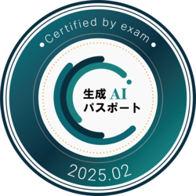
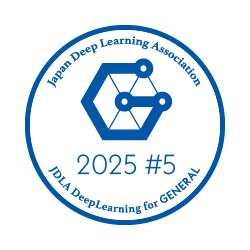

Tagawa et al. (2021) Nat. Commun.

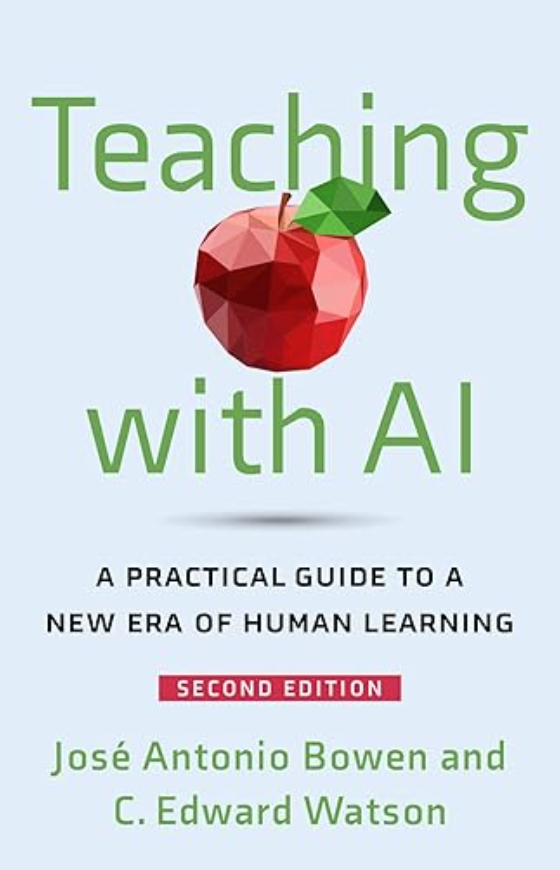

---

<!-- _class: ppt -->

2026/03/16

千葉大学 国際未来教育基幹 助教

田川 翔  /  博士(理学)

‹#›

生成AI時代の

教え方

前半： 生成AIで学びを損なわない

生成AIの仕組み、ポリシー(全学・授業)、目標・評価設計、価値の伝え方

---

<!-- _class: ppt -->

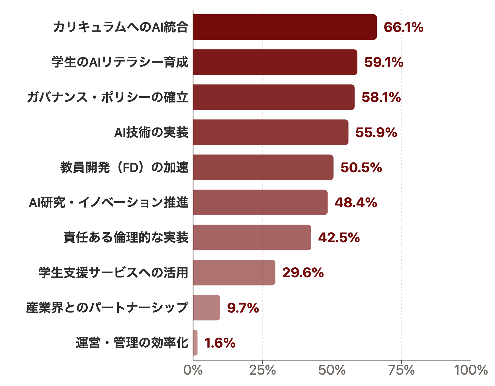

n = 191

2024年に実施したいこと

上位3-5個を選択

大学・学習を取り巻く状況

1. 生成AIはもはや「環境」に

2. 教員は評価で苦労

3. 大学の戦略にも影響

74%の教員が「学生がレポート作成にAIを使用」と認識

92%の教員が不正行為への倫理的な懸念を認識

【米国】　CollegeBoard (2026) リンク (n=3044/2930)

利用経験あり 92.2% (無料版使用 75.1%)

  授業や研究 　　44.5%

  論文・レポートの参考　49.8%

  翻訳・英作文　　31.9%

【国内】　全国大学生協連 (2026) リンク (n=13,277)

2025–2026年 AI・教育法・カリキュラムに関する 参加大学の生成AI活用に関連する目標調査 Bowen &amp; Watson (2025)

大学教育の全方位に生成AIは影響

---

<!-- _class: ppt -->

変化への処方箋

1. 生成AI自体に詳しくなる

　　どんな仕組みで、何ができて、なぜ使うのか

3. 科目の目標、評価、方法を改良する

　　改善フローとグッドプラクティスを知る

　　課題とワークをアップデートする

　　他の教職員・学生と対話する

2. 科目レベルのポリシーを設定する

   なぜ、自分の科目ではAIを使って良い・悪いのか

　 学ぶ価値と学生に掴んでほしい成果は？ 

教職員個人レベル

機関レベル

1. 全学ポリシーを定める

　　倫理・評価方針も？

3. 教育課程とUXを改良する

2. 生成AIの基盤を導入する

　　研修・FD

　　共通のシステム

本日は、教職員の皆様ご自身が出来ることを中心に進めます

---

<!-- _class: ppt -->

生成AI自体に詳しくなる

①大規模言語モデルがしていることとは

&#8203;

　　次のもっともらしい単語(Token)を予測する作業

②大規模言語モデルの中身とは

&#8203;

　　ルール集ではなく、数字(統計的な重み)の塊

③なぜ精度が上がったり、複雑なことも出来るのか

&#8203;

　　繰り返し推論したり、ツール/情報を接続できるから

この3つだけ、覚えて頂けますと幸いです

---

<!-- _class: ppt -->

出口(仕事)から学びを考える

生成AIの出力は、仕事の平均値 (Cグレード：並)になる

「AIができることを人がただ出力するのは、 　　　AIで事足りるので採用する必要はない」ということ

Teaching with AI (Bowen &amp; Watson, AAC&amp;U 2024)

② AIができない「高次」の価値を作る必要はある 

① AIの無視/禁止は逆効果で、現実的な解決策にはならない

③ AIができたとしても人がするから生まれる価値もある

→ だから引き続き、今の学びも必要

あなたが塾の講師とします。生徒から、「英語は生成AIが上手いのになんで自分が勉強する必要があるの」と言われました。なんと返しますか？

---

<!-- _class: ppt -->

‹#›

ポリシーの考えかた

他大学のポリシー (森木 2024)

ポリシー（Policy：方針・価値観・哲学）

① なぜそのように考えるのか

　　→全員が目指すべき地点と方向性

       価値観の共有、学生との対話

&#8203;

② 誰が何をするのか (構造)

&#8203;

&#8203;

③ 倫理、規範(ガイドライン)、ルールの参照

「生成 AI についての学び」

「生成 AI を用いた学び」

「生成 AI によらない学び」

     を目的によりそれぞれ推進

教員が科目での使用可否を決めその理由を学生に説明する

千葉大学のポリシー

成績の厳格化

教育課程の変更

学習成果明確化

学問的誠実性

ガバナンス・ プライバシー

不正行為の対応

成績評価基準 / 倫理指針

ルール/他のガイドライン

　（具体的な 　　禁止事項・作業）

ポリシーを定め、様々な基準・ルール・行動に矛盾なく反映

ポリシーは、全学、(学科)、科目、(課題)と様々なレベル感がある

---

<!-- _class: ppt -->

‹#›

科目レベルのポリシー・透明性

AI検出ツールと 不正の扱い

授業(シラバス)における生成AI利用のポリシーの例

このライティングコースの目的は、効果的に書き、コミュニケーションをとる方法を学ぶことです。

これができるようになるには練習が必要です。AIを使って迅速に文章を生産することも期待されるものの、そもそも質の高い文章を作るには、自分で作成、編集し、認識する能力が不可欠です。AIが自分を介さずに作業を行うことができる場合、それは雇用されるに値するライティングスキルを持っていない、ということです。だからこの授業で一緒に練習しましょう。AI検出ツールは使いませんが、授業の内容と矛盾するなどAIで出力したと思われる課題は、警告の上、零点として扱います。

&#8203;

1.目標を達成するために、コースの前半では、AIのサポートは一切禁止する。この過程の苦労やもどかしさは、レベル上げ訓練のようなものと捉えてほしい。

2.一方、コースの後半では、特定の状況下でAIを使用することが許可される場合がある。その際は使用したプロンプトと応答、アプリ名を提出するよう求める。

3.最終課題で生成AIの出力を比較するが、AIからの引用時はAPA形式に従う。

4.AIリテラシーは重要な新しいスキルである。AIは「ハルシネーション：事実のように見えるものを生成する可能性」があることに注意が必要である。 この技術の利点と潜在的な危険性の両方について批判的に考える必要がある。

5.最終的な成果物およびAIからの制限やバイアスの可能性について学生は責任を負う。教員はこのポリシーを必要に応じて変更する権利を留保する。

(Bowen &amp; Watson, AAC&amp;U 2024 ※僅かに講演者が改変)

使用の条件と理由

透明性/申告の要件

限界(ハルシネーション)への警告

AIの引用の表記

最終責任の所在

ポリシーの要素

---

<!-- _class: ppt -->

‹#›

AI利用の検知可能性

信頼を損ない、いたちっごっこになるのでおすすめしない → 課題を変える

AIが生成した文章かを判定するツールを学修成果の評価等に活用する場合でも、 その結果を過信しないことが重要である

文科省 (2023) 大学・高専における生成 AI の教学面の取扱いについて

※有料版・無料版の差異に注意 (Google Geminiは機能差はなく、回数差になっている)

AI検出ツールの精度にはばらつきがあり、誤検知による冤罪が学生に深刻な害を及ぼすリスクがあるため、その確率スコアを不正行為の「決定的な証拠」として過信してはならない　　　　　　　　　　　　　                Bowen &amp; Watson, AAC&amp;U 2025 (講演者が要約)

有料版を用いることで生成AIで出力したことがバレにくくなるし、

ChatGPTの出力をClaudeで加工するとか、webにある検出ツール回避AIで

誤字を意図的に入れるとか、方法はいろいろあって、どうにでもなる。

とある学生とのインタビュー (を講演者が複数人まとめてちょっと加工)

---

<!-- _class: ppt -->

‹#›

学習成果を考える

目標と評価は、対応する

学習成果（learning outcomes） 参考資料 - 学習成果とその可視化 松下佳代先生 (リンク)

目標設定

 教員が設計で意図する目標

 授業で出来るようになって欲しいこと

評価対象

 実際に学生が修得した結果

学士課程教育の構築に向けて (リンク) 中教審 2008年

intended learning outcomes

achieved learning outcomes

学習成果の評価は、学生の知識や能力の表出にもとづく直接評価を中心とする

学習期間終了時に、学習者が知り、理解し、行い、実演できること

を期待される内容を言明したもの

---

<!-- _class: ppt -->

‹#›

逆向き設計

①求められている結果を明確にする （目的・目標）

②承認できる証拠を決定する（評価方法）

③学習経験と指導を計画する（内容）

Wiggins &amp; McTighe (1998); 西岡 (2005)

(この順番 or 三位一体)

例：   (目標)プレゼンテーションを効果的に実施出来る

OK

NG

(内容) 講義のみで演習なし

(評価) テストで要点を確認

　　　　　するだけで実技なし

(内容) 学生が実際に発表準備

(評価) 発表した内容をもとに、

　　　　　フィードバック/採点

設定する目標によって、実施する評価、行うべき内容は変わる

目標・評価・内容を相互に調整 = コース全体： シラバス / クラス1回: クラスデザイン

 逆向き設計(backward design)

---

<!-- _class: ppt -->

‹#›

何が一番伝えたいことか

学生の現状

学修後の状態

目的：

どこに向かうのか

 (授業の存在価値)

達成目標：

何が出来るようになるのか

評価：

どのように測るのか

授業での考え方の例

設計(課題など)：

どのように教えるのか

設計を損なう形で、AIを使わない！

→ 教員が身につけて欲しいと考えるから、意図的に 　　学生の努力を期待している点

AI = RPGの場所ジャンプ機能にもなる

単にジャンプし続けると経験値がたまらずに、

自分が使いこなせなくなってしまう

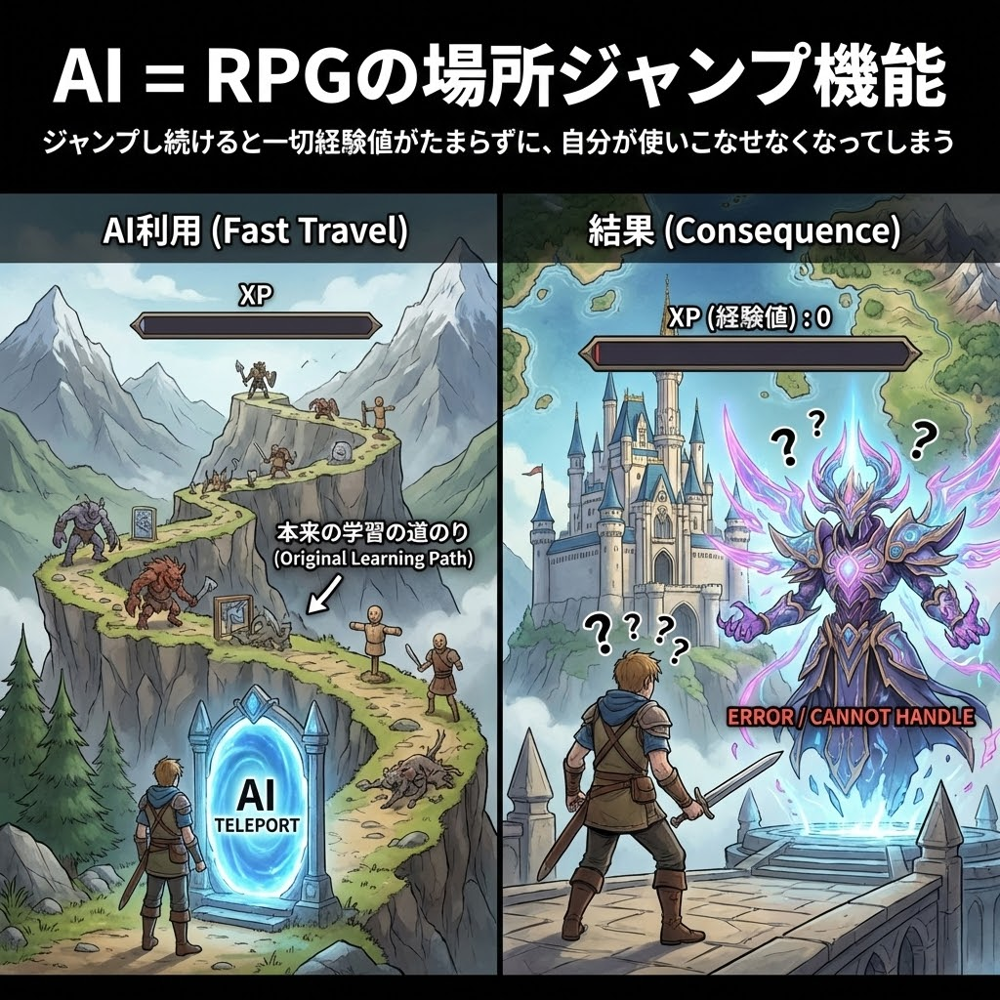

---

<!-- _class: ppt -->

<table class="ppt-tbl" style="left:2.699%;top:10.5%;width:32.808%;height:58.326%">
<tr>
<th></th>
<th>認知的領域 (知識や思考)</th>
<th>学びへの 生成AIの影響</th>
</tr>
<tr>
<td>高次</td>
<td>創造 (学習を応用し、新しい価値を作れる)</td>
<td>人の創造性こそが大切 アイデア出しで活用</td>
</tr>
<tr>
<td></td>
<td>評価 (事物・判断等を比較し評価出来る)</td>
<td>評価軸/価値/判断は人が設定する</td>
</tr>
<tr>
<td></td>
<td>分析 (要素に分け、関係性を指摘できる)</td>
<td>AIもある程度できる (例：要約・構造化)</td>
</tr>
<tr>
<td></td>
<td>応用 (他の場面や状況に使用できる)</td>
<td>単なる問題では、 AIが解いてしまう…</td>
</tr>
<tr>
<td></td>
<td>理解 (学習内容を説明出来る)</td>
<td>AIで支援することで、 より理解しやすくなる?</td>
</tr>
<tr>
<td>低次</td>
<td>記憶 (事実や概念を暗記している)</td>
<td>AIで支援可能だが、 学修者の記憶必須</td>
</tr>
</table>

左は栗田&amp;中村 (2023)を元に作成 / 

原著 Bloom (1956/1964)、改訂版(2001)を記載

AIで学びを代替したときに、

できなくなることがあること。

&#8203;

① 低次→高次まで身に付けないと 使えない/応用が効かない

② 長期的な悪影響は不明

例：手計算 vs 計算機

&#8203;

手計算を早く出来るスキルは不要、

手計算の感覚を持たず代替すると、 「大きな何か」を実現しようとしたとき、(長期的に)困ることのでは？

学習目標分類とAIの関係性

---

<!-- _class: ppt -->

試験以外にも、様々な評価方法があり、得意な範囲が変わる

各論(評価)

実演

筆記

複雑

単純

選択式 問題

記述式 問題

論述式問題

レポート

パフォーマンス課題

(小論文、作品制作、発表等)

実技テスト

面接/口頭試問

心理

テスト

観察

試験

高次の目標を測りやすい

田中（2010）『よくわかる教育評価』を改変

<table class="ppt-tbl" style="left:56.322%;top:27.827%;width:32.808%;height:58.326%">
<tr>
<th></th>
<th>知識</th>
<th>技能</th>
<th>態度</th>
</tr>
<tr>
<td>客観試験</td>
<td>◯(低次)</td>
<td></td>
<td></td>
</tr>
<tr>
<td>論述試験</td>
<td>◯(高次)</td>
<td></td>
<td></td>
</tr>
<tr>
<td>レポート</td>
<td>◯(高次)</td>
<td>◯</td>
<td>◯</td>
</tr>
<tr>
<td>発表</td>
<td>◯(高次)</td>
<td>◯</td>
<td>◯</td>
</tr>
<tr>
<td>口述/面接</td>
<td>◯</td>
<td></td>
<td>◯</td>
</tr>
<tr>
<td>観察評価</td>
<td>◯</td>
<td>◯</td>
<td>◯</td>
</tr>
<tr>
<td>実演・制作</td>
<td></td>
<td>◯</td>
<td>◯</td>
</tr>
<tr>
<td>心理テスト</td>
<td></td>
<td></td>
<td>◯</td>
</tr>
</table>

中島 (2016)  p.36を参考

加筆は吉田2023を参考

様々な評価の種類

適用可能な範囲

→ 詳細は大阪大学FD資料 リンク

AIのインパクト大

評価種類による得意・不得意

---

<!-- _class: ppt -->

前半のまとめ

1. 大規模言語モデルがしていることとは

次のもっともらしい単語(Token)を予測する作業

確率的に出力を出しているので、ハルシネーションは仕組み上起きる

①大規模言語モデルがしていることとは

&#8203;

　　次のもっともらしい単語(Token)を予測する作業

2. ポリシーと透明性の確立

生成AIを使う/使わない学びの推進を「なぜ」に遡り記載

授業のレベルでもポリシーを設定し、使用/申告の手順を明示する

3. 学習成果の「高次」シフトと課題・ワークの変更

目標に遡り、課題・ワークを変える必要があるか、既存科目をアップデート

試行錯誤のプロセスをデザインすると共に、AIに代替されない学びを実現する

---

<!-- _class: ppt -->

2026/03/16

千葉大学 国際未来教育基幹 助教

田川 翔  /  博士(理学)

‹#›

生成AI時代の

教え方

後半： 生成AIで学びを更に良くする

生成AIの機能、授業のグッドプラクティス、課題設計

---

<!-- _class: ppt -->

AIとの関わり方の文脈を作る

答えを教えてくれる道具から、創造性を伸ばし、学び方を伴走する道具へ

学修とは、与えられたレポートや評価で良い点数を取ること

生成AIは、効率よく短時間で点数を上げる道具！

学びとは、自分を伸ばすためのプロセス

生成AIは、学びを深めたり、出来ることを増やす道具！

学生A

学生B

楽する道具

学びの伴走者

AIとの関わり方で、全く結果が変わる時代に / 誰でも、自分の力を解き放てる

答えを教えないように指示された、学習用の生成AIは意味がある

Bastani et al. (2025) PNAS

---

<!-- _class: ppt -->

学習スタイルの複線化

積み上げて受動的に学ぶ

：順問題/演繹的学び方

最終到達点から探究的に学ぶ

：逆問題/アブダクション的学び方

どこかで頭打ちする可能性

高みから中間地点を学ぶ

？

！

学び方の道具としてAIを位置づける

学びを良くするサイクルに含める

既存の学びを効率化するコスパ/タイパの道具ではない

より深く・広く学びやすくするための道具とてAIを考えてみる

---

<!-- _class: ppt -->

生成AIのメリット

・初歩的質問や関心に合わせた回答 ・個別の理解度に応じ難易度を自動調整

・回答が速く、何回でも聞ける

個別最適なチューターとしてのAI

・壁打ち相手として機能

・0→1や言葉になっていない部分、 　今まで時間のかかった点も支援出来る

創造性の壁を取り払うAI

・教員が学んでほしい順番、意図について

　生成AI上に指示を作成できる

　(カスタムAIツールを作成出来る)

教員の意図の実装としてのAI

・大学窓口/議事録等の業務の支援

・採点/スライド作成などの支援

・大学のUXを変える

人がすべきタスクに集中させるAI

生成AIを大学の学びを支援する道具として活用する

---

<!-- _class: ppt -->

Bloomの2シグマ問題の解決

個別指導は、

成績を大きく変化させる

&#8203;

コスト的に不可能だった 個別指導をスケール させるのがAI?

生成AIで学習を伴走すると、成績が上がる可能性

「学び方」や「自分が今まで知っていることとの関係性」に向き合う

そのような「プロセス」における使い方をすることで、学びの道具にできる

---

<!-- _class: ppt -->

NotebookLMの事例

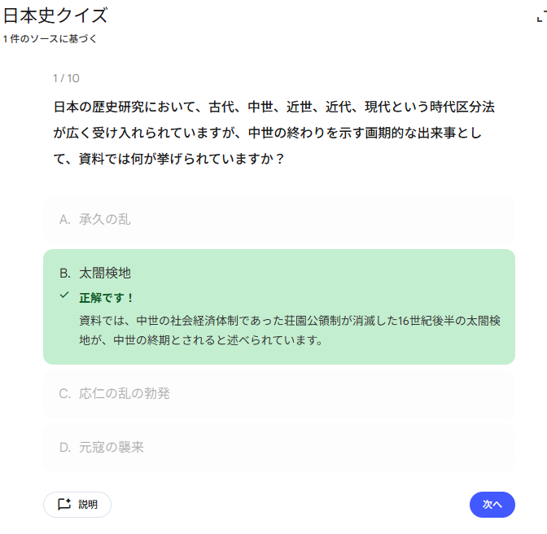

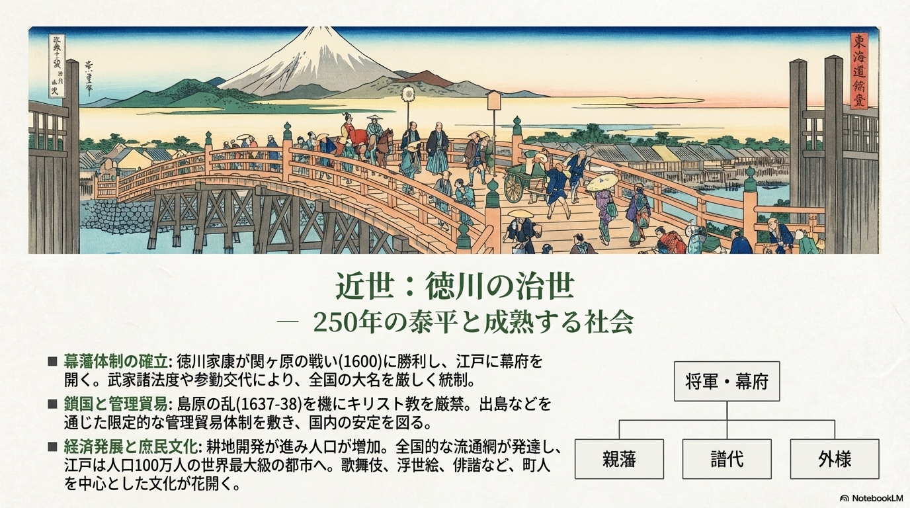

絵1枚で要約

クイズ・フラッシュカードで確認

デモ

スライド作成 /動画作成

情報の構造化

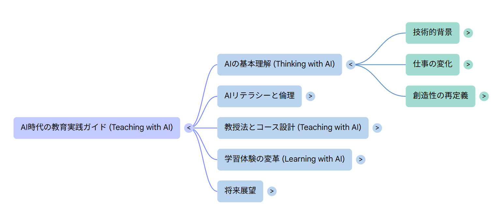

学習体験の変革を目指し、授業内でも提供中

---

<!-- _class: ppt -->

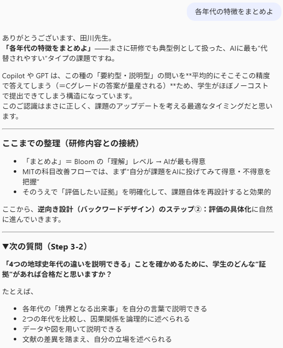

Gems / Copilot Agentの事例

業務内で使用するフローを固定し、利用している

 = AI(“プロンプト”, “参照するデータ範囲”)

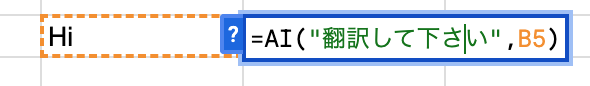

まいど

こんにちは

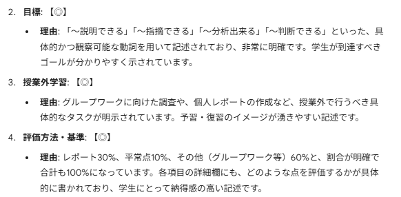

 シラバスチェックのGem

Copilot Agent

---

<!-- _class: ppt -->

AI時代の学習の形

AIを伴走者に「経験」から学び、対話を通じて「人間固有の教養」を磨く

1. 「理論」先行から  「経験」先行へ

2. 「知識伝達」から  「場」の創造へ

3. 「人間固有の力」の育成

AIと伴走した実践的「経験」が先行

「生産的な失敗」から自分に足りない理論や知識に気づく学習サイクル

人が集まるからこそ

学べる価値が問われる

教員は専門家から、対話・内省・人間的成長を促すファシリテータへ

より良い問いを立て、AIの出力を批判的に評価・編集する力

最終的な「選択・責任」を引き受け、他者と関係性を築くレジリエンス

AIがもたらす教育の根本的変化 (私見)

---

<!-- _class: ppt -->

後半のまとめ：AI時代のまなび

生成AIで学びを更に良くする（攻めの姿勢）

学習スタイルの複線化

個別最適な学習支援

AI時代の学習の形

積み上げ型に加えた 「最終到達点」からの探究的な学び

効率化ではなく 「学びの伴走者」としての創造力を磨くAI活用

答えを直接教えず、学生の「創造性」「疑問」「気づき」を引き出す

コスト面で不可能だった「個別指導」を生成AIでスケール化できる

自己説明などの高度な「学習方略」のプロセスをAIが支援

教員の意図（学んでほしい順番等）を反映した カスタムAIツールの作成

理論先行から、AIと実践し生産的な失敗から学ぶ「経験先行」へ

知識伝達から、対話・内省を促す「場の創造（ファシリテート）」へ

AIリテラシや教養を磨き「人間固有の力」の育成・

そこは人しかできない

•

•

•

•

•

•

•

•

•

教職員とAIで分業しつつ、新しい学び方をデザイン

一、真実を求め至誠を捧げよう

一、正義を尊び邪悪を除こう

一、和平を願い人類に尽そう

---

<!-- _class: ppt -->

変化への処方箋 (再掲)

1. 生成AI自体に詳しくなる ☑

　　どんな仕組みで、何ができて、なぜ使うのか

3. 科目の目標、評価、方法を改良する ☑

　　改善フローとグッドプラクティスを知る

　　課題とワークをアップデートする

　　他の教職員・学生と対話する

2. 科目レベルのポリシーを設定する ☑

   なぜ、自分の科目ではAIを使って良い・悪いのか

　 学ぶ価値と学生に掴んでほしい成果は？ 

教職員個人レベル

機関レベル

1. 全学ポリシーを定める

　　倫理・評価方針も？

3. 教育課程とUXを改良する

2. 生成AIの基盤を導入する

　　研修・FD

　　共通のシステム

上記の内容を本日は振り返りました / いかがでしたか

---

<!-- _class: ppt -->

本日のFDのねらい

当日の設計： ワークとレクチャーを半々で行います

前半： 生成AIで学びを損なわない

ご参加の先生方、職員の皆様で、

「生成AI時代の教え方」のヒントを探し、言葉にし、

実践出来るアイデアを得ること。

後半: 生成AIで学びを更に良くする

生成AIの仕組み、ポリシー(全学・授業)、目標・評価設計、価値の伝え方

生成AIの機能、授業のグッドプラクティス、課題設計

---

<!-- _class: ppt -->

他にどんな事ができる？

スライドの作成・修正

圧巻の風景写真を作成したいです。

北極の空を静かに飛ぶ旅客機を横から眺め、後ろにはオーロラが見えるような、景色を写実感のある写真として出して下さい。高度は高く、地上は小さく、暗闇の中を光るのは飛行機の窓とオーロラだけ、という雄大な構図にして下さい。飛行機の窓は一部は閉じられています。

&#8203;

飛行機を横からみた構図にして下さい。

写真は正方形にして下さい。

高校の化学の実験を生徒がモチベーションがあがるような、楽しそうな絵を生成して下さい。化学実験室の机にフラスコがあって、反応が進んで生徒2-3人驚いている感じで。

&#8203;

但し、現実的な実験の様子にして下さい。

漫画な感じで、効果音も文字で書いてほしい。吹き出しは使ってはだめです。白黒の線画にして下さい

&#8203;

図は正方形で、明るい感じ。

以下は、千葉大学のGoogle Workspaceで、教職員・学生もできる作業です。

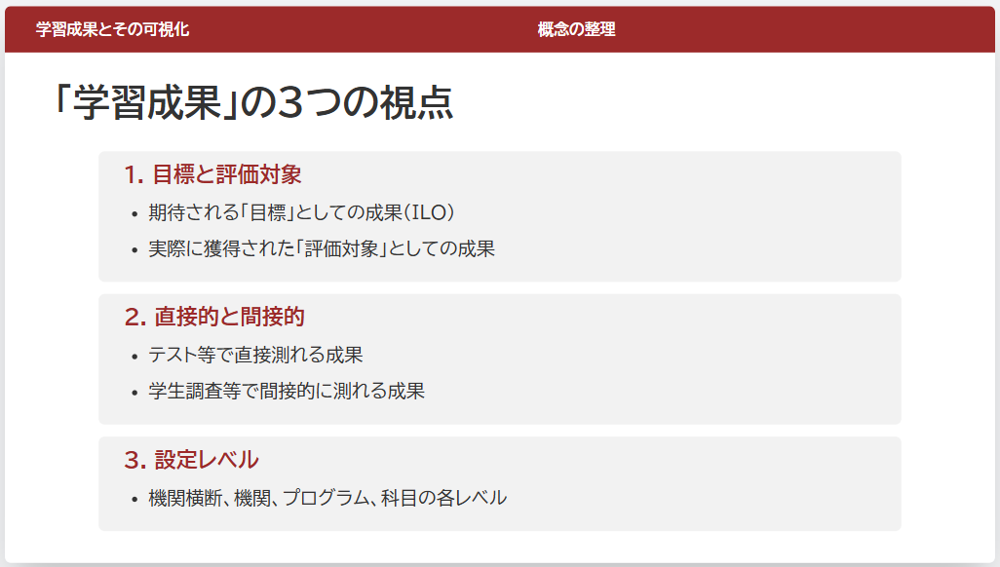

プログラムの対話的作成

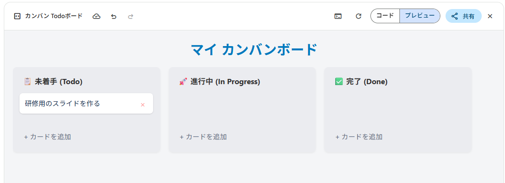

絵/漫画の出力 ・ 図の修正

授業の解説や問題の作成

資料からの情報検索

曲/動画の作成

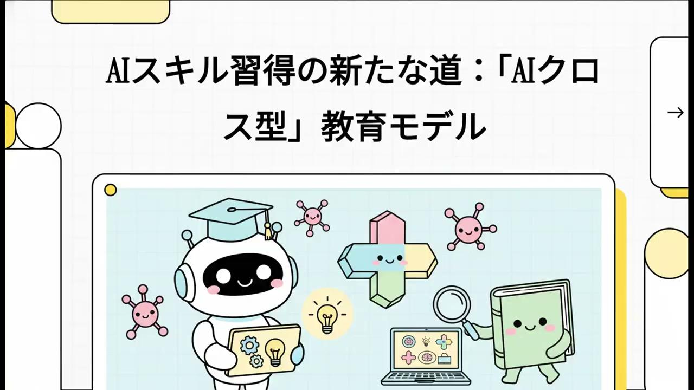

採点の下読み

スプレッドシートの分析

シラバスプレチェック

授業目標設定の支援

業務支援ワークフロー

大学全体で共有 → 授業や職務で活用しやすい / 研修も実施

---

<!-- _class: ppt -->

今後の展開

2026年： AIによる「補助」　→　AIとの「自律的・協働的な作業」

Chat 時代

Tool 時代

Agent 時代

変化

AIと対話

使い方

情報収集 DeepResearch

例

発表表現のアイデア出し

発表・資料作成のコツ

こうしたらどうですか？

→ 人は作成者

AIが案・部品を作成

スライドの案の作成

発表資料の図の生成

構成・原稿の作成支援

スライド案/図を作成する

→ 人は編集者 (“ガチャ”)

AIが作成を実行

対話によるスライドの完成

スライド自体の作り込み

デザイン・表現の一貫性担保

スライドを自然言語で指示する

→人とAIで協働作成

誤字・分かりにくい点の確認

作成ワークフローの実現

なう

例：スライド

「チャット」で聞く道具から、「エージェント」で作業の伴走者に転換

---

<!-- _class: ppt -->

仕事への影響

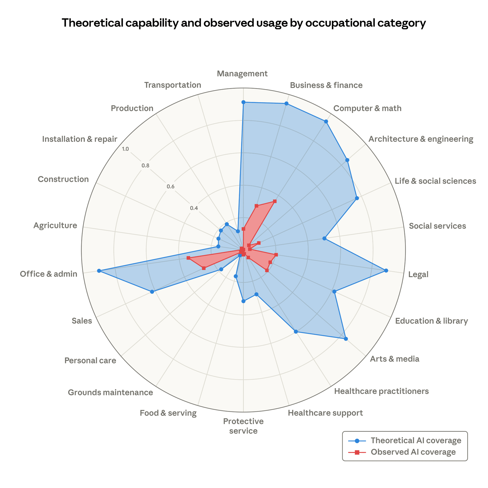

AIの仕事への影響度合い

Massenkoff and McCrory (2026)

Anthropic /Economic Research 

例 Education &amp; Library：

  青≒60%分の時間×タスクがAIで効率化/代替可能

  赤≒20%分のタスクがClaudeに実行結果がある

① いわゆるホワイトカラーの大半に影響

② 今後、赤が青に近づく cf. 軸も変わる

③ 現時点で雇用は影響ないが、若手で変化

時間×タスクでのAIカバレッジ指標

軸:　AIを全く使ってなかった時

青： 　AIで理論上、2倍効率化する範囲

(Eloundou et al., 2023)

赤： 自動化/効率化が観察された範囲

 　(2025/8・11の利用実績：”暴露度”)

---

<!-- _class: ppt -->

‹#›

全学レベルのポリシーの指針

国内大学のポリシーは、上記等の考え方と文科省の指針を合わせ、

各大学のミッションと状況に合わせた記載になっているはず

大学全体の基本ガイドラインと倫理的枠組み

生成AIの教育活用への倫理

（California State University Fullerton ETHICALフレームワークより）

Exploration and evaluation  （探索と評価：AIの出力を批判的に評価する）

Transparency and accountability  （透明性と説明責任：AI使用を隠さない）

Human-centered approach  （人間中心のアプローチ：人間の判断を優先する）

Integrity and academic honesty  （誠実性と学問的誠実さ：基準を遵守する）

Continuous learning and innovation  （継続的な学習とイノベーション）

Accessibility and inclusivity  （アクセシビリティと包摂性：公平性を促進する）

▶

▶

▶

▶

▶

▶

大学全体の基本ガイドライン

（英国研究大学群 ラッセル・グループ が定めた5原則より）

学生と教職員がAIリテラシーを身につけることを支援する

教職員がAIツールを教育に効果的かつ適切に使用できるようサポートする

AIの倫理的使用をカリキュラムに取り入れ、教育と評価の方法を適応させる

学問的な厳格さと誠実性（Academic Integrity）を確実に維持する

ベストプラクティスを共有し、協力する

•

•

•

•

•

---

<!-- _class: ppt -->

‹#›

卒論・課題の違反行為への対応

アカデミックインテグリティ (学問における誠実性)

AIの有無によらず同じ

数年前の先輩のレポートを丸写しした

使用を禁止されたツールを回答に用いた

卒論で何も考えずに他者の記述・文献をコピペした

研究倫理/アカデミック・インテグリティの遵守を説明し、求める

(特定不正行為に該当することをAIの利用の有無によらずしない)

&#8203;

不正時のペナルティもあらかじめ説明しておく

日本学術振興会「科学の健全な発展のために」-誠実な科学者の心得 (2015) リンク

fabrication(捏造)　存在しないデータ，研究結果等を作成すること。 

falsification(改ざん)　研究資料・機器・過程を変更する操作を行い、データ、研究活動によって得られた結果等を真正でないものに加工すること。 

plagiarism(盗用)　他の研究者のアイデア、分析・解析方法、データ、研究結果、論文又は用語を 当該研究者の了解又は適切な表示なく流用すること。 

---

<!-- _class: ppt -->

MITの科目改善フロー

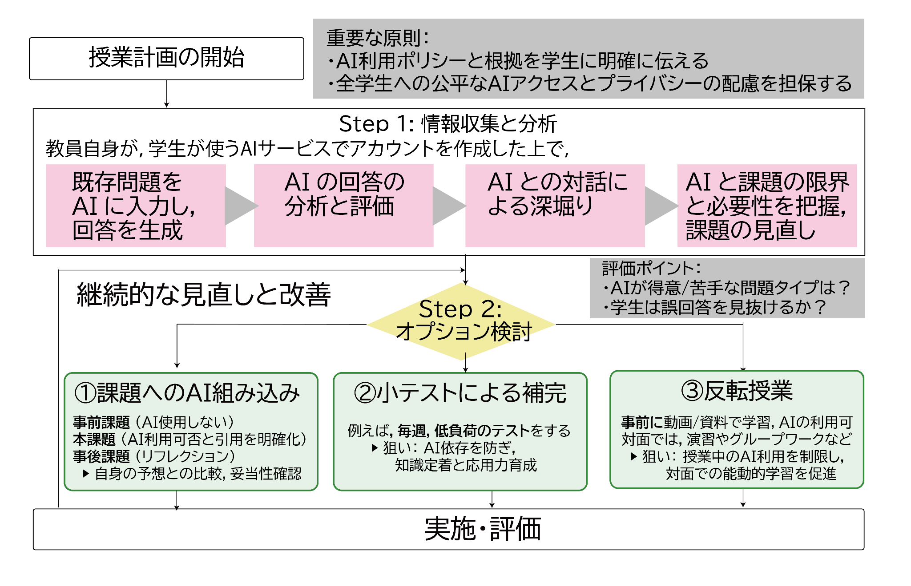

類似のヒントは阪大HPにも

https://www.tlsc.osaka-u.ac.jp/project/generative_ai/assessment_ai.html

授業の目的・目標を

再考する

生成AIを利用可能な範囲を決め、科目レベルのポリシーを決める

授業のワークと課題を

このフローで見直す

伊澤先生のグッドプラクティスを伺ったあと、実際に、ワークで体験してみましょう

---

<!-- _class: ppt -->

創造性をAIで解き放つ

生成AIにこう送ってみてください

[あなたのやりたいこと]を実現する最初の一歩は？

# Google for Education Gemini Day: 大学生アンバサダーの発表より

---

<!-- _class: ppt -->

学習方略の観点からAIを見る

学習方略 - Dunlosky et al. (2013)  PSPI

　　　教育心理学による、「生徒がどう勉強すべきか」のレビュー論文

<table class="ppt-tbl" style="left:2.585%;top:29.226%;width:32.808%;height:58.326%">
<tr>
<th>テクニック</th>
<th>内容・方法</th>
<th>効果</th>
<th>主な理由</th>
</tr>
<tr>
<td>実力テスト</td>
<td>フラッシュカードや練習問題などを使い、自分の記憶から情報を引き出すテストを行う。</td>
<td>高</td>
<td>学習効果が高く、幅広い教材・年齢層に有効。フィードバックがあると効果的。</td>
</tr>
<tr>
<td>分散学習</td>
<td>一気に学習せず、学習スケジュールを分散させる。</td>
<td>高</td>
<td>長期的な記憶保持に有効。一夜漬けよりも遥かに効率が良い。</td>
</tr>
<tr>
<td>精緻化的質問</td>
<td>「なぜその事実が成り立つのか？」という質問を自分に投げかけ、説明を考える。</td>
<td>中</td>
<td>事実の学習に有効だが、ある程度の予備知識が必要。</td>
</tr>
<tr>
<td>自己説明</td>
<td>学習のプロセスや、新しい情報が既知の情報とどう関連するかを自分自身に説明する。</td>
<td>中</td>
<td>数学や論理的思考を要する問題解決に有効だが、時間がかかる。</td>
</tr>
<tr>
<td>交互練習</td>
<td>1つの種類の問題をまとめて解くのではなく、異なる種類の問題を混ぜて練習する。</td>
<td>中</td>
<td>数学などで劇的な効果がある（区別がつかなくなるのを防ぐ）。 ※ 全ての教科での効果は未検証。</td>
</tr>
<tr>
<td>要約</td>
<td>学習したテキストの要点をまとめ短い文章にする。</td>
<td>低</td>
<td>時間がかかるわりに、要約スキルの形成を除き効果が薄い。</td>
</tr>
<tr>
<td>ハイライト</td>
<td>重要な部分に線を引いたり、色を塗ったりする。</td>
<td>低</td>
<td>読むだけより効果が薄くなりがちで、推論能力を阻害しうる。</td>
</tr>
<tr>
<td>キーワード法</td>
<td>発音が似たキーワードにイメージを結びつける。</td>
<td>低</td>
<td>適用できる教材が限られ（語呂合わせなど）、長期記憶しにくい。</td>
</tr>
<tr>
<td>テキストのイメージ化</td>
<td>読んでいる内容を頭の中で映像化する。</td>
<td>低</td>
<td>視覚化しやすい教材に限られ、効果が一貫しない。</td>
</tr>
<tr>
<td>再読</td>
<td>テキストやノートを繰り返し読む。</td>
<td>低</td>
<td>最も一般的だが、時間対効果が低く、深い理解につながらない。</td>
</tr>
</table>

※個人差はあります。

効果の高い方法は、準備コストが高く一人では難しい→AIで伴走

---

<!-- _class: ppt -->

生成AIについての学びの事例

生成AI活用講座 / Hands-on Generative AI Workshop

生成AIアプリを作ってみる

大規模言語モデルを知る

AIとの関わり方を考える

AIリテラシ/倫理

レポート

・人間中心のAI社会原則

・安全性

・プライシー

・透明性

・公平性

・説明可能性

・AIの活用例

 →企業での活用例を調査

・生成AIの自分なりの説明

・AIとの関わり方レポート

テスト

グループワーク

生成AIについての学び

AIツールを作れる学生の育成 → 学生参画型のSD/FDへの展開？

---

<!-- _class: ppt -->

生成AIを用いた学びの事例

AIをワークや課題に導入することで、ありそうな課題を現実にといてもらう

課題の現実化

クリエイティビティと視覚化

アメリカ独立戦争時の「普通の人々」の日記や記録を調査し、AIで統合し、画像生成AIや音声AIを組み合わせて、歴史的に正確な3Dのビデオポートレートを作成させる。

起業と概念実証（プロトタイピング

AIに50個の新製品アイデアを生成させ、そこから優れたものを選び出す。

顧客ペルソナを設定し、5つの事業提案を作成する。

学習ツールの作成・発表準備の時短

(Bowen &amp; Watson, AAC&amp;U 2025 ※僅かに講演者が改変)

土木・公共工事における「橋」設計の課題を出し、構造評価後のデザインを実際の写真と合わせることで画像を生成、評価、発表。

-Googleセミナーであった日大さんの事例

数学や経済の分野など、パラメーターを変更できるシミュレーターを作成し、学生が実験する。気付いた点をシェアするが、文字起こしを実施後、スライドはAIで自動作成する。

---

<!-- _class: ppt -->

設計の際の原理

講義をしなくても、学生は学ぶ事ができる

ID(インストラクショナル・デザイン)の第一原理

5つの要件        　　　　説明

➀問題(Problem)  　　　現実に起こりそうな問題に挑戦する

②活性化(Activation)  　　　すでに知っている知識を動員する

③例示(Demonstration)  　　例示がある(Tell me でなく Show me)

④応用(Application)  　　　応用するチャンスがある(Let me)

⑤統合(Integration)   　　　現場で活用し、振り返るチャンスがある

鈴木克明（2015）『研修設計マニュアル』北大路書房

インストラクション：学習を促進させるために行うことすべて

課題中心型の授業設計/インストラクション

学習者中心の指導において内発的動機づけと協働を支持するために、現実社会の課題を学習の中心に据える

サポートやガイダンスを提供することで、効率的に目標に到達できる

&#8203;

参考：　ライゲルース 他 (邦訳2020) 学習者中心の教育を実現する インストラクショナルデザイン理論とモデル

---

<!-- _class: ppt -->

深層学習

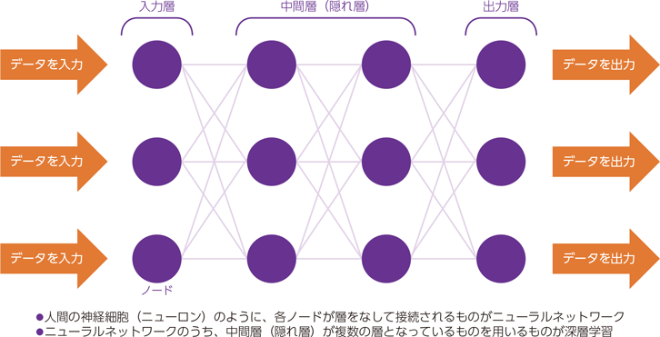

『R1 総務省 情報通信白書』総務省(2019)

パラメーター

の函

学習

入力

出力

評価

更新

パラメーター

の函

入力

出力

利用 (推論・生成)

数字の羅列

数字の羅列

‹#›

機械学習：データから、「機械」（コンピューター）が自動で「学習」し、              データの背景にあるルールやパターンを発見する方法。

深層学習：機械学習に多数の層から成る 　　　　　　　ニューラルネットワークを用いて 　　　　　　　行う方法

(参考)機械学習・深層学習

生成AI： 深層学習を用いてデータを学習し、

  　　　　　新しいコンテンツを生成する技術

---

<!-- _class: ppt -->

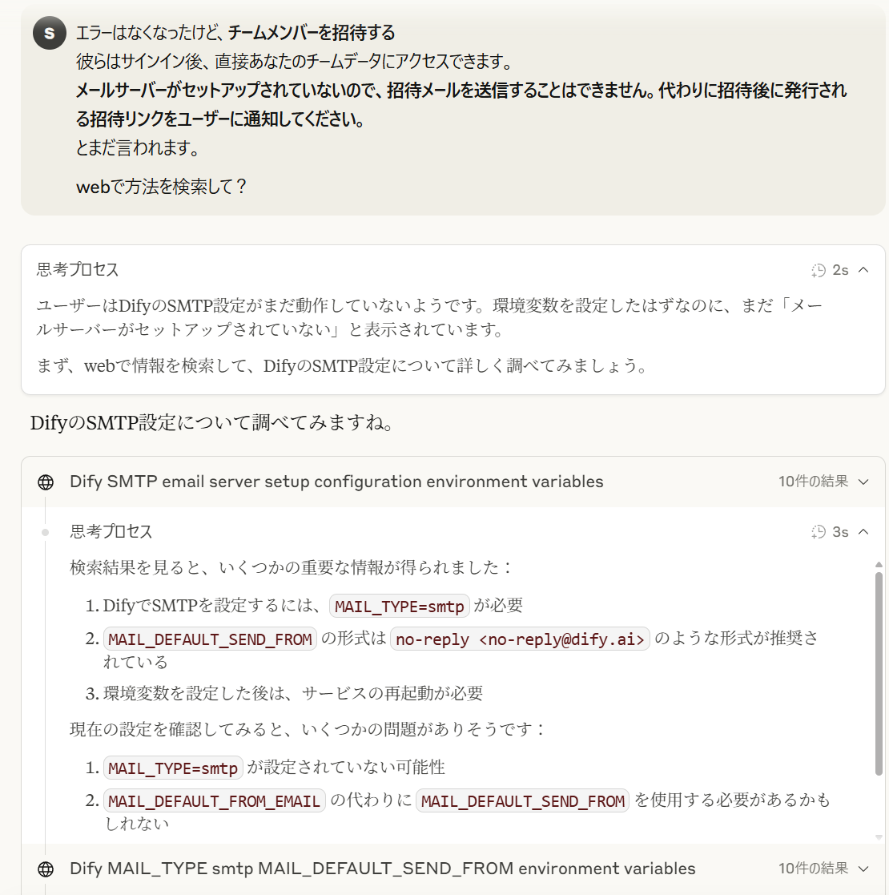
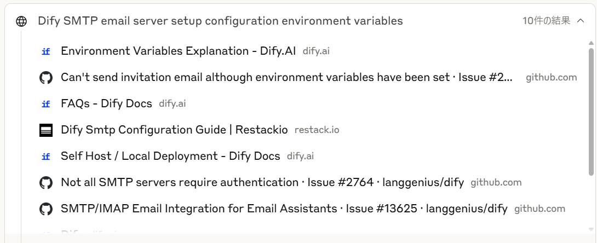

グラウンディング：

　AIが生成する回答を、特定の信頼できる 　情報源（ソース）にしっかりと結びつける技術

昔：

AI

回答

データ

回答

AI

今：

「因果推論」「思考ツール」になりつつある

‹#›

(参考)AI agentのふるまい

---

<!-- _class: ppt -->

<table class="ppt-tbl" style="left:11.046%;top:18.718%;width:32.808%;height:58.326%">
<tr>
<th>生成AI アプリケーション</th>
<th>Chat GPT, Gemini etc… インターフェースを通じて AI 機能をユーザーに提供する</th>
</tr>
<tr>
<td>エージェント</td>
<td>DeepResearch, web検索 etc… 環境とやり取りし、情報を収集して、その情報に基づいて意思決定を行い、アクションを実行</td>
</tr>
<tr>
<td>プラットフォーム</td>
<td>Dify, Google AI studio etc… AI モデルの構築とデプロイに役立つツールとサービス、データマネジメントツールで構成</td>
</tr>
<tr>
<td>大規模言語モデル</td>
<td>説明の通り</td>
</tr>
<tr>
<td>インフラストラクチャー</td>
<td>コンピューターリソース、GPUなど</td>
</tr>
</table>

基盤

応用

改変：Google Cloud Skills Boost

(参考)生成AIのレイヤー構造

---

<!-- _class: ppt -->

(参考)コンテキストの重要性

昨今のAIは、何をコンテキストに入れるか勝負になっている

前提情報A

前提情報B

詳細なプロンプト

良い結果

改善LOOP

※ 矛盾する前提情報が多くなると雑な回答になりがち

※ ベストなコンテキストのデザインを行う方法は、コンテキストエンジニアリングと言われている

参考：

AIに適切な情報を渡す手法には検索拡張生成（Retrieval-Augmented Generation）がある。

ベストなコンテキストになるようなRAGアルゴリズムが必要 (RAGは断片を持ってきがち)。

RAGは断片的で難しく、整った形でコンテキストに入れられる場合に限り、精度があがる。

→ 情報が繋がって、新しい価値ある情報を生む価値を作る

---

<!-- _class: ppt -->

(参考)授業の改善サイクル

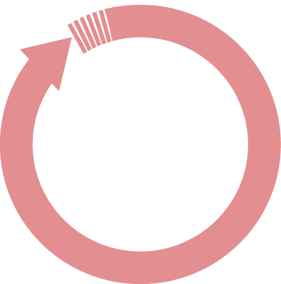

分析

設計

開発

実施

評価

Analysis

Design

教育・教材設計のプロセスを示したもの

(ガニエ他 2007) ※但し1980sからある

Implementation

Evaluation

Close the LOOP!

✔1回のループで終わるのではなく、より高次の ループに入ることが重要です(Close the LOOP!)

✔この形に常に固執するのではなく場合によっては 実験を行ったり(ラピッドプロトタイピング)、 引き返すなどが重要です

✔授業で期待される学習成果も明確化します

&#8203;

　※ 他に、授業改善に特化したモデル・理論もあります

Development

① 学生の受講動機・事前知識等の分析

② レポート・期末試験 (間違いの多い点)

③ 成績分布 (ダッシュボード)

④ 授業評価アンケート

⑤ シラバスチェック

⑥ 科目の位置づけ・DP/CPとの関係

授業改善の道具 (分析項目)

逆向き設計

ADDIEモデル

---

<!-- _class: ppt -->

(参考)課題における透明性の確保

課題における使用の申告例 (Bowen &amp; Watson, AAC&amp;U 2024)

- 私は友人、ツール、テクノロジー、AI の助けを一切借りずに、この作業を完全に自力で行った。

- 最初のドラフトは自分で書いたが、その後、友人/ 家族/AI/ パラフレーズ/文法/剽窃ソフトウェアに読んでもらい、提案をもらった。この助けを受けた後、以下の変更を行った：

    - スペルと文法の修正

    - 構成や順序の変更

-自分で作成した後、テクノロジーを使用して文全体や段落全体を書き直した。

-元となるアイデアを生成するためにAI/友人/チューターを使用した。

-アウトライン/最初のドラフトを作成するためにAIを使用し、その後編集した。

課題における自分のコントリビューションを説明する

研究論文のコントリビューションにおけるCRediTモデルに近い

虚偽申告は倫理規定により罰則など

---

<!-- _class: ppt -->

(参考)授業ポリシーのチェック点

ポリシー作成チェックリスト (Bowen &amp; Watson, AAC&amp;U 2024)

-AI の使用が許可または禁止されるのはいつか？なぜか？

-AI とのブレイ ンストーミングはカンニングにあたるのか？

-AI がこのクラスで学習をど のように強化または妨げる可能性があるのか？

-AI が許可されている場合、 学生は課題提出の一環として AI プロンプ トを共有する必要があるのか？

-AI の使用はどのようにクレジットされるべきか？

-AI の限界に関する警告

-AI 検出ツールの使用計画とその情報の使用方法に関する説明

事前に授業における生成AI利用のポリシーを共有する

---

<!-- _class: ppt -->

(参考)国内でのFD研修状況

2024年度のFDの話題の集計 (田川 2025)

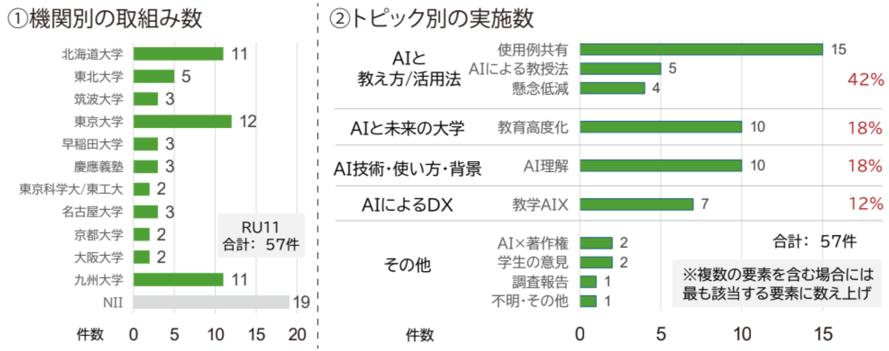

10 トピック、高いニーズ、肯定的 / 活用関連の内容が目立つ

生成AIの禁止・否定から、共存・活用への転換が見られる(AIの環境化)

---

<!-- _class: ppt -->

(参考)千葉大での研修状況

AIを活用する風土づくり

環境

対象：大学院生 + 教職員 (初心者)

　60-70名程 + 事後で映像配信

講義

体験

議論・座談会

最初の15分

真ん中の15分

最後の15分

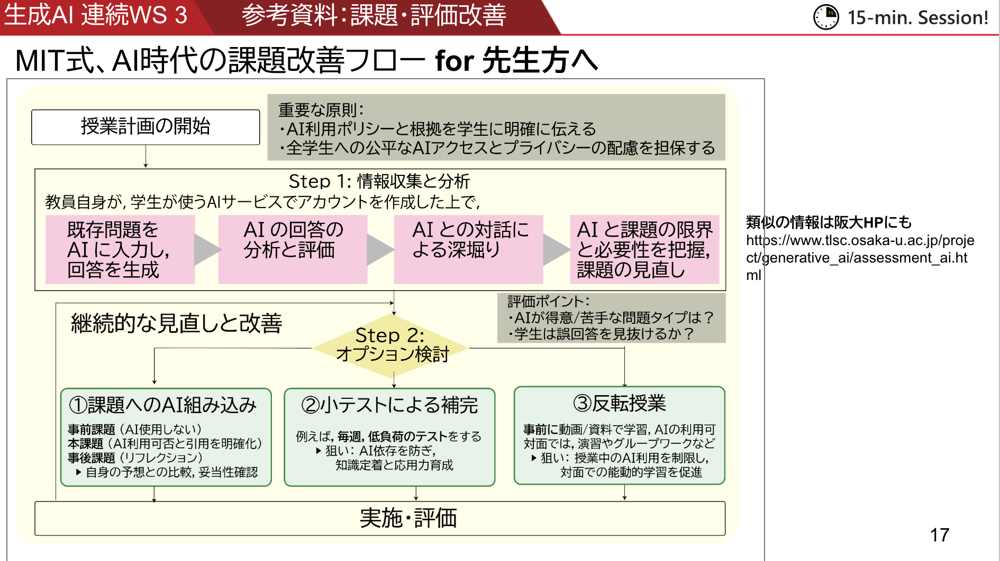

「触ってみる」

「みんなで試す」

「反応を見る」

概ね好評

教職員多数

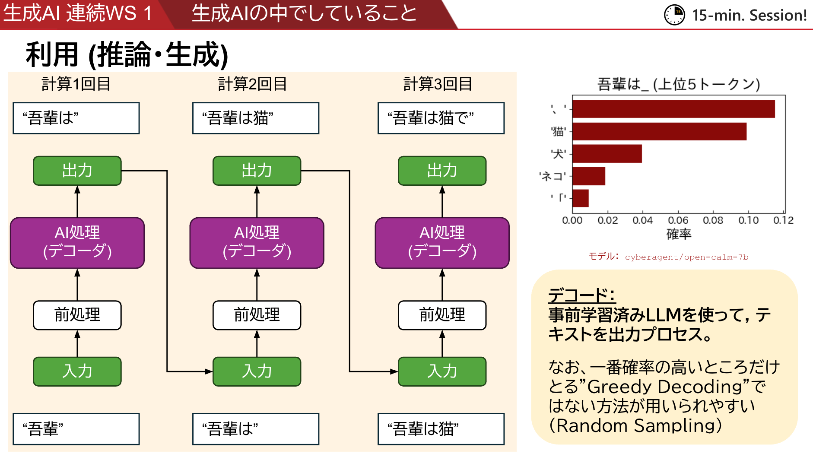

---

<!-- _class: ppt -->

生成AIの関連の影響範囲

マクロ

(全学)

ミクロ

(授業)

クリエイティブ

事務/タスク

フィード バック

学生 相談

iPaaS + AI

業務改革

授業支援

チューター

ポリシー

教学マネジメント

質保証/ with AI

データ中心の

記録改革

個別最適で在学中支援するアプリ

生成AIと教員mixの

授業設計

課題・教材利用

ミドル

(課程)

カリキュラムへの

生成AIの統合

科目

検索

専門AI  教科書

教育データ活用

一生涯 + 2次

AIの

FD/SD

時間主義から 達成主義へ

AI リテラシ

採点利用

窓口DX

研究クラウド

・研究AI

データ活用

ポリシー

Writing

支援

学び方・卒業後の

ロールモデル提示

授業評価

教務作業 自動化

シラバス・

授業案自動化

業務フロー

改善

普及済

普及中

黎明期

まだ

AI活用 反転授業

KPI/

経営支援

倫理的

確認

(参考)生成AIの影響範囲

---

<!-- _class: ppt -->

(参考)AIの大学への学びの影響

Does ChatGPT enhance student learning?

A systematic review and meta-analysis of experimental studies

Deng et al. (April 2025) Computers &amp; Education

ChatGPTが主に(85%)大学生の学習に与える影響について、

2022年から2024年にかけて発表された69本の教育実践を

システマティック・レビューしたもの (※語学32%)

Academic performance (学業成績)

縦軸：各研究名

Hedge‘s g ：各研究の効果量を示す。大きいほど研究のサンプルサイズが大きく、結果の精度が高い (0.5で中程度、0.8を超えると大) 。

ひげ：各研究の効果量の95%信頼区間（CI）を示す。この線が0をまたがなければ、その研究は統計的に有意な効果を持つことを示す。

&#8203;

見方

　中央の0を基準とし、

　- 右側は「ChatGPT利用が学習効果を高める」

　- 左側は「ChatGPTが逆効果または効果なし」

&#8203;

結論

一番下の菱形（ダイヤモンド）：全研究を統合した全体の効果量、菱形の中央が全体の効果量。

学業成績を高める効果があるとわかる。

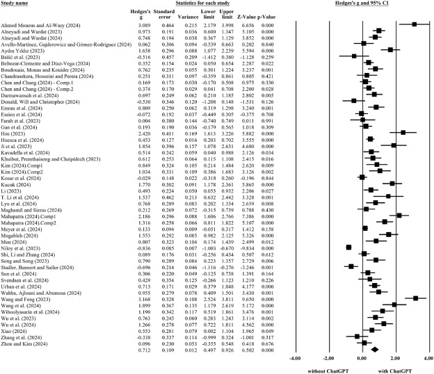

An alternative explanation for the improved academic performance could be the higher quality of work produced with ChatGPT&#x27;s assistance

注意点：

9件の研究では、ChatGPTの使用を許可した状態でポストテストを行ったと明記されている（例：Bašić et al., 2023; Li, 2023）。

33件の研究では、ChatGPTの使用が明示されておらず不明である。

？

---

<!-- _class: ppt -->

(参考)AIの大学への学びの影響

Does ChatGPT enhance student learning?

A systematic review and meta-analysis of experimental studies

Deng et al. (April 2025) Computers &amp; Education

ChatGPTが主に(85%)大学生の学習に与える影響について、

2022年から2024年にかけて発表された69本の教育実践を

システマティック・レビューしたもの (※語学32%)

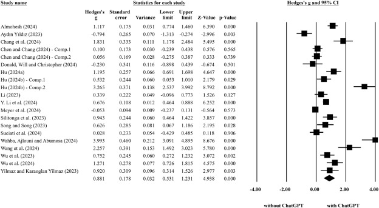

Affective-motivational states (学習意欲・動機)

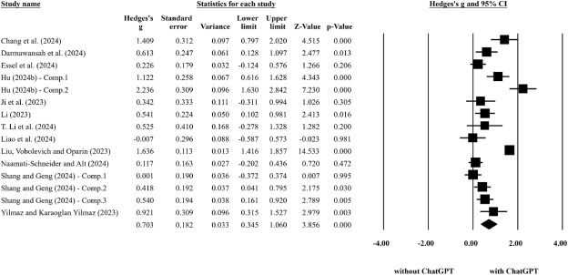

Higher-order thinking propensities (高次思考の傾向)

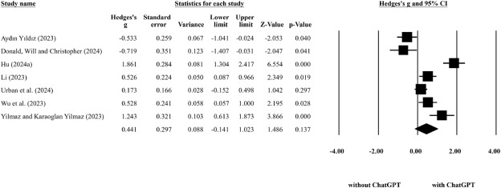

Computational /Creative / Critical thinking, 

Problem solving（問題解決力, Reflective thinking（内省的思考）

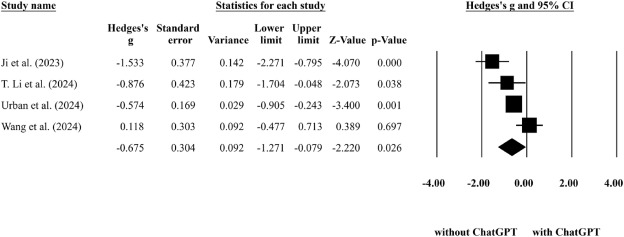

Mental effort (思考的な負荷)

Self-efficacy (自己効力感)

？

---

<!-- _class: ppt -->

‹#›

注意：今回の内容はいま現在、研究ポリシーやレポート作成の観点ではアウトな場合があります

ケース①

生成AIで画像を作成・修正した

※AIに関する研究など、例外を除く

多くの論文誌で禁止行為or許可必要

ケース③

ExcelのグラフをreplotするためPythonのコードを出力した

ケースバイケース (追いついていない)

明示必須もありえる

シナリオ例：”XRDのDebye-Scherrer ringのコントラストを変えて/キャプションつけて”

　　　　　　　　→一発でfalsification(改ざん)になる可能性がある。

※ なお、左の絵は、Tagawa et al. (2022 JGR)にある、きちんとした画像です。

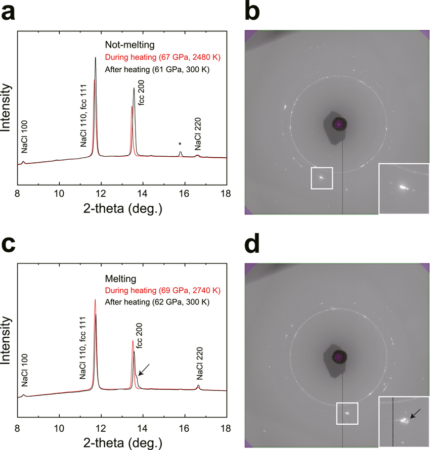

厳しい例： PNASのポリシー  AI tools for creating images or graphics may not be used unless the software is the subject of the work under consideration. Accordingly, PNAS does not permit AI-generated content in cover art submissions. 

学生の皆様が研究以外の仕事で使うこともあるので、知っておくことは重要 → 生成AIの使用目的を考えて、つきあうことが重要 / 分野特性を確認しましょう

ケース②

Canvas機能で作図した / 

リンクを生成しダウンロードした

幾つかの論文誌で禁止行為or許可必要

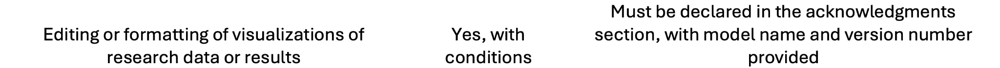

記載が必要な例：Science

(参考)図/絵を作るAIと倫理

---

<!-- _class: ppt -->

(参考)翻訳中の本

(Bowen &amp; Watson, AAC&amp;U 2025)

高等教育における生成AI活用の事例・プロンプト集

授業での活用:

•AIをリアルタイムの議論のサポートとして活用

•AIを用いた模擬面接や役割演習の実施

•AIを使った個別化された学習支援とフィードバック提供

•クラスディスカッションでのAIの活用 (例:反対意見の提示役として)

•授業内での小テストやミニエッセイの実施

&#8203;

課題設計:

•個人の経験や地域に基づいた課題の作成

•プロセスを重視した段階的な課題設計

•ピアレビューを組み込んだ課題

•リアルタイムの出来事についての分析課題

•フィールドワークやインタビューを含む課題

•グループワークやコラボレーション課題

•アノテーション(注釈付け)を活用した読解課題

•マルチメディア(ビデオ、ポッドキャスト)を使用した課題

&#8203;

AIを活用しながら、人間の創造性や批判的思考を重視し、学習効果を高める大学へ

評価方法:

•ルーブリックを使用した評価

•プロセスの評価(draftsの提出など)

•AIとの対話記録の提出と評価

•個別化された評価基準の設定

•即時フィードバックの提供

&#8203;

&#8203;

特徴的な課題例:

AIを使って生成した文章の編集・改善

AIの出力に対する事実確認演習

異なる観客向けの文章作成練習

ケーススタディやアドベンチャーゲームの作成

グラフィックノベルの制作

プレゼンテーションの準備と実施

Teaching with AI、翻訳中！

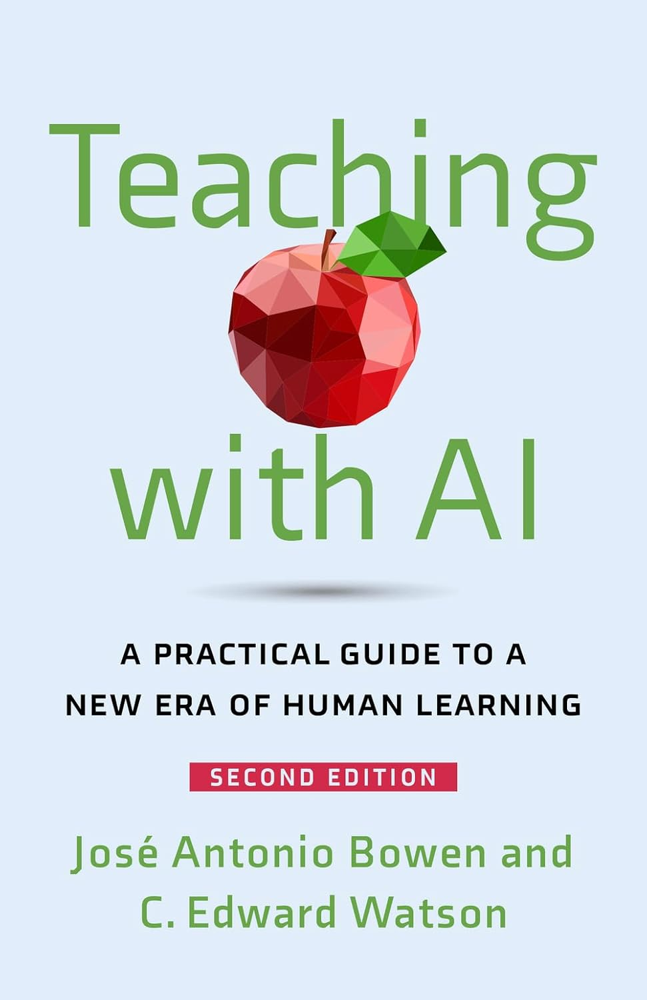

技術評論社から出版予定です！

