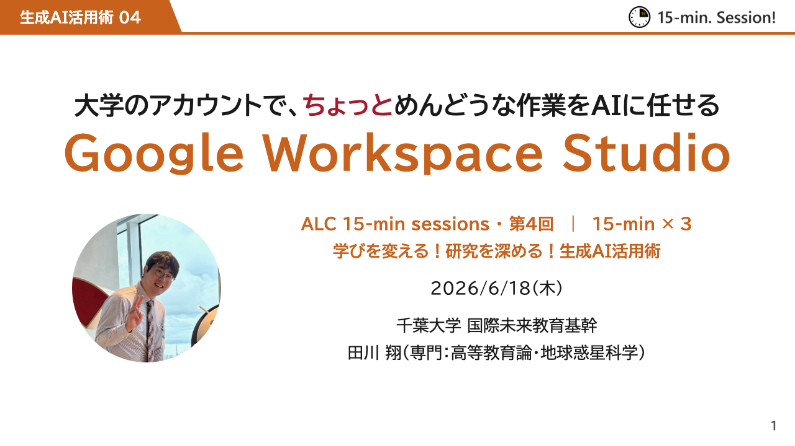
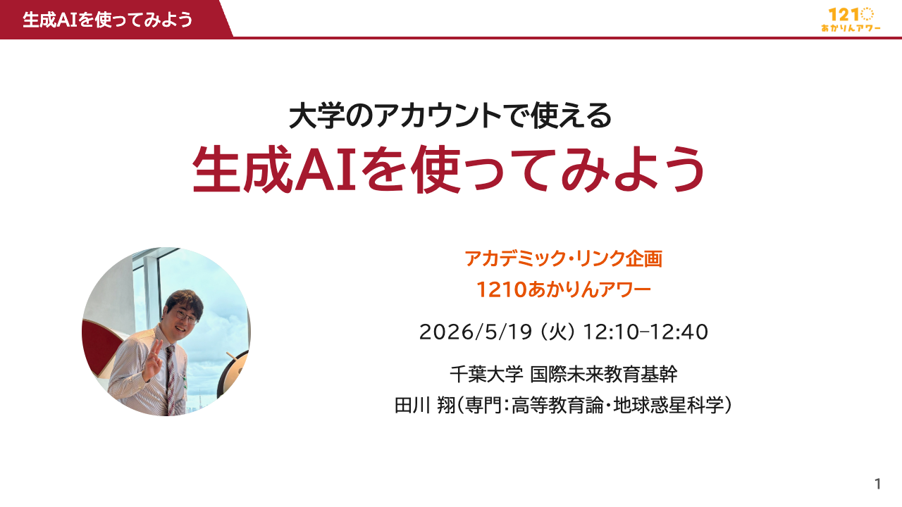
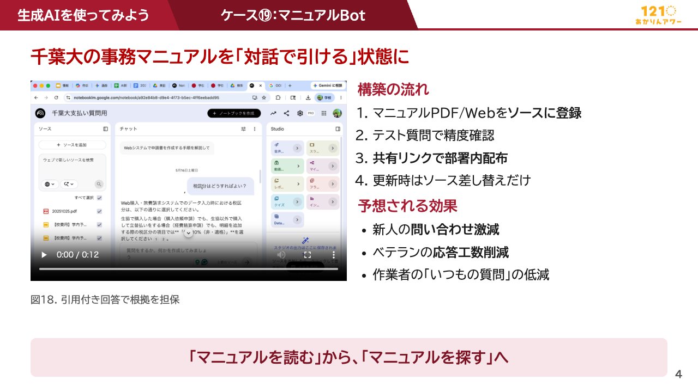

<!-- _class: cover-hero -->

ALPS履修証明プログラム ｜ 教育・学修支援におけるDX

自分でやってみるAI、インパクトのある活用例

2026年8月19日（水）

田川 翔

千葉大学 国際未来教育基幹／高等教育センター 助教

<!-- 10分。名乗りは次のスライドでするので、ここは表題だけ読んで進む。 -->

---

自己紹介

## 理学から民間を経て、大学教育の仕事をしています

<b>田川 翔</b>千葉大学 国際未来教育基幹／高等教育センター 助教

理学（地球科学）

地球の内部を実験で調べる研究者でした。

民間（航空貨物）

現場のオペレーションと改善を経験しました。

大学教育

千葉大学で、AIを教える・学ぶに生かす仕事をしています。

千葉大学、特に附属図書館で、教職協働のもと、AIの活用を広げています。

<!-- 30秒。経歴の詳細より「現場出身」であることを伝える。 -->

---

いまの仕事

## 図書館を拠点に、学生・教職員向けの生成AI講座を続けています

15-min sessions 第4回

大学のアカウントで、毎日の定型作業をAIに任せる回です。

1210あかりんアワー

昼休みの30分で、使える機能をまとめて紹介しました。

千葉大学アカデミック・リンク、2026年4〜7月・全6回・各60分／対面とオンラインの選択制

今日お話しするのは、千葉大学で実際にやってみて残ったことです

<!-- 30秒。実績の自慢ではなく「同じことを現場で試している人間が話す」という位置づけを伝える。15分×3（講義→体験→座談）の形式が好評だったことにも一言触れる。 -->

---

<!-- _class: split -->

社会での使われ方

## AIが得意な仕事と、人が担い続けそうな仕事があります

- **青は、AIが理論上できる範囲です**
  事務や書類の仕事ほど、AIができることが多くなります。
- **赤は、実際に使われている範囲です**
  この差が伸びしろです。
  とはいえ100%も変わっていくでしょう。
- **緑の文字の3つが、ありそうな進路です**
  人やケアに関する仕事ほど、AIができる範囲は狭いままです。

出典: Massenkoff &amp; McCrory (2026)「Labor market impacts of AI」（値は公開図からの読み取り）

<svg xmlns="http://www.w3.org/2000/svg" xmlns:xlink="http://www.w3.org/1999/xlink" version="1.1" baseProfile="full" viewBox="0 0 960 600"><rect width="960" height="600" x="0" y="0" fill="none"></rect><path d="M480 256.8L466.1 258.8L453.4 264.6L442.8 273.8L435.2 285.6L431.3 299L431.3 313L435.2 326.4L442.8 338.2L453.4 347.4L466.1 353.2L480 355.2L493.9 353.2L506.6 347.4L517.2 338.2L524.8 326.4L528.7 313L528.7 299L524.8 285.6L517.2 273.8L506.6 264.6L493.9 258.8L480 256.8L480 306ZM480 158.4L438.4 164.4L400.2 181.8L368.5 209.3L345.7 244.7L333.9 285L333.9 327L345.7 367.3L368.5 402.7L400.2 430.2L438.4 447.6L480 453.6L521.6 447.6L559.8 430.2L591.5 402.7L614.3 367.3L626.1 327L626.1 285L614.3 244.7L591.5 209.3L559.8 181.8L521.6 164.4L480 158.4L480 207.6L507.7 211.6L533.2 223.2L554.4 241.6L569.5 265.1L577.4 292L577.4 320L569.5 346.9L554.4 370.4L533.2 388.8L507.7 400.4L480 404.4L452.3 400.4L426.8 388.8L405.6 370.4L390.5 346.9L382.6 320L382.6 292L390.5 265.1L405.6 241.6L426.8 223.2L452.3 211.6L480 207.6ZM480 60L410.7 70L347 99.1L294.1 144.9L256.2 203.8L236.5 271L236.5 341L256.2 408.2L294.1 467.1L347 512.9L410.7 542L480 552L549.3 542L613 512.9L665.9 467.1L703.8 408.2L723.5 341L723.5 271L703.8 203.8L665.9 144.9L613 99.1L549.3 70L480 60L480 109.2L535.4 117.2L586.4 140.4L628.7 177.1L659 224.2L674.8 278L674.8 334L659 387.8L628.7 434.9L586.4 471.6L535.4 494.8L480 502.8L424.6 494.8L373.6 471.6L331.3 434.9L301 387.8L285.2 334L285.2 278L301 224.2L331.3 177.1L373.6 140.4L424.6 117.2L480 109.2Z" fill="#fbfbfa" class="zr0-cls-0"></path><path d="M480 207.6L452.3 211.6L426.8 223.2L405.6 241.6L390.5 265.1L382.6 292L382.6 320L390.5 346.9L405.6 370.4L426.8 388.8L452.3 400.4L480 404.4L507.7 400.4L533.2 388.8L554.4 370.4L569.5 346.9L577.4 320L577.4 292L569.5 265.1L554.4 241.6L533.2 223.2L507.7 211.6L480 207.6L480 256.8L493.9 258.8L506.6 264.6L517.2 273.8L524.8 285.6L528.7 299L528.7 313L524.8 326.4L517.2 338.2L506.6 347.4L493.9 353.2L480 355.2L466.1 353.2L453.4 347.4L442.8 338.2L435.2 326.4L431.3 313L431.3 299L435.2 285.6L442.8 273.8L453.4 264.6L466.1 258.8L480 256.8ZM480 109.2L424.6 117.2L373.6 140.4L331.3 177.1L301 224.2L285.2 278L285.2 334L301 387.8L331.3 434.9L373.6 471.6L424.6 494.8L480 502.8L535.4 494.8L586.4 471.6L628.7 434.9L659 387.8L674.8 334L674.8 278L659 224.2L628.7 177.1L586.4 140.4L535.4 117.2L480 109.2L480 158.4L521.6 164.4L559.8 181.8L591.5 209.3L614.3 244.7L626.1 285L626.1 327L614.3 367.3L591.5 402.7L559.8 430.2L521.6 447.6L480 453.6L438.4 447.6L400.2 430.2L368.5 402.7L345.7 367.3L333.9 327L333.9 285L345.7 244.7L368.5 209.3L400.2 181.8L438.4 164.4L480 158.4Z" fill="#f4f4f2" class="zr0-cls-0"></path><path d="M480 306M480 256.8L466.1 258.8L453.4 264.6L442.8 273.8L435.2 285.6L431.3 299L431.3 313L435.2 326.4L442.8 338.2L453.4 347.4L466.1 353.2L480 355.2L493.9 353.2L506.6 347.4L517.2 338.2L524.8 326.4L528.7 313L528.7 299L524.8 285.6L517.2 273.8L506.6 264.6L493.9 258.8L480 256.8M480 207.6L452.3 211.6L426.8 223.2L405.6 241.6L390.5 265.1L382.6 292L382.6 320L390.5 346.9L405.6 370.4L426.8 388.8L452.3 400.4L480 404.4L507.7 400.4L533.2 388.8L554.4 370.4L569.5 346.9L577.4 320L577.4 292L569.5 265.1L554.4 241.6L533.2 223.2L507.7 211.6L480 207.6M480 158.4L438.4 164.4L400.2 181.8L368.5 209.3L345.7 244.7L333.9 285L333.9 327L345.7 367.3L368.5 402.7L400.2 430.2L438.4 447.6L480 453.6L521.6 447.6L559.8 430.2L591.5 402.7L614.3 367.3L626.1 327L626.1 285L614.3 244.7L591.5 209.3L559.8 181.8L521.6 164.4L480 158.4M480 109.2L424.6 117.2L373.6 140.4L331.3 177.1L301 224.2L285.2 278L285.2 334L301 387.8L331.3 434.9L373.6 471.6L424.6 494.8L480 502.8L535.4 494.8L586.4 471.6L628.7 434.9L659 387.8L674.8 334L674.8 278L659 224.2L628.7 177.1L586.4 140.4L535.4 117.2L480 109.2M480 60L410.7 70L347 99.1L294.1 144.9L256.2 203.8L236.5 271L236.5 341L256.2 408.2L294.1 467.1L347 512.9L410.7 542L480 552L549.3 542L613 512.9L665.9 467.1L703.8 408.2L723.5 341L723.5 271L703.8 203.8L665.9 144.9L613 99.1L549.3 70L480 60" fill="none" pointer-events="visible" stroke="#e3e6ea" class="zr0-cls-0"></path><path d="M480.5 306L480.5 60" fill="none" pointer-events="visible" stroke="#d6d9dd" stroke-linecap="round" class="zr0-cls-0"></path><path d="M-39 -27l78 0l0 26l-78 0Z" transform="translate(480 45)" fill="none" pointer-events="visible" class="zr0-cls-0"></path><text dominant-baseline="central" text-anchor="middle" style="font-size:26px;font-family:'Hiragino Sans','Yu Gothic',YuGothic,'Noto Sans JP',Meiryo,sans-serif;" y="-14" transform="translate(480 45)" fill="#6b7177">管理職</text><path d="M480 306L410.7 70" fill="none" pointer-events="visible" stroke="#d6d9dd" stroke-linecap="round" class="zr0-cls-0"></path><path d="M-52 -13l52 0l0 26l-52 0Z" transform="translate(406.4678 55.5723)" fill="none" pointer-events="visible" class="zr0-cls-0"></path><text dominant-baseline="central" text-anchor="end" style="font-size:26px;font-family:'Hiragino Sans','Yu Gothic',YuGothic,'Noto Sans JP',Meiryo,sans-serif;" transform="translate(406.4678 55.5723)" fill="#6b7177">運輸</text><path d="M480 306L347 99.1" fill="none" pointer-events="visible" stroke="#d6d9dd" stroke-linecap="round" class="zr0-cls-0"></path><path d="M-52 -13l52 0l0 26l-52 0Z" transform="translate(338.8927 86.4328)" fill="none" pointer-events="visible" class="zr0-cls-0"></path><text dominant-baseline="central" text-anchor="end" style="font-size:26px;font-family:'Hiragino Sans','Yu Gothic',YuGothic,'Noto Sans JP',Meiryo,sans-serif;" transform="translate(338.8927 86.4328)" fill="#6b7177">製造</text><path d="M480 306L294.1 144.9" fill="none" pointer-events="visible" stroke="#d6d9dd" stroke-linecap="round" class="zr0-cls-0"></path><path d="M-130 -13l130 0l0 26l-130 0Z" transform="translate(282.7494 135.0813)" fill="none" pointer-events="visible" class="zr0-cls-0"></path><text dominant-baseline="central" text-anchor="end" style="font-size:26px;font-family:'Hiragino Sans','Yu Gothic',YuGothic,'Noto Sans JP',Meiryo,sans-serif;" transform="translate(282.7494 135.0813)" fill="#6b7177">設置・修理</text><path d="M480 306L256.2 203.8" fill="none" pointer-events="visible" stroke="#d6d9dd" stroke-linecap="round" class="zr0-cls-0"></path><path d="M-52 -13l52 0l0 26l-52 0Z" transform="translate(242.586 197.5767)" fill="none" pointer-events="visible" class="zr0-cls-0"></path><text dominant-baseline="central" text-anchor="end" style="font-size:26px;font-family:'Hiragino Sans','Yu Gothic',YuGothic,'Noto Sans JP',Meiryo,sans-serif;" transform="translate(242.586 197.5767)" fill="#6b7177">建設</text><path d="M480 306L236.5 271" fill="none" pointer-events="visible" stroke="#d6d9dd" stroke-linecap="round" class="zr0-cls-0"></path><path d="M-104 -13l104 0l0 26l-104 0Z" transform="translate(221.6566 268.8558)" fill="none" pointer-events="visible" class="zr0-cls-0"></path><text dominant-baseline="central" text-anchor="end" style="font-size:26px;font-family:'Hiragino Sans','Yu Gothic',YuGothic,'Noto Sans JP',Meiryo,sans-serif;" transform="translate(221.6566 268.8558)" fill="#6b7177">農林漁業</text><path d="M480 306L236.5 341" fill="none" pointer-events="visible" stroke="#d6d9dd" stroke-linecap="round" class="zr0-cls-0"></path><path d="M-130 -13l130 0l0 26l-130 0Z" transform="translate(221.6566 343.1442)" fill="none" pointer-events="visible" class="zr0-cls-0"></path><text dominant-baseline="central" text-anchor="end" style="font-size:26px;font-family:'Hiragino Sans','Yu Gothic',YuGothic,'Noto Sans JP',Meiryo,sans-serif;font-weight:bold;" transform="translate(221.6566 343.1442)" fill="#2F6B3A">事務・管理</text><path d="M480 306L256.2 408.2" fill="none" pointer-events="visible" stroke="#d6d9dd" stroke-linecap="round" class="zr0-cls-0"></path><path d="M-130 -13l130 0l0 26l-130 0Z" transform="translate(242.586 414.4233)" fill="none" pointer-events="visible" class="zr0-cls-0"></path><text dominant-baseline="central" text-anchor="end" style="font-size:26px;font-family:'Hiragino Sans','Yu Gothic',YuGothic,'Noto Sans JP',Meiryo,sans-serif;" transform="translate(242.586 414.4233)" fill="#6b7177">営業・販売</text><path d="M480 306L294.1 467.1" fill="none" pointer-events="visible" stroke="#d6d9dd" stroke-linecap="round" class="zr0-cls-0"></path><path d="M-104 -13l104 0l0 26l-104 0Z" transform="translate(282.7494 476.9187)" fill="none" pointer-events="visible" class="zr0-cls-0"></path><text dominant-baseline="central" text-anchor="end" style="font-size:26px;font-family:'Hiragino Sans','Yu Gothic',YuGothic,'Noto Sans JP',Meiryo,sans-serif;font-weight:bold;" transform="translate(282.7494 476.9187)" fill="#2F6B3A">対人ケア</text><path d="M480 306L347 512.9" fill="none" pointer-events="visible" stroke="#d6d9dd" stroke-linecap="round" class="zr0-cls-0"></path><path d="M-130 -13l130 0l0 26l-130 0Z" transform="translate(338.8927 525.5672)" fill="none" pointer-events="visible" class="zr0-cls-0"></path><text dominant-baseline="central" text-anchor="end" style="font-size:26px;font-family:'Hiragino Sans','Yu Gothic',YuGothic,'Noto Sans JP',Meiryo,sans-serif;" transform="translate(338.8927 525.5672)" fill="#6b7177">清掃・整備</text><path d="M480 306L410.7 542" fill="none" pointer-events="visible" stroke="#d6d9dd" stroke-linecap="round" class="zr0-cls-0"></path><path d="M-52 -13l52 0l0 26l-52 0Z" transform="translate(406.4678 556.4277)" fill="none" pointer-events="visible" class="zr0-cls-0"></path><text dominant-baseline="central" text-anchor="end" style="font-size:26px;font-family:'Hiragino Sans','Yu Gothic',YuGothic,'Noto Sans JP',Meiryo,sans-serif;" transform="translate(406.4678 556.4277)" fill="#6b7177">飲食</text><path d="M480.5 306L480.5 552" fill="none" pointer-events="visible" stroke="#d6d9dd" stroke-linecap="round" class="zr0-cls-0"></path><path d="M-26 1l52 0l0 26l-52 0Z" transform="translate(480 567)" fill="none" pointer-events="visible" class="zr0-cls-0"></path><text dominant-baseline="central" text-anchor="middle" style="font-size:26px;font-family:'Hiragino Sans','Yu Gothic',YuGothic,'Noto Sans JP',Meiryo,sans-serif;" y="14" transform="translate(480 567)" fill="#6b7177">保安</text><path d="M480 306L549.3 542" fill="none" pointer-events="visible" stroke="#d6d9dd" stroke-linecap="round" class="zr0-cls-0"></path><path d="M0 -13l104 0l0 26l-104 0Z" transform="translate(553.5322 556.4277)" fill="none" pointer-events="visible" class="zr0-cls-0"></path><text dominant-baseline="central" text-anchor="start" style="font-size:26px;font-family:'Hiragino Sans','Yu Gothic',YuGothic,'Noto Sans JP',Meiryo,sans-serif;" transform="translate(553.5322 556.4277)" fill="#6b7177">医療補助</text><path d="M480 306L613 512.9" fill="none" pointer-events="visible" stroke="#d6d9dd" stroke-linecap="round" class="zr0-cls-0"></path><path d="M0 -13l130 0l0 26l-130 0Z" transform="translate(621.1073 525.5672)" fill="none" pointer-events="visible" class="zr0-cls-0"></path><text dominant-baseline="central" text-anchor="start" style="font-size:26px;font-family:'Hiragino Sans','Yu Gothic',YuGothic,'Noto Sans JP',Meiryo,sans-serif;" transform="translate(621.1073 525.5672)" fill="#6b7177">医療専門職</text><path d="M480 306L665.9 467.1" fill="none" pointer-events="visible" stroke="#d6d9dd" stroke-linecap="round" class="zr0-cls-0"></path><path d="M0 -13l182 0l0 26l-182 0Z" transform="translate(677.2506 476.9187)" fill="none" pointer-events="visible" class="zr0-cls-0"></path><text dominant-baseline="central" text-anchor="start" style="font-size:26px;font-family:'Hiragino Sans','Yu Gothic',YuGothic,'Noto Sans JP',Meiryo,sans-serif;" transform="translate(677.2506 476.9187)" fill="#6b7177">芸術・メディア</text><path d="M480 306L703.8 408.2" fill="none" pointer-events="visible" stroke="#d6d9dd" stroke-linecap="round" class="zr0-cls-0"></path><path d="M0 -13l130 0l0 26l-130 0Z" transform="translate(717.414 414.4233)" fill="none" pointer-events="visible" class="zr0-cls-0"></path><text dominant-baseline="central" text-anchor="start" style="font-size:26px;font-family:'Hiragino Sans','Yu Gothic',YuGothic,'Noto Sans JP',Meiryo,sans-serif;font-weight:bold;" transform="translate(717.414 414.4233)" fill="#2F6B3A">教育・図書</text><path d="M480 306L723.5 341" fill="none" pointer-events="visible" stroke="#d6d9dd" stroke-linecap="round" class="zr0-cls-0"></path><path d="M0 -13l52 0l0 26l-52 0Z" transform="translate(738.3434 343.1442)" fill="none" pointer-events="visible" class="zr0-cls-0"></path><text dominant-baseline="central" text-anchor="start" style="font-size:26px;font-family:'Hiragino Sans','Yu Gothic',YuGothic,'Noto Sans JP',Meiryo,sans-serif;" transform="translate(738.3434 343.1442)" fill="#6b7177">法務</text><path d="M480 306L723.5 271" fill="none" pointer-events="visible" stroke="#d6d9dd" stroke-linecap="round" class="zr0-cls-0"></path><path d="M0 -13l104 0l0 26l-104 0Z" transform="translate(738.3434 268.8558)" fill="none" pointer-events="visible" class="zr0-cls-0"></path><text dominant-baseline="central" text-anchor="start" style="font-size:26px;font-family:'Hiragino Sans','Yu Gothic',YuGothic,'Noto Sans JP',Meiryo,sans-serif;" transform="translate(738.3434 268.8558)" fill="#6b7177">社会福祉</text><path d="M480 306L703.8 203.8" fill="none" pointer-events="visible" stroke="#d6d9dd" stroke-linecap="round" class="zr0-cls-0"></path><path d="M0 -13l182 0l0 26l-182 0Z" transform="translate(717.414 197.5767)" fill="none" pointer-events="visible" class="zr0-cls-0"></path><text dominant-baseline="central" text-anchor="start" style="font-size:26px;font-family:'Hiragino Sans','Yu Gothic',YuGothic,'Noto Sans JP',Meiryo,sans-serif;" transform="translate(717.414 197.5767)" fill="#6b7177">自然・社会科学</text><path d="M480 306L665.9 144.9" fill="none" pointer-events="visible" stroke="#d6d9dd" stroke-linecap="round" class="zr0-cls-0"></path><path d="M0 -13l130 0l0 26l-130 0Z" transform="translate(677.2506 135.0813)" fill="none" pointer-events="visible" class="zr0-cls-0"></path><text dominant-baseline="central" text-anchor="start" style="font-size:26px;font-family:'Hiragino Sans','Yu Gothic',YuGothic,'Noto Sans JP',Meiryo,sans-serif;" transform="translate(677.2506 135.0813)" fill="#6b7177">建築・工学</text><path d="M480 306L613 99.1" fill="none" pointer-events="visible" stroke="#d6d9dd" stroke-linecap="round" class="zr0-cls-0"></path><path d="M0 -13l130 0l0 26l-130 0Z" transform="translate(621.1073 86.4328)" fill="none" pointer-events="visible" class="zr0-cls-0"></path><text dominant-baseline="central" text-anchor="start" style="font-size:26px;font-family:'Hiragino Sans','Yu Gothic',YuGothic,'Noto Sans JP',Meiryo,sans-serif;" transform="translate(621.1073 86.4328)" fill="#6b7177">情報・数学</text><path d="M480 306L549.3 70" fill="none" pointer-events="visible" stroke="#d6d9dd" stroke-linecap="round" class="zr0-cls-0"></path><path d="M0 -13l182 0l0 26l-182 0Z" transform="translate(553.5322 55.5723)" fill="none" pointer-events="visible" class="zr0-cls-0"></path><text dominant-baseline="central" text-anchor="start" style="font-size:26px;font-family:'Hiragino Sans','Yu Gothic',YuGothic,'Noto Sans JP',Meiryo,sans-serif;" transform="translate(553.5322 55.5723)" fill="#6b7177">ビジネス・金融</text><polyline points="480 79.7 468.9 268.2 456.1 268.7 455.8 285.1 464.3 298.8 455.7 302.5 273 335.8 386 348.9 463.3 320.5 472 318.4 471.7 334.3 480 355.2 498.7 369.7 553.1 419.8 628.7 434.9 596.4 359.1 711.3 339.3 596.9 289.2 618.7 242.6 606.4 196.5 586.4 140.4 542.4 93.6 480 79.7" fill="none" pointer-events="visible" stroke="#3B7DD8" stroke-width="2.5" stroke-linejoin="round" ecmeta_series_index="0" ecmeta_data_index="0" ecmeta_ssr_type="chart" class="zr0-cls-1"></polyline><polygon points="480 79.7 468.9 268.2 456.1 268.7 455.8 285.1 464.3 298.8 455.7 302.5 273 335.8 386 348.9 463.3 320.5 472 318.4 471.7 334.3 480 355.2 498.7 369.7 553.1 419.8 628.7 434.9 596.4 359.1 711.3 339.3 596.9 289.2 618.7 242.6 606.4 196.5 586.4 140.4 542.4 93.6 480 79.7" fill="rgb(59,125,216)" fill-opacity="0.154" ecmeta_series_index="0" ecmeta_data_index="0" ecmeta_ssr_type="chart" class="zr0-cls-2"></polygon><polyline points="480 239.6 475.8 291.8 473.4 295.7 470.7 297.9 475.5 304 472.7 304.9 389.9 319 428.5 329.5 474.4 310.8 477.3 310.1 477.9 313.1 480 323.2 489 336.7 494.6 328.8 509.7 331.8 495.7 313.2 511.7 310.6 492.2 304.2 495.7 298.8 502.3 286.7 539.8 212.9 507.7 211.6 480 239.6" fill="none" pointer-events="visible" stroke="#E0483A" stroke-width="3" stroke-linejoin="round" ecmeta_series_index="1" ecmeta_data_index="0" ecmeta_ssr_type="chart" class="zr0-cls-1"></polyline><polygon points="480 239.6 475.8 291.8 473.4 295.7 470.7 297.9 475.5 304 472.7 304.9 389.9 319 428.5 329.5 474.4 310.8 477.3 310.1 477.9 313.1 480 323.2 489 336.7 494.6 328.8 509.7 331.8 495.7 313.2 511.7 310.6 492.2 304.2 495.7 298.8 502.3 286.7 539.8 212.9 507.7 211.6 480 239.6" fill="rgb(224,72,58)" fill-opacity="0.22399999999999998" ecmeta_series_index="1" ecmeta_data_index="0" ecmeta_ssr_type="chart" class="zr0-cls-3"></polygon><path d="M1 0A1 1 0 1 1 1 -0.1A1 1 0 0 1 1 0" transform="matrix(2,0,0,2,480,79.68)" fill="#3B7DD8" ecmeta_series_index="0" ecmeta_data_index="0" ecmeta_ssr_type="chart" class="zr0-cls-4"></path><path d="M1 0A1 1 0 1 1 1 -0.1A1 1 0 0 1 1 0" transform="matrix(2,0,0,2,468.911,268.2344)" fill="#3B7DD8" ecmeta_series_index="0" ecmeta_data_index="0" ecmeta_ssr_type="chart" class="zr0-cls-4"></path><path d="M1 0A1 1 0 1 1 1 -0.1A1 1 0 0 1 1 0" transform="matrix(2,0,0,2,456.0604,268.7493)" fill="#3B7DD8" ecmeta_series_index="0" ecmeta_data_index="0" ecmeta_ssr_type="chart" class="zr0-cls-4"></path><path d="M1 0A1 1 0 1 1 1 -0.1A1 1 0 0 1 1 0" transform="matrix(2,0,0,2,455.8311,285.0576)" fill="#3B7DD8" ecmeta_series_index="0" ecmeta_data_index="0" ecmeta_ssr_type="chart" class="zr0-cls-4"></path><path d="M1 0A1 1 0 1 1 1 -0.1A1 1 0 0 1 1 0" transform="matrix(2,0,0,2,464.3361,298.8466)" fill="#3B7DD8" ecmeta_series_index="0" ecmeta_data_index="0" ecmeta_ssr_type="chart" class="zr0-cls-4"></path><path d="M1 0A1 1 0 1 1 1 -0.1A1 1 0 0 1 1 0" transform="matrix(2,0,0,2,455.6504,302.4991)" fill="#3B7DD8" ecmeta_series_index="0" ecmeta_data_index="0" ecmeta_ssr_type="chart" class="zr0-cls-4"></path><path d="M1 0A1 1 0 1 1 1 -0.1A1 1 0 0 1 1 0" transform="matrix(2,0,0,2,273.0283,335.758)" fill="#3B7DD8" ecmeta_series_index="0" ecmeta_data_index="0" ecmeta_ssr_type="chart" class="zr0-cls-4"></path><path d="M1 0A1 1 0 1 1 1 -0.1A1 1 0 0 1 1 0" transform="matrix(2,0,0,2,386.0168,348.9207)" fill="#3B7DD8" ecmeta_series_index="0" ecmeta_data_index="0" ecmeta_ssr_type="chart" class="zr0-cls-4"></path><path d="M1 0A1 1 0 1 1 1 -0.1A1 1 0 0 1 1 0" transform="matrix(2,0,0,2,463.2677,320.4986)" fill="#3B7DD8" ecmeta_series_index="0" ecmeta_data_index="0" ecmeta_ssr_type="chart" class="zr0-cls-4"></path><path d="M1 0A1 1 0 1 1 1 -0.1A1 1 0 0 1 1 0" transform="matrix(2,0,0,2,472.0201,318.4169)" fill="#3B7DD8" ecmeta_series_index="0" ecmeta_data_index="0" ecmeta_ssr_type="chart" class="zr0-cls-4"></path><path d="M1 0A1 1 0 1 1 1 -0.1A1 1 0 0 1 1 0" transform="matrix(2,0,0,2,471.6833,334.3242)" fill="#3B7DD8" ecmeta_series_index="0" ecmeta_data_index="0" ecmeta_ssr_type="chart" class="zr0-cls-4"></path><path d="M1 0A1 1 0 1 1 1 -0.1A1 1 0 0 1 1 0" transform="matrix(2,0,0,2,480,355.2)" fill="#3B7DD8" ecmeta_series_index="0" ecmeta_data_index="0" ecmeta_ssr_type="chart" class="zr0-cls-4"></path><path d="M1 0A1 1 0 1 1 1 -0.1A1 1 0 0 1 1 0" transform="matrix(2,0,0,2,498.7127,369.7295)" fill="#3B7DD8" ecmeta_series_index="0" ecmeta_data_index="0" ecmeta_ssr_type="chart" class="zr0-cls-4"></path><path d="M1 0A1 1 0 1 1 1 -0.1A1 1 0 0 1 1 0" transform="matrix(2,0,0,2,553.1487,419.8216)" fill="#3B7DD8" ecmeta_series_index="0" ecmeta_data_index="0" ecmeta_ssr_type="chart" class="zr0-cls-4"></path><path d="M1 0A1 1 0 1 1 1 -0.1A1 1 0 0 1 1 0" transform="matrix(2,0,0,2,628.7315,434.8766)" fill="#3B7DD8" ecmeta_series_index="0" ecmeta_data_index="0" ecmeta_ssr_type="chart" class="zr0-cls-4"></path><path d="M1 0A1 1 0 1 1 1 -0.1A1 1 0 0 1 1 0" transform="matrix(2,0,0,2,596.3601,359.1399)" fill="#3B7DD8" ecmeta_series_index="0" ecmeta_data_index="0" ecmeta_ssr_type="chart" class="zr0-cls-4"></path><path d="M1 0A1 1 0 1 1 1 -0.1A1 1 0 0 1 1 0" transform="matrix(2,0,0,2,711.3213,339.259)" fill="#3B7DD8" ecmeta_series_index="0" ecmeta_data_index="0" ecmeta_ssr_type="chart" class="zr0-cls-4"></path><path d="M1 0A1 1 0 1 1 1 -0.1A1 1 0 0 1 1 0" transform="matrix(2,0,0,2,596.8781,289.1955)" fill="#3B7DD8" ecmeta_series_index="0" ecmeta_data_index="0" ecmeta_ssr_type="chart" class="zr0-cls-4"></path><path d="M1 0A1 1 0 1 1 1 -0.1A1 1 0 0 1 1 0" transform="matrix(2,0,0,2,618.7371,242.6409)" fill="#3B7DD8" ecmeta_series_index="0" ecmeta_data_index="0" ecmeta_ssr_type="chart" class="zr0-cls-4"></path><path d="M1 0A1 1 0 1 1 1 -0.1A1 1 0 0 1 1 0" transform="matrix(2,0,0,2,606.4218,196.4549)" fill="#3B7DD8" ecmeta_series_index="0" ecmeta_data_index="0" ecmeta_ssr_type="chart" class="zr0-cls-4"></path><path d="M1 0A1 1 0 1 1 1 -0.1A1 1 0 0 1 1 0" transform="matrix(2,0,0,2,586.3981,140.4413)" fill="#3B7DD8" ecmeta_series_index="0" ecmeta_data_index="0" ecmeta_ssr_type="chart" class="zr0-cls-4"></path><path d="M1 0A1 1 0 1 1 1 -0.1A1 1 0 0 1 1 0" transform="matrix(2,0,0,2,542.3756,93.5683)" fill="#3B7DD8" ecmeta_series_index="0" ecmeta_data_index="0" ecmeta_ssr_type="chart" class="zr0-cls-4"></path><path d="M-1 -1l2 0l0 2l-2 0Z" transform="matrix(2.5,0,0,2.5,480,239.58)" fill="#E0483A" ecmeta_series_index="1" ecmeta_data_index="0" ecmeta_ssr_type="chart" class="zr0-cls-5"></path><path d="M-1 -1l2 0l0 2l-2 0Z" transform="matrix(2.5,0,0,2.5,475.8416,291.8379)" fill="#E0483A" ecmeta_series_index="1" ecmeta_data_index="0" ecmeta_ssr_type="chart" class="zr0-cls-5"></path><path d="M-1 -1l2 0l0 2l-2 0Z" transform="matrix(2.5,0,0,2.5,473.3501,295.6526)" fill="#E0483A" ecmeta_series_index="1" ecmeta_data_index="0" ecmeta_ssr_type="chart" class="zr0-cls-5"></path><path d="M-1 -1l2 0l0 2l-2 0Z" transform="matrix(2.5,0,0,2.5,470.7043,297.9452)" fill="#E0483A" ecmeta_series_index="1" ecmeta_data_index="0" ecmeta_ssr_type="chart" class="zr0-cls-5"></path><path d="M-1 -1l2 0l0 2l-2 0Z" transform="matrix(2.5,0,0,2.5,475.5246,303.9562)" fill="#E0483A" ecmeta_series_index="1" ecmeta_data_index="0" ecmeta_ssr_type="chart" class="zr0-cls-5"></path><path d="M-1 -1l2 0l0 2l-2 0Z" transform="matrix(2.5,0,0,2.5,472.6951,304.9497)" fill="#E0483A" ecmeta_series_index="1" ecmeta_data_index="0" ecmeta_ssr_type="chart" class="zr0-cls-5"></path><path d="M-1 -1l2 0l0 2l-2 0Z" transform="matrix(2.5,0,0,2.5,389.9065,318.9535)" fill="#E0483A" ecmeta_series_index="1" ecmeta_data_index="0" ecmeta_ssr_type="chart" class="zr0-cls-5"></path><path d="M-1 -1l2 0l0 2l-2 0Z" transform="matrix(2.5,0,0,2.5,428.533,329.5042)" fill="#E0483A" ecmeta_series_index="1" ecmeta_data_index="0" ecmeta_ssr_type="chart" class="zr0-cls-5"></path><path d="M-1 -1l2 0l0 2l-2 0Z" transform="matrix(2.5,0,0,2.5,474.4226,310.8329)" fill="#E0483A" ecmeta_series_index="1" ecmeta_data_index="0" ecmeta_ssr_type="chart" class="zr0-cls-5"></path><path d="M-1 -1l2 0l0 2l-2 0Z" transform="matrix(2.5,0,0,2.5,477.34,310.139)" fill="#E0483A" ecmeta_series_index="1" ecmeta_data_index="0" ecmeta_ssr_type="chart" class="zr0-cls-5"></path><path d="M-1 -1l2 0l0 2l-2 0Z" transform="matrix(2.5,0,0,2.5,477.9208,313.0811)" fill="#E0483A" ecmeta_series_index="1" ecmeta_data_index="0" ecmeta_ssr_type="chart" class="zr0-cls-5"></path><path d="M-1 -1l2 0l0 2l-2 0Z" transform="matrix(2.5,0,0,2.5,480,323.22)" fill="#E0483A" ecmeta_series_index="1" ecmeta_data_index="0" ecmeta_ssr_type="chart" class="zr0-cls-5"></path><path d="M-1 -1l2 0l0 2l-2 0Z" transform="matrix(2.5,0,0,2.5,489.0098,336.6846)" fill="#E0483A" ecmeta_series_index="1" ecmeta_data_index="0" ecmeta_ssr_type="chart" class="zr0-cls-5"></path><path d="M-1 -1l2 0l0 2l-2 0Z" transform="matrix(2.5,0,0,2.5,494.6297,328.7643)" fill="#E0483A" ecmeta_series_index="1" ecmeta_data_index="0" ecmeta_ssr_type="chart" class="zr0-cls-5"></path><path d="M-1 -1l2 0l0 2l-2 0Z" transform="matrix(2.5,0,0,2.5,509.7463,331.7753)" fill="#E0483A" ecmeta_series_index="1" ecmeta_data_index="0" ecmeta_ssr_type="chart" class="zr0-cls-5"></path><path d="M-1 -1l2 0l0 2l-2 0Z" transform="matrix(2.5,0,0,2.5,495.6639,313.1534)" fill="#E0483A" ecmeta_series_index="1" ecmeta_data_index="0" ecmeta_ssr_type="chart" class="zr0-cls-5"></path><path d="M-1 -1l2 0l0 2l-2 0Z" transform="matrix(2.5,0,0,2.5,511.6545,310.5512)" fill="#E0483A" ecmeta_series_index="1" ecmeta_data_index="0" ecmeta_ssr_type="chart" class="zr0-cls-5"></path><path d="M-1 -1l2 0l0 2l-2 0Z" transform="matrix(2.5,0,0,2.5,492.1748,304.2495)" fill="#E0483A" ecmeta_series_index="1" ecmeta_data_index="0" ecmeta_ssr_type="chart" class="zr0-cls-5"></path><path d="M-1 -1l2 0l0 2l-2 0Z" transform="matrix(2.5,0,0,2.5,495.6639,298.8466)" fill="#E0483A" ecmeta_series_index="1" ecmeta_data_index="0" ecmeta_ssr_type="chart" class="zr0-cls-5"></path><path d="M-1 -1l2 0l0 2l-2 0Z" transform="matrix(2.5,0,0,2.5,502.3097,286.6685)" fill="#E0483A" ecmeta_series_index="1" ecmeta_data_index="0" ecmeta_ssr_type="chart" class="zr0-cls-5"></path><path d="M-1 -1l2 0l0 2l-2 0Z" transform="matrix(2.5,0,0,2.5,539.8489,212.8732)" fill="#E0483A" ecmeta_series_index="1" ecmeta_data_index="0" ecmeta_ssr_type="chart" class="zr0-cls-5"></path><path d="M-1 -1l2 0l0 2l-2 0Z" transform="matrix(2.5,0,0,2.5,507.7225,211.5859)" fill="#E0483A" ecmeta_series_index="1" ecmeta_data_index="0" ecmeta_ssr_type="chart" class="zr0-cls-5"></path></svg>

分野差が大きいこと、事務作業は活用余地が大きいこと、ケアの価値は変わらないこと

<!-- 青と赤の面積差を指さして見せる。赤い3軸（教育・図書／対人ケア／事務・管理）が皆さんの仕事、と伝えてから次へ。数値は公開図からの読み取りである点に注意。 -->

---

生成AIの変化

## AIの性能は伸びましたが、現場での活用は進んでいません

性能の伸び（曲線）と組織の活用（直線）の差（出所：Anthropic）

- **モデルの性能は、毎年大きく伸びています**
  「前に試してダメだった」は、当てになりません
- **私たちの使い方は、ゆるやかにしか変わりません**
  この差は Capability Overhang（性能の余り）と呼ばれます。
- **AIを活用するためのデータがありません**
  AIが大学・企業のデータを活用しようにも、読めない場合が多いです。データの整備が必須です。

まずは、「何にでも活用できる道はある」と仮定し、試してみることが重要です

<!-- 性能ギャップの話。去年の印象で判断しない、が要点。 -->

---

AIの仕組み ①

## 言語型の生成AIは「次に来そうな言葉」を選び続けるシステムです

<svg viewBox="0 0 520 375" xmlns="http://www.w3.org/2000/svg" role="img" aria-label="「吾輩は」に続く語の予測確率の棒グラフ" style="width:100%; height:auto;">
<rect x="14" y="14" width="108" height="46" rx="3" fill="#F6E9EC"/>
<text x="68" y="45" font-size="25" font-weight="700" fill="#7D1322" text-anchor="middle">吾輩は</text>
<text x="136" y="45" font-size="19" fill="#5F5F5F">の次に来る語は？</text>
<line x1="104" y1="80" x2="104" y2="358" stroke="#262626" stroke-width="2"/>
<text x="94" y="112" font-size="21" font-weight="700" fill="#262626" text-anchor="end">、</text>
<rect x="104" y="97" width="325" height="30" fill="#BDBDBD"/>
<text x="439" y="112" font-size="18" fill="#5F5F5F" dominant-baseline="middle">11.5%</text>
<text x="94" y="166" font-size="21" font-weight="700" fill="#262626" text-anchor="end">猫</text>
<rect x="104" y="151" width="280" height="30" fill="#A6192E"/>
<text x="394" y="166" font-size="18" font-weight="700" fill="#262626" dominant-baseline="middle">9.9%</text>
<text x="94" y="220" font-size="21" font-weight="700" fill="#262626" text-anchor="end">犬</text>
<rect x="104" y="205" width="113" height="30" fill="#BDBDBD"/>
<text x="227" y="220" font-size="18" fill="#5F5F5F" dominant-baseline="middle">4.0%</text>
<text x="94" y="274" font-size="21" font-weight="700" fill="#262626" text-anchor="end">ネコ</text>
<rect x="104" y="259" width="51" height="30" fill="#BDBDBD"/>
<text x="165" y="274" font-size="18" fill="#5F5F5F" dominant-baseline="middle">1.8%</text>
<text x="94" y="328" font-size="21" font-weight="700" fill="#262626" text-anchor="end">「</text>
<rect x="104" y="313" width="25" height="30" fill="#BDBDBD"/>
<text x="139" y="328" font-size="18" fill="#5F5F5F" dominant-baseline="middle">0.9%</text>
</svg>

候補ごとに確率を出し、そこから次の一語（赤）を選びます

- **一語ずつ、確率の高い「続き」を選んでいます**
  選んだ語を文末に足して、また次の一語を選びます。
- **文章全体の設計図を持っているわけではありません**
  それでも、続け方の巧みさで文章が成立します。
- **「それらしいが違う」は、この仕組みの副作用です**
  「正しさ」ではなく「流暢さ」をトレーニングしています。

生成AIは「次の一語」を当て続ける機械です

<!-- 今日いちばん持ち帰ってほしい1枚。「確率の機械」だと分かると怖さが減る、につなぐ。 -->

---

AIの仕組み ②

## 最近のAIは、答える前にReasoningという、「考える時間」を取ります

<svg viewBox="0 0 600 430" xmlns="http://www.w3.org/2000/svg" role="img" aria-label="質問・思考プロセス・回答の3段からなる、AIの応答画面の例" style="width:100%; height:auto;">
<rect x="6" y="6" width="74" height="30" rx="4" fill="#E4E4E4"/>
<text x="43" y="28" font-size="18" font-weight="700" fill="#5F5F5F" text-anchor="middle">質問</text>
<rect x="90" y="6" width="504" height="76" rx="6" fill="#F1F1F1"/>
<text x="110" y="36" font-size="18" fill="#262626">オープンキャンパスの案内文を作ってください。</text>
<text x="110" y="64" font-size="18" fill="#262626">高校2年生と保護者向け、300字くらいで。</text>
<path d="M292 88 L312 88 L302 102 Z" fill="#8A8A8A"/>
<rect x="6" y="106" width="588" height="166" rx="6" fill="#FAFAFA" stroke="#BDBDBD" stroke-width="1.5" stroke-dasharray="6 4"/>
<text x="26" y="134" font-size="18" font-weight="700" fill="#8A8A8A">思考プロセス（8秒間 考えました）</text>
<text x="26" y="170" font-size="18" fill="#5F5F5F">読み手は高校2年生と保護者。専門用語は避けよう。</text>
<text x="26" y="202" font-size="18" fill="#5F5F5F">300字に入るのは3点。日程・会場・申込方法に絞る。</text>
<text x="26" y="234" font-size="18" fill="#5F5F5F">保護者は入試の情報も気になるはず。日付はユーザーに聞こう。</text>
<path d="M292 278 L312 278 L302 292 Z" fill="#A6192E"/>
<rect x="6" y="296" width="588" height="128" rx="6" fill="#F6E9EC" stroke="#A6192E" stroke-width="2.5"/>
<text x="26" y="324" font-size="18" font-weight="700" fill="#7D1322">回答</text>
<text x="26" y="358" font-size="18" fill="#262626">高校2年生のみなさん、保護者の皆さまへ。本学の</text>
<text x="26" y="390" font-size="18" fill="#262626">オープンキャンパスを◯月◯日に開催します。……</text>
</svg>

- **いきなり答えず、考えの途中を書き出します**
  reasoning（推論の積み増し）と呼ばれます。一回の計算ではなく、何度も回して精度を上げます。
- **途中を読めば、どこで話がずれたか分かります**
  読み手を取り違えていたら、そこだけ直して頼み直せます。
- **人に頼んだり、マニュアルを書くように頼みます**
  十分な資料(Context)を渡すと精度が出ます。

<b>どんな道具と文脈を渡し、どう安全性を担保するか</b>という考え方で設計されています

<!-- reasoningは1回の計算ではなく反復。技術的に正確に。図は応答画面の再現例（実物のスクショに差し替え可）。当日は実機で1つ動かして見せてもよい。最後の囲みはハーネス（harness）の話。用語を覚えてもらう必要はなく、「プロンプトの言い回しより、渡す材料と確認の置き方」と言い換えて話す。 -->

---

直しながら使う

## ループが大切： 一発で正解を求めず、直しながら使います

<svg xmlns="http://www.w3.org/2000/svg" viewBox="-70 -6 740 616" preserveAspectRatio="xMidYMid meet" style="max-height:462px;max-width:100%;height:auto;display:block;margin:0 auto"><defs><marker id="ooda-arrow-uk" markerWidth="12" markerHeight="12" refX="10" refY="4" orient="auto"><path d="M0,0 L0,8 L11,4 z" fill="#A6192E"/></marker></defs><rect x="200" y="230" width="200" height="140" rx="6" ry="6" fill="#fff" stroke="#A6192E" stroke-width="3"/><text x="300" y="286" text-anchor="middle" font-size="34" font-weight="700" fill="#A6192E">OODA</text><text x="300" y="318" text-anchor="middle" font-size="24" fill="#333">Loop</text><text x="300" y="350" text-anchor="middle" font-size="19" fill="#5F5F5F">(主語：人間)</text><path d="M 380 130 A 240 240 0 0 1 470 220" fill="none" stroke="#A6192E" stroke-width="4" marker-end="url(#ooda-arrow-uk)"/><path d="M 470 380 A 240 240 0 0 1 380 470" fill="none" stroke="#A6192E" stroke-width="4" marker-end="url(#ooda-arrow-uk)"/><path d="M 220 470 A 240 240 0 0 1 130 380" fill="none" stroke="#A6192E" stroke-width="4" stroke-dasharray="8,6" marker-end="url(#ooda-arrow-uk)"/><path d="M 130 220 A 240 240 0 0 1 220 130" fill="none" stroke="#A6192E" stroke-width="4" marker-end="url(#ooda-arrow-uk)"/><circle cx="300" cy="80" r="76" fill="#F6E9EC" stroke="#A6192E" stroke-width="3"/><text x="300" y="72" text-anchor="middle" font-size="30" font-weight="700" fill="#A6192E">Observe</text><text x="300" y="106" text-anchor="middle" font-size="21" fill="#333">観る</text><text x="214" y="46" text-anchor="end" font-size="22" font-weight="600" fill="#262626">AIの出力を見る</text><text x="214" y="72" text-anchor="end" font-size="19" fill="#5F5F5F">（HITLで確認）</text><circle cx="520" cy="300" r="76" fill="#F6E9EC" stroke="#A6192E" stroke-width="3"/><text x="520" y="292" text-anchor="middle" font-size="30" font-weight="700" fill="#A6192E">Orient</text><text x="520" y="326" text-anchor="middle" font-size="21" fill="#333">状況判断</text><text x="566" y="446" text-anchor="middle" font-size="22" font-weight="600" fill="#262626">自分の知識と照らす</text><circle cx="300" cy="520" r="76" fill="#F6E9EC" stroke="#A6192E" stroke-width="3"/><text x="300" y="512" text-anchor="middle" font-size="30" font-weight="700" fill="#A6192E">Decide</text><text x="300" y="546" text-anchor="middle" font-size="21" fill="#333">意思決定</text><text x="390" y="556" text-anchor="start" font-size="22" font-weight="600" fill="#262626">採用 / 修正 / 棄却</text><text x="390" y="583" text-anchor="start" font-size="19" fill="#5F5F5F">（使うかどうか決める）</text><circle cx="80" cy="300" r="76" fill="#F6E9EC" stroke="#A6192E" stroke-width="3"/><text x="80" y="292" text-anchor="middle" font-size="30" font-weight="700" fill="#A6192E">Act</text><text x="80" y="326" text-anchor="middle" font-size="21" fill="#333">実行</text><text x="34" y="446" text-anchor="middle" font-size="22" font-weight="600" fill="#262626">再プロンプト／実装</text><rect x="417" y="34" width="206" height="126" rx="8" ry="8" fill="#FBF6EC" stroke="#B45309" stroke-width="2.5"/><text x="520" y="78" text-anchor="middle" font-size="29" font-weight="700" fill="#B45309">Pause（確認）</text><text x="520" y="112" text-anchor="middle" font-size="20" fill="#333">私はこの出力を</text><text x="520" y="140" text-anchor="middle" font-size="20" fill="#333"><tspan font-weight="700">評価できる</tspan>か？</text><line x1="520" y1="160" x2="520" y2="222" stroke="#B45309" stroke-width="2.5"/></svg>

- **観る → 照らす → 決める → 再依頼、を回します**
  途中に「私はこの出力を評価できるか」の確認を挟みます。
- **最初の答えの出来は、あまり重要ではありません**
  2周目・3周目で良くなります。
- **使わないことには、上手になりません**
  試し、修正し、ループすることが上達の近道です。

「試す → 直す」を回した経験で、上手になっていきます

<!-- OODAループ。「1周目の出来は気にしない」を強調する。 -->

---

業務とAI

## 業務での活用は、「データを整える」から始まります

データを作る

AIに読ませる

結果を確かめて直す

- **AIは、読ませたものの範囲でしか手伝えません**
  マニュアル・議事録・過去文書が、AIの「材料」になります。
  自動的にAIで保存したり、Google DocのようにAIが参照しやすい形にしましょう。
  DXの最大の壁は、ローカルにあるファイル(特にエクセル)です。
- **紙のまま・頭の中のままでは、AIに渡せません**
  データをクラウドに整えれば部署の共有財産になり、引き継ぎにも効きます。

「AIを導入する」の前に、「AIに渡せるデータを作る」から始めます

<!-- DX戦略の核。「AI導入」の前に「データづくり」。図書館の事例だが、csvの汚れを人が整える構造はどの部署の定型業務にも共通、と広げて話す。 -->

---

AIに任せる範囲

## 結果を自分で判断できる仕事、後工程に影響しない範囲からです

- **出力の良し悪しを見極められる仕事から始めます**
  判断できない領域は、下書きと案出しに留めます。
  人が関与＝Human in the Loop 監督＝Human on the Loop。
- **確認と修正のループを、仕事の手順に組み込みます**
  一発完成を期待しないほうが、結局早く終わります。
- **業務フローをAIで標準化出来ないか考えてみます**
  議事録の記録など、AIで終わる範囲はないですか。

✓ 今、やるべきこと出汁を仕込むように、土台から

まずは入れてみるところから始める 
データを「AIに渡せる形」に整える 
仕事の流れを見直す（BPR） 
組織を設計し、人を育てる

✕ やるべきではないこと出来た頃には古い

ニッチな作り込み（Fine Tuning） 
モデルや製品の比較

橋口剛氏（元Google Cloud）特別講義より

判断できる範囲で任せ、ループで質を上げます

<!-- 前のスライドのOODAを業務に適用。右パネルは橋口氏の「今、やるべきこと、やるべきではないこと」。氏の比喩をそのまま使える：データ整備＝「出汁を仕込むように、土台から」、BPRなき導入＝「器のないコース料理」、比較検討＝「サバのようなもの。比較している間に腐っていく」、Fine Tuning＝「出来た頃には古い」。乗り遅れが致命的、技術より先に人と仕組み、も口頭で補う。 -->

---

既存の課題を見直す

## 課題そのものを、AIがある前提に作り替えます

MITの科目改善フロー。まず課題をAIに解かせてみます

MIT Teaching + Learning Lab「<a href="https://tll.mit.edu/teaching-resources/course-design/gen-ai-your-course/">Generative AI &amp; Your Course</a>」をもとに再構成

- **先生が出されてる課題を、AIに解かせてみます**
  どこまで解けるかで、課題の弱点が見えます。
- **AIでも良い点と、人が考えるべき部分を分けます**
- **教え方や課題のプロセスを変更します**
  授業のデザインや課題のデザインを変えてみます
  結果だけでなく、途中も評価に含めます

これまでの課題は、そのままでは機能しません

<!-- MITフロー。まず自分の課題をAIに解かせてみる、が一歩目。 -->

---

学習への期待

## 学びの「伸びしろ」の側にも、AIは効くと期待されています

① 個別指導なみの伴走（2シグマ問題）

<svg viewBox="0 0 720 330" xmlns="http://www.w3.org/2000/svg" role="img" aria-label="1対1指導の成績分布は一斉授業より2標準偏差（偏差値+20）高い側に寄ることを示す分布図" style="height:215px; width:auto; display:block; margin:.3em auto;">
<defs><marker id="sig3ar" markerWidth="10" markerHeight="9" refX="7" refY="3" orient="auto"><path d="M0,0 L9,3 L0,6 Z" fill="#B03A5B"/></marker><marker id="sig3al" markerWidth="10" markerHeight="9" refX="2" refY="3" orient="auto"><path d="M9,0 L0,3 L9,6 Z" fill="#B03A5B"/></marker></defs>
<line x1="30" y1="270" x2="690" y2="270" stroke="#262626" stroke-width="2"/>
<path d="M60,270 C165,270 170,120 250,120 C330,120 335,270 440,270 Z" fill="#BDBDBD" fill-opacity="0.5" stroke="#8A8A8A" stroke-width="2.5"/>
<path d="M280,270 C385,270 390,75 470,75 C550,75 555,270 660,270 Z" fill="#E3B7BE" fill-opacity="0.6" stroke="#A6192E" stroke-width="3"/>
<line x1="250" y1="270" x2="250" y2="60" stroke="#B03A5B" stroke-width="2" stroke-dasharray="5 4"/>
<line x1="470" y1="270" x2="470" y2="60" stroke="#B03A5B" stroke-width="2" stroke-dasharray="5 4"/>
<line x1="250" y1="52" x2="470" y2="52" stroke="#B03A5B" stroke-width="3" marker-start="url(#sig3al)" marker-end="url(#sig3ar)"/>
<text x="360" y="36" font-size="36" font-weight="700" fill="#B03A5B" text-anchor="middle">＋2σ（偏差値+20）</text>
<text x="140" y="150" font-size="32" font-weight="700" fill="#5F5F5F" text-anchor="middle">一斉授業</text>
<text x="140" y="184" font-size="24" fill="#8A8A8A" text-anchor="middle">(50%ile)</text>
<text x="590" y="105" font-size="32" font-weight="700" fill="#7D1322" text-anchor="middle">1対1指導</text>
<text x="590" y="139" font-size="24" fill="#5F5F5F" text-anchor="middle">(98%ile)</text>
<text x="360" y="312" font-size="26" fill="#5F5F5F" text-anchor="middle">総合的達成度（≒成績）</text>
</svg>

1対1指導は一斉授業より<b>＋2σ</b>高い到達度。AIの伴走で、<b>到達度が上がる可能性</b>があります。

Bloom (1984) “The 2 Sigma Problem” <i>Educational Researcher</i> 13(6) <a href="https://web.mit.edu/5.95/readings/bloom-two-sigma.pdf">PDF</a>

② 学びのモードの多様化

<svg viewBox="0 0 760 330" xmlns="http://www.w3.org/2000/svg" role="img" aria-label="積み上げて受動的に学ぶ従来型は途中で頭打ちし、最終到達点から探究的に学ぶ型では高みから中間地点を学べることを対比した図" style="height:215px; width:auto; display:block; margin:.3em auto;">
<defs><marker id="modear" markerWidth="10" markerHeight="9" refX="7" refY="3" orient="auto"><path d="M0,0 L9,3 L0,6 Z" fill="#A6192E"/></marker></defs>
<rect x="0" y="0" width="370" height="330" rx="6" fill="#F1F1F1"/>
<text x="185" y="42" font-size="26" font-weight="700" fill="#262626" text-anchor="middle">積み上げて受動的に学ぶ</text>
<text x="185" y="70" font-size="20" fill="#5F5F5F" text-anchor="middle">：学校的な学び方</text>
<path d="M40,272 h70 v-50 h70 v-50 h70 v-50 h80" fill="none" stroke="#262626" stroke-width="3"/>
<circle cx="215" cy="126" r="13" fill="#FFFFFF" stroke="#262626" stroke-width="2.5"/>
<rect x="204" y="142" width="22" height="30" rx="10" fill="#FFFFFF" stroke="#262626" stroke-width="2.5"/>
<text x="248" y="120" font-size="40" font-weight="700" fill="#B45309">?</text>
<text x="185" y="314" font-size="26" font-weight="700" fill="#262626" text-anchor="middle">どこかで頭打ちする</text>
<rect x="390" y="0" width="370" height="330" rx="6" fill="#F6E9EC"/>
<text x="575" y="42" font-size="26" font-weight="700" fill="#7D1322" text-anchor="middle">最終到達点から探究的に学ぶ</text>
<text x="575" y="70" font-size="20" fill="#5F5F5F" text-anchor="middle">：職人的・芸術家的な学び方</text>
<path d="M430,272 h70 v-50 h70 v-50 h70 v-50 h80" fill="none" stroke="#A6192E" stroke-width="3"/>
<line x1="665" y1="132" x2="520" y2="228" stroke="#A6192E" stroke-width="2.5" stroke-dasharray="6 5" marker-end="url(#modear)"/>
<circle cx="690" cy="76" r="13" fill="#FFFFFF" stroke="#7D1322" stroke-width="2.5"/>
<rect x="679" y="92" width="22" height="30" rx="10" fill="#FFFFFF" stroke="#7D1322" stroke-width="2.5"/>
<text x="652" y="100" font-size="40" font-weight="700" fill="#B03A5B">!</text>
<text x="575" y="314" font-size="26" font-weight="700" fill="#7D1322" text-anchor="middle">高みから中間地点を学ぶ</text>
</svg>

積み上げて学ぶ従来の型に加え、<b>最終到達点から探究的に学ぶ</b>型をAIが支えます。学びのモードが多様になります。

「全員に個別の伴走」と「学び方の選択肢」。ここがAIへの学びの期待です

<!-- 左＝Bloomの2シグマ問題：個別指導は一斉指導より2σ高い到達度。コスト上実現できなかった個別指導を、AIが常時・全員に近づけられるかという期待。図はFDデック（20241120_GenAIFD）の図を元にSVGで描き直し。右＝学びのモードの多様化：積み上げ型（どこかで頭打ち）に対し、到達点から降りてくる探究型をAIが伴走する。図は学生向けデック（20250611_GenAI_learn-with-ai-student）から転用。 -->

---

仕組みを配る

## 1人の工夫を、部署の仕組みに育てます

資料を読ませて、案内役にする

事務マニュアルを「対話で引ける」状態に。新人の問い合わせにも、ベテランの負担減にも効きます。

頼み方を固定して、Gemにする

<video controls src="./src/fig11b-gem-syllabus.mov" poster="./src/fig11b-gem-syllabus.png" title="Gemによるシラバス点検の例"></video>

シラバスチェッカー／4択問題出題者／授業中ワークの伴走者／Gemを作るGem。毎回打つプロンプトをGem化し、学内で共有できます。

AIを作り込んで、リンク1つで配れる→創る文化への転換が鍵です。

<!-- みんなで作って配る。1人の便利で終わらせない。右の動画とGemの例は千葉大「1210あかりんアワー」（ケース⑳）から。動画はHTML出力で再生（PDFではポスター画像が出る）。 -->

---

なぜ進まないか

## 進まない理由は、やる気ではなく仕組みにあります

<svg xmlns="http://www.w3.org/2000/svg" xmlns:xlink="http://www.w3.org/1999/xlink" version="1.1" baseProfile="full" viewBox="0 0 760 250"><rect width="760" height="250" x="0" y="0" fill="none"></rect><path d="M152.5 12L152.5 212" fill="none" pointer-events="visible" stroke="#E4E4E4" class="zr0-cls-0"></path><path d="M256.5 12L256.5 212" fill="none" pointer-events="visible" stroke="#E4E4E4" class="zr0-cls-0"></path><path d="M361.5 12L361.5 212" fill="none" pointer-events="visible" stroke="#E4E4E4" class="zr0-cls-0"></path><path d="M465.5 12L465.5 212" fill="none" pointer-events="visible" stroke="#E4E4E4" class="zr0-cls-0"></path><path d="M569.5 12L569.5 212" fill="none" pointer-events="visible" stroke="#E4E4E4" class="zr0-cls-0"></path><path d="M674.5 12L674.5 212" fill="none" pointer-events="visible" stroke="#E4E4E4" class="zr0-cls-0"></path><path d="M152 12L152 212" fill="none" pointer-events="visible" stroke="#262626" stroke-width="1.5" stroke-linecap="round" class="zr0-cls-0"></path><text dominant-baseline="central" text-anchor="end" style="font-size:21px;font-family:'BIZ UDPGothic','Hiragino Sans','Hiragino Kaku Gothic ProN','Yu Gothic Medium','Noto Sans JP',Meiryo,sans-serif;font-weight:bold;" transform="translate(142 62)" fill="#262626">現場の従業員</text><text dominant-baseline="central" text-anchor="end" style="font-size:21px;font-family:'BIZ UDPGothic','Hiragino Sans','Hiragino Kaku Gothic ProN','Yu Gothic Medium','Noto Sans JP',Meiryo,sans-serif;font-weight:bold;" transform="translate(142 162)" fill="#262626">経営層</text><text dominant-baseline="central" text-anchor="middle" style="font-size:16px;font-family:'BIZ UDPGothic','Hiragino Sans','Hiragino Kaku Gothic ProN','Yu Gothic Medium','Noto Sans JP',Meiryo,sans-serif;" y="8" transform="translate(152 222)" fill="#5F5F5F">0%</text><text dominant-baseline="central" text-anchor="middle" style="font-size:16px;font-family:'BIZ UDPGothic','Hiragino Sans','Hiragino Kaku Gothic ProN','Yu Gothic Medium','Noto Sans JP',Meiryo,sans-serif;" y="8" transform="translate(256.4 222)" fill="#5F5F5F">20%</text><text dominant-baseline="central" text-anchor="middle" style="font-size:16px;font-family:'BIZ UDPGothic','Hiragino Sans','Hiragino Kaku Gothic ProN','Yu Gothic Medium','Noto Sans JP',Meiryo,sans-serif;" y="8" transform="translate(360.8 222)" fill="#5F5F5F">40%</text><text dominant-baseline="central" text-anchor="middle" style="font-size:16px;font-family:'BIZ UDPGothic','Hiragino Sans','Hiragino Kaku Gothic ProN','Yu Gothic Medium','Noto Sans JP',Meiryo,sans-serif;" y="8" transform="translate(465.2 222)" fill="#5F5F5F">60%</text><text dominant-baseline="central" text-anchor="middle" style="font-size:16px;font-family:'BIZ UDPGothic','Hiragino Sans','Hiragino Kaku Gothic ProN','Yu Gothic Medium','Noto Sans JP',Meiryo,sans-serif;" y="8" transform="translate(569.6 222)" fill="#5F5F5F">80%</text><text dominant-baseline="central" text-anchor="middle" style="font-size:16px;font-family:'BIZ UDPGothic','Hiragino Sans','Hiragino Kaku Gothic ProN','Yu Gothic Medium','Noto Sans JP',Meiryo,sans-serif;" y="8" transform="translate(674 222)" fill="#5F5F5F">100%</text><path d="M152 40l208.8 0l0 44l-208.8 0Z" fill="#A6192E" ecmeta_series_index="0" ecmeta_data_index="0" ecmeta_ssr_type="chart" class="zr0-cls-1"></path><path d="M152 140l10.4 0l0 44l-10.4 0Z" fill="#BDBDBD" ecmeta_series_index="0" ecmeta_data_index="1" ecmeta_ssr_type="chart" class="zr0-cls-2"></path><text dominant-baseline="central" text-anchor="start" style="font-size:28px;font-family:'BIZ UDPGothic','Hiragino Sans','Hiragino Kaku Gothic ProN','Yu Gothic Medium','Noto Sans JP',Meiryo,sans-serif;font-weight:bold;" transform="translate(365.8 62)" fill="#262626">40%</text><text dominant-baseline="central" text-anchor="start" style="font-size:28px;font-family:'BIZ UDPGothic','Hiragino Sans','Hiragino Kaku Gothic ProN','Yu Gothic Medium','Noto Sans JP',Meiryo,sans-serif;font-weight:bold;" transform="translate(167.44 162)" fill="#262626">2%</text></svg>

「AIで節約できた時間はゼロ」と答えた割合

The Wall Street Journal「CEOs Say AI Is Making Work More Efficient. Employees Tell a Different Story.」（2026年1月21日）

完璧主義 ── 間違いを許さないと使えません

直しながら使う前提が重要です。

報われない構造 ── 挑む得より、損が大きい

試した人が損をしない形が重要です

試す習慣がない ── 詳しい人任せになります

試せる環境と試すきっかけの両方が必要です。

でも、システムは「作るもの」に変わりました

与えられるものではなく、現場の職員がその日のうちに試作する風土が鍵になります。

試した人が損をしない場を用意し、使い手から作り手へ

<!-- 現場の「時短になっている気がしない」を否定せず、構造の問題として引き取る。完璧主義は、前半1の「一発で正解を求めず、直しながら使う」の組織版だと繋げる。経営層との差は責める話ではなく「だから研修と仕組みが要る」に着地させる。最後の緑のパネルは旧52枚目の要約＝受け身から作り手へのマインド転換。要望を出して数か月待つ時代から、言葉で頼めば手元で動くものができる時代に変わった、と一言添える。 -->

---

大学とAI

## 募集から卒業まで、学生・社会・内部関係者の接点に影響します

- **入試・広報：受験生は、AIで大学を調べて比べています**
  大学側での分析もAIが活用されています。
- **教育・学生支援：学び方と課題の意味が変わります**
  AIを使う前提で、課題の出し方を設計し直します。
- **経営・事務：定型業務の作り直しが始まっています**
  浮いた時間をどこに使うかが、次の問いになります。

日本大学 ── 全教職員にAIを配る

2026年度、全専任教職員を含む<b>1万ユーザー</b>にGemini有償版（Google AI Pro for Education）を導入。効率化で生まれた時間を「知的創造時間」と位置づけます。

学校法人立命館 ── 教職員がAIを作る

例規集や会議録に答えるチャットボットを、教職員がプログラミング不要のツール（Copilot Studio）で作れるようにしました。Microsoftとの共創拠点も学内に開設しています。

導入事例：日本大学（Google Cloud・2026年5月）／立命館（Microsoft・2025年9月）

「うちの大学にどう効くか」を、試していくことが鍵になります。

<!-- 右の事例はどちらもベンダー公式の導入事例が一次資料。日大＝Google Cloud公式ブログ「日本最大規模の総合大学、日本大学が挑む教学DX」（2026年5月18日）：令和8年度に全専任教職員を含む1万ユーザーへGoogle AI Pro for Education、狙いは「業務効率化で創出された知的創造時間」。立命館＝Microsoft Customer Story「学校法人立命館は“自由な挑戦”をMicrosoft 365 Copilotなどの活用によって加速」（2025年9月8日）：当初はAzure AI Foundry配布を計画したが難しく、ローコードのCopilot Studioに切替え、例規集・会議履歴を参照するチャットボットを開発。Microsoft Base Ritsumeikan（2024年4月・大阪いばらき、教育機関で全国初）は1年で学生延べ3,700人超が利用。対比は「日大＝全教職員に配る（トップダウン）／立命館＝教職員が作る（現場発）」。どちらも聴衆（職員）と地続きの話として紹介する。 -->

---

まず試す

## 安心して「まず試す」、一歩目に

- **生成AIが何者かを、仕組みから説明できるようになります**
  魔法ではなく確率の機械だと分かると、怖さが減ります。
- **危ない使い方との線引きができるようになります**
  判断の基準と、試すことができた達成感を持ち帰れます。
- **自分の仕事での活用を試す、一歩目になります**
  活用へのハードルが下がると嬉しいです。

<svg viewBox="0 0 420 320" xmlns="http://www.w3.org/2000/svg" role="img" aria-label="知る・線引きする・試すの3段の階段を上る図" style="width:100%; height:auto;">
<rect x="20" y="230" width="125" height="60" fill="#F1F1F1"/>
<rect x="145" y="185" width="125" height="105" fill="#F1F1F1"/>
<rect x="270" y="140" width="125" height="150" fill="#F1F1F1"/>
<path d="M20 230 H145 V185 H270 V140 H395" fill="none" stroke="#A6192E" stroke-width="4"/>
<line x1="20" y1="290" x2="395" y2="290" stroke="#262626" stroke-width="2"/>
<text x="82" y="268" font-size="19" font-weight="700" fill="#262626" text-anchor="middle">知る</text>
<text x="207" y="248" font-size="19" font-weight="700" fill="#262626" text-anchor="middle">試す</text>
<text x="332" y="200" font-size="17" font-weight="700" fill="#262626" text-anchor="middle"><tspan x="332">AIとの</tspan><tspan x="332" dy="23">関わり方を</tspan><tspan x="332" dy="23">形成する</tspan></text>
<circle cx="332" cy="96" r="13" fill="none" stroke="#A6192E" stroke-width="3"/>
<line x1="332" y1="109" x2="332" y2="126" stroke="#A6192E" stroke-width="3"/>
<line x1="314" y1="117" x2="350" y2="112" stroke="#A6192E" stroke-width="3"/>
<line x1="332" y1="126" x2="322" y2="140" stroke="#A6192E" stroke-width="3"/>
<line x1="332" y1="126" x2="343" y2="140" stroke="#A6192E" stroke-width="3"/>
</svg>

特に、一緒に活用を推進できる、**仲間を**見つけて下さい！
そして、活用の風土を作っていって下さい。

知る → 試す → AIとの関わり方を言葉にする。まずは一歩目から

<!-- 3つを言い切る。最後の一文（仲間を見つけて下さい）は必ず口に出す。 -->

---

関わり方

## AIは、知れば怖くありません

- **AIは仕事の仕方を変えますが、仕事の本質は変えません**
  判断と責任、人と向き合う部分は残ります。
- **使い方が分からないことも、AIに聞けます**
  「聞ける相手がいる」だけで、一人で抱える場面が減ります。
- **とりあえず試して、AIを味方にしてください**
  今日の話の続きを、明日の仕事で一つだけやってみてください。

とりあえず試して、AIとの関わり方を意識する。それがAIを味方にする近道です

<!-- 着地のメッセージ。急がず、ゆっくり読んで終える。 -->
