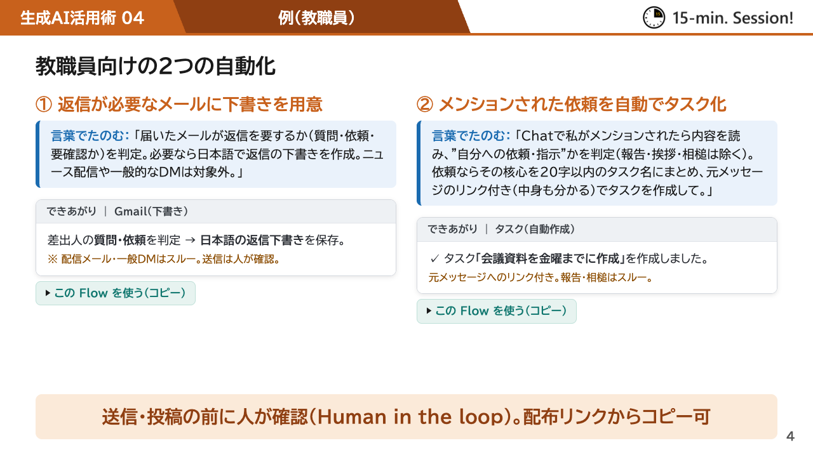
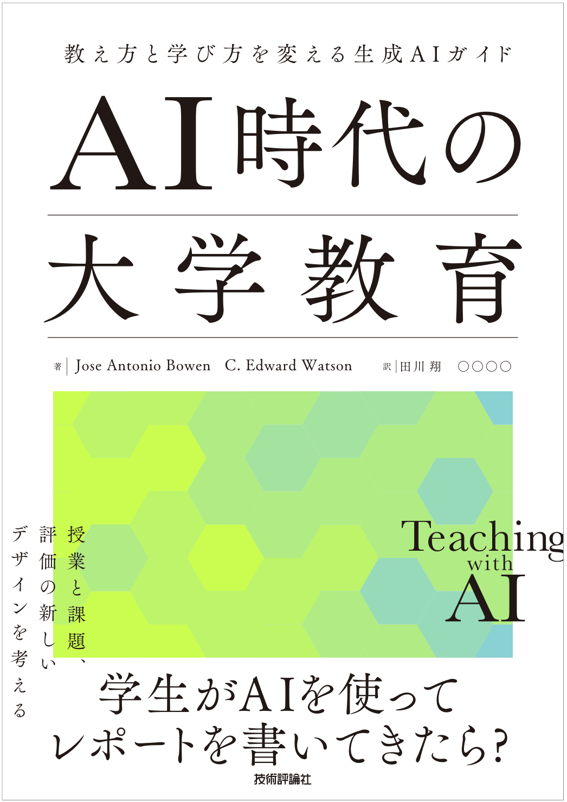
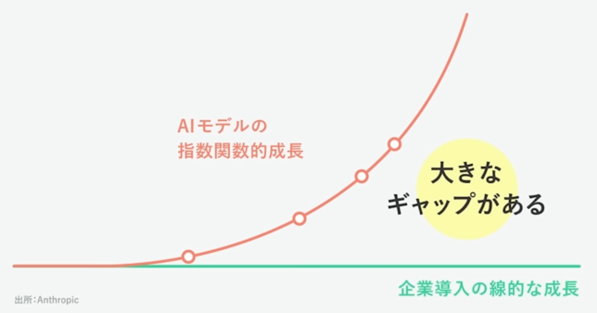
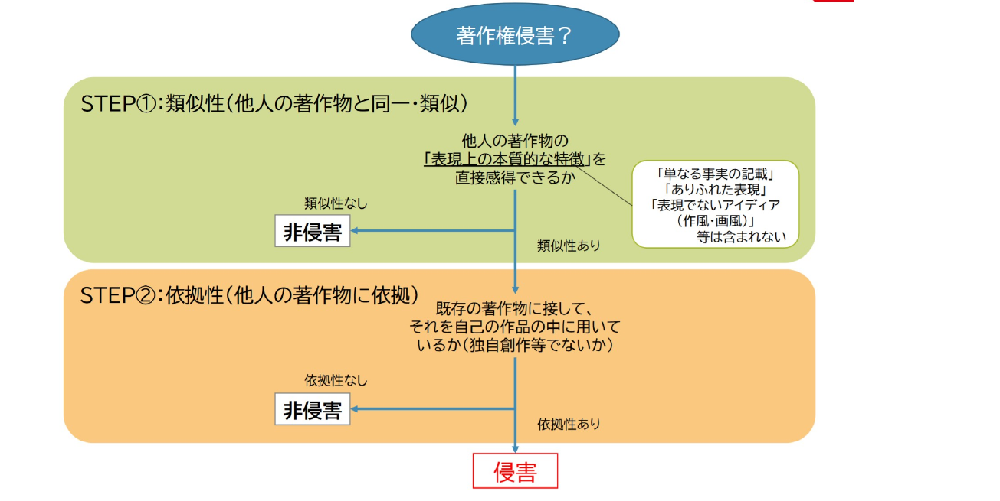
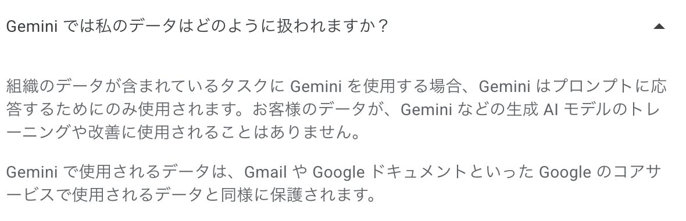
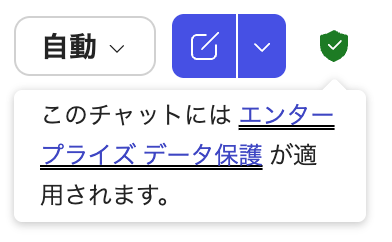
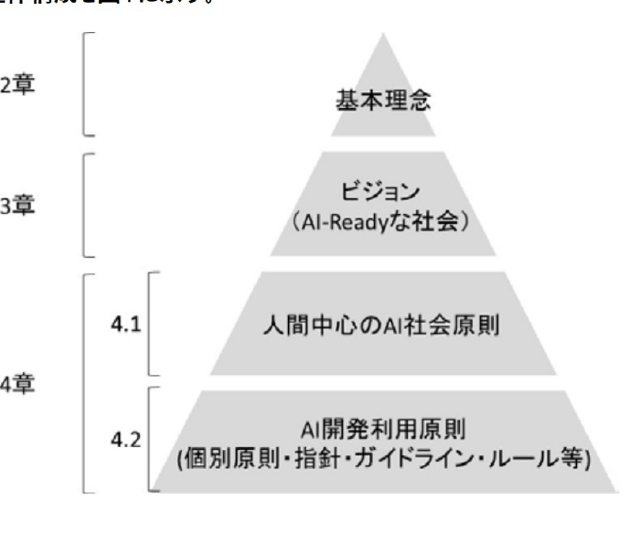
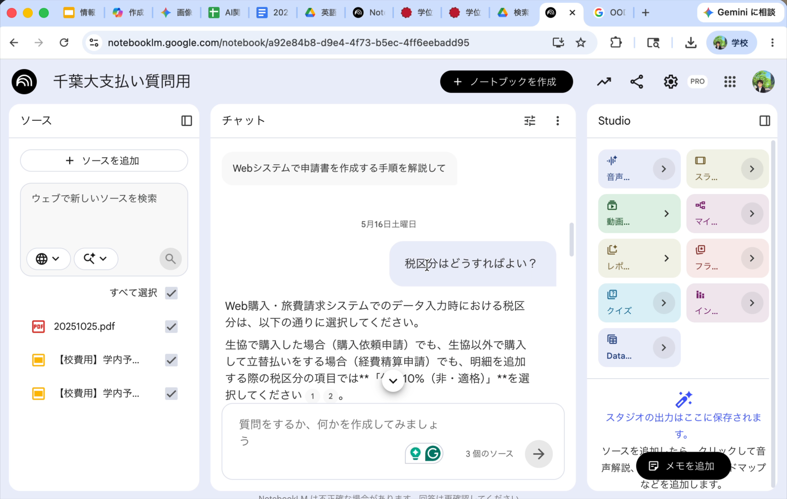
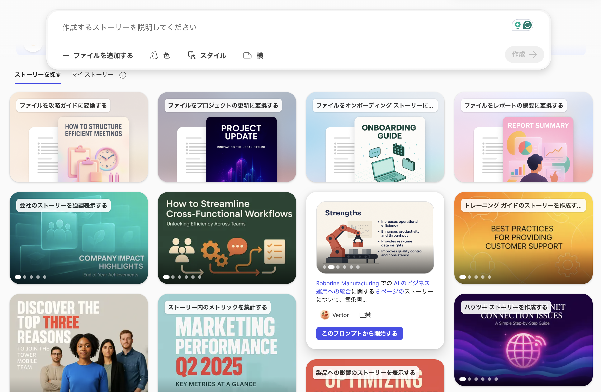
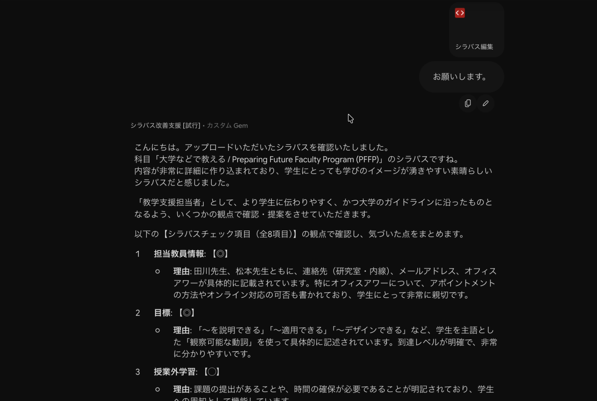

<!--
差し替え残件（確定後にこのメモを消す）：
1) ワークシートのシナリオ一覧（S62）
2) 提出先の URL・QR（S63・S64）
3) 事前アンケート結果のグラフ（S69。データ受領後に ECharts で作成）
確定済み: Slido = コード uekusa-ai26 / https://app.sli.do/event/wZgLG7PtvyyqKiE5iGjvdD / QR=src/slido-qr.png
-->

<!-- _class: cover-hero -->

令和8年度 第1回 学校法人植草学園SD（職員）研修

生成AIの活用法について

2026年8月20日（木）9:00–11:35　さくらホール

田川 翔

千葉大学 国際未来教育基幹／高等教育センター 助教

<!-- 開場中はこの表紙を投影。8:55からS2のSlido案内に切り替える。 -->

---

Slido

## はじめに、お手元でSlidoを開いてください

<b>Slidoとは</b>　スマホやPCから匿名で回答・質問できるWebサービスです。導入も登録も不要です。

- **スマホの方は、QRコードを読み取ってください**
  カメラをかざすと回答画面が開きます。
- **PCの方は、slido.com から参加できます**
  参加コード uekusa-ai26 を入力 or   <a href="https://app.sli.do/event/wZgLG7PtvyyqKiE5iGjvdD">直リンク</a>

回答はすべて匿名です。
個人情報・機密情報は入力しないで下さい。  
本研修の振り返りと改善にのみ使います。

参加コード：uekusa-ai26（slido.com で入力）

本日はSlidoで、皆さんに伺いながら進めます。もしよければ、今日の期待を記入下さい！

<!-- 8:55から投影。接続できない方には近くの方と画面共有をお願いする。9:00になったら理事長挨拶へ。 -->

---

<!-- _class: message -->

# ご参加ありがとうございます

## 9時5分ごろから、講師のパートを始めます

<!-- 理事長挨拶の間はこの画面。挨拶が終わったら次へ。 -->

---

<!-- _class: cover-hero -->

令和8年度 第1回 学校法人植草学園SD（職員）研修

生成AIの活用法について

2026年8月20日（木）9:00–11:35　さくらホール

田川 翔

千葉大学 国際未来教育基幹／高等教育センター 助教

<!-- 理事長挨拶のあと、講師パートの開始時にこの表紙を再度投影して名乗る。 -->

---

自己紹介

## 理学から民間を経て、大学教育の仕事をしています

<b>田川 翔</b>千葉大学 国際未来教育基幹／高等教育センター 助教

理学（地球科学）

地球の内部を実験で調べる研究者でした。

民間（航空貨物）

現場のオペレーションと改善を経験しました。

大学教育

千葉大学で、AIを教える・学ぶに生かす仕事をしています。

千葉大学、特に附属図書館で、教職協働のもと、AIの活用を広げています。

<!-- 理事長挨拶のあと、ここから講師パート。名乗りと経歴を1枚にまとめてある（旧・表紙再掲は廃止）。30秒〜1分。経歴の詳細より「現場出身」であることを伝える。 -->

---

いまの仕事

## 図書館を拠点に、学生・教職員向けの生成AI講座を続けています

15-min sessions 第4回

大学のアカウントで、毎日の定型作業をAIに任せる回です。

1210あかりんアワー

昼休みの30分で、使える機能をまとめて紹介しました。

千葉大学アカデミック・リンク、2026年4〜7月・全6回・各60分／対面とオンラインの選択制

今日お話しするのは、千葉大学で実際にやってみて残ったことです

<!-- 30秒。実績の自慢ではなく「同じことを現場で試している人間が話す」という位置づけを伝える。15分×3（講義→体験→座談）の形式が好評だったことにも一言触れる。 -->

---

なぜAIに関心があるのか

## AIは、学び直しの「相棒」にできると考えているから

- **自分のキャリア：地球科学から物流へ、物流から教育へ**
  自分も、毎回、学び直しをしてきました。
  学ぶための道具に関心があり、AIは、最大の焦点です。
- **仕事(大学の出口)から考えるとAIは優れた道具です**
  有効に活用すれば、成長も成果にも繋がると期待されています。
- **AIは「学び直しの伴走者」になり得ます**
  自分の成長に繋がる使い方を考えるようになりました。
  今、翻訳も行っています。

Bowen &amp; Watson『Teaching with AI』 邦題『AI時代の大学教育』近刊（田川 訳）

大学における生成AIの位置づけに、様々な側面で関心を持っています。

<!-- 1分。理学の博士を取ったのがコロナ禍と重なり、「大学自体が大変・学び方が変わる」という問題意識からオンライン教育支援の研究を始めた、という実話。分野を移るたびのゼロからの学び直しが本当にしんどかった、という実感を素直に語る。ここが後半の「使えないこともAIに聞ける」に効いてくる。 -->

---

今日の構造

## 前半で仕組みを知り、後半はハンズオン

| 時間 | すること |
|---|---|
| 9:05 – 9:34 | 前半1：生成AIとは何かを、仕組みから知る |
| 9:36 – 10:03 | 前半2：大学の教育・業務・戦略にどう関わるかを考える |
| 10:13 – 10:22 | 後半1：道具ごとの得意技を知る |
| 10:22 – 11:15 | 後半2：**グループワーク＆ミニコンペ**：シナリオを選んで実際に試す |
| 11:15 – 11:35 | 共有、まとめ、振り返り |

途中に3分と10分の休憩を挟みます。

今日の最終ゴールは、「使って」、「修正して」、「AIへの意見を持って頂く」ことです。

<!-- 時間割を30秒で。ワークがあること、移動があり得ることを予告する。 -->

---

前半のねらい

## 今日聞けば、安心して「まず試す」を始められます

- **生成AIが何者かを、仕組みから説明できるようになります**
  魔法ではなく確率の機械だと分かると、怖さが減ります。
- **危ない使い方との線引きができるようになります**
  判断の基準と、試すことができた達成感を持ち帰れます。
- **自分の仕事のどこで試すか見当がつく、一歩目になります**
  生成AIを活用するきっかけになると嬉しいです。

<svg viewBox="0 0 420 320" xmlns="http://www.w3.org/2000/svg" role="img" aria-label="知る・線引きする・試すの3段の階段を上る図" style="width:100%; height:auto;">
<rect x="20" y="230" width="125" height="60" fill="#F1F1F1"/>
<rect x="145" y="185" width="125" height="105" fill="#F1F1F1"/>
<rect x="270" y="140" width="125" height="150" fill="#F1F1F1"/>
<path d="M20 230 H145 V185 H270 V140 H395" fill="none" stroke="#2F6B3A" stroke-width="4"/>
<line x1="20" y1="290" x2="395" y2="290" stroke="#262626" stroke-width="2"/>
<text x="82" y="268" font-size="19" font-weight="700" fill="#262626" text-anchor="middle">知る</text>
<text x="207" y="248" font-size="19" font-weight="700" fill="#262626" text-anchor="middle">試す</text>
<text x="332" y="200" font-size="17" font-weight="700" fill="#262626" text-anchor="middle"><tspan x="332">AIとの</tspan><tspan x="332" dy="23">関わり方を</tspan><tspan x="332" dy="23">形成する</tspan></text>
<circle cx="332" cy="96" r="13" fill="none" stroke="#2F6B3A" stroke-width="3"/>
<line x1="332" y1="109" x2="332" y2="126" stroke="#2F6B3A" stroke-width="3"/>
<line x1="314" y1="117" x2="350" y2="112" stroke="#2F6B3A" stroke-width="3"/>
<line x1="332" y1="126" x2="322" y2="140" stroke="#2F6B3A" stroke-width="3"/>
<line x1="332" y1="126" x2="343" y2="140" stroke="#2F6B3A" stroke-width="3"/>
</svg>

特に、一緒に活用を推進できる、**仲間を**見つけて下さい！

知る → 試す → 自分なりのAIとの関わり方をつくる、盛りだくさんの半日です

<!-- 「〇〇できるようになる」を具体的に3つ宣言する。 -->

---

<!-- _class: divider -->

前半1 ｜ 9:07 – 9:34

# 生成AIとは何か

## 仕組みが分かれば、怖さは減ります

<!-- 章扉。ここからSlidoアンケート1へ。 -->

---

<!-- _class: slido -->

Slido ①

## まず、皆さんの現在地を3問、伺わせてください

- **1-①　生成AIをどのくらいの頻度で使っていますか択一**
  毎日 ／ 週に数回 ／ 月に数回 ／ 使ったことがない
- **1-②　何に使っていますか複数選択**
  文章の下書き ／ 調べもの ／ 翻訳 ／ 資料づくり ／ その他 ／ まだ使っていない
- **1-③　AIにどんな印象を持っていますか択一**
  期待が大きい ／ どちらかといえば期待 ／ どちらかといえば不安 ／ 不安が大きい

正解はありません。いまの実感のままお答えください

<!-- 【ここで Slido 1-①〜③ を実施】結果を画面に映し、分布を一言ずつ拾う。1-③の結果は最後（5-①）ともう一度比べる、と予告する。 -->

---

業務での広がり

## 仕事で使う流れも来ているが、日本はまだ半分

<svg xmlns="http://www.w3.org/2000/svg" xmlns:xlink="http://www.w3.org/1999/xlink" version="1.1" baseProfile="full" viewBox="0 0 720 330"><rect width="720" height="330" x="0" y="0" fill="none"></rect><path d="M84.5 12L84.5 295" fill="none" pointer-events="visible" stroke="#E4E4E4" class="zr0-cls-0"></path><path d="M220.5 12L220.5 295" fill="none" pointer-events="visible" stroke="#E4E4E4" class="zr0-cls-0"></path><path d="M357.5 12L357.5 295" fill="none" pointer-events="visible" stroke="#E4E4E4" class="zr0-cls-0"></path><path d="M493.5 12L493.5 295" fill="none" pointer-events="visible" stroke="#E4E4E4" class="zr0-cls-0"></path><path d="M630.5 12L630.5 295" fill="none" pointer-events="visible" stroke="#E4E4E4" class="zr0-cls-0"></path><path d="M84 12L84 295" fill="none" pointer-events="visible" stroke="#262626" stroke-width="1.5" stroke-linecap="round" class="zr0-cls-0"></path><text dominant-baseline="central" text-anchor="end" style="font-size:22px;font-family:'BIZ UDPGothic','Hiragino Sans','Hiragino Kaku Gothic ProN','Yu Gothic Medium','Noto Sans JP',Meiryo,sans-serif;font-weight:bold;" transform="translate(74 47.375)" fill="#262626">日本</text><text dominant-baseline="central" text-anchor="end" style="font-size:22px;font-family:'BIZ UDPGothic','Hiragino Sans','Hiragino Kaku Gothic ProN','Yu Gothic Medium','Noto Sans JP',Meiryo,sans-serif;font-weight:bold;" transform="translate(74 118.125)" fill="#262626">米国</text><text dominant-baseline="central" text-anchor="end" style="font-size:22px;font-family:'BIZ UDPGothic','Hiragino Sans','Hiragino Kaku Gothic ProN','Yu Gothic Medium','Noto Sans JP',Meiryo,sans-serif;font-weight:bold;" transform="translate(74 188.875)" fill="#262626">ドイツ</text><text dominant-baseline="central" text-anchor="end" style="font-size:22px;font-family:'BIZ UDPGothic','Hiragino Sans','Hiragino Kaku Gothic ProN','Yu Gothic Medium','Noto Sans JP',Meiryo,sans-serif;font-weight:bold;" transform="translate(74 259.625)" fill="#262626">中国</text><text dominant-baseline="central" text-anchor="middle" style="font-size:17px;font-family:'BIZ UDPGothic','Hiragino Sans','Hiragino Kaku Gothic ProN','Yu Gothic Medium','Noto Sans JP',Meiryo,sans-serif;" y="8.5" transform="translate(84 305)" fill="#5F5F5F">0%</text><text dominant-baseline="central" text-anchor="middle" style="font-size:17px;font-family:'BIZ UDPGothic','Hiragino Sans','Hiragino Kaku Gothic ProN','Yu Gothic Medium','Noto Sans JP',Meiryo,sans-serif;" y="8.5" transform="translate(220.5 305)" fill="#5F5F5F">25%</text><text dominant-baseline="central" text-anchor="middle" style="font-size:17px;font-family:'BIZ UDPGothic','Hiragino Sans','Hiragino Kaku Gothic ProN','Yu Gothic Medium','Noto Sans JP',Meiryo,sans-serif;" y="8.5" transform="translate(357 305)" fill="#5F5F5F">50%</text><text dominant-baseline="central" text-anchor="middle" style="font-size:17px;font-family:'BIZ UDPGothic','Hiragino Sans','Hiragino Kaku Gothic ProN','Yu Gothic Medium','Noto Sans JP',Meiryo,sans-serif;" y="8.5" transform="translate(493.5 305)" fill="#5F5F5F">75%</text><text dominant-baseline="central" text-anchor="middle" style="font-size:17px;font-family:'BIZ UDPGothic','Hiragino Sans','Hiragino Kaku Gothic ProN','Yu Gothic Medium','Noto Sans JP',Meiryo,sans-serif;" y="8.5" transform="translate(630 305)" fill="#5F5F5F">100%</text><path d="M84 29.7l301.4 0l0 35.4l-301.4 0Z" fill="#2F6B3A" ecmeta_series_index="0" ecmeta_data_index="0" ecmeta_ssr_type="chart" class="zr0-cls-1"></path><path d="M84 100.4l494.7 0l0 35.4l-494.7 0Z" fill="#BDBDBD" ecmeta_series_index="0" ecmeta_data_index="1" ecmeta_ssr_type="chart" class="zr0-cls-2"></path><path d="M84 171.2l493 0l0 35.4l-493 0Z" fill="#BDBDBD" ecmeta_series_index="0" ecmeta_data_index="2" ecmeta_ssr_type="chart" class="zr0-cls-2"></path><path d="M84 241.9l523.1 0l0 35.4l-523.1 0Z" fill="#BDBDBD" ecmeta_series_index="0" ecmeta_data_index="3" ecmeta_ssr_type="chart" class="zr0-cls-2"></path><text dominant-baseline="central" text-anchor="start" style="font-size:25px;font-family:'BIZ UDPGothic','Hiragino Sans','Hiragino Kaku Gothic ProN','Yu Gothic Medium','Noto Sans JP',Meiryo,sans-serif;font-weight:bold;" transform="translate(390.392 47.375)" fill="#262626">55.2%</text><text dominant-baseline="central" text-anchor="start" style="font-size:25px;font-family:'BIZ UDPGothic','Hiragino Sans','Hiragino Kaku Gothic ProN','Yu Gothic Medium','Noto Sans JP',Meiryo,sans-serif;font-weight:bold;" transform="translate(583.676 118.125)" fill="#262626">90.6%</text><text dominant-baseline="central" text-anchor="start" style="font-size:25px;font-family:'BIZ UDPGothic','Hiragino Sans','Hiragino Kaku Gothic ProN','Yu Gothic Medium','Noto Sans JP',Meiryo,sans-serif;font-weight:bold;" transform="translate(582.038 188.875)" fill="#262626">90.3%</text><text dominant-baseline="central" text-anchor="start" style="font-size:25px;font-family:'BIZ UDPGothic','Hiragino Sans','Hiragino Kaku Gothic ProN','Yu Gothic Medium','Noto Sans JP',Meiryo,sans-serif;font-weight:bold;" transform="translate(612.068 259.625)" fill="#262626">95.8%</text></svg>

業務で生成AIを一つでも使っている企業の割合

総務省『令和7年版 情報通信白書』図表Ⅰ-1-2-14ほか（令和6年度調査、日本の企業 n=442・活用方針 n=515）

- **日本企業の55.2%しか業務で使っていません**
  米国90.6%、ドイツ90.3%、中国95.8%との差があります。
- **49.7%が「活用する」方針を決めています**
  31.8%は「方針を明確に定めていない」と回答しています。
- **個人の利用経験は、日本は26.7%です**
  米国68.8%、ドイツ59.2%、中国81.2%。20代でも44.7%です。

学生は9割、日本の職場は半分。ここに差が生まれています

<!-- 業務側の現在地。海外との差を煽らず「伸びしろ」として置く。数値の出典＝業務利用は図表Ⅰ-1-2-14「企業における業務での生成AI利用率（国別）」、活用方針は図表Ⅰ-1-2-12「生成AIの活用方針策定状況（国別）」（積極的23.7%＋領域限定26.0%＝49.7%、方針を定めていない31.8%）、個人利用は「生成AIサービス利用経験（国別／年代別、日本）」。 -->

---

学生の利用

## 目の前の学生は、もうほぼ全員が使用中？

<svg xmlns="http://www.w3.org/2000/svg" xmlns:xlink="http://www.w3.org/1999/xlink" version="1.1" baseProfile="full" viewBox="0 0 720 330"><rect width="720" height="330" x="0" y="0" fill="none"></rect><path d="M115.5 12L115.5 295" fill="none" pointer-events="visible" stroke="#E4E4E4" class="zr0-cls-0"></path><path d="M244.5 12L244.5 295" fill="none" pointer-events="visible" stroke="#E4E4E4" class="zr0-cls-0"></path><path d="M372.5 12L372.5 295" fill="none" pointer-events="visible" stroke="#E4E4E4" class="zr0-cls-0"></path><path d="M501.5 12L501.5 295" fill="none" pointer-events="visible" stroke="#E4E4E4" class="zr0-cls-0"></path><path d="M630.5 12L630.5 295" fill="none" pointer-events="visible" stroke="#E4E4E4" class="zr0-cls-0"></path><path d="M116 12L116 295" fill="none" pointer-events="visible" stroke="#262626" stroke-width="1.5" stroke-linecap="round" class="zr0-cls-0"></path><text dominant-baseline="central" text-anchor="end" style="font-size:22px;font-family:'BIZ UDPGothic','Hiragino Sans','Hiragino Kaku Gothic ProN','Yu Gothic Medium','Noto Sans JP',Meiryo,sans-serif;font-weight:bold;" transform="translate(105.28 59.1667)" fill="#262626">2023年</text><text dominant-baseline="central" text-anchor="end" style="font-size:22px;font-family:'BIZ UDPGothic','Hiragino Sans','Hiragino Kaku Gothic ProN','Yu Gothic Medium','Noto Sans JP',Meiryo,sans-serif;font-weight:bold;" transform="translate(105.28 153.5)" fill="#262626">2024年</text><text dominant-baseline="central" text-anchor="end" style="font-size:22px;font-family:'BIZ UDPGothic','Hiragino Sans','Hiragino Kaku Gothic ProN','Yu Gothic Medium','Noto Sans JP',Meiryo,sans-serif;font-weight:bold;" transform="translate(105.28 247.8333)" fill="#262626">2025年</text><text dominant-baseline="central" text-anchor="middle" style="font-size:17px;font-family:'BIZ UDPGothic','Hiragino Sans','Hiragino Kaku Gothic ProN','Yu Gothic Medium','Noto Sans JP',Meiryo,sans-serif;" y="8.5" transform="translate(115.28 305)" fill="#5F5F5F">0%</text><text dominant-baseline="central" text-anchor="middle" style="font-size:17px;font-family:'BIZ UDPGothic','Hiragino Sans','Hiragino Kaku Gothic ProN','Yu Gothic Medium','Noto Sans JP',Meiryo,sans-serif;" y="8.5" transform="translate(243.96 305)" fill="#5F5F5F">25%</text><text dominant-baseline="central" text-anchor="middle" style="font-size:17px;font-family:'BIZ UDPGothic','Hiragino Sans','Hiragino Kaku Gothic ProN','Yu Gothic Medium','Noto Sans JP',Meiryo,sans-serif;" y="8.5" transform="translate(372.64 305)" fill="#5F5F5F">50%</text><text dominant-baseline="central" text-anchor="middle" style="font-size:17px;font-family:'BIZ UDPGothic','Hiragino Sans','Hiragino Kaku Gothic ProN','Yu Gothic Medium','Noto Sans JP',Meiryo,sans-serif;" y="8.5" transform="translate(501.32 305)" fill="#5F5F5F">75%</text><text dominant-baseline="central" text-anchor="middle" style="font-size:17px;font-family:'BIZ UDPGothic','Hiragino Sans','Hiragino Kaku Gothic ProN','Yu Gothic Medium','Noto Sans JP',Meiryo,sans-serif;" y="8.5" transform="translate(630 305)" fill="#5F5F5F">100%</text><path d="M115.3 35.6l240.4 0l0 47.2l-240.4 0Z" fill="#BDBDBD" ecmeta_series_index="0" ecmeta_data_index="0" ecmeta_ssr_type="chart" class="zr0-cls-1"></path><path d="M115.3 129.9l351 0l0 47.2l-351 0Z" fill="#9CBFA3" ecmeta_series_index="0" ecmeta_data_index="1" ecmeta_ssr_type="chart" class="zr0-cls-2"></path><path d="M115.3 224.3l474.6 0l0 47.2l-474.6 0Z" fill="#2F6B3A" ecmeta_series_index="0" ecmeta_data_index="2" ecmeta_ssr_type="chart" class="zr0-cls-3"></path><text dominant-baseline="central" text-anchor="start" style="font-size:25px;font-family:'BIZ UDPGothic','Hiragino Sans','Hiragino Kaku Gothic ProN','Yu Gothic Medium','Noto Sans JP',Meiryo,sans-serif;font-weight:bold;" transform="translate(360.6542 59.1667)" fill="#262626">46.7%</text><text dominant-baseline="central" text-anchor="start" style="font-size:25px;font-family:'BIZ UDPGothic','Hiragino Sans','Hiragino Kaku Gothic ProN','Yu Gothic Medium','Noto Sans JP',Meiryo,sans-serif;font-weight:bold;" transform="translate(471.319 153.5)" fill="#262626">68.2%</text><text dominant-baseline="central" text-anchor="start" style="font-size:25px;font-family:'BIZ UDPGothic','Hiragino Sans','Hiragino Kaku Gothic ProN','Yu Gothic Medium','Noto Sans JP',Meiryo,sans-serif;font-weight:bold;" transform="translate(594.8518 247.8333)" fill="#262626">92.2%</text></svg>

大学生で「生成AIの利用経験あり」と答えた割合

全国大学生活協同組合連合会「学生生活実態調査」第60回（2024年10–11月, n=11,590）・第61回（2025年10–11月, n=13,277）

- **2025年秋、92.2%が「使った経験がある」**
  2023年46.7%、2024年68.2%から急増。
- **用途は授業・研究とレポート作成が中心です**
  翻訳や相談相手など日常的な使い方にも拡大。
- **分野を問わない**
  理工系77%、文科系63%、医歯薬系62%

学校・保育でも資料づくりや業務での活用が進むはずです。卒業後も機会は多いでしょう。

AIは既に環境になった→使う使わないを含め、デザイン的なアプローチが必要

<!-- 学生側の現在地。9割超という数字を、驚きではなく前提として置く。用途が学修の中心に入っている点を強調する。 -->

---

<!-- _class: split -->

社会での使われ方

## AIが得意な仕事と、人が担い続けそうな仕事があります

- **青は、AIが理論上できる範囲です**
  事務や書類の仕事ほど、AIができることが多くなります。
- **赤は、実際に使われている範囲です**
  差は大きく、この差が伸びしろです。
- **緑の文字の3つが、学園の仕事です**
  人やケアに関する仕事ほど、AIができる範囲は狭いままです。

出典: Massenkoff &amp; McCrory (2026)「Labor market impacts of AI」（値は公開図からの読み取り）

<svg xmlns="http://www.w3.org/2000/svg" xmlns:xlink="http://www.w3.org/1999/xlink" version="1.1" baseProfile="full" viewBox="0 0 960 600"><rect width="960" height="600" x="0" y="0" fill="none"></rect><path d="M480 256.8L466.1 258.8L453.4 264.6L442.8 273.8L435.2 285.6L431.3 299L431.3 313L435.2 326.4L442.8 338.2L453.4 347.4L466.1 353.2L480 355.2L493.9 353.2L506.6 347.4L517.2 338.2L524.8 326.4L528.7 313L528.7 299L524.8 285.6L517.2 273.8L506.6 264.6L493.9 258.8L480 256.8L480 306ZM480 158.4L438.4 164.4L400.2 181.8L368.5 209.3L345.7 244.7L333.9 285L333.9 327L345.7 367.3L368.5 402.7L400.2 430.2L438.4 447.6L480 453.6L521.6 447.6L559.8 430.2L591.5 402.7L614.3 367.3L626.1 327L626.1 285L614.3 244.7L591.5 209.3L559.8 181.8L521.6 164.4L480 158.4L480 207.6L507.7 211.6L533.2 223.2L554.4 241.6L569.5 265.1L577.4 292L577.4 320L569.5 346.9L554.4 370.4L533.2 388.8L507.7 400.4L480 404.4L452.3 400.4L426.8 388.8L405.6 370.4L390.5 346.9L382.6 320L382.6 292L390.5 265.1L405.6 241.6L426.8 223.2L452.3 211.6L480 207.6ZM480 60L410.7 70L347 99.1L294.1 144.9L256.2 203.8L236.5 271L236.5 341L256.2 408.2L294.1 467.1L347 512.9L410.7 542L480 552L549.3 542L613 512.9L665.9 467.1L703.8 408.2L723.5 341L723.5 271L703.8 203.8L665.9 144.9L613 99.1L549.3 70L480 60L480 109.2L535.4 117.2L586.4 140.4L628.7 177.1L659 224.2L674.8 278L674.8 334L659 387.8L628.7 434.9L586.4 471.6L535.4 494.8L480 502.8L424.6 494.8L373.6 471.6L331.3 434.9L301 387.8L285.2 334L285.2 278L301 224.2L331.3 177.1L373.6 140.4L424.6 117.2L480 109.2Z" fill="#fbfbfa" class="zr0-cls-0"></path><path d="M480 207.6L452.3 211.6L426.8 223.2L405.6 241.6L390.5 265.1L382.6 292L382.6 320L390.5 346.9L405.6 370.4L426.8 388.8L452.3 400.4L480 404.4L507.7 400.4L533.2 388.8L554.4 370.4L569.5 346.9L577.4 320L577.4 292L569.5 265.1L554.4 241.6L533.2 223.2L507.7 211.6L480 207.6L480 256.8L493.9 258.8L506.6 264.6L517.2 273.8L524.8 285.6L528.7 299L528.7 313L524.8 326.4L517.2 338.2L506.6 347.4L493.9 353.2L480 355.2L466.1 353.2L453.4 347.4L442.8 338.2L435.2 326.4L431.3 313L431.3 299L435.2 285.6L442.8 273.8L453.4 264.6L466.1 258.8L480 256.8ZM480 109.2L424.6 117.2L373.6 140.4L331.3 177.1L301 224.2L285.2 278L285.2 334L301 387.8L331.3 434.9L373.6 471.6L424.6 494.8L480 502.8L535.4 494.8L586.4 471.6L628.7 434.9L659 387.8L674.8 334L674.8 278L659 224.2L628.7 177.1L586.4 140.4L535.4 117.2L480 109.2L480 158.4L521.6 164.4L559.8 181.8L591.5 209.3L614.3 244.7L626.1 285L626.1 327L614.3 367.3L591.5 402.7L559.8 430.2L521.6 447.6L480 453.6L438.4 447.6L400.2 430.2L368.5 402.7L345.7 367.3L333.9 327L333.9 285L345.7 244.7L368.5 209.3L400.2 181.8L438.4 164.4L480 158.4Z" fill="#f4f4f2" class="zr0-cls-0"></path><path d="M480 306M480 256.8L466.1 258.8L453.4 264.6L442.8 273.8L435.2 285.6L431.3 299L431.3 313L435.2 326.4L442.8 338.2L453.4 347.4L466.1 353.2L480 355.2L493.9 353.2L506.6 347.4L517.2 338.2L524.8 326.4L528.7 313L528.7 299L524.8 285.6L517.2 273.8L506.6 264.6L493.9 258.8L480 256.8M480 207.6L452.3 211.6L426.8 223.2L405.6 241.6L390.5 265.1L382.6 292L382.6 320L390.5 346.9L405.6 370.4L426.8 388.8L452.3 400.4L480 404.4L507.7 400.4L533.2 388.8L554.4 370.4L569.5 346.9L577.4 320L577.4 292L569.5 265.1L554.4 241.6L533.2 223.2L507.7 211.6L480 207.6M480 158.4L438.4 164.4L400.2 181.8L368.5 209.3L345.7 244.7L333.9 285L333.9 327L345.7 367.3L368.5 402.7L400.2 430.2L438.4 447.6L480 453.6L521.6 447.6L559.8 430.2L591.5 402.7L614.3 367.3L626.1 327L626.1 285L614.3 244.7L591.5 209.3L559.8 181.8L521.6 164.4L480 158.4M480 109.2L424.6 117.2L373.6 140.4L331.3 177.1L301 224.2L285.2 278L285.2 334L301 387.8L331.3 434.9L373.6 471.6L424.6 494.8L480 502.8L535.4 494.8L586.4 471.6L628.7 434.9L659 387.8L674.8 334L674.8 278L659 224.2L628.7 177.1L586.4 140.4L535.4 117.2L480 109.2M480 60L410.7 70L347 99.1L294.1 144.9L256.2 203.8L236.5 271L236.5 341L256.2 408.2L294.1 467.1L347 512.9L410.7 542L480 552L549.3 542L613 512.9L665.9 467.1L703.8 408.2L723.5 341L723.5 271L703.8 203.8L665.9 144.9L613 99.1L549.3 70L480 60" fill="none" pointer-events="visible" stroke="#e3e6ea" class="zr0-cls-0"></path><path d="M480.5 306L480.5 60" fill="none" pointer-events="visible" stroke="#d6d9dd" stroke-linecap="round" class="zr0-cls-0"></path><path d="M-39 -27l78 0l0 26l-78 0Z" transform="translate(480 45)" fill="none" pointer-events="visible" class="zr0-cls-0"></path><text dominant-baseline="central" text-anchor="middle" style="font-size:26px;font-family:'Hiragino Sans','Yu Gothic',YuGothic,'Noto Sans JP',Meiryo,sans-serif;" y="-14" transform="translate(480 45)" fill="#6b7177">管理職</text><path d="M480 306L410.7 70" fill="none" pointer-events="visible" stroke="#d6d9dd" stroke-linecap="round" class="zr0-cls-0"></path><path d="M-52 -13l52 0l0 26l-52 0Z" transform="translate(406.4678 55.5723)" fill="none" pointer-events="visible" class="zr0-cls-0"></path><text dominant-baseline="central" text-anchor="end" style="font-size:26px;font-family:'Hiragino Sans','Yu Gothic',YuGothic,'Noto Sans JP',Meiryo,sans-serif;" transform="translate(406.4678 55.5723)" fill="#6b7177">運輸</text><path d="M480 306L347 99.1" fill="none" pointer-events="visible" stroke="#d6d9dd" stroke-linecap="round" class="zr0-cls-0"></path><path d="M-52 -13l52 0l0 26l-52 0Z" transform="translate(338.8927 86.4328)" fill="none" pointer-events="visible" class="zr0-cls-0"></path><text dominant-baseline="central" text-anchor="end" style="font-size:26px;font-family:'Hiragino Sans','Yu Gothic',YuGothic,'Noto Sans JP',Meiryo,sans-serif;" transform="translate(338.8927 86.4328)" fill="#6b7177">製造</text><path d="M480 306L294.1 144.9" fill="none" pointer-events="visible" stroke="#d6d9dd" stroke-linecap="round" class="zr0-cls-0"></path><path d="M-130 -13l130 0l0 26l-130 0Z" transform="translate(282.7494 135.0813)" fill="none" pointer-events="visible" class="zr0-cls-0"></path><text dominant-baseline="central" text-anchor="end" style="font-size:26px;font-family:'Hiragino Sans','Yu Gothic',YuGothic,'Noto Sans JP',Meiryo,sans-serif;" transform="translate(282.7494 135.0813)" fill="#6b7177">設置・修理</text><path d="M480 306L256.2 203.8" fill="none" pointer-events="visible" stroke="#d6d9dd" stroke-linecap="round" class="zr0-cls-0"></path><path d="M-52 -13l52 0l0 26l-52 0Z" transform="translate(242.586 197.5767)" fill="none" pointer-events="visible" class="zr0-cls-0"></path><text dominant-baseline="central" text-anchor="end" style="font-size:26px;font-family:'Hiragino Sans','Yu Gothic',YuGothic,'Noto Sans JP',Meiryo,sans-serif;" transform="translate(242.586 197.5767)" fill="#6b7177">建設</text><path d="M480 306L236.5 271" fill="none" pointer-events="visible" stroke="#d6d9dd" stroke-linecap="round" class="zr0-cls-0"></path><path d="M-104 -13l104 0l0 26l-104 0Z" transform="translate(221.6566 268.8558)" fill="none" pointer-events="visible" class="zr0-cls-0"></path><text dominant-baseline="central" text-anchor="end" style="font-size:26px;font-family:'Hiragino Sans','Yu Gothic',YuGothic,'Noto Sans JP',Meiryo,sans-serif;" transform="translate(221.6566 268.8558)" fill="#6b7177">農林漁業</text><path d="M480 306L236.5 341" fill="none" pointer-events="visible" stroke="#d6d9dd" stroke-linecap="round" class="zr0-cls-0"></path><path d="M-130 -13l130 0l0 26l-130 0Z" transform="translate(221.6566 343.1442)" fill="none" pointer-events="visible" class="zr0-cls-0"></path><text dominant-baseline="central" text-anchor="end" style="font-size:26px;font-family:'Hiragino Sans','Yu Gothic',YuGothic,'Noto Sans JP',Meiryo,sans-serif;font-weight:bold;" transform="translate(221.6566 343.1442)" fill="#2F6B3A">事務・管理</text><path d="M480 306L256.2 408.2" fill="none" pointer-events="visible" stroke="#d6d9dd" stroke-linecap="round" class="zr0-cls-0"></path><path d="M-130 -13l130 0l0 26l-130 0Z" transform="translate(242.586 414.4233)" fill="none" pointer-events="visible" class="zr0-cls-0"></path><text dominant-baseline="central" text-anchor="end" style="font-size:26px;font-family:'Hiragino Sans','Yu Gothic',YuGothic,'Noto Sans JP',Meiryo,sans-serif;" transform="translate(242.586 414.4233)" fill="#6b7177">営業・販売</text><path d="M480 306L294.1 467.1" fill="none" pointer-events="visible" stroke="#d6d9dd" stroke-linecap="round" class="zr0-cls-0"></path><path d="M-104 -13l104 0l0 26l-104 0Z" transform="translate(282.7494 476.9187)" fill="none" pointer-events="visible" class="zr0-cls-0"></path><text dominant-baseline="central" text-anchor="end" style="font-size:26px;font-family:'Hiragino Sans','Yu Gothic',YuGothic,'Noto Sans JP',Meiryo,sans-serif;font-weight:bold;" transform="translate(282.7494 476.9187)" fill="#2F6B3A">対人ケア</text><path d="M480 306L347 512.9" fill="none" pointer-events="visible" stroke="#d6d9dd" stroke-linecap="round" class="zr0-cls-0"></path><path d="M-130 -13l130 0l0 26l-130 0Z" transform="translate(338.8927 525.5672)" fill="none" pointer-events="visible" class="zr0-cls-0"></path><text dominant-baseline="central" text-anchor="end" style="font-size:26px;font-family:'Hiragino Sans','Yu Gothic',YuGothic,'Noto Sans JP',Meiryo,sans-serif;" transform="translate(338.8927 525.5672)" fill="#6b7177">清掃・整備</text><path d="M480 306L410.7 542" fill="none" pointer-events="visible" stroke="#d6d9dd" stroke-linecap="round" class="zr0-cls-0"></path><path d="M-52 -13l52 0l0 26l-52 0Z" transform="translate(406.4678 556.4277)" fill="none" pointer-events="visible" class="zr0-cls-0"></path><text dominant-baseline="central" text-anchor="end" style="font-size:26px;font-family:'Hiragino Sans','Yu Gothic',YuGothic,'Noto Sans JP',Meiryo,sans-serif;" transform="translate(406.4678 556.4277)" fill="#6b7177">飲食</text><path d="M480.5 306L480.5 552" fill="none" pointer-events="visible" stroke="#d6d9dd" stroke-linecap="round" class="zr0-cls-0"></path><path d="M-26 1l52 0l0 26l-52 0Z" transform="translate(480 567)" fill="none" pointer-events="visible" class="zr0-cls-0"></path><text dominant-baseline="central" text-anchor="middle" style="font-size:26px;font-family:'Hiragino Sans','Yu Gothic',YuGothic,'Noto Sans JP',Meiryo,sans-serif;" y="14" transform="translate(480 567)" fill="#6b7177">保安</text><path d="M480 306L549.3 542" fill="none" pointer-events="visible" stroke="#d6d9dd" stroke-linecap="round" class="zr0-cls-0"></path><path d="M0 -13l104 0l0 26l-104 0Z" transform="translate(553.5322 556.4277)" fill="none" pointer-events="visible" class="zr0-cls-0"></path><text dominant-baseline="central" text-anchor="start" style="font-size:26px;font-family:'Hiragino Sans','Yu Gothic',YuGothic,'Noto Sans JP',Meiryo,sans-serif;" transform="translate(553.5322 556.4277)" fill="#6b7177">医療補助</text><path d="M480 306L613 512.9" fill="none" pointer-events="visible" stroke="#d6d9dd" stroke-linecap="round" class="zr0-cls-0"></path><path d="M0 -13l130 0l0 26l-130 0Z" transform="translate(621.1073 525.5672)" fill="none" pointer-events="visible" class="zr0-cls-0"></path><text dominant-baseline="central" text-anchor="start" style="font-size:26px;font-family:'Hiragino Sans','Yu Gothic',YuGothic,'Noto Sans JP',Meiryo,sans-serif;" transform="translate(621.1073 525.5672)" fill="#6b7177">医療専門職</text><path d="M480 306L665.9 467.1" fill="none" pointer-events="visible" stroke="#d6d9dd" stroke-linecap="round" class="zr0-cls-0"></path><path d="M0 -13l182 0l0 26l-182 0Z" transform="translate(677.2506 476.9187)" fill="none" pointer-events="visible" class="zr0-cls-0"></path><text dominant-baseline="central" text-anchor="start" style="font-size:26px;font-family:'Hiragino Sans','Yu Gothic',YuGothic,'Noto Sans JP',Meiryo,sans-serif;" transform="translate(677.2506 476.9187)" fill="#6b7177">芸術・メディア</text><path d="M480 306L703.8 408.2" fill="none" pointer-events="visible" stroke="#d6d9dd" stroke-linecap="round" class="zr0-cls-0"></path><path d="M0 -13l130 0l0 26l-130 0Z" transform="translate(717.414 414.4233)" fill="none" pointer-events="visible" class="zr0-cls-0"></path><text dominant-baseline="central" text-anchor="start" style="font-size:26px;font-family:'Hiragino Sans','Yu Gothic',YuGothic,'Noto Sans JP',Meiryo,sans-serif;font-weight:bold;" transform="translate(717.414 414.4233)" fill="#2F6B3A">教育・図書</text><path d="M480 306L723.5 341" fill="none" pointer-events="visible" stroke="#d6d9dd" stroke-linecap="round" class="zr0-cls-0"></path><path d="M0 -13l52 0l0 26l-52 0Z" transform="translate(738.3434 343.1442)" fill="none" pointer-events="visible" class="zr0-cls-0"></path><text dominant-baseline="central" text-anchor="start" style="font-size:26px;font-family:'Hiragino Sans','Yu Gothic',YuGothic,'Noto Sans JP',Meiryo,sans-serif;" transform="translate(738.3434 343.1442)" fill="#6b7177">法務</text><path d="M480 306L723.5 271" fill="none" pointer-events="visible" stroke="#d6d9dd" stroke-linecap="round" class="zr0-cls-0"></path><path d="M0 -13l104 0l0 26l-104 0Z" transform="translate(738.3434 268.8558)" fill="none" pointer-events="visible" class="zr0-cls-0"></path><text dominant-baseline="central" text-anchor="start" style="font-size:26px;font-family:'Hiragino Sans','Yu Gothic',YuGothic,'Noto Sans JP',Meiryo,sans-serif;" transform="translate(738.3434 268.8558)" fill="#6b7177">社会福祉</text><path d="M480 306L703.8 203.8" fill="none" pointer-events="visible" stroke="#d6d9dd" stroke-linecap="round" class="zr0-cls-0"></path><path d="M0 -13l182 0l0 26l-182 0Z" transform="translate(717.414 197.5767)" fill="none" pointer-events="visible" class="zr0-cls-0"></path><text dominant-baseline="central" text-anchor="start" style="font-size:26px;font-family:'Hiragino Sans','Yu Gothic',YuGothic,'Noto Sans JP',Meiryo,sans-serif;" transform="translate(717.414 197.5767)" fill="#6b7177">自然・社会科学</text><path d="M480 306L665.9 144.9" fill="none" pointer-events="visible" stroke="#d6d9dd" stroke-linecap="round" class="zr0-cls-0"></path><path d="M0 -13l130 0l0 26l-130 0Z" transform="translate(677.2506 135.0813)" fill="none" pointer-events="visible" class="zr0-cls-0"></path><text dominant-baseline="central" text-anchor="start" style="font-size:26px;font-family:'Hiragino Sans','Yu Gothic',YuGothic,'Noto Sans JP',Meiryo,sans-serif;" transform="translate(677.2506 135.0813)" fill="#6b7177">建築・工学</text><path d="M480 306L613 99.1" fill="none" pointer-events="visible" stroke="#d6d9dd" stroke-linecap="round" class="zr0-cls-0"></path><path d="M0 -13l130 0l0 26l-130 0Z" transform="translate(621.1073 86.4328)" fill="none" pointer-events="visible" class="zr0-cls-0"></path><text dominant-baseline="central" text-anchor="start" style="font-size:26px;font-family:'Hiragino Sans','Yu Gothic',YuGothic,'Noto Sans JP',Meiryo,sans-serif;" transform="translate(621.1073 86.4328)" fill="#6b7177">情報・数学</text><path d="M480 306L549.3 70" fill="none" pointer-events="visible" stroke="#d6d9dd" stroke-linecap="round" class="zr0-cls-0"></path><path d="M0 -13l182 0l0 26l-182 0Z" transform="translate(553.5322 55.5723)" fill="none" pointer-events="visible" class="zr0-cls-0"></path><text dominant-baseline="central" text-anchor="start" style="font-size:26px;font-family:'Hiragino Sans','Yu Gothic',YuGothic,'Noto Sans JP',Meiryo,sans-serif;" transform="translate(553.5322 55.5723)" fill="#6b7177">ビジネス・金融</text><polyline points="480 79.7 468.9 268.2 456.1 268.7 455.8 285.1 464.3 298.8 455.7 302.5 273 335.8 386 348.9 463.3 320.5 472 318.4 471.7 334.3 480 355.2 498.7 369.7 553.1 419.8 628.7 434.9 596.4 359.1 711.3 339.3 596.9 289.2 618.7 242.6 606.4 196.5 586.4 140.4 542.4 93.6 480 79.7" fill="none" pointer-events="visible" stroke="#3B7DD8" stroke-width="2.5" stroke-linejoin="round" ecmeta_series_index="0" ecmeta_data_index="0" ecmeta_ssr_type="chart" class="zr0-cls-1"></polyline><polygon points="480 79.7 468.9 268.2 456.1 268.7 455.8 285.1 464.3 298.8 455.7 302.5 273 335.8 386 348.9 463.3 320.5 472 318.4 471.7 334.3 480 355.2 498.7 369.7 553.1 419.8 628.7 434.9 596.4 359.1 711.3 339.3 596.9 289.2 618.7 242.6 606.4 196.5 586.4 140.4 542.4 93.6 480 79.7" fill="rgb(59,125,216)" fill-opacity="0.154" ecmeta_series_index="0" ecmeta_data_index="0" ecmeta_ssr_type="chart" class="zr0-cls-2"></polygon><polyline points="480 239.6 475.8 291.8 473.4 295.7 470.7 297.9 475.5 304 472.7 304.9 389.9 319 428.5 329.5 474.4 310.8 477.3 310.1 477.9 313.1 480 323.2 489 336.7 494.6 328.8 509.7 331.8 495.7 313.2 511.7 310.6 492.2 304.2 495.7 298.8 502.3 286.7 539.8 212.9 507.7 211.6 480 239.6" fill="none" pointer-events="visible" stroke="#E0483A" stroke-width="3" stroke-linejoin="round" ecmeta_series_index="1" ecmeta_data_index="0" ecmeta_ssr_type="chart" class="zr0-cls-1"></polyline><polygon points="480 239.6 475.8 291.8 473.4 295.7 470.7 297.9 475.5 304 472.7 304.9 389.9 319 428.5 329.5 474.4 310.8 477.3 310.1 477.9 313.1 480 323.2 489 336.7 494.6 328.8 509.7 331.8 495.7 313.2 511.7 310.6 492.2 304.2 495.7 298.8 502.3 286.7 539.8 212.9 507.7 211.6 480 239.6" fill="rgb(224,72,58)" fill-opacity="0.22399999999999998" ecmeta_series_index="1" ecmeta_data_index="0" ecmeta_ssr_type="chart" class="zr0-cls-3"></polygon><path d="M1 0A1 1 0 1 1 1 -0.1A1 1 0 0 1 1 0" transform="matrix(2,0,0,2,480,79.68)" fill="#3B7DD8" ecmeta_series_index="0" ecmeta_data_index="0" ecmeta_ssr_type="chart" class="zr0-cls-4"></path><path d="M1 0A1 1 0 1 1 1 -0.1A1 1 0 0 1 1 0" transform="matrix(2,0,0,2,468.911,268.2344)" fill="#3B7DD8" ecmeta_series_index="0" ecmeta_data_index="0" ecmeta_ssr_type="chart" class="zr0-cls-4"></path><path d="M1 0A1 1 0 1 1 1 -0.1A1 1 0 0 1 1 0" transform="matrix(2,0,0,2,456.0604,268.7493)" fill="#3B7DD8" ecmeta_series_index="0" ecmeta_data_index="0" ecmeta_ssr_type="chart" class="zr0-cls-4"></path><path d="M1 0A1 1 0 1 1 1 -0.1A1 1 0 0 1 1 0" transform="matrix(2,0,0,2,455.8311,285.0576)" fill="#3B7DD8" ecmeta_series_index="0" ecmeta_data_index="0" ecmeta_ssr_type="chart" class="zr0-cls-4"></path><path d="M1 0A1 1 0 1 1 1 -0.1A1 1 0 0 1 1 0" transform="matrix(2,0,0,2,464.3361,298.8466)" fill="#3B7DD8" ecmeta_series_index="0" ecmeta_data_index="0" ecmeta_ssr_type="chart" class="zr0-cls-4"></path><path d="M1 0A1 1 0 1 1 1 -0.1A1 1 0 0 1 1 0" transform="matrix(2,0,0,2,455.6504,302.4991)" fill="#3B7DD8" ecmeta_series_index="0" ecmeta_data_index="0" ecmeta_ssr_type="chart" class="zr0-cls-4"></path><path d="M1 0A1 1 0 1 1 1 -0.1A1 1 0 0 1 1 0" transform="matrix(2,0,0,2,273.0283,335.758)" fill="#3B7DD8" ecmeta_series_index="0" ecmeta_data_index="0" ecmeta_ssr_type="chart" class="zr0-cls-4"></path><path d="M1 0A1 1 0 1 1 1 -0.1A1 1 0 0 1 1 0" transform="matrix(2,0,0,2,386.0168,348.9207)" fill="#3B7DD8" ecmeta_series_index="0" ecmeta_data_index="0" ecmeta_ssr_type="chart" class="zr0-cls-4"></path><path d="M1 0A1 1 0 1 1 1 -0.1A1 1 0 0 1 1 0" transform="matrix(2,0,0,2,463.2677,320.4986)" fill="#3B7DD8" ecmeta_series_index="0" ecmeta_data_index="0" ecmeta_ssr_type="chart" class="zr0-cls-4"></path><path d="M1 0A1 1 0 1 1 1 -0.1A1 1 0 0 1 1 0" transform="matrix(2,0,0,2,472.0201,318.4169)" fill="#3B7DD8" ecmeta_series_index="0" ecmeta_data_index="0" ecmeta_ssr_type="chart" class="zr0-cls-4"></path><path d="M1 0A1 1 0 1 1 1 -0.1A1 1 0 0 1 1 0" transform="matrix(2,0,0,2,471.6833,334.3242)" fill="#3B7DD8" ecmeta_series_index="0" ecmeta_data_index="0" ecmeta_ssr_type="chart" class="zr0-cls-4"></path><path d="M1 0A1 1 0 1 1 1 -0.1A1 1 0 0 1 1 0" transform="matrix(2,0,0,2,480,355.2)" fill="#3B7DD8" ecmeta_series_index="0" ecmeta_data_index="0" ecmeta_ssr_type="chart" class="zr0-cls-4"></path><path d="M1 0A1 1 0 1 1 1 -0.1A1 1 0 0 1 1 0" transform="matrix(2,0,0,2,498.7127,369.7295)" fill="#3B7DD8" ecmeta_series_index="0" ecmeta_data_index="0" ecmeta_ssr_type="chart" class="zr0-cls-4"></path><path d="M1 0A1 1 0 1 1 1 -0.1A1 1 0 0 1 1 0" transform="matrix(2,0,0,2,553.1487,419.8216)" fill="#3B7DD8" ecmeta_series_index="0" ecmeta_data_index="0" ecmeta_ssr_type="chart" class="zr0-cls-4"></path><path d="M1 0A1 1 0 1 1 1 -0.1A1 1 0 0 1 1 0" transform="matrix(2,0,0,2,628.7315,434.8766)" fill="#3B7DD8" ecmeta_series_index="0" ecmeta_data_index="0" ecmeta_ssr_type="chart" class="zr0-cls-4"></path><path d="M1 0A1 1 0 1 1 1 -0.1A1 1 0 0 1 1 0" transform="matrix(2,0,0,2,596.3601,359.1399)" fill="#3B7DD8" ecmeta_series_index="0" ecmeta_data_index="0" ecmeta_ssr_type="chart" class="zr0-cls-4"></path><path d="M1 0A1 1 0 1 1 1 -0.1A1 1 0 0 1 1 0" transform="matrix(2,0,0,2,711.3213,339.259)" fill="#3B7DD8" ecmeta_series_index="0" ecmeta_data_index="0" ecmeta_ssr_type="chart" class="zr0-cls-4"></path><path d="M1 0A1 1 0 1 1 1 -0.1A1 1 0 0 1 1 0" transform="matrix(2,0,0,2,596.8781,289.1955)" fill="#3B7DD8" ecmeta_series_index="0" ecmeta_data_index="0" ecmeta_ssr_type="chart" class="zr0-cls-4"></path><path d="M1 0A1 1 0 1 1 1 -0.1A1 1 0 0 1 1 0" transform="matrix(2,0,0,2,618.7371,242.6409)" fill="#3B7DD8" ecmeta_series_index="0" ecmeta_data_index="0" ecmeta_ssr_type="chart" class="zr0-cls-4"></path><path d="M1 0A1 1 0 1 1 1 -0.1A1 1 0 0 1 1 0" transform="matrix(2,0,0,2,606.4218,196.4549)" fill="#3B7DD8" ecmeta_series_index="0" ecmeta_data_index="0" ecmeta_ssr_type="chart" class="zr0-cls-4"></path><path d="M1 0A1 1 0 1 1 1 -0.1A1 1 0 0 1 1 0" transform="matrix(2,0,0,2,586.3981,140.4413)" fill="#3B7DD8" ecmeta_series_index="0" ecmeta_data_index="0" ecmeta_ssr_type="chart" class="zr0-cls-4"></path><path d="M1 0A1 1 0 1 1 1 -0.1A1 1 0 0 1 1 0" transform="matrix(2,0,0,2,542.3756,93.5683)" fill="#3B7DD8" ecmeta_series_index="0" ecmeta_data_index="0" ecmeta_ssr_type="chart" class="zr0-cls-4"></path><path d="M-1 -1l2 0l0 2l-2 0Z" transform="matrix(2.5,0,0,2.5,480,239.58)" fill="#E0483A" ecmeta_series_index="1" ecmeta_data_index="0" ecmeta_ssr_type="chart" class="zr0-cls-5"></path><path d="M-1 -1l2 0l0 2l-2 0Z" transform="matrix(2.5,0,0,2.5,475.8416,291.8379)" fill="#E0483A" ecmeta_series_index="1" ecmeta_data_index="0" ecmeta_ssr_type="chart" class="zr0-cls-5"></path><path d="M-1 -1l2 0l0 2l-2 0Z" transform="matrix(2.5,0,0,2.5,473.3501,295.6526)" fill="#E0483A" ecmeta_series_index="1" ecmeta_data_index="0" ecmeta_ssr_type="chart" class="zr0-cls-5"></path><path d="M-1 -1l2 0l0 2l-2 0Z" transform="matrix(2.5,0,0,2.5,470.7043,297.9452)" fill="#E0483A" ecmeta_series_index="1" ecmeta_data_index="0" ecmeta_ssr_type="chart" class="zr0-cls-5"></path><path d="M-1 -1l2 0l0 2l-2 0Z" transform="matrix(2.5,0,0,2.5,475.5246,303.9562)" fill="#E0483A" ecmeta_series_index="1" ecmeta_data_index="0" ecmeta_ssr_type="chart" class="zr0-cls-5"></path><path d="M-1 -1l2 0l0 2l-2 0Z" transform="matrix(2.5,0,0,2.5,472.6951,304.9497)" fill="#E0483A" ecmeta_series_index="1" ecmeta_data_index="0" ecmeta_ssr_type="chart" class="zr0-cls-5"></path><path d="M-1 -1l2 0l0 2l-2 0Z" transform="matrix(2.5,0,0,2.5,389.9065,318.9535)" fill="#E0483A" ecmeta_series_index="1" ecmeta_data_index="0" ecmeta_ssr_type="chart" class="zr0-cls-5"></path><path d="M-1 -1l2 0l0 2l-2 0Z" transform="matrix(2.5,0,0,2.5,428.533,329.5042)" fill="#E0483A" ecmeta_series_index="1" ecmeta_data_index="0" ecmeta_ssr_type="chart" class="zr0-cls-5"></path><path d="M-1 -1l2 0l0 2l-2 0Z" transform="matrix(2.5,0,0,2.5,474.4226,310.8329)" fill="#E0483A" ecmeta_series_index="1" ecmeta_data_index="0" ecmeta_ssr_type="chart" class="zr0-cls-5"></path><path d="M-1 -1l2 0l0 2l-2 0Z" transform="matrix(2.5,0,0,2.5,477.34,310.139)" fill="#E0483A" ecmeta_series_index="1" ecmeta_data_index="0" ecmeta_ssr_type="chart" class="zr0-cls-5"></path><path d="M-1 -1l2 0l0 2l-2 0Z" transform="matrix(2.5,0,0,2.5,477.9208,313.0811)" fill="#E0483A" ecmeta_series_index="1" ecmeta_data_index="0" ecmeta_ssr_type="chart" class="zr0-cls-5"></path><path d="M-1 -1l2 0l0 2l-2 0Z" transform="matrix(2.5,0,0,2.5,480,323.22)" fill="#E0483A" ecmeta_series_index="1" ecmeta_data_index="0" ecmeta_ssr_type="chart" class="zr0-cls-5"></path><path d="M-1 -1l2 0l0 2l-2 0Z" transform="matrix(2.5,0,0,2.5,489.0098,336.6846)" fill="#E0483A" ecmeta_series_index="1" ecmeta_data_index="0" ecmeta_ssr_type="chart" class="zr0-cls-5"></path><path d="M-1 -1l2 0l0 2l-2 0Z" transform="matrix(2.5,0,0,2.5,494.6297,328.7643)" fill="#E0483A" ecmeta_series_index="1" ecmeta_data_index="0" ecmeta_ssr_type="chart" class="zr0-cls-5"></path><path d="M-1 -1l2 0l0 2l-2 0Z" transform="matrix(2.5,0,0,2.5,509.7463,331.7753)" fill="#E0483A" ecmeta_series_index="1" ecmeta_data_index="0" ecmeta_ssr_type="chart" class="zr0-cls-5"></path><path d="M-1 -1l2 0l0 2l-2 0Z" transform="matrix(2.5,0,0,2.5,495.6639,313.1534)" fill="#E0483A" ecmeta_series_index="1" ecmeta_data_index="0" ecmeta_ssr_type="chart" class="zr0-cls-5"></path><path d="M-1 -1l2 0l0 2l-2 0Z" transform="matrix(2.5,0,0,2.5,511.6545,310.5512)" fill="#E0483A" ecmeta_series_index="1" ecmeta_data_index="0" ecmeta_ssr_type="chart" class="zr0-cls-5"></path><path d="M-1 -1l2 0l0 2l-2 0Z" transform="matrix(2.5,0,0,2.5,492.1748,304.2495)" fill="#E0483A" ecmeta_series_index="1" ecmeta_data_index="0" ecmeta_ssr_type="chart" class="zr0-cls-5"></path><path d="M-1 -1l2 0l0 2l-2 0Z" transform="matrix(2.5,0,0,2.5,495.6639,298.8466)" fill="#E0483A" ecmeta_series_index="1" ecmeta_data_index="0" ecmeta_ssr_type="chart" class="zr0-cls-5"></path><path d="M-1 -1l2 0l0 2l-2 0Z" transform="matrix(2.5,0,0,2.5,502.3097,286.6685)" fill="#E0483A" ecmeta_series_index="1" ecmeta_data_index="0" ecmeta_ssr_type="chart" class="zr0-cls-5"></path><path d="M-1 -1l2 0l0 2l-2 0Z" transform="matrix(2.5,0,0,2.5,539.8489,212.8732)" fill="#E0483A" ecmeta_series_index="1" ecmeta_data_index="0" ecmeta_ssr_type="chart" class="zr0-cls-5"></path><path d="M-1 -1l2 0l0 2l-2 0Z" transform="matrix(2.5,0,0,2.5,507.7225,211.5859)" fill="#E0483A" ecmeta_series_index="1" ecmeta_data_index="0" ecmeta_ssr_type="chart" class="zr0-cls-5"></path></svg>

分野差が大きいこと、事務作業は活用余地が大きいこと、ケアの価値は変わらないこと

<!-- 明海FDから移設し、強調軸を学園向けに変更。青と赤の面積差を指さして見せる。赤い3軸（教育・図書／対人ケア／事務・管理）が皆さんの仕事、と伝えてから、次の業務の話につなぐ。数値は公開図からの読み取りである点に注意。 -->

---

生成AIの変化

## AIの性能は伸びましたが、現場での活用は進んでいません

性能の伸び（曲線）と組織の活用（直線）の差（出所：Anthropic）

- **モデルの性能は、毎年大きく伸びています**
  「前に試してダメだった」は、当てになりません
- **私たちの使い方は、ゆるやかにしか変わりません**
  この差は Capability Overhang（性能の余り）と呼ばれます。
- **AIを活用するためのデータがありません**
  AIが大学・企業のデータを活用しようにも、読めない場合が多いです。データの整備が必須です。

まずは、試してみることが重要です

<!-- 性能ギャップの話。去年の印象で判断しない、が要点。 -->

---

使い方の変化

## AIは「聞く相手」から「任せる相手」になりました

聞くと答えが返るチャット

検索やファイルも扱うツール連携

2026年　いまここ手順を立てて作業するエージェント

- **はじまりは、一問一答のチャットでした**
  　2022年11月末に公開されたChatGPTは、聞いたことに文章で答える道具でした。
- **次に、AIが外の道具を使えるようになりました**
  　Web検索やファイルの読み込みを、会話の中でこなします。
- **いまは、目的を渡すと自分で手順を立てて進めます**
  　調べて、まとめて、下書きまでが一続きになり、人は途中の確認と最後の判断に回ります。

AIに任せられる範囲や、AIとの働き方が変わって来ています

<!-- 未来といっても数年先ではなく、すでに始まっている変化だと伝える。「どこまで任せるか」の線引きは後半の使い分けで扱う、と予告する。 -->

---

未来の例

## 「毎回やっている作業」を、言葉で頼んで自動化できます

| いつもの作業の例 | AIに頼むと |
|---|---|
| 名簿の表記ゆれを直す | 数十件を一度に整える |
| 問い合わせに定型で返す | 下書きを一括で作る |
| アンケートの自由記述を読む | 分類して要約する |
| 報告書の体裁を揃える | 決まった様式に流し込む |

同じ作業が毎月あるなら、一度頼み方を決めてしまえば次回から使い回せます。再現性の観点で、プロンプトの工夫より、**元になるデータや資料を整え直す**ほうが先です。

<svg viewBox="0 0 420 300" xmlns="http://www.w3.org/2000/svg" role="img" aria-label="言葉で頼む、AIが手順を作る、次からは使い回す、の3段階の図" style="width:100%; height:auto;">
<rect x="12" y="10" width="396" height="74" rx="3" fill="#EAF3EA"/>
<text x="30" y="40" font-size="18" font-weight="700" fill="#1E4A27">① 言葉で頼む</text>
<text x="30" y="68" font-size="16" fill="#262626">「この名簿の表記を揃えて」</text>
<path d="M200 90 L220 90 L210 108 Z" fill="#262626"/>
<rect x="12" y="114" width="396" height="74" rx="3" fill="#F1F1F1"/>
<text x="30" y="144" font-size="18" font-weight="700" fill="#262626">② AIが手順を作って実行</text>
<text x="30" y="172" font-size="16" fill="#5F5F5F">人はできあがりを確かめる</text>
<path d="M200 194 L220 194 L210 212 Z" fill="#262626"/>
<rect x="12" y="218" width="396" height="74" rx="3" fill="#EAF3EA" stroke="#2F6B3A" stroke-width="2.5"/>
<text x="30" y="248" font-size="18" font-weight="700" fill="#1E4A27">③ 次からは使い回す</text>
<text x="30" y="276" font-size="16" fill="#262626">同僚にも、道具をそのまま渡せる</text>
</svg>

但し、AIの答えは、渡したデータの質を超えられないため、データ整備が鍵になっています

<!-- 実演気味に。「この資料もAIと作った」で身近さを出す。 -->

---

仕組みを一言で言うと ①

## 言語型の生成AIは「次に来そうな言葉」を選び続けるシステムです

<svg viewBox="0 0 520 375" xmlns="http://www.w3.org/2000/svg" role="img" aria-label="「吾輩は」に続く語の予測確率の棒グラフ" style="width:100%; height:auto;">
<rect x="14" y="14" width="108" height="46" rx="3" fill="#EAF3EA"/>
<text x="68" y="45" font-size="25" font-weight="700" fill="#1E4A27" text-anchor="middle">吾輩は</text>
<text x="136" y="45" font-size="19" fill="#5F5F5F">の次に来る語は？</text>
<line x1="104" y1="80" x2="104" y2="358" stroke="#262626" stroke-width="2"/>
<text x="94" y="112" font-size="21" font-weight="700" fill="#262626" text-anchor="end">、</text>
<rect x="104" y="97" width="325" height="30" fill="#BDBDBD"/>
<text x="439" y="112" font-size="18" fill="#5F5F5F" dominant-baseline="middle">11.5%</text>
<text x="94" y="166" font-size="21" font-weight="700" fill="#262626" text-anchor="end">猫</text>
<rect x="104" y="151" width="280" height="30" fill="#2F6B3A"/>
<text x="394" y="166" font-size="18" font-weight="700" fill="#262626" dominant-baseline="middle">9.9%</text>
<text x="94" y="220" font-size="21" font-weight="700" fill="#262626" text-anchor="end">犬</text>
<rect x="104" y="205" width="113" height="30" fill="#BDBDBD"/>
<text x="227" y="220" font-size="18" fill="#5F5F5F" dominant-baseline="middle">4.0%</text>
<text x="94" y="274" font-size="21" font-weight="700" fill="#262626" text-anchor="end">ネコ</text>
<rect x="104" y="259" width="51" height="30" fill="#BDBDBD"/>
<text x="165" y="274" font-size="18" fill="#5F5F5F" dominant-baseline="middle">1.8%</text>
<text x="94" y="328" font-size="21" font-weight="700" fill="#262626" text-anchor="end">「</text>
<rect x="104" y="313" width="25" height="30" fill="#BDBDBD"/>
<text x="139" y="328" font-size="18" fill="#5F5F5F" dominant-baseline="middle">0.9%</text>
</svg>

候補ごとに確率を出し、そこから次の一語（緑）を選びます

- **一語ずつ、確率の高い続きを選んでいます**
  選んだ語を文末に足して、また次の一語を選びます。
- **文章全体の設計図を持っているわけではありません**
  それでも、続け方の巧みさで文章が成立します。
- **「それらしいが違う」は、この仕組みの副作用です**
  後で出てくるハルシネーションの根っこです。

生成AIは「次の一語」を当て続ける機械です

<!-- 今日いちばん持ち帰ってほしい1枚その1。Slidoの4択クイズはここから出す。 -->

---

仕組みを一言で言うと ②

## 最近のAIは、答える前にReasoningという、「考える時間」を取ります

<svg viewBox="0 0 600 430" xmlns="http://www.w3.org/2000/svg" role="img" aria-label="質問・思考プロセス・回答の3段からなる、AIの応答画面の例" style="width:100%; height:auto;">
<rect x="6" y="6" width="74" height="30" rx="4" fill="#E4E4E4"/>
<text x="43" y="28" font-size="18" font-weight="700" fill="#5F5F5F" text-anchor="middle">質問</text>
<rect x="90" y="6" width="504" height="76" rx="6" fill="#F1F1F1"/>
<text x="110" y="36" font-size="18" fill="#262626">オープンキャンパスの案内文を作ってください。</text>
<text x="110" y="64" font-size="18" fill="#262626">高校2年生と保護者向け、300字くらいで。</text>
<path d="M292 88 L312 88 L302 102 Z" fill="#8A8A8A"/>
<rect x="6" y="106" width="588" height="166" rx="6" fill="#FAFAFA" stroke="#BDBDBD" stroke-width="1.5" stroke-dasharray="6 4"/>
<text x="26" y="134" font-size="18" font-weight="700" fill="#8A8A8A">思考プロセス（8秒間 考えました）</text>
<text x="26" y="170" font-size="18" fill="#5F5F5F">読み手は高校2年生と保護者。専門用語は避けよう。</text>
<text x="26" y="202" font-size="18" fill="#5F5F5F">300字に入るのは3点。日程・会場・申込方法に絞る。</text>
<text x="26" y="234" font-size="18" fill="#5F5F5F">保護者は入試の情報も気になるはず。日付はユーザーに聞こう。</text>
<path d="M292 278 L312 278 L302 292 Z" fill="#2F6B3A"/>
<rect x="6" y="296" width="588" height="128" rx="6" fill="#EAF3EA" stroke="#2F6B3A" stroke-width="2.5"/>
<text x="26" y="324" font-size="18" font-weight="700" fill="#1E4A27">回答</text>
<text x="26" y="358" font-size="18" fill="#262626">高校2年生のみなさん、保護者の皆さまへ。本学の</text>
<text x="26" y="390" font-size="18" fill="#262626">オープンキャンパスを◯月◯日に開催します。……</text>
</svg>

- **いきなり答えず、考えの途中を書き出します**
  reasoning（推論の積み増し）と呼ばれます。一回の計算ではなく、何度も回して精度を上げます。
- **途中を読めば、どこで話がずれたか分かります**
  読み手を取り違えていたら、そこだけ直して頼み直せます。
- **人に頼んだり、マニュアルを書くように頼みます**
  十分な資料(Context)を渡すと精度が出ます。

<b>どんな道具を渡し、どう安全性を担保するか</b>という考え方の設計です。これをハーネスと呼びます。

<!-- reasoningは1回の計算ではなく反復。技術的に正確に。図は応答画面の再現例（実物のスクショに差し替え可）。当日は実機で1つ動かして見せてもよい。最後の囲みはハーネス（harness）の話。用語を覚えてもらう必要はなく、「プロンプトの言い回しより、渡す材料と確認の置き方」と言い換えて話す。 -->

---

仕組みを一言で言うと ③

## 中身はルール集ではなく、巨大な「数字の塊」

<svg viewBox="0 0 500 400" xmlns="http://www.w3.org/2000/svg" role="img" aria-label="人が書いたルールでも正解の文章の集まりでもなく、学習で決まった数字の並びであることを示す図" style="width:100%; height:auto;">
<rect x="14" y="10" width="228" height="112" rx="3" fill="#FAFAFA" stroke="#D6D6D6" stroke-width="1.5"/>
<text x="30" y="40" font-size="18" font-weight="700" fill="#6E6E6E">人が書いたルール</text>
<text x="30" y="70" font-size="16" fill="#8A8A8A">もし「吾輩は」なら</text>
<text x="30" y="96" font-size="16" fill="#8A8A8A">→「猫」と出す</text>
<rect x="258" y="10" width="228" height="112" rx="3" fill="#FAFAFA" stroke="#D6D6D6" stroke-width="1.5"/>
<text x="274" y="40" font-size="18" font-weight="700" fill="#6E6E6E">正解の文章の集まり</text>
<text x="274" y="70" font-size="16" fill="#8A8A8A">文例集のように大量に</text>
<text x="274" y="96" font-size="16" fill="#8A8A8A">溜め込んでいる</text>
<rect x="180" y="132" width="140" height="32" rx="3" fill="#E4E4E4"/>
<text x="250" y="154" font-size="17" font-weight="700" fill="#6E6E6E" text-anchor="middle">どちらでもない</text>
<path d="M240 172 L260 172 L250 192 Z" fill="#262626"/>
<rect x="14" y="200" width="472" height="192" rx="3" fill="#EAF3EA" stroke="#2F6B3A" stroke-width="2.5"/>
<text x="34" y="232" font-size="19" font-weight="700" fill="#1E4A27">学習で決まった、膨大な数字（重み）</text>
<text x="38" y="274" font-size="18" fill="#262626">0.83</text>
<text x="114" y="274" font-size="18" fill="#262626">-0.12</text>
<text x="190" y="274" font-size="18" fill="#262626">0.47</text>
<text x="266" y="274" font-size="18" fill="#262626">0.05</text>
<text x="342" y="274" font-size="18" fill="#262626">-0.61</text>
<text x="418" y="274" font-size="18" fill="#262626">0.29</text>
<text x="38" y="306" font-size="18" fill="#262626">0.74</text>
<text x="114" y="306" font-size="18" fill="#262626">-0.38</text>
<text x="190" y="306" font-size="18" fill="#262626">0.16</text>
<text x="266" y="306" font-size="18" fill="#262626">0.92</text>
<text x="342" y="306" font-size="18" fill="#262626">-0.05</text>
<text x="418" y="306" font-size="18" fill="#262626">0.41</text>
<text x="38" y="338" font-size="18" fill="#262626">0.68</text>
<text x="114" y="338" font-size="18" fill="#262626">-0.23</text>
<text x="190" y="338" font-size="18" fill="#262626">0.57</text>
<text x="266" y="338" font-size="18" fill="#262626">0.31</text>
<text x="342" y="338" font-size="18" fill="#262626">-0.77</text>
<text x="418" y="338" font-size="18" fill="#262626">0.14</text>
<text x="38" y="370" font-size="18" fill="#262626">0.52</text>
<text x="114" y="370" font-size="18" fill="#262626">0.09</text>
<text x="190" y="370" font-size="18" fill="#262626">-0.44</text>
<text x="266" y="370" font-size="18" fill="#262626">0.86</text>
<text x="342" y="370" font-size="18" fill="#262626">0.23</text>
<text x="418" y="370" font-size="18" fill="#262626">-0.31</text>
</svg>

実際にはこの数字が何十億個も並んでいます

- **ルールでも、正解の文章の集まりでもありません**
  言葉のつながり方が、数値として記録されています。
  「回答の正しさ」ではなく、流暢さでトレーニングされています。
- **この数値は「重み」と呼ばれます**
  学習とは、この数を少しずつ直していく作業です。
- **だから、答えの理由をたどることが難しいのです**
  作った本人にも、個々の答えの根拠は読み切れません。

<!-- ルールベースとの対比。「なぜその答えか」を説明しにくい理由もここにある。 -->

---

生成AIの作り方 ①

## 学習とは、穴埋めを解いては数を直す、その繰り返しです

<svg viewBox="0 0 600 430" xmlns="http://www.w3.org/2000/svg" role="img" aria-label="文章の続きを隠して当てさせ、正解とのズレの分だけ内部の数字を直す、という学習の3段階の図" style="width:100%; height:auto;">
<rect x="6" y="6" width="588" height="104" rx="6" fill="#F1F1F1"/>
<text x="26" y="36" font-size="18" font-weight="700" fill="#262626">① 文章の続きを隠して、AIに当てさせる</text>
<text x="26" y="82" font-size="20" fill="#262626">本日はお足元の悪い中、</text>
<rect x="256" y="58" width="96" height="34" rx="4" fill="#FFFFFF" stroke="#8A8A8A" stroke-width="1.5" stroke-dasharray="5 4"/>
<text x="304" y="83" font-size="20" font-weight="700" fill="#8A8A8A" text-anchor="middle">？</text>
<path d="M292 116 L312 116 L302 130 Z" fill="#8A8A8A"/>
<rect x="6" y="136" width="588" height="132" rx="6" fill="#FAFAFA" stroke="#D6D6D6" stroke-width="1.5"/>
<text x="26" y="166" font-size="18" font-weight="700" fill="#262626">② 予想と、実際の文章を見比べる</text>
<text x="26" y="206" font-size="18" fill="#8A8A8A">AIの予想</text>
<text x="150" y="207" font-size="21" font-weight="700" fill="#8A8A8A">ありがとう</text>
<text x="26" y="244" font-size="18" fill="#5F5F5F">実際の文章</text>
<text x="150" y="245" font-size="21" font-weight="700" fill="#1E4A27">ご来場</text>
<text x="330" y="226" font-size="18" font-weight="700" fill="#B45309">← この差が「ズレ」</text>
<path d="M292 274 L312 274 L302 288 Z" fill="#2F6B3A"/>
<rect x="6" y="294" width="588" height="130" rx="6" fill="#EAF3EA" stroke="#2F6B3A" stroke-width="2.5"/>
<text x="26" y="324" font-size="18" font-weight="700" fill="#1E4A27">③ ズレのぶんだけ、中の数字をほんの少し直す</text>
<text x="26" y="362" font-size="18" fill="#262626">これを何兆回とくり返すと、続け方の「クセ」が</text>
<text x="26" y="394" font-size="18" fill="#262626">身についていきます。</text>
</svg>

教科書を丸暗記するのではなく、穴埋めの練習を延々とくり返します

- **やっているのは、巨大な穴埋め問題の練習です**
  文章の続きを隠して当てさせ、外れたぶんだけ中の数字を直します。
- **正解の文章そのものを、しまい込んではいません**
  残るのは「こう来たら、こう続く」という傾向です。
- **覚えた「事実」ではなく、覚えた「傾向」で答えます**
  だから、知らないことにも、それらしく答えてしまいます。

<!-- 散布図・最小二乗法は文系の受講者に通じないので、穴埋め練習の図に差し替えた。「本日はお足元の悪い中、」は口頭でも一度、受講者に当ててもらうと入りやすい。 -->

---

生成AIの作り方 ②

## 私たちが触るのは、学習ではなく「使うとき」の側です

<svg viewBox="0 0 1120 180" xmlns="http://www.w3.org/2000/svg" role="img" aria-label="提供者が学習で重みを育て、私たちはアプリという器の中で動く推論に触れている、という関係の図" style="display:block; width:100%; height:auto;">
<text x="12" y="18" font-size="19" font-weight="700" fill="#5F5F5F">提供者がつくる</text>
<rect x="10" y="30" width="290" height="142" fill="#FFFFFF" stroke="#B0B0B0" stroke-width="1.5"/>
<text x="155" y="68" font-size="20" fill="#6B6B6B" text-anchor="middle">学習</text>
<text x="155" y="108" font-size="29" font-weight="700" fill="#6B6B6B" text-anchor="middle">重みを育てる</text>
<text x="155" y="142" font-size="18" fill="#8A8A8A" text-anchor="middle">大量のデータで数字を直す</text>
<path d="M320 91 L352 101 L320 111 Z" fill="#262626"/>
<text x="374" y="18" font-size="19" font-weight="700" fill="#1E4A27">私たちが使う</text>
<rect x="372" y="30" width="740" height="142" fill="#EAF3EA" stroke="#2F6B3A" stroke-width="2.5"/>
<text x="394" y="58" font-size="21" font-weight="700" fill="#1E4A27">アプリ（＝ハーネス）</text>
<rect x="394" y="70" width="376" height="94" fill="#FFFFFF" stroke="#2F6B3A" stroke-width="2"/>
<text x="582" y="94" font-size="19" fill="#5F5F5F" text-anchor="middle">推論</text>
<text x="582" y="126" font-size="28" font-weight="700" fill="#1E4A27" text-anchor="middle">重みで答える</text>
<text x="582" y="153" font-size="18" fill="#5F5F5F" text-anchor="middle">育てた数字だけで続きを作る</text>
<text x="800" y="96" font-size="19" fill="#262626">渡す情報を絞る</text>
<text x="800" y="126" font-size="19" fill="#262626">人が確かめる場所を決める</text>
<text x="800" y="156" font-size="19" fill="#262626">画面と設定を用意する</text>
</svg>

- **学習：大量のデータで、中の数字（重み）を育てます**
  　データが要るので、入力した内容が改善に使われ、人が目を通すことがあります。
- **推論：その数字だけを頼りに、続きを組み立てます**
  　事実を調べ直してはいないので、それらしい間違い（ハルシネーション）が混ざります。
- **アプリ：モデルを直接ではなく、様々なものを取り付けて使っています**

学習と推論の癖を、アプリ側の工夫で補っています

<!-- 学習・推論・アプリの3段で、この後の伏線を2つ置く。①学習にはデータが要る＝入力が改善に使われ人が見ることがある（→「リスク①」で設定の話に回収）。②推論は重みだけで続きを作る＝ハルシネーション（→「リスク②」）。③だからモデルを裸で使わず、アプリ＝ハーネスで囲う（前ページの続き）。 -->

---

生成AIの種類

## ひとくちに生成AIと言っても、大きく4つの型があります

特化型

画像生成・翻訳・文字起こしなど、一つの仕事に絞ったAIです。

<svg viewBox="0 0 168 104" role="img" aria-label="入力も出力も一つだけの専用AI"><rect x="2" y="36" width="32" height="32" rx="2" fill="none" stroke="#6B7770" stroke-width="3"/><path d="M38 52h16" stroke="#6B7770" stroke-width="3"/><path d="M56 52l-9-5.5v11z" fill="#6B7770"/><rect x="60" y="18" width="48" height="68" rx="2" fill="none" stroke="#2F6B3A" stroke-width="3.5"/><path d="M84 34v36M68 42l32 20M100 42L68 62" stroke="#2F6B3A" stroke-width="3" stroke-linecap="round"/><path d="M114 52h16" stroke="#6B7770" stroke-width="3"/><path d="M132 52l-9-5.5v11z" fill="#6B7770"/><rect x="134" y="36" width="32" height="32" rx="2" fill="none" stroke="#2F6B3A" stroke-width="3"/></svg>

なんでも型

ChatGPT・Geminiなどのモデルです。データベースが付随するものもあります。

<svg viewBox="0 0 168 104" role="img" aria-label="ブラウザから大型のクラウドAIにつないで使う"><path d="M42 36a21 21 0 0141-7 17 17 0 0120 16 15 15 0 01-15 15H49a17 17 0 01-7-24z" fill="none" stroke="#2F6B3A" stroke-width="3.5" stroke-linejoin="round"/><path d="M64 34h34M64 45h24" stroke="#2F6B3A" stroke-width="3" stroke-linecap="round"/><path d="M84 60v10" stroke="#6B7770" stroke-width="3"/><path d="M84 74l-5.5-9h11z" fill="#6B7770"/><rect x="44" y="76" width="80" height="26" rx="2" fill="none" stroke="#6B7770" stroke-width="3"/><path d="M44 86h80" stroke="#6B7770" stroke-width="3"/><circle cx="52" cy="81" r="2" fill="#6B7770"/><circle cx="60" cy="81" r="2" fill="#6B7770"/><path d="M56 94h56" stroke="#6B7770" stroke-width="3" stroke-linecap="round"/></svg>

道具に組み込まれた型

WordやGmailの中で動きます。気づかずに使っていることもあります。

<svg viewBox="0 0 168 104" role="img" aria-label="ワープロやメールなど、いつもの道具の中でAIが動く"><rect x="6" y="8" width="156" height="88" rx="3" fill="none" stroke="#6B7770" stroke-width="3"/><path d="M6 28h156" stroke="#6B7770" stroke-width="3"/><path d="M22 46h74M22 62h88M22 78h50" stroke="#6B7770" stroke-width="3" stroke-linecap="round"/><path d="M126 50l6.5 16.5L149 73l-16.5 6.5L126 96l-6.5-16.5L103 73l16.5-6.5z" fill="#2F6B3A"/></svg>

手元で動く型

自分のPCや借りたクラウドの中で完結します。データを外に出さない使い方ができます。

<svg viewBox="0 0 168 104" role="img" aria-label="自分のPCの中だけで動き、データが外に出ない"><rect x="4" y="4" width="160" height="96" rx="5" fill="none" stroke="#2F6B3A" stroke-width="3" stroke-dasharray="9 7"/><rect x="36" y="20" width="96" height="56" rx="3" fill="none" stroke="#6B7770" stroke-width="3"/><path d="M22 86h124" stroke="#6B7770" stroke-width="3" stroke-linecap="round"/><rect x="66" y="36" width="36" height="24" rx="2" fill="none" stroke="#2F6B3A" stroke-width="3.5"/><path d="M74 36v-7M84 36v-7M94 36v-7M74 67v-7M84 67v-7M94 67v-7M66 43h-8M66 53h-8M102 43h8M102 53h8" stroke="#2F6B3A" stroke-width="3" stroke-linecap="round"/></svg>

どの型を使っているかで、注意すべき点が変わります

<!-- 分類は入れ子にしない。次の「リスク」への橋渡し。 -->

---

リスク ①　情報の流出

## 入力が守られるかは、料金ではなく「どのアカウントか」で決まります

<svg viewBox="0 0 460 312" xmlns="http://www.w3.org/2000/svg" role="img" aria-label="組織契約・学習利用の設定・そもそも入力しない、という3段の守りを示す図" style="width:100%; height:auto;">
<rect x="10" y="4" width="440" height="84" rx="3" fill="#EAF3EA"/>
<text x="28" y="38" font-size="19" font-weight="700" fill="#1E4A27">① 学園のアカウントで入っているか</text>
<text x="28" y="70" font-size="17" fill="#262626">本学園は契約あり。無償でも学習に使われない</text>
<path d="M220 94 L240 94 L230 108 Z" fill="#262626"/>
<rect x="10" y="112" width="440" height="84" rx="3" fill="#F1F1F1"/>
<text x="28" y="146" font-size="19" font-weight="700" fill="#262626">② 個人アカウントなら、設定をオフに</text>
<text x="28" y="178" font-size="17" fill="#5F5F5F">学習利用を止める（オプトアウト）</text>
<path d="M220 202 L240 202 L230 216 Z" fill="#262626"/>
<rect x="10" y="220" width="440" height="84" rx="3" fill="#EAF3EA" stroke="#2F6B3A" stroke-width="2.5"/>
<text x="28" y="254" font-size="19" font-weight="700" fill="#1E4A27">③ 迷う情報は、そもそも入れない</text>
<text x="28" y="286" font-size="17" fill="#262626">設定によらず、これが最後の砦</text>
</svg>

- **分かれ目は、どのアカウントで入るかです**
  例えば、大学契約のGoogleアカウントのGeminiは、無償でも学習に使われません。
  機密を入れてよいという規定を作った大学もあります。
- **個人アカウントは、初期設定だと学習に使われます**
  設定でオフにできますが、ChatGPTなど原則学習するものもあります。
  学校の機密を扱うには、そもそも向きません。
- **迷う情報は、そもそも入力しないのが確実です**
  個人情報や機密は組織が許可したものしか入れない。

使い始める前に、データの扱いを一度だけ確認してください

<!-- 軸は「無料か有料か」ではなく「どのアカウントで入っているか」。同じ gemini.google.com でも、個人アカウントなら消費者向け規約、学園アカウントなら Workspace for Education の規約が適用される。出典：Google 公式ヘルプ「Gemini アプリは、エンタープライズ級のデータ保護を備えたコアサービスとして、すべての Education エディションで使用できます」「ライセンスなしの Education Fundamentals ユーザーの場合：チャットとアップロードされたファイルは、人間のレビュアーが確認することも、生成 AI モデルの改善に使用されることもありません」。画面表示での確かめ方は S30 で回収する。設定画面は当日デモでもよい。口頭で足す：学園アカウントなら人間のレビューも入らないので、成績や研究の機密をどこまで入れてよいかは、組織として判断・許可できる範囲の話になる。 -->

---

リスク ②　シャドーAI

## 職場に「見えないAI利用」が生まれ始めています

学生名簿やレポートを貼って並べ替える

個人契約のAIに、そのまま貼ってしまった。

面談の記録を要約させる

音声入力/文字起こしをAIが学習していた。

未公開の資料を下書きさせる

論文の査読をさせたが、学会が禁じていた。

素性の分からないアプリを使う

AIつき安全カメラに課題があった。。。

- **どれも悪気はありません。だから見えなくなります。**
  組織が把握できないのに、業務で利用されているのが「シャドーAI」です。
  禁止するより、安全に使える道を用意するほうが効きます。

安全な生成AI/機械かどうかや、用途別の利用可否に注意が必要です。

<!-- 前スライド（リスク①情報の流出）と同じ「データを外に出す」話なので続けて置く。①どのアカウントで入っているか → ②そもそも組織から見えていない利用がある、という順で話す。責める話ではなく、組織で安全な道を作る話につなげる。4つの例は「うちでも起きうる」と自分の部署に置き換えてもらう。 -->

---

リスク ③　認知的負債

## 任せきりにすると、考える力が細る可能性があります。

<svg viewBox="0 0 520 372" xmlns="http://www.w3.org/2000/svg" role="img" aria-label="AIありの練習では成績が上がるが、AIなしのテストではそのまま使った群だけ対照群より下がることを示す棒グラフ" style="width:100%; height:auto;">
<text x="145" y="26" font-size="17" font-weight="700" fill="#262626" text-anchor="middle">① AIを使いながら練習</text>
<text x="395" y="26" font-size="17" font-weight="700" fill="#262626" text-anchor="middle">② AIなしでテスト</text>
<line x1="255" y1="40" x2="255" y2="300" stroke="#E4E4E4" stroke-width="2"/>
<line x1="30" y1="205" x2="500" y2="205" stroke="#5F5F5F" stroke-width="1.5" stroke-dasharray="5,4"/>
<rect x="70" y="205" width="46" height="95" fill="#BDBDBD"/>
<text x="93" y="196" font-size="16" font-weight="700" fill="#5F5F5F" text-anchor="middle">基準</text>
<rect x="124" y="159" width="46" height="141" fill="#8A8A8A"/>
<text x="147" y="150" font-size="17" font-weight="700" fill="#262626" text-anchor="middle">+48%</text>
<rect x="178" y="84" width="46" height="216" fill="#2F6B3A"/>
<text x="201" y="75" font-size="17" font-weight="700" fill="#1E4A27" text-anchor="middle">+127%</text>
<rect x="320" y="205" width="46" height="95" fill="#BDBDBD"/>
<text x="343" y="196" font-size="16" font-weight="700" fill="#5F5F5F" text-anchor="middle">基準</text>
<rect x="374" y="221" width="46" height="79" fill="#8A8A8A"/>
<text x="397" y="268" font-size="17" font-weight="700" fill="#FFFFFF" text-anchor="middle">−17%</text>
<rect x="428" y="205" width="46" height="95" fill="#2F6B3A"/>
<text x="451" y="196" font-size="16" font-weight="700" fill="#1E4A27" text-anchor="middle">同じ</text>
<line x1="30" y1="300" x2="500" y2="300" stroke="#262626" stroke-width="2"/>
<rect x="60" y="336" width="15" height="15" fill="#BDBDBD"/>
<text x="82" y="349" font-size="15" fill="#262626">使わない</text>
<rect x="170" y="336" width="15" height="15" fill="#8A8A8A"/>
<text x="192" y="349" font-size="15" fill="#262626">そのまま使う</text>
<rect x="310" y="336" width="15" height="15" fill="#2F6B3A"/>
<text x="332" y="349" font-size="15" fill="#262626">ヒント型で使う</text>
</svg>

成績の変化（使わなかった生徒を基準にした比較）

Bastani et al. (2025)<i>PNAS</i> 122(26): e2422633122

<b>どんな研究か</b>　米ペンシルベニア大学ウォートン校の研究チームが、トルコの高校生 約1,000名を3群に分けて、数学の学習でAIを活用してもらった、無作為化実験。

- **AIを使っている間は、成績が大きく上がりました**
  そのまま使う型で48%、ヒント型で127%の向上です。
- **AIを外すと、そのまま使った生徒だけが下がりました**
  対照群より17%低い成績でした。
- **ヒント型で使った生徒は、低下しませんでした**
  答えをもらうか、ヒントで自分で解くかが分かれ目です。

2023年秋・GPT-4時点の結果です。ヒント型は、教員が用意したヒントを返すよう設定した仕様です。

<!-- Wharton（ペンシルベニア大）Bastaniらの研究。トルコの高校でのRCTで、査読済みのPNAS論文。MITの「Your Brain on ChatGPT」（プレプリント）とは別物なので、混同しない。48%/127%は「AIを使いながらの練習」、−17%は「AIなしのテスト」。ヒント型（GPT Tutor）は正解と教員が用意したヒントをプロンプトに入れた特別仕様で、市販のChatGPTそのままではない点に注意。2023年秋・GPT-4時点の結果。 -->

---

リスク ④　迎合と依存

## 生成AIが「よき理解者」に見えるのは、そう作られているからです

<svg viewBox="0 0 460 312" xmlns="http://www.w3.org/2000/svg" role="img" aria-label="利用者の考えにAIが同意する会話例と、その理由の説明" style="width:94%; height:auto;">
<text x="20" y="52" font-size="17" fill="#5F5F5F">あなた</text>
<rect x="100" y="22" width="346" height="48" rx="8" fill="#F1F1F1"/>
<text x="118" y="52" font-size="18" fill="#262626">この企画、うまくいきますよね？</text>
<text x="20" y="132" font-size="17" fill="#5F5F5F">AI</text>
<rect x="100" y="102" width="346" height="48" rx="8" fill="#EAF3EA"/>
<text x="118" y="132" font-size="18" fill="#1E4A27">はい、とても良い企画だと思います</text>
<rect x="14" y="182" width="432" height="116" rx="3" fill="#FAFAFA" stroke="#D6D6D6" stroke-width="1.5"/>
<text x="32" y="214" font-size="18" font-weight="700" fill="#6E6E6E">なぜ同意しがちなのか</text>
<text x="32" y="248" font-size="17" fill="#262626">人は「同意してくれる答え」を</text>
<text x="32" y="276" font-size="17" fill="#262626">高く評価する → そう学習される</text>
</svg>

Sharma et al. (2023) arXiv:2310.13548（ICLR 2024）／Fang et al. (2025) arXiv:2503.17473（MITメディアラボとOpenAI・査読前）

- **AIは、正しさより同意へ寄ることがあります**
  同意する答えほど人に好まれるため、学習の段階でそう育ちます。
- **2025年4月、褒めすぎるChatGPTが数日で差し戻されました**
  危険な判断まで肯定してしまい、OpenAIが更新を取り消しています。不正解でも正解と言い張るわけです。
- **長く使う人ほど、孤独感と依存が強い傾向でした**
  981名・4週間の実験。話し相手として使うほど、この傾向が出てしまいました。

心地よく感じたときほど要注意。学生さんはプライバシーを越えて、話しすぎてませんか。

<!-- 迎合性(sycophancy)と依存。①Anthropicの研究で、RLHFで育てた5つのアシスタント全てに迎合が確認され、人間の選好データが「同意する答え」を好むことが原因と示された。②2025年4月末のGPT-4o更新は「短期的なフィードバックを重視しすぎた」ため過度に迎合的になり、OpenAIが4/29に差し戻した。③MIT/OpenAIの4週間RCT(981名・30万メッセージ)では、実験条件による有意差はなかったが、自発的な利用時間が長い人ほど孤独感・依存・問題的利用が高く、実世界の社交が少ない傾向。相関であって因果ではない点に注意。 -->

---

リスク ⑤　著作権

## 著作権は、「学習：トレーニング」と「生成利用」を分けて考えます

学習段階と生成・利用段階では、あてはまるルールが違います

文化審議会 著作権分科会「AIと著作権に関する考え方について」（2024年3月）

- **学習段階：原則として許諾なく学習に使えます**
  著作権法30条の4。但し条件と例外があります。モデルを作る側の話です。
- **生成利用段階 ほとんどの方はこちら**
  資料を添付して要約させる、画像を作る。日常の作業はこちら側です。
- **公開・配布するときは、人が作った場合と同じ基準で確かめます**
  出力が既存作品に似ていないか。「AIが作ったから安全」にはなりません。

<!-- 広報物にAI画像を使う場面が増えるので、職員にも直結する話。学習段階はモデルを作る事業者の話で、職員が日常で関わるのは生成・利用段階だと明示する。他人の資料を添付するときは、著作権とは別に「その資料を外部サービスに渡してよいか」も確認する（リスク①の話とつながる）。 -->

---

注意点 ①　ハルシネーション

## 知らないことも、それらしく答えてしまいます

<svg viewBox="0 0 600 344" xmlns="http://www.w3.org/2000/svg" role="img" aria-label="AIが実在しない文献を書式まで整えて出した例と、それが架空である旨の注記" style="width:100%; height:auto;">
<rect x="6" y="6" width="588" height="52" rx="6" fill="#F1F1F1"/>
<text x="26" y="39" font-size="18" fill="#262626">質問：保育士の離職について、論文を教えて</text>
<path d="M292 62 L312 62 L302 74 Z" fill="#8A8A8A"/>
<rect x="6" y="80" width="588" height="142" rx="6" fill="#FAFAFA" stroke="#D6D6D6" stroke-width="1.5"/>
<text x="26" y="108" font-size="18" font-weight="700" fill="#8A8A8A">回答</text>
<text x="26" y="142" font-size="19" fill="#262626">山田 花子・鈴木 一郎（2021）</text>
<text x="26" y="174" font-size="19" fill="#262626">「保育者の離職意向と職場環境の関連」</text>
<text x="26" y="206" font-size="19" fill="#262626">保育学研究, 59(2), 112–125.</text>
<rect x="6" y="238" width="588" height="98" rx="6" fill="#FBF6EC" stroke="#B45309" stroke-width="2.5"/>
<text x="26" y="270" font-size="18" font-weight="700" fill="#B45309">この論文は存在しません</text>
<text x="26" y="304" font-size="18" fill="#262626">著者名も巻号もページも、それらしく作られています</text>
</svg>

AIが作り出した架空の文献の例（再現）。書式が整うほど気づけません

- **ハルシネーション：事実でない内容を出します**
  書式まで整っているので、そのまま信じてしまいます。
- **カットオフ：知識には「収集時点」の期限があります**
  それ以降の出来事は、検索機能を使わない限り知りません。
- **対策は、出典を出させて原典で確かめることです**
  文献名で検索すれば、存在しないことはすぐ分かります。

事実の最終確認は、人の仕事として残ります

<!-- 「仕組み上そうなる」と前半1の内容につなげると腹落ちしやすい。図の文献は架空（説明用に作った再現例）で、実在の論文ではない。当日は「この誌名で検索しても出てきません」と実演してもよい。 -->

---

注意点 ②　バイアス

## 「平均」に寄る性質が、そのまま偏りになります

生成AIに「医療従事者」を描かせた例。似た属性に偏ります

- **学習データの偏りが、そのまま出力に現れます**
  特定の属性ばかりが描かれる、といった形で表面化します。
- **文章でも同じことが起きます**
  「ふつう」「一般的」の中身が、データ由来で偏っています。
- **目の前の相手に当てはめる前に、一拍おいてください**
  教育・保育・福祉の現場では、特に注意が必要です。

<!-- バイアス。植草の専門分野（保育・福祉・看護）に引きつける。 -->

---

注意点 ③　データ保護

## 守られているかは、画面の表示で確かめられます

Google側のデータ保護の表示例

Microsoft側の保護マークの例

- **保護が効くのは、学園のアカウントで入ったときです**
  同じ画面でも、個人アカウントで入ると扱いが変わります。
- **学園のGoogleアカウントなら、学習に使われません**
  無償のエディションでも、人によるレビューも入りません。

<!-- 学園のGoogleアカウントなら「学校のものだから守られる」が成立する（出典：Google 公式ヘルプ Education 向け FAQ）。ただし個人アカウントで入った瞬間に成立しなくなるので、表示を見る習慣が要る、という順で話す。Microsoft 側は M365 Copilot の契約が無いため事情が違う（S60）。 -->

---

直しながら使う

## 一発で正解を求めず、直しながら使います

<svg xmlns="http://www.w3.org/2000/svg" viewBox="-70 0 730 620" preserveAspectRatio="xMidYMid meet" style="max-height:382px;max-width:100%;height:auto;display:block;margin:0 auto" font-family="'Helvetica Neue', 'Hiragino Sans', sans-serif"><defs><marker id="ooda-arrow-uk" markerWidth="12" markerHeight="12" refX="10" refY="4" orient="auto"><path d="M0,0 L0,8 L11,4 z" fill="#2F6B3A"/></marker></defs><rect x="215" y="235" width="170" height="130" rx="6" ry="6" fill="#fff" stroke="#2F6B3A" stroke-width="3"/><text x="300" y="283" text-anchor="middle" font-size="28" font-weight="700" fill="#2F6B3A">OODA</text><text x="300" y="313" text-anchor="middle" font-size="20" fill="#333">Loop</text><text x="300" y="345" text-anchor="middle" font-size="16" fill="#666">(主語：人間)</text><path d="M 380 130 A 240 240 0 0 1 470 220" fill="none" stroke="#2F6B3A" stroke-width="4" marker-end="url(#ooda-arrow-uk)"/><path d="M 470 380 A 240 240 0 0 1 380 470" fill="none" stroke="#2F6B3A" stroke-width="4" marker-end="url(#ooda-arrow-uk)"/><path d="M 220 470 A 240 240 0 0 1 130 380" fill="none" stroke="#2F6B3A" stroke-width="4" stroke-dasharray="8,6" marker-end="url(#ooda-arrow-uk)"/><path d="M 130 220 A 240 240 0 0 1 220 130" fill="none" stroke="#2F6B3A" stroke-width="4" marker-end="url(#ooda-arrow-uk)"/><circle cx="300" cy="80" r="60" fill="#EAF3EA" stroke="#2F6B3A" stroke-width="3"/><text x="300" y="73" text-anchor="middle" font-size="26" font-weight="700" fill="#2F6B3A">Observe</text><text x="300" y="103" text-anchor="middle" font-size="17" fill="#333">観る</text><text x="230" y="45" text-anchor="end" font-size="18" font-weight="600" fill="#333">AIの出力を見る</text><text x="230" y="68" text-anchor="end" font-size="15" fill="#666">（HITLで確認）</text><circle cx="520" cy="300" r="60" fill="#EAF3EA" stroke="#2F6B3A" stroke-width="3"/><text x="520" y="293" text-anchor="middle" font-size="26" font-weight="700" fill="#2F6B3A">Orient</text><text x="520" y="323" text-anchor="middle" font-size="17" fill="#333">状況判断</text><text x="560" y="400" text-anchor="middle" font-size="18" font-weight="600" fill="#333">自分の知識と照らす</text><circle cx="300" cy="520" r="60" fill="#EAF3EA" stroke="#2F6B3A" stroke-width="3"/><text x="300" y="513" text-anchor="middle" font-size="26" font-weight="700" fill="#2F6B3A">Decide</text><text x="300" y="543" text-anchor="middle" font-size="17" fill="#333">意思決定</text><text x="370" y="555" text-anchor="start" font-size="18" font-weight="600" fill="#333">採用 / 修正 / 棄却</text><text x="370" y="578" text-anchor="start" font-size="15" fill="#666">（使うかどうか決める）</text><circle cx="80" cy="300" r="60" fill="#EAF3EA" stroke="#2F6B3A" stroke-width="3"/><text x="80" y="293" text-anchor="middle" font-size="26" font-weight="700" fill="#2F6B3A">Act</text><text x="80" y="323" text-anchor="middle" font-size="17" fill="#333">実行</text><text x="40" y="400" text-anchor="middle" font-size="18" font-weight="600" fill="#333">再プロンプト／実装</text><g><rect x="425" y="40" width="190" height="110" rx="8" ry="8" fill="#FBF6EC" stroke="#B45309" stroke-width="2.5"/><text x="520" y="76" text-anchor="middle" font-size="24" font-weight="700" fill="#B45309">Pause（確認）</text><text x="520" y="106" text-anchor="middle" font-size="17" fill="#333">私はこの出力を</text><text x="520" y="130" text-anchor="middle" font-size="17" fill="#333"><tspan font-weight="700">評価できる</tspan>か？</text><line x1="520" y1="150" x2="520" y2="240" stroke="#B45309" stroke-width="2.5"/></g></svg>

出力を観て、自分の知識と照らし、直して再依頼するループ

- **観る → 照らす → 決める → 再依頼、を回します**
  途中に「私はこの出力を評価できるか」の確認を挟みます。
- **最初の答えの出来は、それほど重要ではありません**
  2周目・3周目で急に良くなります。
- **使わないことには、上手になりません**
  小さな仕事で回数を稼ぐのが、上達の近道です。

「試す → 直す」を回した人から、上手になっていきます

<!-- OODAループ。ワークでもこのループを体験してもらう、と予告。 -->

---

人間中心の原則

## 日本のAI原則は、「人間中心」を土台に置いています

基本理念からビジョン、原則へと階層で示されています

- **国の原則は「人間中心のAI社会原則」です（2019年決定）**
  人間の尊厳・多様性・持続可能性を基本理念に置いています。
- **AIは人の能力を広げる道具と位置づけられています**
  人を置き換えることが目的ではありません。
- **判断と責任は、人の側に残します**
  今日の研修の判断基準も、ここに置きます。

統合イノベーション戦略推進会議決定「人間中心のAI社会原則」（2019年3月）

<!-- 価値の話で前半1を締める。「怖がる」でも「盲信する」でもない軸。 -->

---

<!-- _class: message -->

# 皆さんは、どんな未来を想像しますか

## 仕組みを知ったいま、皆さんの現場から考えてください

<!-- 10秒だけ間を取る。答えは求めず、次のSlidoへ。 -->

---

<!-- _class: slido -->

Slido ②

## 前半1の締めに、2問だけ伺います

- **2-①　前半1で最も伝えたかったことは、どれでしょう4択クイズ**
  選択肢はSlidoの画面でご覧ください。
- **2-②　いま、AIについて困っていることは何ですか自由記述**
  後半のワークと、最後の質疑で拾います。

回答が終わった方から、少し休憩してください。

回答後、2分だけ休憩します。9:36に再開します

<!-- 【ここで Slido 2-①② を実施】クイズの正解は「次の一語を当て続ける機械」。正答分布を見て一言。 -->

---

<!-- _class: divider -->

前半2 ｜ 9:36 – 10:03

# 生成AIと大学教育

## 学生・業務・大学戦略の3つの面から考えます

<!-- 章扉。ここからは大学の話。 -->

---

前半2のねらい

## 関わり方を、学生・業務・大学に分けて考えます

- **① 学生とAI ── 教育の場面でどう向き合うか**
  「守り」と「攻め」に分けて整理します。
- **② 業務とAI ── 事務・運営の仕事でどう使うか**
  データを軸にした考え方を紹介します。
- **③ 大学とAI ── 学園全体の戦略にどう関わるか**
  AIが「環境」になった時代の立ち位置を考えます。

教員の話にも、職員の話にも、両方に関わります

<!-- SD研修なので職員・教員の両方に効く構成だと最初に言う。 -->

---

影響の整理

## AIの影響は、授業だけでなく大学全体に及びます

| 階層 | 教育 | 業務 | 経営 |
|---|---|---|---|
| 全学 | 方針・学修支援のかたち | 規程・問い合わせ対応 | 戦略・広報・入試 |
| 部署・課程 | カリキュラム・課題設計 | 定型文書・集計・引き継ぎ | データに基づく改善 |
| 個人 | 授業準備・添削の支援 | メール・資料の下書き | 企画の壁打ち |

整理：田川（2025）を植草学園向けに再構成しています。

ご自分の持ち場の行に、今日の話を当てはめてください

<!-- 3×3の地図。以降のスライドがこの地図のどこの話かを都度指す。 -->

---

① 学生とAI

## 入口の禁止ではなく、卒業後の働き方から考えます

卒業後の仕事AIと協働する

在学中に育てる力を決める

授業・課題を設計し直す

- **卒業生は、AIがある職場に出ていきます**
  保育・福祉・教育・医療の現場でも、記録と事務から使われ始めています。
- **「使えない」も「任せきり」も、どちらも困ります**
  使いどころを自分で判断できる人を育てたいのです。
- **だから、入口の禁止ではなく出口から設計します**
  この視点で「守り」と「攻め」を見ていきます。

<!-- 出口から考える。植草の学部（保育・福祉等）に引きつける。 -->

---

守り ①

## まず「うちのルール」を決めて、学生に見せます

- **全学レベル：学園としての基本方針を示します**
  してよいこと・いけないことの、共通の土台になります。
- **科目レベル：授業ごとに使える範囲をシラバスに書きます**
  科目によって適切な範囲は違って構いません。
- **透明性：使ったら「使った」と書かせます**
  隠す理由をなくすことが、指導の入り口になります。

「どこまで使ってよいか」を、先に言葉にして示します

<!-- ポリシーの二層構造＋透明性。ルールがないと指導もできない。 -->

---

守り ②

## 疑わしい提出物は、断定せずに手順で確かめます

- **卒業論文や学外投稿には、それぞれの制限があります**
  媒体ごとに「AIを使ってよい範囲」が違うことを学生に教えます。
- **「AIらしい文章だ」という印象だけでの断定は避けます**
  検出ツールの判定は確実ではなく、冤罪の危険があります。
- **本人にしか答えられない問いで、学びを確かめます**
  面談や口頭での確認を、対応手順に組み込みます。

断定より確認。対応の手順を決めてから運用します

<!-- 違反対応。感情的にならず、手続きで守る。教員だけでなく教務・学生課にも関わる。 -->

---

守り ③

## 課題そのものを、AIがある前提に作り替えます

MITの科目改善フロー。まず課題をAIに解かせてみます

- **いまの課題を、まずAIに解かせてみます**
  どこまで解けるかで、課題の弱点が見えます。
- **AIで済む部分と、本人にしか出せない部分を分けます**
  実習・現場・自分の意見を求める部分を厚くします。
- **結果だけでなく、途中のプロセスも評価に含めます**
  下書きの提出や口頭での説明を組み合わせます。

<!-- MITフロー。後半ワークの「課題を作り替える」シナリオの種でもある。 -->

---

守り ④

## 研究で使える範囲は、学会・投稿先で決まりつつあります。

| AIの使い方 | Science の判定 | 条件・理由 |
|---|---|---|
| 文献の検索・下調べ | 可 | 事実は自分で確かめる |
| 言い回し・文法の校正 | 軽微なら可 | 文意を変えない範囲で |
| 本文の執筆・翻訳・要約 | **要開示で可** | 謝辞に明記し、モデル名と版も書く |
| 解析コード・データの生成 | **要開示で可** | 開示したうえで、結果を自分で検証する |
| 図・画像をAIで生成 | 原則不可 | 編集部の許可が要る |
| 原稿をAIに入れて査読する | 不可 | 機密保持に反する |

Science Journals「Guidelines for AI use」。規定は分野・投稿先で違います。投稿前に最新版の確認を。

AIは著者になれません。合言葉は「規定の確認」と「開示」です

<!-- 研究での関わり方。紀要・学会発表を持つ教員向け。表は「研究における生成AIの活用法」第4回（20260630_GenAI-Research_04_academic-integrity）のScience方針の表を、この研修向けに6行へ絞ったもの。
口頭で足す2点：①開示の実際＝cover letter＋謝辞に書き、methodsにプロンプト・モデル名・版まで残す。②表に載せていないが「引用の捏造・データ改ざん」は不可（研究不正）で、図のデータ改変も禁止。
植草の分野（保育・教育・福祉）の学会誌にも同種の規定があるので、「まず自分の投稿先を見に行く」を促す。 -->

---

攻め ①

## 手持ちの資料を、「質問できる教材」に変えられます

NotebookLM。読み込ませた資料だけを根拠に、出典つきで答えます

- **配布資料やマニュアルを、質問できる相手にします**
  回答には出典がつき、元の資料に戻って確かめられます。
- **「答えを教えず、考えを引き出す」教材も作れます**
  課題デザインの新しい選択肢になります。
- **時間がかかりすぎた課題も、出せるようになります**
  日本大学では、橋の設計課題で構造を評価し、完成予想の絵をAIで描いて発表したそうです。

橋の事例＝Googleの教育向けセミナーで紹介されたもの

<!-- 攻めの代表例。後半のGoogle系紹介への伏線。 -->

---

攻め ②

## 学生が自分で学ぶ力を、AIで下支えできます

- **分からないことを、気兼ねなく何度でも聞けます**
  人に聞きにくいことほど、AIが受け皿になります。
- **練習問題・要約・言い換えを、自分用に作れます**
  その学生の弱点に合わせた教材が手に入ります。
- **ただし「聞けば済む」で止まらせない仕掛けが要ります**
  先に自分で考える手順とセットで教えます。

自学の支援と、考えさせる仕掛けをセットで渡します

<!-- 自分で学ぶ。認知的負債の話と対にして「使わせ方」を語る。 -->

---

② 業務とAI

## 業務での活用は、「データを整える」から始まります

データを作る

AIに読ませる

結果を確かめて直す

- **AIは、読ませたものの範囲でしか手伝えません**
  マニュアル・議事録・過去文書が、AIの「材料」になります。
- **紙のまま・頭の中のままでは、AIに渡せません**
  記録をデータにすること自体が第一歩です。整えれば部署の共有財産になり、引き継ぎにも効きます。
- **千葉大の例：シラバスから、購入する図書を洗い出します**
  教科書欄はISBNの記載が教員次第で、書名の誤りや「適宜指示」も混じります。この汚れを人が整えるところまでが、仕事の山です。

<!-- DX戦略の核。「AI導入」の前に「データづくり」。図書館の事例だが、csvの汚れを人が整える構造はどの部署の定型業務にも共通、と広げて話す。 -->

---

任せる範囲

## 任せるのは、結果を自分で判断できる仕事からです

- **出力の良し悪しを見極められる仕事から始めます**
  判断できない領域は、下書きと案出しまでに留めます。
- **確認と修正のループを、仕事の手順に組み込みます**
  一発完成を期待しないほうが、結局早く終わります。
- **結果の責任は、使った人が持ちます**
  「AIがそう言ったから」は理由になりません。

判断できる範囲で任せ、ループで質を上げます

<!-- 前半1のOODAを業務に適用。後半の「使い分け」の予告。 -->

---

仕組みを配る

## 1人の工夫を、部署の仕組みに育てます

事務マニュアルを「対話で引ける」状態にした例

- **良い使い方を見つけたら、作り込んで共有します**
  プロンプトや設定は、リンク1つで配れます。
- **マニュアルの案内役は、職員の実務と相性のよい例です**
  新人の問い合わせにも、ベテランの負担減にも効きます。
- **「配る文化」が、組織のAI活用の速さを決めます**
  後半のワークの提出と共有も、その練習です。

<!-- みんなで作って配る。1人の便利で終わらせない。 -->

---

<!-- _class: slido big vcenter -->

Slido ③

## いま使っていて「便利」なことを教えてください

- **3-①　便利だと感じるのは、どれですか複数選択**
  文章の下書き ／ 要約 ／ 翻訳 ／ 調べもの ／ 資料づくり ／ まだ使っていない

自由記述には「便利にしたい仕事」もどうぞ。後半のワークでシナリオを選ぶ材料になります。「まだ使っていない」も大事な情報です。

参加コード：uekusa-ai26

隣の方の「便利」が、明日の自分のヒントになります

<!-- 【ここで Slido 3-① を実施】結果の分布を見ながら次のスライドの3方向につなぐ。 -->

---

使いたい方向

## 使い道は、時間・質・できることの3方向に分かれます

- **時間を返してもらう使い方**
  下書き・要約・定型処理。まず量の多い仕事から始めます。
- **質を上げる使い方**
  壁打ち・別案出し・チェック。自分の判断は残したまま使います。
- **できることを増やす使い方**
  教材づくり・データ分析。これまで諦めていた仕事に手が届きます。

節約した時間を、人にしかできない仕事に回します

<!-- Slido結果を受けて整理。効率化で終わらせず「何に時間を使うか」へ。 -->

---

なぜ進まないか

## 進まない理由は、やる気ではなく仕組みにあります

<svg xmlns="http://www.w3.org/2000/svg" xmlns:xlink="http://www.w3.org/1999/xlink" version="1.1" baseProfile="full" viewBox="0 0 760 250"><rect width="760" height="250" x="0" y="0" fill="none"></rect><path d="M152.5 12L152.5 212" fill="none" pointer-events="visible" stroke="#E4E4E4" class="zr0-cls-0"></path><path d="M256.5 12L256.5 212" fill="none" pointer-events="visible" stroke="#E4E4E4" class="zr0-cls-0"></path><path d="M361.5 12L361.5 212" fill="none" pointer-events="visible" stroke="#E4E4E4" class="zr0-cls-0"></path><path d="M465.5 12L465.5 212" fill="none" pointer-events="visible" stroke="#E4E4E4" class="zr0-cls-0"></path><path d="M569.5 12L569.5 212" fill="none" pointer-events="visible" stroke="#E4E4E4" class="zr0-cls-0"></path><path d="M674.5 12L674.5 212" fill="none" pointer-events="visible" stroke="#E4E4E4" class="zr0-cls-0"></path><path d="M152 12L152 212" fill="none" pointer-events="visible" stroke="#262626" stroke-width="1.5" stroke-linecap="round" class="zr0-cls-0"></path><text dominant-baseline="central" text-anchor="end" style="font-size:21px;font-family:'BIZ UDPGothic','Hiragino Sans','Hiragino Kaku Gothic ProN','Yu Gothic Medium','Noto Sans JP',Meiryo,sans-serif;font-weight:bold;" transform="translate(142 62)" fill="#262626">現場の従業員</text><text dominant-baseline="central" text-anchor="end" style="font-size:21px;font-family:'BIZ UDPGothic','Hiragino Sans','Hiragino Kaku Gothic ProN','Yu Gothic Medium','Noto Sans JP',Meiryo,sans-serif;font-weight:bold;" transform="translate(142 162)" fill="#262626">経営層</text><text dominant-baseline="central" text-anchor="middle" style="font-size:16px;font-family:'BIZ UDPGothic','Hiragino Sans','Hiragino Kaku Gothic ProN','Yu Gothic Medium','Noto Sans JP',Meiryo,sans-serif;" y="8" transform="translate(152 222)" fill="#5F5F5F">0%</text><text dominant-baseline="central" text-anchor="middle" style="font-size:16px;font-family:'BIZ UDPGothic','Hiragino Sans','Hiragino Kaku Gothic ProN','Yu Gothic Medium','Noto Sans JP',Meiryo,sans-serif;" y="8" transform="translate(256.4 222)" fill="#5F5F5F">20%</text><text dominant-baseline="central" text-anchor="middle" style="font-size:16px;font-family:'BIZ UDPGothic','Hiragino Sans','Hiragino Kaku Gothic ProN','Yu Gothic Medium','Noto Sans JP',Meiryo,sans-serif;" y="8" transform="translate(360.8 222)" fill="#5F5F5F">40%</text><text dominant-baseline="central" text-anchor="middle" style="font-size:16px;font-family:'BIZ UDPGothic','Hiragino Sans','Hiragino Kaku Gothic ProN','Yu Gothic Medium','Noto Sans JP',Meiryo,sans-serif;" y="8" transform="translate(465.2 222)" fill="#5F5F5F">60%</text><text dominant-baseline="central" text-anchor="middle" style="font-size:16px;font-family:'BIZ UDPGothic','Hiragino Sans','Hiragino Kaku Gothic ProN','Yu Gothic Medium','Noto Sans JP',Meiryo,sans-serif;" y="8" transform="translate(569.6 222)" fill="#5F5F5F">80%</text><text dominant-baseline="central" text-anchor="middle" style="font-size:16px;font-family:'BIZ UDPGothic','Hiragino Sans','Hiragino Kaku Gothic ProN','Yu Gothic Medium','Noto Sans JP',Meiryo,sans-serif;" y="8" transform="translate(674 222)" fill="#5F5F5F">100%</text><path d="M152 40l208.8 0l0 44l-208.8 0Z" fill="#2F6B3A" ecmeta_series_index="0" ecmeta_data_index="0" ecmeta_ssr_type="chart" class="zr0-cls-1"></path><path d="M152 140l10.4 0l0 44l-10.4 0Z" fill="#BDBDBD" ecmeta_series_index="0" ecmeta_data_index="1" ecmeta_ssr_type="chart" class="zr0-cls-2"></path><text dominant-baseline="central" text-anchor="start" style="font-size:28px;font-family:'BIZ UDPGothic','Hiragino Sans','Hiragino Kaku Gothic ProN','Yu Gothic Medium','Noto Sans JP',Meiryo,sans-serif;font-weight:bold;" transform="translate(365.8 62)" fill="#262626">40%</text><text dominant-baseline="central" text-anchor="start" style="font-size:28px;font-family:'BIZ UDPGothic','Hiragino Sans','Hiragino Kaku Gothic ProN','Yu Gothic Medium','Noto Sans JP',Meiryo,sans-serif;font-weight:bold;" transform="translate(167.44 162)" fill="#262626">2%</text></svg>

「AIで節約できた時間はゼロ」と答えた割合

The Wall Street Journal「CEOs Say AI Is Making Work More Efficient. Employees Tell a Different Story.」（2026年1月21日）

- **完璧主義：間違いを許さないと使えません**
  直しながら使う前提でないと、一歩目が踏み出せません。
- **報われない構造：挑む得より、損が大きい**
  試した人が損をしない決め方が、組織の側に要ります。
- **試す習慣がない：詳しい人任せになります**
  小さく試して直す進め方が、根づいていません。

試した人が損をしない場を、組織として用意します

<!-- 現場の「時短になっている気がしない」を否定せず、構造の問題として引き取る。完璧主義は、前半1の「一発で正解を求めず、直しながら使う」の組織版だと繋げる。経営層との差は責める話ではなく「だから研修と仕組みが要る」に着地させる。 -->

---

作り手になる

## ルールは「守るもの」から「作るもの」に変わります

- **AIの変化は速く、完成したルールを待てません**
  待っている間も、現場では使われ続けます。
- **現場の私たちが、使いながらルールを育てます**
  小さく試して、問題が見えたら直す進め方です。
- **「作り手」の目で見ると、考え方が変わります**
  今日の後半のワークは、その最初の一歩です。

私たちは、ルールと仕組みの作り手になれます

<!-- マインドの転換。受け身から作り手へ。 -->

---

<!-- _class: message -->

# AIは、道具から「環境」になりました

## 電気や通信と同じで、大学の全体に効いてきます

<!-- ③大学戦略の導入。1枚で切り替える。 -->

---

③ 大学とAI

## 募集から卒業まで、あらゆる接点に影響します

- **入試・広報：受験生は、AIで大学を調べて比べています**
  大学の情報がAIに正しく読まれるかどうかが、新しい論点です。
- **教育・学生支援：学び方と課題の意味が変わります**
  前半2の①で見たとおりです。
- **経営・事務：定型業務の作り直しが始まっています**
  浮いた時間をどこに使うかが、次の問いになります。

「うちのどこに効くか」を、地図で考えます

<!-- 影響の整理（3×3の表）をもう一度指しながら話す。 -->

---

大学の戦略

## 小さい学園ほど、動きの速さで差をつけられます

<svg xmlns="http://www.w3.org/2000/svg" xmlns:xlink="http://www.w3.org/1999/xlink" version="1.1" baseProfile="full" viewBox="0 0 760 420"><rect width="760" height="420" x="0" y="0" fill="none"></rect><path d="M216.5 46L216.5 386" fill="none" pointer-events="visible" stroke="#E4E4E4" class="zr0-cls-0"></path><path d="M309.5 46L309.5 386" fill="none" pointer-events="visible" stroke="#E4E4E4" class="zr0-cls-0"></path><path d="M402.5 46L402.5 386" fill="none" pointer-events="visible" stroke="#E4E4E4" class="zr0-cls-0"></path><path d="M495.5 46L495.5 386" fill="none" pointer-events="visible" stroke="#E4E4E4" class="zr0-cls-0"></path><path d="M589.5 46L589.5 386" fill="none" pointer-events="visible" stroke="#E4E4E4" class="zr0-cls-0"></path><path d="M682.5 46L682.5 386" fill="none" pointer-events="visible" stroke="#E4E4E4" class="zr0-cls-0"></path><path d="M216 46L216 386" fill="none" pointer-events="visible" stroke="#262626" stroke-width="1.5" stroke-linecap="round" class="zr0-cls-0"></path><path d="M-190 -12l190 0l0 24l-190 0Z" transform="translate(206 88.5)" fill="none" pointer-events="visible" class="zr0-cls-0"></path><text dominant-baseline="central" text-anchor="end" style="font-size:19px;font-family:'BIZ UDPGothic','Hiragino Sans','Hiragino Kaku Gothic ProN','Yu Gothic Medium','Noto Sans JP',Meiryo,sans-serif;font-weight:bold;" transform="translate(206 88.5)" fill="#262626">職員への支援が未実施</text><path d="M-132 -12l132.1 0l0 24l-132 0Z" transform="translate(206 173.5)" fill="none" pointer-events="visible" class="zr0-cls-0"></path><text dominant-baseline="central" text-anchor="end" style="font-size:19px;font-family:'BIZ UDPGothic','Hiragino Sans','Hiragino Kaku Gothic ProN','Yu Gothic Medium','Noto Sans JP',Meiryo,sans-serif;font-weight:bold;" transform="translate(206 173.5)" fill="#262626">有料AIが未提供</text><path d="M-152 -12l152 0l0 24l-152 0Z" transform="translate(206 258.5)" fill="none" pointer-events="visible" class="zr0-cls-0"></path><text dominant-baseline="central" text-anchor="end" style="font-size:19px;font-family:'BIZ UDPGothic','Hiragino Sans','Hiragino Kaku Gothic ProN','Yu Gothic Medium','Noto Sans JP',Meiryo,sans-serif;font-weight:bold;" transform="translate(206 258.5)" fill="#262626">システムが未整備</text><path d="M-190 -12l190 0l0 24l-190 0Z" transform="translate(206 343.5)" fill="none" pointer-events="visible" class="zr0-cls-0"></path><text dominant-baseline="central" text-anchor="end" style="font-size:19px;font-family:'BIZ UDPGothic','Hiragino Sans','Hiragino Kaku Gothic ProN','Yu Gothic Medium','Noto Sans JP',Meiryo,sans-serif;font-weight:bold;" transform="translate(206 343.5)" fill="#262626">方針を決める予定なし</text><text dominant-baseline="central" text-anchor="middle" style="font-size:16px;font-family:'BIZ UDPGothic','Hiragino Sans','Hiragino Kaku Gothic ProN','Yu Gothic Medium','Noto Sans JP',Meiryo,sans-serif;" y="8" transform="translate(216 396)" fill="#5F5F5F">0%</text><text dominant-baseline="central" text-anchor="middle" style="font-size:16px;font-family:'BIZ UDPGothic','Hiragino Sans','Hiragino Kaku Gothic ProN','Yu Gothic Medium','Noto Sans JP',Meiryo,sans-serif;" y="8" transform="translate(309.2 396)" fill="#5F5F5F">20%</text><text dominant-baseline="central" text-anchor="middle" style="font-size:16px;font-family:'BIZ UDPGothic','Hiragino Sans','Hiragino Kaku Gothic ProN','Yu Gothic Medium','Noto Sans JP',Meiryo,sans-serif;" y="8" transform="translate(402.4 396)" fill="#5F5F5F">40%</text><text dominant-baseline="central" text-anchor="middle" style="font-size:16px;font-family:'BIZ UDPGothic','Hiragino Sans','Hiragino Kaku Gothic ProN','Yu Gothic Medium','Noto Sans JP',Meiryo,sans-serif;" y="8" transform="translate(495.6 396)" fill="#5F5F5F">60%</text><text dominant-baseline="central" text-anchor="middle" style="font-size:16px;font-family:'BIZ UDPGothic','Hiragino Sans','Hiragino Kaku Gothic ProN','Yu Gothic Medium','Noto Sans JP',Meiryo,sans-serif;" y="8" transform="translate(588.8 396)" fill="#5F5F5F">80%</text><text dominant-baseline="central" text-anchor="middle" style="font-size:16px;font-family:'BIZ UDPGothic','Hiragino Sans','Hiragino Kaku Gothic ProN','Yu Gothic Medium','Noto Sans JP',Meiryo,sans-serif;" y="8" transform="translate(682 396)" fill="#5F5F5F">100%</text><path d="M216 53l285.2 0l0 32.3l-285.2 0Z" fill="#2F6B3A" ecmeta_series_index="0" ecmeta_data_index="0" ecmeta_ssr_type="chart" class="zr0-cls-1"></path><path d="M216 138l378.4 0l0 32.3l-378.4 0Z" fill="#2F6B3A" ecmeta_series_index="0" ecmeta_data_index="1" ecmeta_ssr_type="chart" class="zr0-cls-1"></path><path d="M216 223l279.6 0l0 32.3l-279.6 0Z" fill="#2F6B3A" ecmeta_series_index="0" ecmeta_data_index="2" ecmeta_ssr_type="chart" class="zr0-cls-1"></path><path d="M216 308l175.2 0l0 32.3l-175.2 0Z" fill="#2F6B3A" ecmeta_series_index="0" ecmeta_data_index="3" ecmeta_ssr_type="chart" class="zr0-cls-1"></path><path d="M216 91.7l83.4 0l0 32.3l-83.4 0Z" fill="#BDBDBD" ecmeta_series_index="1" ecmeta_data_index="0" ecmeta_ssr_type="chart" class="zr0-cls-2"></path><path d="M216 176.7l233 0l0 32.3l-233 0Z" fill="#BDBDBD" ecmeta_series_index="1" ecmeta_data_index="1" ecmeta_ssr_type="chart" class="zr0-cls-2"></path><path d="M216 261.7l99.7 0l0 32.3l-99.7 0Z" fill="#BDBDBD" ecmeta_series_index="1" ecmeta_data_index="2" ecmeta_ssr_type="chart" class="zr0-cls-2"></path><path d="M216 346.7l66.6 0l0 32.3l-66.6 0Z" fill="#BDBDBD" ecmeta_series_index="1" ecmeta_data_index="3" ecmeta_ssr_type="chart" class="zr0-cls-2"></path><text dominant-baseline="central" text-anchor="start" style="font-size:20px;font-family:'BIZ UDPGothic','Hiragino Sans','Hiragino Kaku Gothic ProN','Yu Gothic Medium','Noto Sans JP',Meiryo,sans-serif;font-weight:bold;" transform="translate(506.192 69.12)" fill="#262626">61.2%</text><text dominant-baseline="central" text-anchor="start" style="font-size:20px;font-family:'BIZ UDPGothic','Hiragino Sans','Hiragino Kaku Gothic ProN','Yu Gothic Medium','Noto Sans JP',Meiryo,sans-serif;font-weight:bold;" transform="translate(599.392 154.12)" fill="#262626">81.2%</text><text dominant-baseline="central" text-anchor="start" style="font-size:20px;font-family:'BIZ UDPGothic','Hiragino Sans','Hiragino Kaku Gothic ProN','Yu Gothic Medium','Noto Sans JP',Meiryo,sans-serif;font-weight:bold;" transform="translate(500.6 239.12)" fill="#262626">60%</text><text dominant-baseline="central" text-anchor="start" style="font-size:20px;font-family:'BIZ UDPGothic','Hiragino Sans','Hiragino Kaku Gothic ProN','Yu Gothic Medium','Noto Sans JP',Meiryo,sans-serif;font-weight:bold;" transform="translate(396.216 324.12)" fill="#262626">37.6%</text><text dominant-baseline="central" text-anchor="start" style="font-size:20px;font-family:'BIZ UDPGothic','Hiragino Sans','Hiragino Kaku Gothic ProN','Yu Gothic Medium','Noto Sans JP',Meiryo,sans-serif;font-weight:700;" transform="translate(304.414 107.88)" fill="#5F5F5F">17.9%</text><text dominant-baseline="central" text-anchor="start" style="font-size:20px;font-family:'BIZ UDPGothic','Hiragino Sans','Hiragino Kaku Gothic ProN','Yu Gothic Medium','Noto Sans JP',Meiryo,sans-serif;font-weight:700;" transform="translate(454 192.88)" fill="#5F5F5F">50%</text><text dominant-baseline="central" text-anchor="start" style="font-size:20px;font-family:'BIZ UDPGothic','Hiragino Sans','Hiragino Kaku Gothic ProN','Yu Gothic Medium','Noto Sans JP',Meiryo,sans-serif;font-weight:700;" transform="translate(320.724 277.88)" fill="#5F5F5F">21.4%</text><text dominant-baseline="central" text-anchor="start" style="font-size:20px;font-family:'BIZ UDPGothic','Hiragino Sans','Hiragino Kaku Gothic ProN','Yu Gothic Medium','Noto Sans JP',Meiryo,sans-serif;font-weight:700;" transform="translate(287.638 362.88)" fill="#5F5F5F">14.3%</text><path d="M-5 -5l479.8 0l0 29l-479.8 0Z" transform="translate(145.12 5)" fill="rgb(0,0,0)" fill-opacity="0" stroke="#ccc" stroke-width="0" class="zr0-cls-0"></path><path d="M3 0L15 0A3 3 0 0 1 18 3L18 9A3 3 0 0 1 15 12L3 12A3 3 0 0 1 0 9L0 3A3 3 0 0 1 3 0" transform="translate(145.12 8.5)" fill="#2F6B3A" ecmeta_series_index="0" ecmeta_data_index="0" ecmeta_ssr_type="legend" ecmeta_silent="true" class="zr0-cls-0"></path><text dominant-baseline="central" text-anchor="start" style="font-size:19px;font-family:'BIZ UDPGothic','Hiragino Sans','Hiragino Kaku Gothic ProN','Yu Gothic Medium','Noto Sans JP',Meiryo,sans-serif;font-weight:bold;" x="23" y="6" transform="translate(145.12 8.5)" fill="#5F5F5F">小規模（4,000人未満）</text><path d="M0 -3.5l222.9 0l0 19l-222.9 0Z" transform="translate(145.12 8.5)" fill="none" pointer-events="visible" ecmeta_series_index="0" ecmeta_data_index="0" ecmeta_ssr_type="legend" class="zr0-cls-3"></path><path d="M3 0L15 0A3 3 0 0 1 18 3L18 9A3 3 0 0 1 15 12L3 12A3 3 0 0 1 0 9L0 3A3 3 0 0 1 3 0" transform="translate(392 8.5)" fill="#BDBDBD" ecmeta_series_index="1" ecmeta_data_index="1" ecmeta_ssr_type="legend" ecmeta_silent="true" class="zr0-cls-0"></path><text dominant-baseline="central" text-anchor="start" style="font-size:19px;font-family:'BIZ UDPGothic','Hiragino Sans','Hiragino Kaku Gothic ProN','Yu Gothic Medium','Noto Sans JP',Meiryo,sans-serif;font-weight:bold;" x="23" y="6" transform="translate(392 8.5)" fill="#5F5F5F">大規模（4,000人以上）</text><path d="M0 -3.5l222.9 0l0 19l-222.9 0Z" transform="translate(392 8.5)" fill="none" pointer-events="visible" ecmeta_series_index="1" ecmeta_data_index="1" ecmeta_ssr_type="legend" class="zr0-cls-3"></path></svg>

小規模と大規模で、生成AIへの対応はどれだけ違うか

大学教育学会 課題研究 実態調査（調査2025年9–10月・n=113機関／規模別。有料AIは「未提供」に換算）

- **職員支援は、小規模の61.2%が未実施です**
  大規模は17.9%。有料AI・システム・方針も同じ向きです。
- **待っているだけでは、差は開きます**
  全部を一度にやらず、効く場所を選んで小さく始めます。
- **人を育て、「使わない領域」も決めます**
  研修と共有の場を続け、人が向き合う場面は人に残します。

小さく始めて、共有で広げる。それが現実的な戦略です

<!-- 大規模校の真似ではなく、機動力で勝つ話。61.2%は「放っておけばこちら側」という警告として一度置き、そこから「だから速さが武器」に折り返す。 -->

---

前半のまとめ

## 仕組みを知り、線を引き、現場でルールを育てます

- **生成AIは「次の一語」を選び続ける、確率の機械です**
- **危険は、設定の確認と入力の選び方で大きく減らせます**
- **教育は出口から、業務はデータから考えます**
- **ルールは待つものではなく、現場で育てるものです**

<!-- 前半の総括。4行だけ、ゆっくり読む。 -->

---

ワークの予告

## 後半は、班ごとにシナリオを選んで実際に試します

- **ワークシートには、複数のシナリオが載っています**
  班の中で相談して、1つ選んで取り組みます。
- **班は、使う道具のまとまりで分かれています**
  手元にない道具の班だった場合は、同じアルファベットの他の班に移って構いません。
- **成果は「1枚もの」で、11:15までに提出します**
  詳しい手順は、道具の紹介のあとに説明します。

休憩のあいだに、班と道具の確認をお願いします

<!-- ワークの概要だけ先に。詳細は後半で。 -->

---

<!-- _class: divider -->

休憩 ｜ 10:03 – 10:13

# 10分休憩

## 10:13 に再開します。班の移動はこの間にどうぞ

<!-- 休憩中はこの画面を出したままにする。 -->

---

<!-- _class: divider -->

後半 ｜ 10:13 – 11:22

# 道具の得意技と、試すワーク

## 道具の得意技を知ってから、班で実際に試します

<!-- 後半の章扉。10:13再開。 -->

---

Google系

## Google系は、資料を読ませて質問するのが得意です

| 道具 | 得意なこと |
|---|---|
| Gemini（学園アカウント） | 文章の下書き・要約・翻訳。長い資料を読ませて、その場で質問できます |
| NotebookLM | 手持ちの資料だけを根拠に、出典つきで答えるノートを作れます |
| スプレッドシート＋AI | アンケート自由記述の分類・要約など、集計の手伝いができます |

学園のGoogleアカウントで使えば、入力は学習に使われず、人によるレビューも入りません。今日はその範囲でできることを紹介します。

「読ませてから聞く」と、答えの当たりが良くなります

<!-- Google系3分。NotebookLMは前半2の攻め①の再登場なので簡潔に。 -->

---

MS系

## MS系は、Officeの中で完結できるのが強みです

有償契約で使える「作成」機能の例（画像・資料の一括生成）

- **無料のCopilotでも、文章・要約・画像生成は試せます**
  ブラウザから copilot.microsoft.com で使えます。
- **WordやExcelの中で使うには、追加の契約が必要です**
  本学園では、現時点でこの契約はありません。
- **「Officeの中で完結する」のがMS系の強みです**
  今日は、将来の判断材料として姿だけ知っておいてください。

<!-- MS系1分。事務系アカウントのみ・Copilotサブスクなし、を正確に。 -->

---

Canva

## Canvaは、デザインの叩き台が数分でできます

- **ポスター・掲示・SNS画像の下地を、AIが数案出します**
  文字の言い換え（Magic Write）も日本語で使えます。
- **写真の背景消しや、サイズ違いへの展開が得意です**
  広報物を作り直す手間が減ります。
- **本学園では、広報関係の約20名がすでに使っています**
  興味のある方は、Canvaのワーク班で体験できます。

見た目の叩き台はAIに任せて、仕上げに時間を使います

<!-- Canva2分。使える人が限られる点は正直に伝える。 -->

---

頼み方

## 頼み方は、キーワードではなく文章で書きます

<svg viewBox="0 0 600 382" xmlns="http://www.w3.org/2000/svg" role="img" aria-label="よくある頼み方と、役割・課題・背景・形式の4要素で書いた頼み方の対比" style="width:100%; height:auto;">
<rect x="6" y="6" width="588" height="118" rx="6" fill="#FAFAFA" stroke="#D6D6D6" stroke-width="1.5"/>
<text x="26" y="36" font-size="18" font-weight="700" fill="#8A8A8A">✕ よくある頼み方</text>
<text x="26" y="74" font-size="19" fill="#262626">オープンキャンパスの案内文を書いて</text>
<text x="26" y="106" font-size="18" fill="#B45309">→ 誰に向けた文か決まらず、何度も直すことに</text>
<rect x="6" y="140" width="588" height="236" rx="6" fill="#EAF3EA" stroke="#2F6B3A" stroke-width="2.5"/>
<text x="26" y="170" font-size="18" font-weight="700" fill="#1E4A27">○ 4要素で書いた頼み方</text>
<text x="26" y="206" font-size="18" fill="#262626">［役割］あなたは大学の広報担当です。</text>
<text x="26" y="238" font-size="18" fill="#262626">［課題］案内文の下書きを作ってください。</text>
<text x="26" y="270" font-size="18" fill="#262626">［背景］読み手は高校2年生と保護者。8月◯日、</text>
<text x="122" y="302" font-size="18" fill="#262626">本学さくらホールで開催します。</text>
<text x="26" y="340" font-size="18" fill="#262626">［形式］300字程度、敬体、最後に申込先を1行。</text>
</svg>

同じ用件でも、4要素を書けば直しの往復が減ります

- **役割・課題・背景・形式の4要素を書きます**
  Googleのガイドが勧める、基本の型です。
- **人に仕事を頼むときと、同じ書き方をします**
  新人に頼むつもりで書くと、ちょうどよい詳しさになります。
- **見本を1つ付けると、出力が安定します**
  「この形式で」と実物を見せるのが、いちばん速い伝え方です。

Google「Gemini for Google Workspace プロンプトガイド」

<!-- プロンプトの基本。ワーク中に画面に戻せるよう覚えておく。スライド20の質問文と同じ題材なので「あれを4要素で書き直すとこうなる」と繋げられる。元のテンプレ図は src/fig56-prompt-template.png に残してある。 -->

---

Gem

## よく使う頼み方は、保存して何度でも使い回せます

シラバスの点検係として作ったGemの例

- **Gemは、指示をあらかじめ仕込んだ自分専用のAIです**
  例：シラバスの点検係、文書の様式チェック係。
- **Gemに仕込む指示文も、AIに書かせられます**
  「Gemを作るGem」を最初に用意すると早く進みます。
- **作った指示文は、コピーして同僚に渡せます**
  前半2で話した「配る文化」の受け皿になります。

<!-- Gemを作るGem。ChatGPTのGPTs、CopilotのエージェントもTLで同型と一言。 -->

---

使い分け

## 任せてよいかは、2つの問いで決まります

- **問い①：出てきた結果を、自分で判断できますか**
  判断できるなら任せられます。できないなら、案出しまでにします。
- **問い②：結果の利用に、責任が生じますか**
  外に出る文書・成績・お金に関わるものは、必ず人の確認を通します。
- **2つの問いの答えは、仕事ごとに変わります**
  同じ道具でも、場面によって使い方を変えるのが正解です。

「判断できるか」「責任が生じるか」で任せ方を決めます

<!-- ワーク前の判断基準その1。 -->

---

使い方

## 出てきた答えに、すぐ飛びつかないでください

- **答えをいったん閉じて、まず自分で考えます**
  自分の案を持ってから見比べると、鵜呑みを防げます。
- **物足りなければ、頼み方を直して再依頼します**
  役割・背景・形式を足すだけで、答えは大きく変わります。
- **「一往復で終わり」をやめると、質が安定します**
  前半で見たループの実践です。

考えてから使う。直してから受け取る。この順番です

<!-- ワーク前の判断基準その2。認知的負債の予防ともつながる。 -->

---

試し方

## 「たぶん使える」と思って、試してから判断します

- **「なんらかの形でAIは使えるはずだ」から入ります**
  無理だと決める前に、一度だけ試します。
- **良い使い方が見つかったら、作り込んで人に配ります**
  Gem化・手順書化・リンク共有まで進めて、ひと区切りです。
- **今日のワークは、この2つの練習です**
  シナリオを選んで、実際に手を動かします。

試す → 見つける → 配る。ここまでがワンセットです

<!-- ワーク直前の心構え。ここからワークの具体へ。 -->

---

ワークの進め方

## ここからは、班で手を動かす時間です

| 時間 | すること |
|---|---|
| はじめの5分 | ワークシートのシナリオから、班で1つ選びます |
| 〜11:10 | 実際にAIで試します（約45分） |
| 〜11:15 | 「やったこと」を1枚にまとめて提出します |
| 11:15〜 | 5つの班に、1分ずつ結果を伺います |

- **質問があれば、手を挙げてください**
  進め方は班にお任せします。分担も相談も自由です。
- **進め方そのものを、AIに聞くのも歓迎です**
  「このシナリオをどう進めればいい？」から始められます。

<!-- ワーク運営の要。時間割は常にこの画面に戻れるようにする。 -->

---

シナリオ

## シナリオは、班で1つ選んでください

[ワークシートのシナリオ一覧をここに掲載（受領後に差し替え）]

- **詳しい内容は、お手元のワークシートをご覧ください**
  迷ったら「いちばん時間を取られている仕事」に近いものを選びます。
- **途中でシナリオを変えても構いません**
  行き詰まったら、別の題材で試し直してください。

正解探しではなく、道具の感触をつかむ時間です

<!-- シナリオ一覧はワークシート確定後に差し替える。 -->

---

提出と共有

## 成果は「1枚もの」で、全員が提出します

- **どんなことを試したかを、1枚にまとめます**
  形式は自由です。箇条書きで構いません。
- **スクリーンショットや作った物があれば添えてください**
  ファイルで共有する場合は、リンクも付けてください。
- **締切は11:15です**
  発表は、この提出物を映しながら行います。

[提出先のQRコード （確定後に差し替え）]

提出先URL：（確定後に差し替え）

うまくいかなかった記録も、立派な成果です

<!-- 提出のハードルを下げる。「失敗の記録も歓迎」を必ず言う。 -->

---

<!-- _class: vcenter -->

ワーク中

## 困ったら、手を挙げてください

提出の締切11:15

結果の共有1分×5班

進め方に迷ったら、AIに聞くのも歓迎です。

[提出先のQRコード （確定後に差し替え）]

<!-- ワーク中はこの画面を出したままにする。机間巡視。 -->

---

<!-- _class: message -->

# お疲れさまでした ── 手を止めてください

## 提出がまだの班は、リンクからお願いします

<!-- 11:12ごろ表示。1〜2分で回収を締める。 -->

---

共有

## 5つの班に、1分ずつ伺います

- **何を試しましたか**
  選んだシナリオと使った道具を、一言でどうぞ。
- **何に気づきましたか**
  うまくいった点も、いかなかった点も歓迎です。
- **明日から使えそうですか**
  率直な手応えを聞かせてください。

発表を聞きながら、Slidoへの感想の入力もお願いします。

<!-- 【ここで Slido 感想（自由記述）を開いておく】5班×1分。時間が押したら3班に減らす。 -->

---

<!-- _class: divider -->

まとめ ｜ 11:22 – 11:35

# まとめ

## AIを味方にするために、今日の一歩を決めます

<!-- まとめの章扉。 -->

---

関わり方

## AIは、知らないと怖く、知れば怖くありません

- **AIは仕事の仕方を変えますが、仕事の本質は変えません**
  判断と責任、人と向き合う部分は残ります。
- **使い方が分からないことも、AIに聞けます**
  「聞ける相手がいる」だけで、一人で抱える場面が減ります。
- **とりあえず試して、AIを味方にしてください**
  今日のワークの続きを、明日の仕事で一つだけやってみてください。

とりあえず試す。それがAIを味方にする近道です

<!-- 着地のメッセージ。デザインシートの文言を崩さない。 -->

---

これからの展望

## 大学の打ち手は、カリキュラムと人づくりが中心です

<svg xmlns="http://www.w3.org/2000/svg" xmlns:xlink="http://www.w3.org/1999/xlink" version="1.1" baseProfile="full" viewBox="0 0 760 315"><rect width="760" height="315" x="0" y="0" fill="none"></rect><path d="M273.5 10L273.5 279" fill="none" pointer-events="visible" stroke="#E4E4E4" class="zr0-cls-0"></path><path d="M355.5 10L355.5 279" fill="none" pointer-events="visible" stroke="#E4E4E4" class="zr0-cls-0"></path><path d="M436.5 10L436.5 279" fill="none" pointer-events="visible" stroke="#E4E4E4" class="zr0-cls-0"></path><path d="M518.5 10L518.5 279" fill="none" pointer-events="visible" stroke="#E4E4E4" class="zr0-cls-0"></path><path d="M600.5 10L600.5 279" fill="none" pointer-events="visible" stroke="#E4E4E4" class="zr0-cls-0"></path><path d="M682.5 10L682.5 279" fill="none" pointer-events="visible" stroke="#E4E4E4" class="zr0-cls-0"></path><path d="M273 10L273 279" fill="none" pointer-events="visible" stroke="#262626" stroke-width="1.5" stroke-linecap="round" class="zr0-cls-0"></path><path d="M-208 -11.5l208.1 0l0 23l-208 0Z" transform="translate(263 32.4167)" fill="none" pointer-events="visible" class="zr0-cls-0"></path><text dominant-baseline="central" text-anchor="end" style="font-size:19px;font-family:'BIZ UDPGothic','Hiragino Sans','Hiragino Kaku Gothic ProN','Yu Gothic Medium','Noto Sans JP',Meiryo,sans-serif;font-weight:bold;" transform="translate(263 32.4167)" fill="#262626">カリキュラムへのAI統合</text><path d="M-208 -11.5l208.1 0l0 23l-208 0Z" transform="translate(263 77.25)" fill="none" pointer-events="visible" class="zr0-cls-0"></path><text dominant-baseline="central" text-anchor="end" style="font-size:19px;font-family:'BIZ UDPGothic','Hiragino Sans','Hiragino Kaku Gothic ProN','Yu Gothic Medium','Noto Sans JP',Meiryo,sans-serif;font-weight:bold;" transform="translate(263 77.25)" fill="#262626">学生のAIリテラシー育成</text><path d="M-247 -11.5l247 0l0 23l-247 0Z" transform="translate(263 122.0833)" fill="none" pointer-events="visible" class="zr0-cls-0"></path><text dominant-baseline="central" text-anchor="end" style="font-size:19px;font-family:'BIZ UDPGothic','Hiragino Sans','Hiragino Kaku Gothic ProN','Yu Gothic Medium','Noto Sans JP',Meiryo,sans-serif;font-weight:bold;" transform="translate(263 122.0833)" fill="#262626">ガバナンス・ポリシーの確立</text><path d="M-113 -11.5l113.1 0l0 23l-113 0Z" transform="translate(263 166.9167)" fill="none" pointer-events="visible" class="zr0-cls-0"></path><text dominant-baseline="central" text-anchor="end" style="font-size:19px;font-family:'BIZ UDPGothic','Hiragino Sans','Hiragino Kaku Gothic ProN','Yu Gothic Medium','Noto Sans JP',Meiryo,sans-serif;font-weight:bold;" transform="translate(263 166.9167)" fill="#262626">AI技術の実装</text><path d="M-196.3 -11.5l196.3 0l0 23l-196.3 0Z" transform="translate(263 211.75)" fill="none" pointer-events="visible" class="zr0-cls-0"></path><text dominant-baseline="central" text-anchor="end" style="font-size:19px;font-family:'BIZ UDPGothic','Hiragino Sans','Hiragino Kaku Gothic ProN','Yu Gothic Medium','Noto Sans JP',Meiryo,sans-serif;font-weight:bold;" transform="translate(263 211.75)" fill="#262626">教員研修（FD）の加速</text><path d="M-247 -23l247 0l0 46l-247 0Z" transform="translate(263 256.5833)" fill="none" pointer-events="visible" class="zr0-cls-0"></path><text dominant-baseline="central" text-anchor="end" style="font-size:19px;font-family:'BIZ UDPGothic','Hiragino Sans','Hiragino Kaku Gothic ProN','Yu Gothic Medium','Noto Sans JP',Meiryo,sans-serif;font-weight:bold;" y="-11.5" transform="translate(263 256.5833)" fill="#262626">運営・管理の効率化（最下位</text><text dominant-baseline="central" text-anchor="end" style="font-size:19px;font-family:'BIZ UDPGothic','Hiragino Sans','Hiragino Kaku Gothic ProN','Yu Gothic Medium','Noto Sans JP',Meiryo,sans-serif;font-weight:bold;" y="11.5" transform="translate(263 256.5833)" fill="#262626">）</text><text dominant-baseline="central" text-anchor="middle" style="font-size:16px;font-family:'BIZ UDPGothic','Hiragino Sans','Hiragino Kaku Gothic ProN','Yu Gothic Medium','Noto Sans JP',Meiryo,sans-serif;" y="8" transform="translate(273 289)" fill="#5F5F5F">0%</text><text dominant-baseline="central" text-anchor="middle" style="font-size:16px;font-family:'BIZ UDPGothic','Hiragino Sans','Hiragino Kaku Gothic ProN','Yu Gothic Medium','Noto Sans JP',Meiryo,sans-serif;" y="8" transform="translate(354.8 289)" fill="#5F5F5F">20%</text><text dominant-baseline="central" text-anchor="middle" style="font-size:16px;font-family:'BIZ UDPGothic','Hiragino Sans','Hiragino Kaku Gothic ProN','Yu Gothic Medium','Noto Sans JP',Meiryo,sans-serif;" y="8" transform="translate(436.6 289)" fill="#5F5F5F">40%</text><text dominant-baseline="central" text-anchor="middle" style="font-size:16px;font-family:'BIZ UDPGothic','Hiragino Sans','Hiragino Kaku Gothic ProN','Yu Gothic Medium','Noto Sans JP',Meiryo,sans-serif;" y="8" transform="translate(518.4 289)" fill="#5F5F5F">60%</text><text dominant-baseline="central" text-anchor="middle" style="font-size:16px;font-family:'BIZ UDPGothic','Hiragino Sans','Hiragino Kaku Gothic ProN','Yu Gothic Medium','Noto Sans JP',Meiryo,sans-serif;" y="8" transform="translate(600.2 289)" fill="#5F5F5F">80%</text><text dominant-baseline="central" text-anchor="middle" style="font-size:16px;font-family:'BIZ UDPGothic','Hiragino Sans','Hiragino Kaku Gothic ProN','Yu Gothic Medium','Noto Sans JP',Meiryo,sans-serif;" y="8" transform="translate(682 289)" fill="#5F5F5F">100%</text><path d="M273 20.8l270.3 0l0 23.3l-270.3 0Z" fill="#2F6B3A" ecmeta_series_index="0" ecmeta_data_index="0" ecmeta_ssr_type="chart" class="zr0-cls-1"></path><path d="M273 65.6l241.7 0l0 23.3l-241.7 0Z" fill="#2F6B3A" ecmeta_series_index="0" ecmeta_data_index="1" ecmeta_ssr_type="chart" class="zr0-cls-1"></path><path d="M273 110.4l237.6 0l0 23.3l-237.6 0Z" fill="#2F6B3A" ecmeta_series_index="0" ecmeta_data_index="2" ecmeta_ssr_type="chart" class="zr0-cls-1"></path><path d="M273 155.3l228.6 0l0 23.3l-228.6 0Z" fill="#2F6B3A" ecmeta_series_index="0" ecmeta_data_index="3" ecmeta_ssr_type="chart" class="zr0-cls-1"></path><path d="M273 200.1l206.5 0l0 23.3l-206.5 0Z" fill="#2F6B3A" ecmeta_series_index="0" ecmeta_data_index="4" ecmeta_ssr_type="chart" class="zr0-cls-1"></path><path d="M273 244.9l6.5 0l0 23.3l-6.5 0Z" fill="#BDBDBD" ecmeta_series_index="0" ecmeta_data_index="5" ecmeta_ssr_type="chart" class="zr0-cls-2"></path><text dominant-baseline="central" text-anchor="start" style="font-size:21px;font-family:'BIZ UDPGothic','Hiragino Sans','Hiragino Kaku Gothic ProN','Yu Gothic Medium','Noto Sans JP',Meiryo,sans-serif;font-weight:bold;" transform="translate(548.349 32.4167)" fill="#262626">66.1%</text><text dominant-baseline="central" text-anchor="start" style="font-size:21px;font-family:'BIZ UDPGothic','Hiragino Sans','Hiragino Kaku Gothic ProN','Yu Gothic Medium','Noto Sans JP',Meiryo,sans-serif;font-weight:bold;" transform="translate(519.719 77.25)" fill="#262626">59.1%</text><text dominant-baseline="central" text-anchor="start" style="font-size:21px;font-family:'BIZ UDPGothic','Hiragino Sans','Hiragino Kaku Gothic ProN','Yu Gothic Medium','Noto Sans JP',Meiryo,sans-serif;font-weight:bold;" transform="translate(515.629 122.0833)" fill="#262626">58.1%</text><text dominant-baseline="central" text-anchor="start" style="font-size:21px;font-family:'BIZ UDPGothic','Hiragino Sans','Hiragino Kaku Gothic ProN','Yu Gothic Medium','Noto Sans JP',Meiryo,sans-serif;font-weight:bold;" transform="translate(506.631 166.9167)" fill="#262626">55.9%</text><text dominant-baseline="central" text-anchor="start" style="font-size:21px;font-family:'BIZ UDPGothic','Hiragino Sans','Hiragino Kaku Gothic ProN','Yu Gothic Medium','Noto Sans JP',Meiryo,sans-serif;font-weight:bold;" transform="translate(484.545 211.75)" fill="#262626">50.5%</text><text dominant-baseline="central" text-anchor="start" style="font-size:21px;font-family:'BIZ UDPGothic','Hiragino Sans','Hiragino Kaku Gothic ProN','Yu Gothic Medium','Noto Sans JP',Meiryo,sans-serif;font-weight:bold;" transform="translate(284.544 256.5833)" fill="#262626">1.6%</text></svg>

1年間で取り組みたいこと（上位5項目と最下位／全10項目）

Bowen &amp; Watson (2025)／AAC&amp;U「2025–2026年度 AI・教育法・カリキュラムに関するインスティテュート」参加大学調査（n=191・上位3〜5項目を選択）。<b>カリキュラムを変えたい大学だけが集まる研修</b>なので、教育系が上位に出やすい偏りがあります。

- **上位は、教育そのものの作り替えです**
  カリキュラムへの統合66.1%、学生のリテラシー59.1%、ルールづくり58.1%。
- **人づくりも、打ち手に組み込まれています**
  教員研修50.5%が5位。今日のSD研修も、この列の中にあります。
- **おすすめの次の3ステップ**
  ①使ってよい範囲を決める　
  ②授業と課題を作り替える　
  ③実践と共有を続ける。

まず人を育て、次に教育と仕組みを作り替えていきます

<!-- 北米の大学が「1年で何をやりたいか」を並べた調査。上位が教育・人づくりで、運営効率化が最下位という並びを見せる。ただし母集団が教育系インスティテュートの参加校なので、運営が低いのは当然の面もある、と口頭で必ず添える。右の③は前半2の「守り」「作り手になる」の回収。 -->

---

<!-- _class: slido big vcenter -->

Slido ④

## 今日の気付きを、一言で教えてください

- **4-①　今日いちばんの気付きは何ですか自由記述**
  小さなことほど歓迎です。迷ったら「明日試すこと」を書いてください。

投稿は画面に映します。「その手があったか」を持ち帰るのが狙いです。

参加コード：uekusa-ai26

具体的なほど、明日の行動につながります

<!-- 【ここで Slido 4-① を実施】3分。投稿をいくつか読み上げる。 -->

---

<!-- _class: slido big vcenter -->

Slido ⑤

## 最後の1問です。率直にお答えください

- **5-①　「AIと上手く付き合いたい」と思えましたか5段階**
  冒頭に伺った印象（1-③）からの変化を、その場で見ます。

同じ画面で、最初の分布と並べて映します。

参加コード：uekusa-ai26

最初の印象から、どれくらい動いたかを一緒に見ます

<!-- 【ここで Slido 5-① を実施】1-③の結果と並べて映すと変化が見える。 -->

---

<!-- _class: message -->

# 試した人から、AIは味方になります

## 今日の一歩を、明日も一つだけ続けてください

<!-- 講師からのまとめメッセージ。10秒で締める。 -->

---

<!-- _class: qa -->

おわりに

# ありがとうございました

## 質疑応答は 11:40 から（任意参加）です

<!-- 本資料は講師の企画・監修のもと、生成AI（Claude）を用いて作成し、内容は講師が確認しています。学長講評（11:35〜）の間はこの画面のまま。 -->

---

<!-- _class: divider -->

# 参考資料

## 全国調査から見た、大学の現在地

<!-- ここから先は当日は使わない参考スライド。質疑で数字を聞かれたときに開く。 -->

---

参考：全国調査 ①

## 方針づくりは、7割近くの機関まで行き渡りました

<svg xmlns="http://www.w3.org/2000/svg" xmlns:xlink="http://www.w3.org/1999/xlink" version="1.1" baseProfile="full" viewBox="0 0 720 240"><rect width="720" height="240" x="0" y="0" fill="none"></rect><path d="M8 112.2l317.5 0l0 51.7l-317.5 0Z" fill="#2F6B3A" ecmeta_series_index="0" ecmeta_data_index="0" ecmeta_ssr_type="chart" class="zr0-cls-0"></path><path d="M325.5 112.2l161.9 0l0 51.7l-161.9 0Z" fill="#9CBFA3" ecmeta_series_index="1" ecmeta_data_index="0" ecmeta_ssr_type="chart" class="zr0-cls-1"></path><path d="M487.4 112.2l224.6 0l0 51.7l-224.6 0Z" fill="#BDBDBD" ecmeta_series_index="2" ecmeta_data_index="0" ecmeta_ssr_type="chart" class="zr0-cls-2"></path><text dominant-baseline="central" text-anchor="middle" style="font-size:28px;font-family:'BIZ UDPGothic','Hiragino Sans','Hiragino Kaku Gothic ProN','Yu Gothic Medium','Noto Sans JP',Meiryo,sans-serif;font-weight:bold;" transform="translate(166.752 138)" fill="#FFFFFF">45.1%</text><text dominant-baseline="central" text-anchor="middle" style="font-size:28px;font-family:'BIZ UDPGothic','Hiragino Sans','Hiragino Kaku Gothic ProN','Yu Gothic Medium','Noto Sans JP',Meiryo,sans-serif;font-weight:bold;" transform="translate(406.464 138)" fill="#262626">23.0%</text><text dominant-baseline="central" text-anchor="middle" style="font-size:28px;font-family:'BIZ UDPGothic','Hiragino Sans','Hiragino Kaku Gothic ProN','Yu Gothic Medium','Noto Sans JP',Meiryo,sans-serif;font-weight:bold;" transform="translate(599.712 138)" fill="#262626">31.9%</text><path d="M-5 -5l342 0l0 31l-342 0Z" transform="translate(194 9)" fill="rgb(0,0,0)" fill-opacity="0" stroke="#ccc" stroke-width="0" class="zr0-cls-3"></path><path d="M2.5 0L11.5 0A2.5 2.5 0 0 1 14 2.5L14 7.5A2.5 2.5 0 0 1 11.5 10L2.5 10A2.5 2.5 0 0 1 0 7.5L0 2.5A2.5 2.5 0 0 1 2.5 0" transform="translate(194 14.5)" fill="#2F6B3A" ecmeta_series_index="0" ecmeta_data_index="0" ecmeta_ssr_type="legend" ecmeta_silent="true" class="zr0-cls-3"></path><text dominant-baseline="central" text-anchor="start" style="font-size:21px;font-family:'BIZ UDPGothic','Hiragino Sans','Hiragino Kaku Gothic ProN','Yu Gothic Medium','Noto Sans JP',Meiryo,sans-serif;" x="19" y="5" transform="translate(194 14.5)" fill="#262626">策定済み</text><path d="M0 -5.5l103 0l0 21l-103 0Z" transform="translate(194 14.5)" fill="none" pointer-events="visible" ecmeta_series_index="0" ecmeta_data_index="0" ecmeta_ssr_type="legend" class="zr0-cls-4"></path><path d="M2.5 0L11.5 0A2.5 2.5 0 0 1 14 2.5L14 7.5A2.5 2.5 0 0 1 11.5 10L2.5 10A2.5 2.5 0 0 1 0 7.5L0 2.5A2.5 2.5 0 0 1 2.5 0" transform="translate(319 14.5)" fill="#9CBFA3" ecmeta_series_index="1" ecmeta_data_index="1" ecmeta_ssr_type="legend" ecmeta_silent="true" class="zr0-cls-3"></path><text dominant-baseline="central" text-anchor="start" style="font-size:21px;font-family:'BIZ UDPGothic','Hiragino Sans','Hiragino Kaku Gothic ProN','Yu Gothic Medium','Noto Sans JP',Meiryo,sans-serif;" x="19" y="5" transform="translate(319 14.5)" fill="#262626">策定中</text><path d="M0 -5.5l82 0l0 21l-82 0Z" transform="translate(319 14.5)" fill="none" pointer-events="visible" ecmeta_series_index="1" ecmeta_data_index="1" ecmeta_ssr_type="legend" class="zr0-cls-4"></path><path d="M2.5 0L11.5 0A2.5 2.5 0 0 1 14 2.5L14 7.5A2.5 2.5 0 0 1 11.5 10L2.5 10A2.5 2.5 0 0 1 0 7.5L0 2.5A2.5 2.5 0 0 1 2.5 0" transform="translate(423 14.5)" fill="#BDBDBD" ecmeta_series_index="2" ecmeta_data_index="2" ecmeta_ssr_type="legend" ecmeta_silent="true" class="zr0-cls-3"></path><text dominant-baseline="central" text-anchor="start" style="font-size:21px;font-family:'BIZ UDPGothic','Hiragino Sans','Hiragino Kaku Gothic ProN','Yu Gothic Medium','Noto Sans JP',Meiryo,sans-serif;" x="19" y="5" transform="translate(423 14.5)" fill="#262626">予定なし</text><path d="M0 -5.5l103 0l0 21l-103 0Z" transform="translate(423 14.5)" fill="none" pointer-events="visible" ecmeta_series_index="2" ecmeta_data_index="2" ecmeta_ssr_type="legend" class="zr0-cls-4"></path></svg>

生成AI利用のガイドライン策定状況

大学教育学会 課題研究「高等教育における生成AI利用のガイドラインに関する研究」（2025年9–10月調査、n=113機関・回答率9.8%）

- **策定済み45.1%と策定中23.0%で、合わせて68.1%です**
  「予定なし」は31.9%です。
- **策定済み機関の66.7%は初版のままです**
  見直しの運用体制はまだ十分ではないと報告されています。
- **85.8%が「実質的に機能させるのが困難」と答えています**
  技術進展への対応83.2%、リソース準備77.0%が続きます。

策定は進みました。難しいのは、実質的に機能させることです

<!-- 大学業界全体の現在地①。方針は行き渡ったが、初版のまま・実質化が難しいという状態。植草だけの話ではないと伝える。 -->

---

参考：全国調査 ②

## 難しいのは、使える形にする支援と、学生の把握です

<svg xmlns="http://www.w3.org/2000/svg" xmlns:xlink="http://www.w3.org/1999/xlink" version="1.1" baseProfile="full" viewBox="0 0 720 330"><rect width="720" height="330" x="0" y="0" fill="none"></rect><path d="M152.5 16L152.5 288" fill="none" pointer-events="visible" stroke="#E4E4E4" class="zr0-cls-0"></path><path d="M247.5 16L247.5 288" fill="none" pointer-events="visible" stroke="#E4E4E4" class="zr0-cls-0"></path><path d="M343.5 16L343.5 288" fill="none" pointer-events="visible" stroke="#E4E4E4" class="zr0-cls-0"></path><path d="M439.5 16L439.5 288" fill="none" pointer-events="visible" stroke="#E4E4E4" class="zr0-cls-0"></path><path d="M534.5 16L534.5 288" fill="none" pointer-events="visible" stroke="#E4E4E4" class="zr0-cls-0"></path><path d="M630.5 16L630.5 288" fill="none" pointer-events="visible" stroke="#E4E4E4" class="zr0-cls-0"></path><path d="M152 16L152 288" fill="none" pointer-events="visible" stroke="#262626" stroke-width="1.5" stroke-linecap="round" class="zr0-cls-0"></path><path d="M-126 -13l126 0l0 26l-126 0Z" transform="translate(142 61.3333)" fill="none" pointer-events="visible" class="zr0-cls-0"></path><text dominant-baseline="central" text-anchor="end" style="font-size:21px;font-family:'BIZ UDPGothic','Hiragino Sans','Hiragino Kaku Gothic ProN','Yu Gothic Medium','Noto Sans JP',Meiryo,sans-serif;font-weight:bold;" transform="translate(142 61.3333)" fill="#262626">教員への支援</text><path d="M-126 -13l126 0l0 26l-126 0Z" transform="translate(142 152)" fill="none" pointer-events="visible" class="zr0-cls-0"></path><text dominant-baseline="central" text-anchor="end" style="font-size:21px;font-family:'BIZ UDPGothic','Hiragino Sans','Hiragino Kaku Gothic ProN','Yu Gothic Medium','Noto Sans JP',Meiryo,sans-serif;font-weight:bold;" transform="translate(142 152)" fill="#262626">職員への支援</text><path d="M-126 -13l126 0l0 26l-126 0Z" transform="translate(142 242.6667)" fill="none" pointer-events="visible" class="zr0-cls-0"></path><text dominant-baseline="central" text-anchor="end" style="font-size:21px;font-family:'BIZ UDPGothic','Hiragino Sans','Hiragino Kaku Gothic ProN','Yu Gothic Medium','Noto Sans JP',Meiryo,sans-serif;font-weight:bold;" transform="translate(142 242.6667)" fill="#262626">学生への支援</text><text dominant-baseline="central" text-anchor="middle" style="font-size:16px;font-family:'BIZ UDPGothic','Hiragino Sans','Hiragino Kaku Gothic ProN','Yu Gothic Medium','Noto Sans JP',Meiryo,sans-serif;" y="8" transform="translate(152 298)" fill="#5F5F5F">0%</text><text dominant-baseline="central" text-anchor="middle" style="font-size:16px;font-family:'BIZ UDPGothic','Hiragino Sans','Hiragino Kaku Gothic ProN','Yu Gothic Medium','Noto Sans JP',Meiryo,sans-serif;" y="8" transform="translate(247.6 298)" fill="#5F5F5F">20%</text><text dominant-baseline="central" text-anchor="middle" style="font-size:16px;font-family:'BIZ UDPGothic','Hiragino Sans','Hiragino Kaku Gothic ProN','Yu Gothic Medium','Noto Sans JP',Meiryo,sans-serif;" y="8" transform="translate(343.2 298)" fill="#5F5F5F">40%</text><text dominant-baseline="central" text-anchor="middle" style="font-size:16px;font-family:'BIZ UDPGothic','Hiragino Sans','Hiragino Kaku Gothic ProN','Yu Gothic Medium','Noto Sans JP',Meiryo,sans-serif;" y="8" transform="translate(438.8 298)" fill="#5F5F5F">60%</text><text dominant-baseline="central" text-anchor="middle" style="font-size:16px;font-family:'BIZ UDPGothic','Hiragino Sans','Hiragino Kaku Gothic ProN','Yu Gothic Medium','Noto Sans JP',Meiryo,sans-serif;" y="8" transform="translate(534.4 298)" fill="#5F5F5F">80%</text><text dominant-baseline="central" text-anchor="middle" style="font-size:16px;font-family:'BIZ UDPGothic','Hiragino Sans','Hiragino Kaku Gothic ProN','Yu Gothic Medium','Noto Sans JP',Meiryo,sans-serif;" y="8" transform="translate(630 298)" fill="#5F5F5F">100%</text><path d="M152 40.5l237.1 0l0 41.7l-237.1 0Z" fill="#BDBDBD" ecmeta_series_index="0" ecmeta_data_index="0" ecmeta_ssr_type="chart" class="zr0-cls-1"></path><path d="M152 131.1l240.9 0l0 41.7l-240.9 0Z" fill="#2F6B3A" ecmeta_series_index="0" ecmeta_data_index="1" ecmeta_ssr_type="chart" class="zr0-cls-2"></path><path d="M152 221.8l224.2 0l0 41.7l-224.2 0Z" fill="#BDBDBD" ecmeta_series_index="0" ecmeta_data_index="2" ecmeta_ssr_type="chart" class="zr0-cls-1"></path><text dominant-baseline="central" text-anchor="start" style="font-size:26px;font-family:'BIZ UDPGothic','Hiragino Sans','Hiragino Kaku Gothic ProN','Yu Gothic Medium','Noto Sans JP',Meiryo,sans-serif;font-weight:bold;" transform="translate(394.088 61.3333)" fill="#262626">49.6%</text><text dominant-baseline="central" text-anchor="start" style="font-size:26px;font-family:'BIZ UDPGothic','Hiragino Sans','Hiragino Kaku Gothic ProN','Yu Gothic Medium','Noto Sans JP',Meiryo,sans-serif;font-weight:bold;" transform="translate(397.912 152)" fill="#262626">50.4%</text><text dominant-baseline="central" text-anchor="start" style="font-size:26px;font-family:'BIZ UDPGothic','Hiragino Sans','Hiragino Kaku Gothic ProN','Yu Gothic Medium','Noto Sans JP',Meiryo,sans-serif;font-weight:bold;" transform="translate(381.182 242.6667)" fill="#262626">46.9%</text></svg>

生成AIの活用支援が「特に行っていない」機関の割合

大学教育学会 課題研究「高等教育における生成AI利用のガイドラインに関する研究」（2025年9–10月調査、n=113機関・回答率9.8%）

- **支援は約半数の機関が「特に行っていない」**
  職員向け50.4%、教員向け49.6%、学生向け46.9%。
- **入学前の学生のAI利用を、85.9%が把握していません**
  「限定的にしか把握していない」49.6%＋「全く把握していない」36.3%。
- **最も多い心配は「思考力・判断力の低下」47.3%です**
  「学修成果の格差が広がる」40.9%が続きます。

今後の重点は、学生のリテラシー教育75.2%と教職員研修70.8%

<!-- 大学業界全体の現在地②。方針は進んだが支援が届いておらず、学生の実態も把握できていない。だから今日のようなSD研修が重点施策の上位に挙がっている、と今日ここに集まった意味づけにつなげる。なお「学生がAIで解いたのでは」という評価の真正性・不正利用に関する設問はこの調査には無いので、口頭で補う場合は調査結果としては語らない。 -->

---

<!-- _class: econ-fig -->

参考：職業別の利用

## 「経済的タスク」別のAI使用量 ── Anthropic Economic Index

Claude.aiの会話400万件以上を、米国労働省の職業分類（O*NET）に対応づけた分析です。約36%の職業で使われ、スキルの増強と自動化の比は 57：43 でした。出典：Handa, K. et al. (2025) <i>Which Economic Tasks are Performed with AI?</i>（Anthropic Economic Index）. arXiv:2503.04761（数値＝全タスクに占める割合）。

コンピュータ・数学37.2%

ソフトウェア／Webアプリの開発・保守16.8%

システム・機械のプログラミング／デバッグ6.9%

データ管理・分析のためのDB設計・保守2.3%

芸術・メディア10.3%

映画・TV・演劇・音楽の制作／実演1.8%

広報・戦略的コミュニケーションの管理1.3%

複数業界のマーケ・販促戦略の立案・実行1.2%

教育・図書9.3%

体系的な教育カリキュラム・教材の設計1.9%

多様な教育現場での科目の指導1.7%

書籍・文書の出版プロセスの管理1.4%

事務・管理7.9%

定型的なITシステムの運用・保守1.8%

総合的な顧客サービス・サポート0.7%

業務・研究データの記録・分析・報告0.6%

自然・社会科学6.4%

学術研究の実施と成果の発信1.2%

業務・研究データの記録・分析・報告0.5%

各種物質の化学分析・実験0.3%

ビジネス・金融5.9%

財務データ分析と投資・予算戦略の立案0.8%

個人向けの資産アドバイス・教育0.8%

業務・研究データの記録・分析・報告0.4%

AIはすでに、幅広い職業のタスクで使われています

<!-- 参考資料。質疑で「どの仕事で使われているのか」と聞かれたときに開く。緑の2カテゴリが学校法人の仕事にあたる。 -->
