<!-- _class: cover nofoot -->

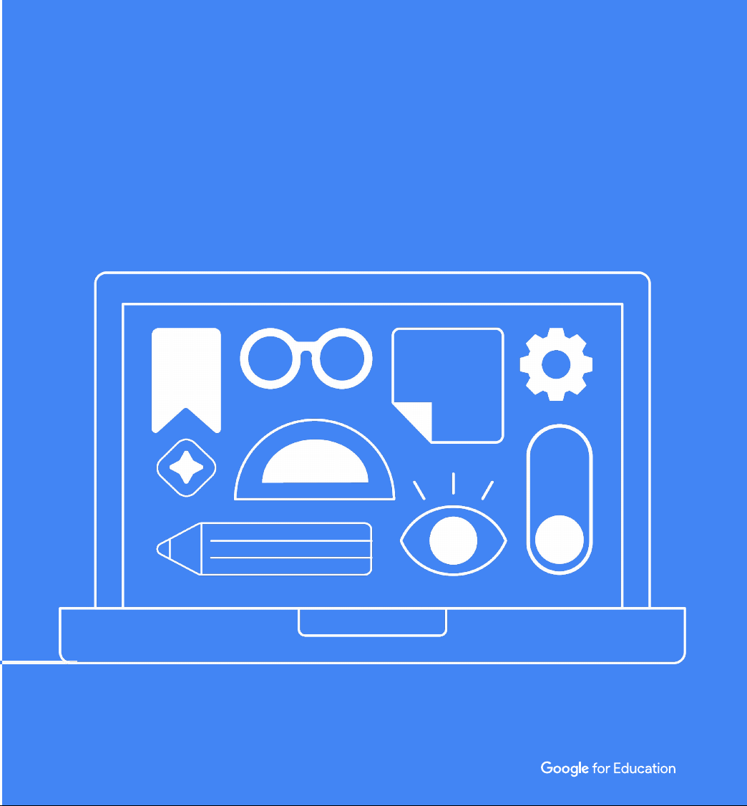

<svg viewBox="0 0 36 36"><circle cx="18" cy="18" r="18" fill="#1A73E8"/><path d="M11 18.4l4.8 4.8L25.4 13.4" fill="none" stroke="#fff" stroke-width="2.8" stroke-linecap="round" stroke-linejoin="round"/></svg>教育者向けガイド 千葉大学 仮訳版

Gemini の Google Classroom アプリ

クラスの文脈を Gemini に渡して、 時間のかかる作業を片づける。

本ガイドのプロンプトは、教育者との協働で作成されたものです。 本書は Google for Education の公開資料「Google Classroom app in Gemini: Guide for educators」を千葉大学が日本語に仮訳したものです（非公式訳）。

---

<!-- _class: nofoot -->

Gemini と Google Classroom をつなぐと、回答はもっと役に立つ

Gemini の <b>Classroom アプリ</b>を使うと、授業の文脈をふまえた新しいかたちで Gemini と協働できます。Gemini はプロンプトの内容から、Google Classroom の情報が関係するかどうかを判断し、それを回答に反映します。

<svg viewBox="0 0 36 36" width="36" height="36"><circle cx="18" cy="18" r="18" fill="#1A73E8"/><path d="M18 8.6a6.2 6.2 0 0 0-3.6 11.2c.7.5 1.1 1.3 1.1 2.1v.7h5v-.7c0-.8.4-1.6 1.1-2.1A6.2 6.2 0 0 0 18 8.6z" fill="#fff"/><rect x="15.5" y="24.1" width="5" height="1.9" rx=".95" fill="#fff"/></svg>
Gemini の Classroom アプリはエンタープライズ級のデータ保護を備えており、学校が発行したアカウントが必要です。管理者は Google 管理コンソールから、ユーザーごとに<u>アプリの有効・無効</u>を設定できます。

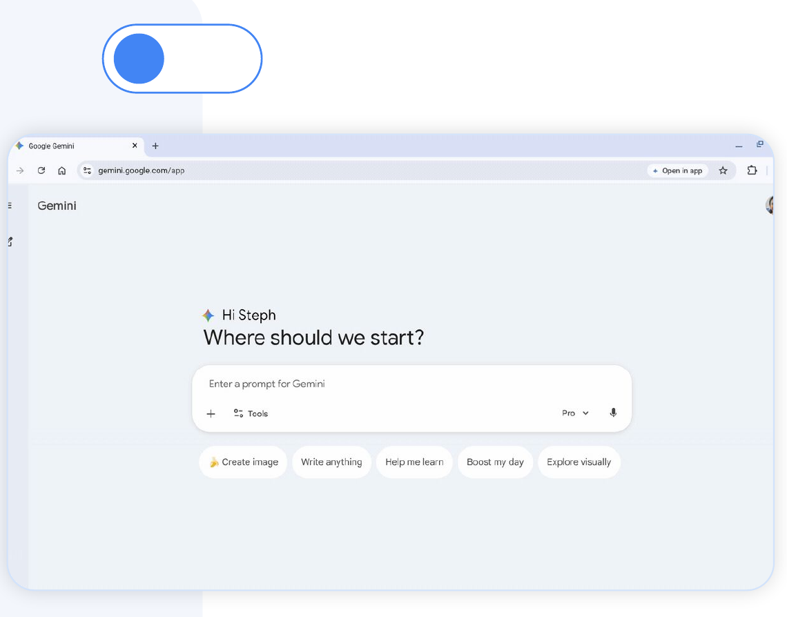

---

指導に集中し、時間を取り戻す

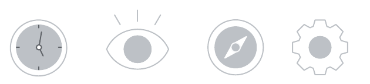

日々の業務を効率化する
<ul class="arrows" style="margin-top:20px"><li><b>気づきを得る</b>：Classroom の情報や成績などを、すばやく分析できます</li><li><b>うまくいったものを再利用する</b>：進行中とアーカイブ済みのクラスを横断して即座に検索し、Google ドライブ内の資料も見つけられます</li><li><b>作成を速くする</b>：Classroom への投稿を Gemini に下書きさせる。複数クラスへの投稿もまとめて作れます</li></ul>

Gemini の Classroom アプリは
<ul class="arrows" style="margin-top:20px"><li><b>投稿前に必ず確認が必要</b>です。自動で公開されることはありません</li><li>既存の Classroom 成績表の成績を<b>分析</b>します（Classroom アドオン提供元の成績は対象外）。点数を変更したり新たに付けたりせずに気づきを得られます</li><li>現時点では、チャットの中でテキストやアイデアを<b>生成</b>します。新しいドキュメントや添付ファイルの作成は行いません</li></ul>

<svg viewBox="0 0 36 36" width="36" height="36"><circle cx="18" cy="18" r="18" fill="#1A73E8"/><path d="M11 18.4l4.8 4.8L25.4 13.4" fill="none" stroke="#fff" stroke-width="2.8" stroke-linecap="round" stroke-linejoin="round"/></svg>
<b>安全に使う：</b>Gemini for Education はエンタープライズ級のデータ保護を備えており、完全に安全な環境で Classroom の文脈を利用できます。

---

<!-- _class: p4 -->

Gemini に頼めるプロンプトのアイデア

指導のための気づきを得る

「@Classroom、点数がいちばん低い課題とトピックはどれ？ 教え直しが必要な関連トピックをまとめて。」

課題をすばやく下書きする

「@Classroom、理科のクラス用に新しい課題を作って、ドライブにある『太陽系』という PDF を添付して。」

学習の進み方をまとめる

「@Classroom、今学期の［クラス名］のまとめを作って。次の手立てを考えたいので。」

過去の教材を探して再利用する

「@Classroom、アーカイブから、昨年『生物学101』で使った進化についてのレポート課題を探して。」

個に応じた指導を助ける

「@Classroom、前回の数学テストの結果をもとに、新しいプロジェクト用に3つのグループを作って。」

クラスに合った活動案をもらう

「@Classroom、課題の提出状況をもとに、『中2数学』のクラス向けに習熟度別の活動を3つ考えて。」

---

Gemini の Classroom アプリで、 プロのようにプロンプトを書くには

シンプル
理科で生徒がつまずいているのはどこ？
<b>「まあまあ」止まりの理由</b>漠然としすぎです。どのクラスのことか、どこまで遡るのか（昨日？ 1年分？）、成績の話か出席の話かが Gemini には分かりません。

よりよい
@Classroom、理科の生徒がつまずいているトピックは？
<b>より良い理由</b>正しいアプリ（<b>@Classroom</b>）を指定し、教科（「理科」）も示しています。ただし理科を複数クラス担当していると、データが混ざるおそれがあり、「つまずいている」も依然として漠然としています。

ベスト
@Classroom、<b>「理科・6限」のクラス</b>の直近3つの課題を分析して。生徒が取りこぼした概念を上位2つ挙げ、手を動かして復習できる活動を提案して。
<b>ベストな理由</b>Google Classroom の<b>どの文脈</b>を使うかを明示し、<b>クラスを特定</b>しています。<b>出力</b>（概念を2つ）も定義し、<b>次の一手</b>（復習活動の提案）まで求めているので、答えをそのまま使えます。

効果は 低い

効果は 高い

---

Classroom アプリでより良い結果を出すコツ

<b>Classroom へのプロンプトを磨く：</b>Classroom アプリは、あなたのデジタルな仕事場を Gemini がたどれるように、はっきりした「目印」を示したときに最も力を発揮します。次の工夫でリクエストを研ぎ澄ましましょう。

<table class="p6-table">
<tr><th></th><th>工夫</th><th>具体的な指示</th><th>良いプロンプトの例</th></tr>
<tr><td class="num">1</td><td class="st">具体的に書く</td><td>Classroom のどの部分から文脈を取るのかを、クラス名や課題名まで含めて正確に伝える。</td><td>「<b>4限 生物</b>のクラス、とくに<b>細胞のつくり小テスト</b>について、授業の進み具合をまとめて。」</td></tr>
<tr><td class="num">2</td><td class="st">道順をはっきり示す</td><td>年度やクラスの区分など、細かい情報を添えて、Gemini が正しい情報にたどり着けるようにする。</td><td>「<b>アーカイブ済みの2023年 生物</b>クラスから、<b>実験の安全ルール</b>の投稿を探して。」</td></tr>
<tr><td class="num">3</td><td class="st">Classroom の情報に絞る</td><td>Gemini が分析するのは Classroom の成績表の中の情報。サードパーティのアプリやアドオンには接続できない。</td><td>「直近3つの数学の課題について <b>Classroom の成績表の点数</b>を分析し、点数が最も低かった生徒を特定して。個別に面談を組めるように。」</td></tr>
<tr><td class="num">4</td><td class="st">形式を指定する</td><td>印刷したりオフラインで使ったりする教材では、デジタル前提の複雑な書式を避けるよう伝える。</td><td>「進化の単元の学習ガイドを作って。配って使いやすいように、<b>装飾のない標準的な文字</b>と<b>箇条書き</b>だけで。」</td></tr>
</table>

<svg viewBox="0 0 36 36" width="36" height="36"><circle cx="18" cy="18" r="18" fill="#1A73E8"/><path d="M18 8.6a6.2 6.2 0 0 0-3.6 11.2c.7.5 1.1 1.3 1.1 2.1v.7h5v-.7c0-.8.4-1.6 1.1-2.1A6.2 6.2 0 0 0 18 8.6z" fill="#fff"/><rect x="15.5" y="24.1" width="5" height="1.9" rx=".95" fill="#fff"/></svg>

プロのコツ：専門家はあなた

自分をナビゲーター役だと考えてください。経路を描くのはあなたです。「前のプロジェクトを探して」のように広すぎるプロンプトでは、Gemini は必要なものを的確に返せません。「アーカイブ済みの理科6年のクラスにある2024年の太陽系プロジェクト」のように<b>目印</b>を示すと、出力の質が上がります。

---

<!-- _class: nofoot -->

教育者は Gemini の Classroom アプリをどう使えるか

以下は、急な代講に備えて教員が Gemini を使う、という想定の例です。Classroom アプリを使うと、教員は次のことができます。

<ul class="dots p7-list">
<li><b>生徒の進み具合と理解の状況をつかむ：</b>最近の成績やトピックを分析し、支援が必要なところを特定する。</li>
<li><b>授業計画と教材を下書きする：</b>その気づきをもとに、いまのクラスの状況に合った代講プランと生徒用の教材をすばやく作る。</li>
<li><b>複数クラスへの投稿を下書きする：</b>複数の Classroom のクラスへ、指示や連絡をまとめて効率よく伝える。</li>
</ul>
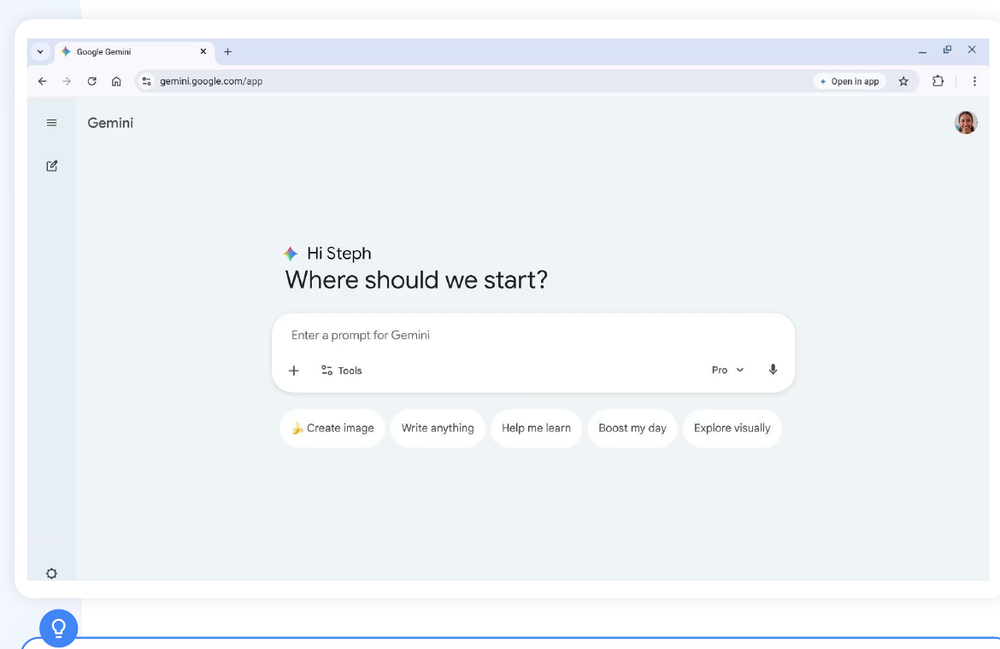

<svg viewBox="0 0 36 36" width="36" height="36"><circle cx="18" cy="18" r="18" fill="#1A73E8"/><path d="M18 8.6a6.2 6.2 0 0 0-3.6 11.2c.7.5 1.1 1.3 1.1 2.1v.7h5v-.7c0-.8.4-1.6 1.1-2.1A6.2 6.2 0 0 0 18 8.6z" fill="#fff"/><rect x="15.5" y="24.1" width="5" height="1.9" rx=".95" fill="#fff"/></svg>
Gemini の <b>Google Classroom アプリ</b>を使うと、自分の Google Classroom の文脈を参照できます。プロンプトに「@Classroom」と入れれば直接指示できますし、プロンプトに関係する場合は Gemini が自ら Classroom の情報を使うこともあります。Google Workspace for Education のアカウントでログインしていれば利用できます。

---

活用例

生徒の成績の傾向を分析する

@Classroom で理解の穴を見つける。

<b>プロンプトの読み解き方：</b>いちばん役立つ気づきを得るには、プロンプトを具体的に。次の型を使うと、Gemini が必要なものを正確に絞り込めます。
@Classroom、<b>理科（6限）</b>のクラスの<b>直近2つの課題</b>のうち、<b>成績の傾向</b>から見て<b>教え直す</b>べき概念を<b>上位3つ</b>挙げて。
<ul class="dots" style="font-size:13.5px;"><li><b>@Classroom：</b>アプリを指定すると、手作業でアップロードしなくても、自分のクラスの文脈に安全にアクセスできます。</li><li><b>上位3つ／直近2つの課題：</b>範囲を決めると、焦点の絞られた簡潔な分析が返ってきます。</li><li><b>理科（6限）：</b>クラスを特定すると、正しい成績表から情報を引いてきます。</li><li><b>教え直す／成績の傾向：</b>目的（理解の穴を見つけること）を書くと、代講プランにそのまま使える出力になります。</li></ul>

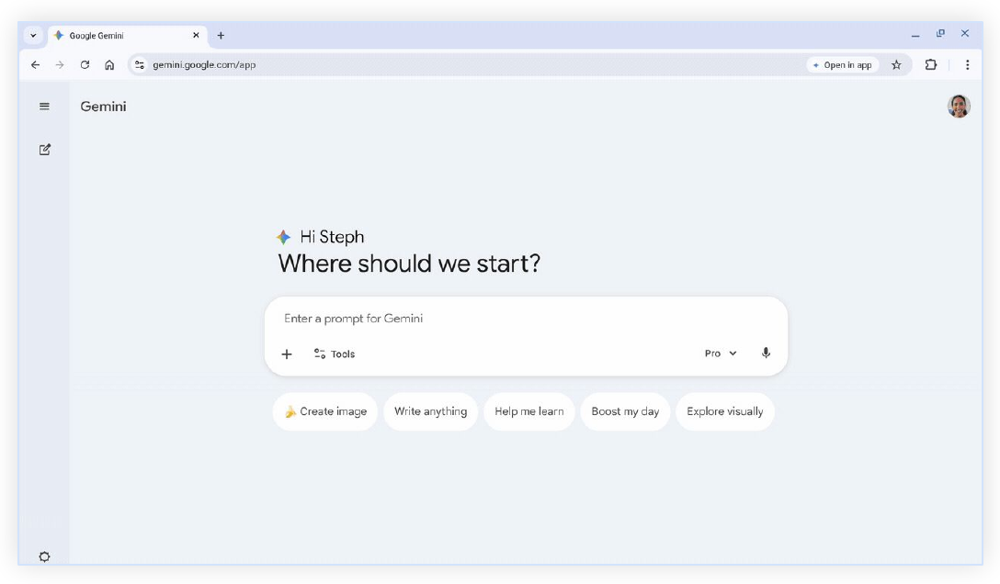

---

活用例

データに基づく代講プランを作る

Gemini の気づきをもとに授業教材を作る。

<b>代講プランを磨く：</b>Gemini が理解の穴を特定したら、そのデータをそのまま代講用の授業計画に変えられます。
<b>プロンプト例：</b>「いまの気づきをもとに、代講の先生向けに<b>60分の授業計画</b>を書いて。<b>5分のウォームアップ</b>、資源の希少性についての<b>印刷できる活動</b>、クラスに共有できる<b>まとめの投稿</b>を含めて。」
<ul class="dots" style="font-size:13.5px;"><li><b>やりとりして良くする：</b>Gemini は協働相手です。最初の下書きが違えば、対話を重ねて時間配分を調整したり、動画のリンクを足したりしましょう。</li><li><b>確認と検証：</b>代講の先生や生徒に渡す前に、内容が正しいか必ず確認を。Gemini は AI であり、間違えることがあります。</li><li><b>自分の必要に合わせる：</b>学級運営のコツから活動の手順まで、代講の先生に必要なものを具体的に指定しましょう。</li></ul>

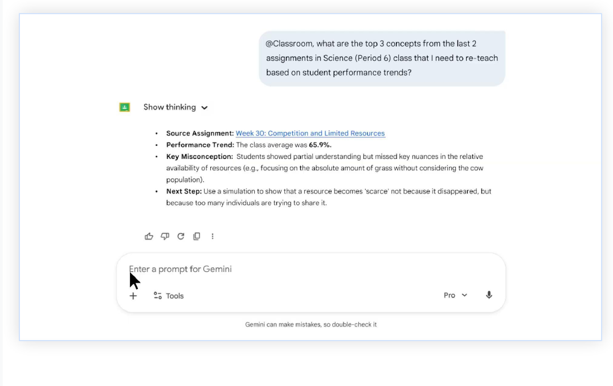

---

活用例

複数クラスへの連絡を下書きする

複数クラス向けの投稿づくりを手伝ってもらう。

<b>生徒に計画を伝える：</b>教材が整ったら、生徒への連絡も効率化できます。クラスごとに手で書く代わりに、すべてのクラスに向けた一貫した連絡をまとめて下書きできます。
<b>プロンプト例：</b>「<b>4限・5限・6限の理科</b>のクラス向けに、今日は不在であることを伝える <b>Classroom の連絡</b>を書いて。指示とシミュレーションのリンクは新しい課題を見るように伝えて。」
<ul class="dots" style="font-size:13.5px;"><li><b>クラスをまたいで速く書く：</b>複数クラスのストリーム投稿をまとめて作り、どの生徒にも同じ明確な指示が届くようにします。</li><li><b>下書きを確認する：</b>生成後は Google Classroom で下書きを開きます。最終的な確認・調整・添付の追加はあなたの手で。</li><li><b>準備ができたら投稿：</b>教室の主導権はあなたにあります。課題や連絡は、自分で投稿または予約したときにだけ生徒に見えます。</li></ul>

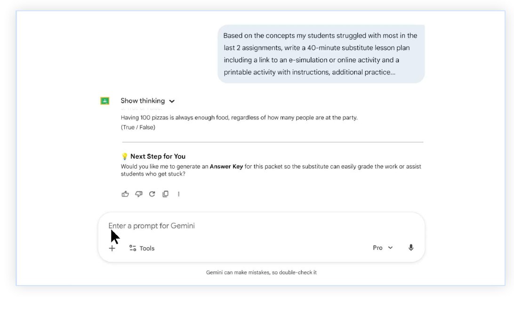

---

プロンプトのアイデア いま Gemini の @Classroom に頼めること

次のページからのプロンプトは、あなたと同じ教育者が実際に使っている例です。次のカテゴリに分けて掲載しています。

<ul class="arrows p11-list">
<li><u>授業設計と教材</u></li>
<li><u>気づき</u></li>
<li><u>事務作業</u></li>
<li><u>評価</u></li>
<li><u>個に応じた指導</u></li>
<li><u>効率化（探して再利用する）</u></li>
</ul>

💡 このプロンプトの使い方

<ul class="dots" style="margin-top:22px; font-size:16px;">
<li><b>［　］を自分用に置き換える：</b>［クラス名］や［課題名］などの角かっこは、実際のクラスの情報に置き換えてください。<b>具体性が鍵です。使ってほしい情報が Google Classroom のどこにあるのかを Gemini に伝えましょう。</b></li>
<li><b>どの学年・どの教科でも：</b>小学校でも、上級の物理でも、選択科目でも使えます。Gemini はあなたの内容に合わせます。</li>
<li><b>鍵はあなたの Google Classroom：</b>Gemini は Classroom の文脈（課題・成績・教材）をもとに出力を作ります。</li>
</ul>

---

授業設計と教材のアイデア

<svg viewBox="0 0 36 36"><path d="M18 5.5a8.4 8.4 0 0 0-4.9 15.2c1 .7 1.5 1.8 1.5 3v1h6.8v-1c0-1.2.5-2.3 1.5-3A8.4 8.4 0 0 0 18 5.5z" fill="#4285F4"/><rect x="14.6" y="26.6" width="6.8" height="2.6" rx="1.3" fill="#4285F4"/></svg>Pro tipGemini を「一緒に授業をつくる相手」だと考えましょう。ゼロから始めるのではなく、いま手元にある教材をもとに、新しい発問・授業の骨子・提示資料へまとめ直してもらうと動き出しやすくなります。

<table class="gtable"><colgroup><col class="c1"><col class="c2"><col class="c3"></colgroup>
<tr><th class="c1cell">こんなときに</th><th>教育者が実際に使ったプロンプト</th><th class="c3cell">コツ</th></tr>
<tr><td class="c1cell"><b>カリキュラムの発想出し</b>。新しいアイデアや意見がほしいとき。</td><td>@Classroom ［世界史］のクラスで出した課題を見て、仏教の単元で出す次の課題を提案してくれる？</td><td class="c3cell"><b>やりとりで仕上げる：</b>良い案が出たら「では、関係する全クラス向けにこの課題の指示文を作って」と続けましょう。</td></tr>
<tr><td class="c1cell"><b>対話型の授業</b>づくりと、生徒の関与を深めたいとき。</td><td>@Classroom 詩「Invictus」とその課題をもとに、話し合いの問いを3つ書いて。中学2年生の水準で、批判的思考を重視して。</td><td class="c3cell"><b>難度を指定する：</b>学年の水準や「批判的思考」といった目標を書くと、指導目標に沿った出力になります。</td></tr>
<tr><td class="c1cell"><b>データに基づく指導</b>。教科書の順番どおりではなく、いまの生徒の状況から学びの穴を見つけたいとき。</td><td>@Classroom ［中2 代数］のクラスで次に扱うべき最適なトピックを考えて。いまの課題・成績・教材から、どのトピックに重点を置くべきか教えて。</td><td class="c3cell"><b>地図を渡す：</b>Gemini は各自治体の試験内容までは知りません。必修の指導事項やトピックの一覧をプロンプトに貼れば、生徒の現状のデータと突き合わせてくれます。</td></tr>
<tr><td class="c1cell"><b>視覚資料</b>づくり。講義メモや教材を、体裁の整った提示資料に手早く変えたいとき。</td><td><em>Gemini で「Canvas」ツールを選んでおくこと：</em> @Classroom 3限 微生物学のクラスの教材をもとに、キムチの発酵過程についてのスライドを作って。</td><td class="c3cell"><b>Canvas で仕上げる：</b>生成できたらスライド作成ツールに移し、1枚ずつ手直しすれば、言いたいとおりになります。</td></tr>
<tr><td class="c1cell"><b>効率化</b>。授業計画をもとに、ドキュメント・スライド・スプレッドシートなど複数の形式をまとめて作りたいとき。</td><td><em>Gemini で「Canvas」ツールを選んでおくこと：</em> @Classroom 次回の［生態系］の授業の内容と目標を確認して、Google スライドの資料を作って。</td><td class="c3cell"><b>目標をそろえる：</b>「授業の内容と目標」と明示すると、一般論ではなく Classroom のカリキュラムから直接引いてきます。</td></tr>
<tr><td class="c1cell"><b>掲示物などの教室資料</b>。実際の課題の内容に基づかせたいとき。</td><td><em>Gemini で「画像を作成」ツールを選んでおくこと：</em> @Classroom ［実験の安全］に関する教材を見て、中心となる安全ルールを短く印象に残る言い回しにまとめて。その言葉で教室に貼るポスターを作って。</td><td class="c3cell"><b>デザインに合う形式で：</b>「短い文案を3通り」「各項目は10語以内で」と頼めば、ポスターや掲示のレイアウトにきれいに収まります。</td></tr>
</table>

---

気づきのアイデア

<svg viewBox="0 0 36 36"><path d="M18 5.5a8.4 8.4 0 0 0-4.9 15.2c1 .7 1.5 1.8 1.5 3v1h6.8v-1c0-1.2.5-2.3 1.5-3A8.4 8.4 0 0 0 18 5.5z" fill="#4285F4"/><rect x="14.6" y="26.6" width="6.8" height="2.6" rx="1.3" fill="#4285F4"/></svg>Pro tipGemini を「データ探偵」役に。生徒の関与のパターンをすぐに見つけたり、成績表に隠れている学びの穴を特定したりできます。

<table class="gtable gtable-green"><colgroup><col class="c1"><col class="c2"><col class="c3"></colgroup>
<tr><th class="c1cell">こんなときに</th><th>教育者が実際に使ったプロンプト</th><th class="c3cell">コツ</th></tr>
<tr><td class="c1cell"><b>締切翌日の声かけ</b>。連絡が必要な生徒を素早く見つけたいとき。</td><td>@Classroom ［上級国語］のクラスを見て、昨日［短編第2回］を提出しなかったのは誰か教えて。</td><td class="c3cell"><b>手作業の確認が減る：</b>未提出を探して成績表を一人ずつ開かなくて済みます。</td></tr>
<tr><td class="c1cell"><b>未完成の課題の評価</b>。空のままの提出を早く見つけたいとき。</td><td>@Classroom ［イタリア語1］と［イタリア語1 発展］のクラスで出した Google スプレッドシートの課題について、空のまま提出した生徒や未提出の生徒はいる？</td><td class="c3cell"><b>中身まで見る：</b>「提出済み」の先まで見て、本当に中身があるのか空のファイルなのかを教えてくれます。</td></tr>
<tr><td class="c1cell"><b>学期を通したデータ収集</b>。遅れている生徒を把握したいとき。</td><td>@Classroom ［1限］のクラスで、1月1日以降の課題が未提出の生徒は何人？ さらに、各生徒が何件未提出かも教えて。</td><td class="c3cell"><b>条件を明確に：</b>指定した期間より前の未提出も含めたいときは、対象の締切日を具体的に伝えましょう。</td></tr>
</table>

---

事務作業のアイデア

<svg viewBox="0 0 36 36"><path d="M18 5.5a8.4 8.4 0 0 0-4.9 15.2c1 .7 1.5 1.8 1.5 3v1h6.8v-1c0-1.2.5-2.3 1.5-3A8.4 8.4 0 0 0 18 5.5z" fill="#4285F4"/><rect x="14.6" y="26.6" width="6.8" height="2.6" rx="1.3" fill="#4285F4"/></svg>Pro tip未提出の追跡や、全クラス分の週間予定づくりといった重い作業は Gemini に任せ、空き時間はいちばん大事なことに使いましょう。

<table class="gtable gtable-red"><colgroup><col class="c1"><col class="c2"><col class="c3"></colgroup>
<tr><th class="c1cell">こんなときに</th><th>教育者が実際に使ったプロンプト</th><th class="c3cell">コツ</th></tr>
<tr><td class="c1cell"><b>学級運営</b>と生徒の進捗を見たいとき。</td><td>@Classroom 担当クラス全体で、提出遅れの割合は何％？</td><td class="c3cell"><b>全体像をつかむ：</b>全クラスの関与の状況を一度に概観できます。</td></tr>
<tr><td class="c1cell"><b>進捗の報告</b>と、クラス全体の関与の把握。</td><td>@Classroom ［小6 音楽］のクラスの今月の課題の達成状況はどう？</td><td class="c3cell"><b>月ごとの点検：</b>特定の評価期間や月単位で進捗を追うのに向いています。</td></tr>
<tr><td class="c1cell"><b>早期の手立て</b>。出席や接続につまずいている生徒に。</td><td>@Classroom 先週、担当クラスで活動がなかった生徒は何人？</td><td class="c3cell"><b>離脱を見つける：</b>ログインも Classroom での操作もなかった生徒が分かります。</td></tr>
<tr><td class="c1cell"><b>準備時間の負担軽減</b>。データ集めよりフィードバックに時間を使うために。</td><td>@Classroom ［12月15日〜19日］の週について、全クラスで［今日の問い］を終えていない生徒と、どの日に終えていないかを示して。</td><td class="c3cell"><b>まとめて処理：</b>6クラスを個別に見る代わりに、1週間分をまとめて要約できます。</td></tr>
<tr><td class="c1cell"><b>週ごとの連絡</b>。締切を共有して足並みをそろえる。</td><td>@Classroom 今週予定されている課題をもとに、［2限 化学］のクラスの週間予定を作って。</td><td class="c3cell"><b>形式を指定する：</b>「表にして」「箇条書きで」と伝えれば、そのままクラスの連絡に貼れます。</td></tr>
</table>

---

評価・進捗確認のアイデア

<svg viewBox="0 0 36 36"><path d="M18 5.5a8.4 8.4 0 0 0-4.9 15.2c1 .7 1.5 1.8 1.5 3v1h6.8v-1c0-1.2.5-2.3 1.5-3A8.4 8.4 0 0 0 18 5.5z" fill="#4285F4"/><rect x="14.6" y="26.6" width="6.8" height="2.6" rx="1.3" fill="#4285F4"/></svg>Pro tip未採点の山を俯瞰したり、全員を同じ基準で見るためのルーブリックやフィードバックの型を作ったりできます。

<table class="gtable gtable-yellow"><colgroup><col class="c1"><col class="c2"><col class="c3"></colgroup>
<tr><th class="c1cell">こんなときに</th><th>教育者が実際に使ったプロンプト</th><th class="c3cell">コツ</th></tr>
<tr><td class="c1cell"><b>客観的な評価</b>。取りかかる前に、期待することを明確に示したいとき。</td><td>@Classroom ［中3 フランス語］のクラスの［Bilan de lecture: Chapitre 1］の課題向けにルーブリックを作って。</td><td class="c3cell"><b>観点を決める：</b>「語彙の使い方」「文法の正確さ」「内容の理解」など評価したい観点と、配点の尺度（例：1〜4）を指定すると、より自分に合ったものになります。</td></tr>
<tr><td class="c1cell"><b>時間の使い方</b>。どの山から採点するか決めたいとき。</td><td>@Classroom ［理科1限］［理科4限］［理科5限］の採点の優先順位を決めて。未採点の課題を古い順に一覧にして。</td><td class="c3cell"><b>採点の優先度：</b>全クラスのうち、どこに未採点がいちばん溜まっているかが分かります。</td></tr>
<tr><td class="c1cell"><b>評価の点検</b>。クラス全体の出来が想定とどう違うかを見たいとき。</td><td>@Classroom ［上皿てんびんの練習］の課題の平均点を、クラスごとに教えて。</td><td class="c3cell"><b>傾向をつかむ：</b>平均が思いのほか低ければ、教え直しの活動を提案してもらいましょう。</td></tr>
<tr><td class="c1cell"><b>フィードバックの循環</b>。結果を待たせたままの生徒をなくす。</td><td>@Classroom ［1限 スペイン語2］のクラスの課題を確認して、まだ生徒に返却していない課題を教えて。</td><td class="c3cell"><b>やりとりを閉じる：</b>採点したのに「返却」を忘れている課題を見つけられます。</td></tr>
<tr><td class="c1cell"><b>準備時間の効率化</b>。やることの全体像を数秒で。</td><td>@Classroom ［レオポルド先生の算数スターズ］の未採点・未返却の課題をすべて挙げて。</td><td class="c3cell"><b>整理：</b>そのクラスで対応が必要なものだけが、すっきり一覧になります。</td></tr>
</table>

---

個に応じた指導のアイデア

<svg viewBox="0 0 36 36"><path d="M18 5.5a8.4 8.4 0 0 0-4.9 15.2c1 .7 1.5 1.8 1.5 3v1h6.8v-1c0-1.2.5-2.3 1.5-3A8.4 8.4 0 0 0 18 5.5z" fill="#4285F4"/><rect x="14.6" y="26.6" width="6.8" height="2.6" rx="1.3" fill="#4285F4"/></svg>Pro tip1つの課題を、読みの水準を変える・指示を翻訳する・足場かけの手順を足すなど、複数の版にすぐ作り替えられます。

<table class="gtable"><colgroup><col class="c1"><col class="c2"><col class="c3"></colgroup>
<tr><th class="c1cell">こんなときに</th><th>教育者が実際に使ったプロンプト</th><th class="c3cell">コツ</th></tr>
<tr><td class="c1cell"><b>公平とアクセス</b>。家庭の機器が限られている生徒などに。</td><td>@Classroom ［ジャーナリズム］でこの2週間に出した課題を見て、長期欠席の生徒向けの学習計画を作って。パソコンなしでできる、印刷可能な活動にして。</td><td class="c3cell"><b>制約を明示する：</b>機器が使えない場合は「パソコン不要」と明示すれば、リンクや動画、オンラインフォームを避けてくれます。</td></tr>
<tr><td class="c1cell"><b>足場かけ</b>。多様な学習ニーズや、その言語を学習中の生徒に。</td><td>@Classroom 読解の支援が必要で、インターネットが使えない生徒向けに［課題名］を作り替えて。重要な概念を3つの短い箇条書きにまとめ、単元でいちばん難しい語5つの意味を添えた語彙集を作り、最後の活動用に穴埋めのワークシートを作って。</td><td class="c3cell"><b>オフライン用の形式を指定：</b>印刷するなら「文字だけの版で」と頼むと、複雑なレイアウトを写したときの崩れを防げます。</td></tr>
<tr><td class="c1cell"><b>学びのユニバーサルデザイン（UDL）</b>。得意に応じて表現の方法を複数用意する。</td><td>@Classroom ［3限 理科］のクラスの［水の循環］の教材をもとに、理解を示す方法を3通り作って。書く・図で示す・話して発表する、の3つで。</td><td class="c3cell"><b>ルーブリックをそろえる：</b>3案が出たら「3つを公平に評価できる共通のルーブリックを作って」と頼むと、評価の準備が省けます。</td></tr>
<tr><td class="c1cell"><b>発展</b>。基礎を身につけた生徒に手応えを与え続ける。</td><td>@Classroom ［代数1］のクラスで［一次方程式］の課題を高得点で終えた生徒向けに、この概念を［家計や工学］に応用する実世界の発展活動を提案して。</td><td class="c3cell"><b>実社会につなぐ：</b>「この概念を日常的に使う職業の説明を短く添えて」と頼むと、興味を引き出せます。</td></tr>
<tr><td class="c1cell"><b>実行機能の支援</b>。複雑な課題を「できそう」に見せる。</td><td>@Classroom ［説得的な作文の下書き］の課題を見て、複雑な指示が苦手な生徒向けに、指示を［5］つの番号付きの手順に分けて。</td><td class="c3cell"><b>視覚の手がかり：</b>「各手順に絵文字を1つ付けて」と頼むと、文字だけの指示より手がかりが増えます。</td></tr>
<tr><td class="c1cell"><b>難しい文章の足場かけ</b>。学年の水準より読みが難しい生徒や、硬い学術語が苦手な生徒に。</td><td>@Classroom ［産業革命の概観］の課題に添付された文章を見つけて、重要な史実はすべて残したまま、［小5］の読解水準に書き直して。</td><td class="c3cell"><b>根拠を確かめる：</b>「原文から残した事実を太字にして」と頼めば、易しくした版でも学習目標を満たしているか素早く確認できます。</td></tr>
</table>

---

効率化のアイデア （探して再利用する）

<svg viewBox="0 0 36 36"><path d="M18 5.5a8.4 8.4 0 0 0-4.9 15.2c1 .7 1.5 1.8 1.5 3v1h6.8v-1c0-1.2.5-2.3 1.5-3A8.4 8.4 0 0 0 18 5.5z" fill="#4285F4"/><rect x="14.6" y="26.6" width="6.8" height="2.6" rx="1.3" fill="#4285F4"/></svg>Pro tipアーカイブ済みのクラスから教材を探し、いまのクラスへそのまま移せます。新年度の準備やカリキュラムの点検で、手作業の検索と再アップロードが要らなくなります。

<table class="gtable gtable-yellow"><colgroup><col class="c1"><col class="c2"><col class="c3"></colgroup>
<tr><th class="c1cell">こんなときに</th><th>教育者が実際に使ったプロンプト</th><th class="c3cell">コツ</th></tr>
<tr><td class="c1cell"><b>進度と暦の計画</b>。過去に単元へ実際どれだけかかったかをもとに。</td><td>@Classroom 昨年度のアーカイブ済み［理科2限］のクラスで、［第2単元 光合成］の指導にどれくらいかかった？</td><td class="c3cell"><b>日付を確認：</b>アーカイブ済みの課題に「締切日」や「予定日」が設定されているか確認を。Gemini はその日時から期間を計算します。</td></tr>
<tr><td class="c1cell"><b>カリキュラムの点検</b>。うまくいった年の大事な活動を落としていないか。</td><td>@Classroom 現在の［4限］のクラスとアーカイブ済みの［4限］のクラスを比べて、違いを挙げて。</td><td class="c3cell"><b>抜けを見つける：</b>「なくなった課題」「新しい教材」を特に探すよう頼むと、カリキュラムの変化が見えます。</td></tr>
<tr><td class="c1cell"><b>教材の掘り出し</b>。何年分ものアーカイブを手でたどらずに。</td><td>@Classroom アーカイブ済みの［世界史］のクラスで使った古い課題を探してくれる？ ［「作文課題 ― 仏教」］のようなもので、題名に［マインドフルネス］が入っているかもしれない。昨年度の［世界史］のクラスで出したもの。</td><td class="c3cell"><b>手がかりの語を使う：</b>正確な題名を思い出せなくても、含まれていそうな語（例では「マインドフルネス」「仏教」）を入れると絞り込めます。</td></tr>
<tr><td class="c1cell"><b>年度をまたいだ移行</b>。うまくいった授業・活動・メモを引き継ぐ。</td><td>@Classroom アーカイブ済みの［3限 数学］のクラスから［7.4 の活動］とメモを探して、現在の［数学7］のクラスに下書きとして保存して。</td><td class="c3cell"><b>名前を正確に：</b>アーカイブ元のクラス名と移し先のクラス名を正確に書けば、正しい場所に下書きが作られます。</td></tr>
</table>

---

<!-- _class: p18 -->

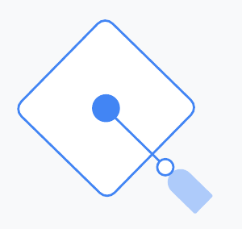

AI の力をさらに伸ばす

---

<!-- _class: p19 -->

役立つ資料で 学び続ける

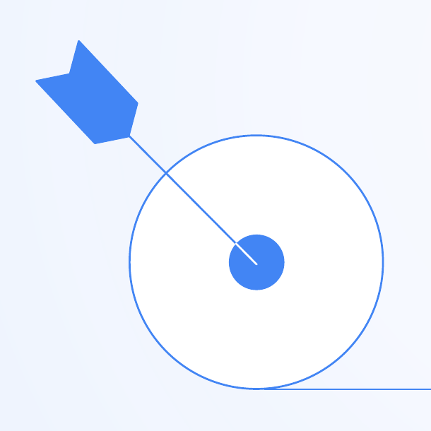

初等中等教育で Gemini を使う 100 以上の方法

世界中の教育者との協働で作られたガイドです。<b>Gemini for Education、Gemini Notebook、Classroom の Gemini</b> といった Google の AI ツールを、初等中等教育の教職員と管理者が使い始められるように作られています。

<u>ユーザーガイド</u> &nbsp;→

AI リテラシーの資料

無償で使えるガイド・講座・認定・学習資料をご覧ください。

<u>ユーザーガイド</u> &nbsp;→

---

<!-- _class: nofoot -->

はじめよう

無償で使えるガイド・講座・認定・学習資料をご覧ください。

<u>goo.gle/genai-resources</u> &nbsp;→

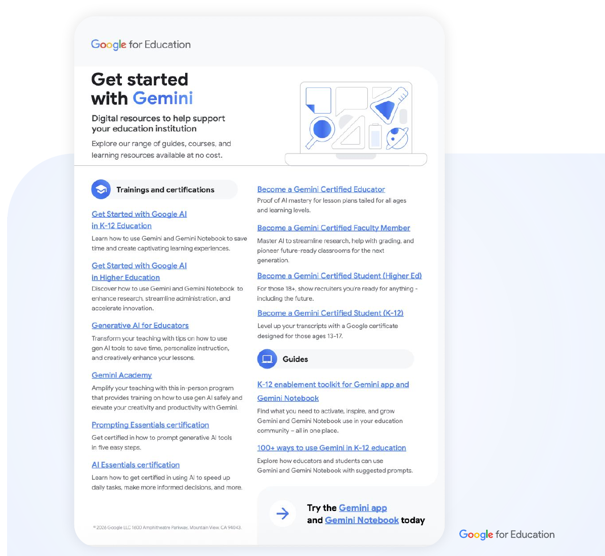

---

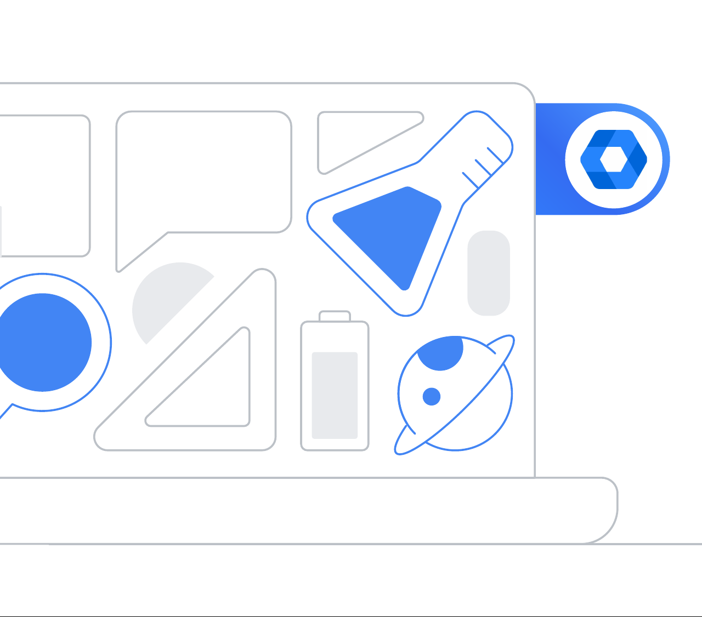

管理者は管理コンソールで、Gemini アプリと Gemini Notebook のアクセスを管理できます

管理コンソールで、生徒・教職員に対する <u>Gemini アプリ</u>と <u>Gemini Notebook</u> のアクセスを管理できます。

