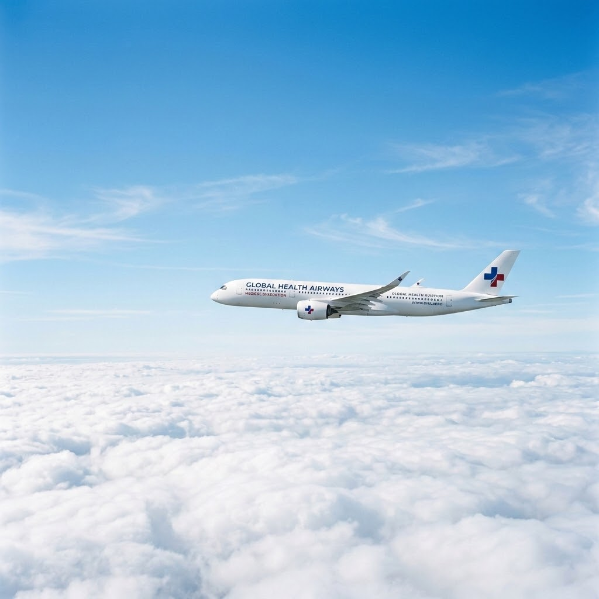
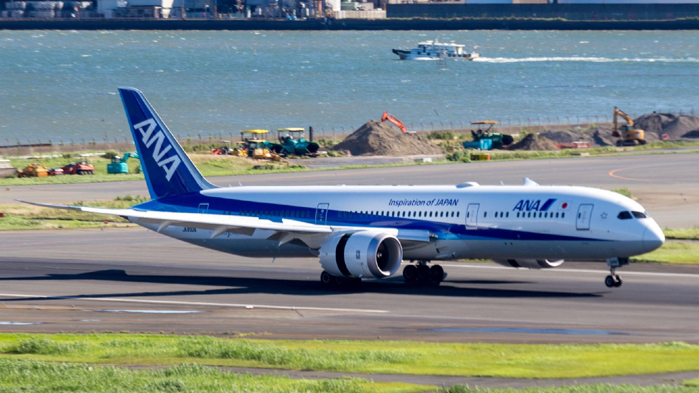

<!-- _class: cover-hero -->

Boeing Externship 2026 — Final Pitch

AeroMedLink

When someone falls ill at 10,000 metres, the story should only have to be told once.

Team AeroMedLink

Chiba University　|　7 September 2026

<!--
Good morning. We are Team AeroMedLink from Chiba University.
Today we want to tell you how we got to our idea — starting from one thing we kept hearing.
-->

---

<!-- _class: vcenter -->

Where we started

## We did not start from a device. We started from a voice.

“The doctor asked me for her blood pressure. All I could give them was how she looked.”

A cabin crew member, describing an in-flight emergency (illustrative scene)

Nobody could say a number. So everybody talked instead.

<!--
When we interviewed and read about in-flight emergencies, we expected to hear
"we need better medical devices". That is not what came back.
What came back was much simpler: it is very hard to explain a patient over a radio.
That sentence became our starting point.
-->

---

<!-- _class: vcenter -->

Today

## The people are connected. The information is not.

<svg viewBox="0 0 1160 316" aria-label="Today: the medical information never leaves the cabin">
<g fill="none" stroke="#D6D6D6" stroke-width="1.5" stroke-dasharray="7 6">
<rect x="0" y="34" width="520" height="264" rx="3"/>
<rect x="640" y="34" width="520" height="264" rx="3"/>
</g>
<text x="4" y="22" font-size="19" font-weight="700" fill="#6E6E6E">IN THE AIRCRAFT</text>
<text x="644" y="22" font-size="19" font-weight="700" fill="#6E6E6E">ON THE GROUND</text>
<rect x="22" y="58" width="476" height="72" rx="3" fill="#F1F1F1"/>
<text x="42" y="88" font-size="21" font-weight="700" fill="#262626">SpO₂ ?　·　pulse ?　·　BP ?</text>
<text x="42" y="114" font-size="19" fill="#6E6E6E">what the doctor asks for first</text>
<path d="M498 94 L566 94" stroke="#B45309" stroke-width="2" stroke-dasharray="6 5" fill="none"/>
<path d="M574 82 l22 24 M596 82 l-22 24" stroke="#B45309" stroke-width="3.5" stroke-linecap="round"/>
<text x="612" y="101" font-size="19" fill="#B45309">no reliable number ever reaches them</text>
<g fill="#ffffff" stroke="#D6D6D6" stroke-width="1.5">
<rect x="22" y="176" width="140" height="76" rx="3"/>
<rect x="190" y="176" width="140" height="76" rx="3"/>
<rect x="358" y="176" width="140" height="76" rx="3"/>
<rect x="676" y="176" width="200" height="76" rx="3"/>
<rect x="920" y="176" width="200" height="76" rx="3"/>
</g>
<g text-anchor="middle" font-size="19" fill="#6E6E6E">
<text x="92" y="204">Crew</text>
<text x="260" y="204">Purser</text>
<text x="428" y="204">Captain</text>
<text x="776" y="204">Doctor</text>
<text x="1020" y="204">Ambulance</text>
</g>
<g text-anchor="middle" font-size="25" font-weight="700" fill="#262626">
<text x="92" y="234">sees</text>
<text x="260" y="234">hears</text>
<text x="428" y="234">relays</text>
<text x="776" y="234">imagines</text>
<text x="1020" y="234">re-asks</text>
</g>
<g stroke="#B0B0B0" stroke-width="2" stroke-dasharray="5 5" fill="none">
<path d="M162 214 L180 214"/>
<path d="M330 214 L348 214"/>
<path d="M498 214 L666 214"/>
<path d="M876 214 L910 214"/>
</g>
<g fill="#B0B0B0">
<path d="M180 208 l10 6 l-10 6 z"/>
<path d="M348 208 l10 6 l-10 6 z"/>
<path d="M666 208 l10 6 l-10 6 z"/>
<path d="M910 208 l10 6 l-10 6 z"/>
</g>
<text x="582" y="204" text-anchor="middle" font-size="19" fill="#6E6E6E">voice only</text>
<g text-anchor="middle" font-size="18" fill="#6E6E6E">
<text x="171" y="278">words</text>
<text x="339" y="278">words</text>
<text x="893" y="278">words</text>
</g>
</svg>

The same story, told four times — and thinner every time.

<!--
This is how ground-based medical support works today. Most airlines pay a third party for it,
and it has saved many lives. But the link is audio only. The doctor cannot see the patient,
receives no digital vital signs, and hears everything through the cabin crew.
-->

---

<!-- _class: vcenter -->

Already on board

## The aircraft is not empty. It already carries almost everything.

- **An emergency medical kit.** Blood-pressure cuff, stethoscope, eleven medicines.
- **A defibrillator.** Required on US airliners with cabin crew.
- **A satellite link.** Already installed. Already selling internet.

Everything is already on board. Nothing is connected.

US requirement: 14 CFR §121.803 and Appendix A to Part 121 (first-aid kits, emergency medical kit, AED).

<!--
This surprised us. We assumed the aircraft was empty, and it is not.
Every large airliner carries a medical kit, a defibrillator, and a satellite connection.
The medicine is already up there. The doctor who knows how to use it is on the ground,
and the only thing joining them is a voice call.
-->

---

<!-- _class: message -->

# So we asked one question: what if the information was connected too?

<!--
Not a hospital in the sky. Not an AI that replaces doctors.
Just this: give the ground doctor the same evidence the cabin crew has.
-->

---

<!-- _class: vcenter -->

Our answer

## The whole cabin and the doctor outside meet on one record

<svg viewBox="0 0 1160 330" aria-label="AeroMedLink: the whole cabin and the doctor on the ground meet on one record">
<g fill="none" stroke="#0033A0" stroke-width="1.5" stroke-dasharray="7 6" opacity=".55">
<rect x="0" y="34" width="392" height="284" rx="3"/>
<rect x="768" y="34" width="392" height="284" rx="3"/>
</g>
<text x="4" y="22" font-size="19" font-weight="700" fill="#6E6E6E">IN THE AIRCRAFT</text>
<text x="772" y="22" font-size="19" font-weight="700" fill="#6E6E6E">ON THE GROUND</text>
<g stroke="#0033A0" stroke-width="2.5" fill="none">
<path d="M366 92 L420 156"/>
<path d="M366 176 L420 176"/>
<path d="M366 260 L420 196"/>
<path d="M740 156 L794 108"/>
<path d="M740 196 L794 244"/>
</g>
<rect x="420" y="118" width="320" height="116" rx="3" fill="#E7EDF7" stroke="#0033A0" stroke-width="2.5"/>
<text x="580" y="150" text-anchor="middle" font-size="22" font-weight="700" fill="#0033A0">One shared record</text>
<text x="580" y="178" text-anchor="middle" font-size="18" font-weight="700" fill="#262626">SpO₂ 96 · pulse 82 · BP 128/76</text>
<text x="580" y="202" text-anchor="middle" font-size="19" fill="#262626">+ what the crew saw</text>
<text x="580" y="226" text-anchor="middle" font-size="18" fill="#6E6E6E">updating live</text>
<text x="580" y="268" text-anchor="middle" font-size="19" font-weight="700" fill="#0033A0">everything meets here</text>
<g fill="#ffffff" stroke="#0033A0" stroke-width="1.5">
<rect x="22" y="58" width="344" height="68" rx="3"/>
<rect x="22" y="142" width="344" height="68" rx="3"/>
<rect x="22" y="226" width="344" height="68" rx="3"/>
<rect x="794" y="74" width="344" height="68" rx="3"/>
<rect x="794" y="210" width="344" height="68" rx="3"/>
</g>
<g text-anchor="middle" font-size="23" font-weight="700" fill="#262626">
<text x="194" y="88">Cabin crew</text>
<text x="194" y="172">Purser</text>
<text x="194" y="256">Captain</text>
<text x="966" y="104">Ground physician</text>
<text x="966" y="240">Ambulance</text>
</g>
<g text-anchor="middle" font-size="18" fill="#6E6E6E">
<text x="194" y="112">enters it once</text>
<text x="194" y="196">sees it, does not relay it</text>
<text x="194" y="280">decides with the same page</text>
<text x="966" y="128">reads and recommends</text>
<text x="966" y="264">has it before the aircraft lands</text>
</g>
</svg>

Told once. Connected to everyone. Still decided by the same people.

<!--
AeroMedLink is one portable kit per aircraft: simple certified sensors, a data link,
and a guided workflow on screen. The crew measures, the aircraft sends, the doctor reviews.
We are not inventing new medicine. We are removing the guesswork from the conversation.
-->

---

<!-- _class: vcenter -->

In the cabin

## Four steps the crew can follow under pressure

1 PrepareOptional passenger profile

2 MeasureOxygen, pulse, blood pressure

3 ConsultDoctor sees the same page

4 Hand overCaptain decides. Record goes to EMS.

The crew tell it once, then go back to the patient.

<!--
Step one is optional and happens before the flight. Steps two to four take minutes.
The screen guides the crew through each measurement, so they do not have to remember a protocol.
And when the aircraft does land, the same record is already with the ambulance team.
-->

---

<!-- _class: vcenter -->

Two calls

## The same system prevents one landing and speeds up another

### Case A — stable

Shortness of breath during cruise. Oxygen 96–97%, pulse settles, symptoms improve.

**“Stable — continue and monitor.”**

The flight reaches its destination.

### Case B — urgent

Chest pain that does not stop, blood pressure falling.

**“Urgent ground evaluation.”**

The record arrives before the patient does.

Fewer diversions we did not need. Faster ones when we do.

<!--
These two cases show why we do not measure success only in money saved.
Case A avoids an unnecessary landing. Case B makes a necessary landing faster and safer,
because the hospital already has the data. Both come from the same kit.
-->

---

<!-- _class: vcenter -->

How often

## A small chance, repeated four billion times a year

1 in 600 flights

has a medical emergency on board.

1 in 22

of those emergencies ends in a diversion.

200 a day

worldwide — about 2 a day at Haneda alone.

Rare for one passenger. Routine for the industry.

Christian M. G. et al. (2018); D. N. I. (2021); Peterson D. C. et al. (2013)

<!--
Studies report one emergency for every 600 flights, that is one for every 55,000 passengers,
and a diversion in about 4.4% of them — one in 22.
Haneda handles 1,200 flights a day, so about two emergencies every day,
and one diversion caused by illness every eleven days.
Worldwide, four billion passengers means about 200 emergencies every day.
-->

---

<!-- _class: vcenter -->

What it costs

## One diversion costs an airline up to $900,000

Cost of one diversion15k–900kUSD

Diversions for illness, worldwide9a day

Upper estimate of daily cost7.8M USD

Fuel, landing fees, crew hours, hotels, passenger compensation.

At that rate: a new 787 burned every 42 days.

Some of these landings were avoidable. Connected information is how we tell.

<!--
Fuel, maintenance, hotels, compensation: one diversion costs between fifteen thousand
and nine hundred thousand dollars. At nine diversions a day, that is up to 7.8 million
dollars every day — roughly a brand new 787 every 42 days.
The point is not that diversions are bad. The point is that some of them are made
without enough information.
-->

---

<!-- _class: vcenter -->

Feasibility

## Nothing here has to be invented

- **The parts exist.** Certified sensors, off the shelf. We assemble; we do not invent.
- **The link is flying.** Our data is tiny next to passenger video.
- **The market pays.** Airlines already buy ground medical support.

Using proven parts is what keeps the risk — and the certification — manageable.

<!--
Feasibility was the question we were asked most often, so we answer it in three parts:
technology, connectivity, and business. In every one of them, the thing we need already exists.
Our contribution is the integration and the workflow.
-->

---

<!-- _class: vcenter -->

Hard questions

## The three problems we could not ignore

| The problem | Our answer |
|---|---|
| A doctor cannot diagnose across every border. | The doctor **advises**. The captain and the local team decide. |
| Cabin crew are not medical staff. | **Guided steps on screen**, simple sensors, standard training. |
| Devices need approval — medical and aviation. | Use **certified devices**. Start in Japan, then expand. |

Defining the roles clearly is what removes most of the legal barrier.

<!--
We are not going to pretend these are solved. But each one has a realistic path.
The most important is the first: we are not asking a doctor to practise medicine
in another country's airspace. We are asking them to advise the people who already have authority.
-->

---

<!-- _class: vcenter -->

Value

## It takes work off everyone in the chain

- **The crew stop guessing.** They read a number instead of finding the words.
- **The doctor stops interviewing.** The numbers are already there when the call starts.
- **The captain stops deciding blind.** Same authority, better evidence.

Less work for everyone — and the passenger is helped sooner.

<!--
Usually safety costs money. Here, better information improves both at once:
the passenger is treated on better evidence, and the airline stops diverting when it does not need to.
-->

---

<!-- _class: vcenter -->

Why Boeing

## Boeing is the one company that can put this in the aircraft

- **Lead connected aviation.** The link is already there. This is what it is for.
- **Raise the value of the fleet.** A ready-to-fit option for the 787 and 777X.
- **Give airlines a reason to choose Boeing.** Fewer diversions is a number they can bank.

Boeing does not have to build a medical company. It has to open the door.

<!--
Airlines can buy medical services from anyone. What they cannot do is design the aircraft.
Boeing can make the aircraft ready for this — and that is the part nobody else can do.
-->

---

<!-- _class: message -->

# From isolated emergencies to connected care.

<!--
Thank you for listening. We are happy to take your questions.
-->
