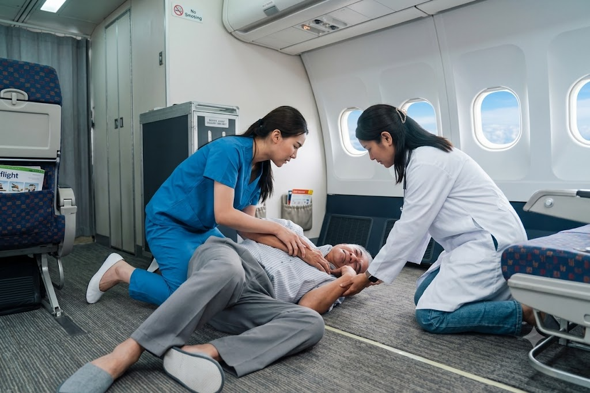

<!-- _class: cover-hero -->

Boeing Externship 2026 — Final Pitchボーイング・エクスターンシップ 2026　最終発表

AeroMedLink

When someone falls ill at 10,000 metres, the story should only have to be told once.上空で人が倒れたとき、同じ話を何度も伝え直さずに済むようにする。

Team AeroMedLink

Chiba University　|　7 September 2026

<!--
Good morning. We are Team AeroMedLink from Chiba University.
-->

---

<!-- _class: vcenter -->

Where we started

## We did not start from a device. We started from a voice.

機材からではなく、現場の声から始めました。

“The doctor asked me for her blood pressure. All I could give them was how she looked.”「医師に血圧を聞かれました。でも私が渡せたのは、患者さんの見た目の様子だけでした。」

A cabin crew member, describing an in-flight emergency (illustrative scene)客室乗務員の語り（機内急病の場面／例示）

Nobody could say a number. So everybody talked instead.誰も数値を言えない。だから、みんなが言葉で話し続ける。

<!--
We expected to hear "we need better medical devices". That is not what came back.
-->

---

<!-- _class: vcenter -->

Today

## The people are connected. The information is not.

人はつながっている。情報がつながっていない。

<svg viewBox="0 0 1160 348" aria-label="Today: no reliable number reaches the doctor">
<g fill="none" stroke="#D6D6D6" stroke-width="1.5" stroke-dasharray="7 6">
<rect x="0" y="34" width="520" height="296" rx="3"/>
<rect x="640" y="34" width="520" height="296" rx="3"/>
</g>
<text x="4" y="22" font-size="19" font-weight="700" fill="#6E6E6E">IN THE AIRCRAFT ／ 機内</text>
<text x="644" y="22" font-size="19" font-weight="700" fill="#6E6E6E">ON THE GROUND ／ 地上</text>
<rect x="22" y="56" width="476" height="98" rx="3" fill="#F1F1F1"/>
<text x="42" y="88" font-size="21" font-weight="700" fill="#262626">SpO₂ ?　·　pulse ?　·　BP ?</text>
<text x="42" y="114" font-size="19" fill="#6E6E6E">what the doctor asks for first</text>
<text x="42" y="138" font-size="18" fill="#6E6E6E">医師が最初に聞くのは、この数値</text>
<path d="M498 100 L566 100" stroke="#B45309" stroke-width="2" stroke-dasharray="6 5" fill="none"/>
<path d="M574 88 l22 24 M596 88 l-22 24" stroke="#B45309" stroke-width="3.5" stroke-linecap="round"/>
<text x="612" y="100" font-size="19" fill="#B45309">no reliable number ever reaches them</text>
<text x="612" y="124" font-size="18" fill="#B45309">確かな数値は、ひとつも届かない</text>
<g fill="#ffffff" stroke="#D6D6D6" stroke-width="1.5">
<rect x="22" y="190" width="140" height="104" rx="3"/>
<rect x="190" y="190" width="140" height="104" rx="3"/>
<rect x="358" y="190" width="140" height="104" rx="3"/>
<rect x="676" y="190" width="200" height="104" rx="3"/>
<rect x="920" y="190" width="200" height="104" rx="3"/>
</g>
<g text-anchor="middle" font-size="19" fill="#6E6E6E">
<text x="92" y="218">Crew</text>
<text x="260" y="218">Purser</text>
<text x="428" y="218">Captain</text>
<text x="776" y="218">Doctor</text>
<text x="1020" y="218">Ambulance</text>
</g>
<g text-anchor="middle" font-size="25" font-weight="700" fill="#262626">
<text x="92" y="250">sees</text>
<text x="260" y="250">hears</text>
<text x="428" y="250">relays</text>
<text x="776" y="250">imagines</text>
<text x="1020" y="250">re-asks</text>
</g>
<g text-anchor="middle" font-size="18" fill="#6E6E6E">
<text x="92" y="278">乗務員が見る</text>
<text x="260" y="278">パーサーが聞く</text>
<text x="428" y="278">機長が中継する</text>
<text x="776" y="278">医師が想像する</text>
<text x="1020" y="278">救急隊がまた聞く</text>
</g>
<g stroke="#B0B0B0" stroke-width="2" stroke-dasharray="5 5" fill="none">
<path d="M162 242 L180 242"/>
<path d="M330 242 L348 242"/>
<path d="M498 242 L666 242"/>
<path d="M876 242 L910 242"/>
</g>
<g fill="#B0B0B0">
<path d="M180 236 l10 6 l-10 6 z"/>
<path d="M348 236 l10 6 l-10 6 z"/>
<path d="M666 236 l10 6 l-10 6 z"/>
<path d="M910 236 l10 6 l-10 6 z"/>
</g>
<text x="582" y="222" text-anchor="middle" font-size="19" fill="#6E6E6E">voice only</text>
<text x="582" y="270" text-anchor="middle" font-size="18" fill="#6E6E6E">音声だけ</text>
</svg>

The same story, told four times — and thinner every time.同じ話を4回。そのたびに情報が薄くなる。

<!--
Every link in this chain is a person talking. Nothing is written down, nothing is shared.
-->

---

Already on board

## The aircraft is not empty. It already carries almost everything.

機内は空ではない。ほとんどの物は、もう積んである。

- **An emergency medical kit.** Blood-pressure cuff, stethoscope, eleven medicines.
  救急医療キット。血圧計・聴診器・11種類の薬。
- **A defibrillator.** Required on US airliners with cabin crew.
  AED。米国では客室乗務員が乗る機体に義務づけられている。
- **A satellite link.** Already installed. Already selling internet.
  衛星回線。すでに搭載され、すでに客席にWi-Fiを売っている。

Everything is already on board. Nothing is connected.物はすべて積んである。つながっていないだけ。

US requirement: 14 CFR §121.803 and Appendix A to Part 121 (first-aid kits, emergency medical kit, AED).

<!--
The medicine is already up there; only the link between people is missing.
-->

---

<!-- _class: message -->

# So we asked one question: what if the information was connected too?

私たちの問いはひとつです ── 情報のほうも、つないだらどうなるか。

<!--
Not a hospital in the sky. Not an AI that replaces doctors.
-->

---

<!-- _class: vcenter -->

Our answer

## The whole cabin and the doctor outside meet on one record

機内の全員と、外にいる医師が、ひとつの記録の上で出会う。

<svg viewBox="0 0 1160 400" aria-label="AeroMedLink: the whole cabin and the doctor on the ground meet on one record">
<g fill="none" stroke="#0033A0" stroke-width="1.5" stroke-dasharray="7 6" opacity=".55">
<rect x="0" y="34" width="392" height="352" rx="3"/>
<rect x="768" y="34" width="392" height="352" rx="3"/>
</g>
<text x="4" y="22" font-size="19" font-weight="700" fill="#6E6E6E">IN THE AIRCRAFT ／ 機内</text>
<text x="772" y="22" font-size="19" font-weight="700" fill="#6E6E6E">ON THE GROUND ／ 地上</text>
<g stroke="#0033A0" stroke-width="2.5" fill="none">
<path d="M366 102 L420 180"/>
<path d="M366 208 L420 215"/>
<path d="M366 314 L420 250"/>
<path d="M740 190 L794 136"/>
<path d="M740 240 L794 296"/>
</g>
<rect x="420" y="140" width="320" height="150" rx="3" fill="#E7EDF7" stroke="#0033A0" stroke-width="2.5"/>
<text x="580" y="172" text-anchor="middle" font-size="22" font-weight="700" fill="#0033A0">One shared record</text>
<text x="580" y="196" text-anchor="middle" font-size="18" fill="#0033A0">ひとつの共有記録</text>
<text x="580" y="224" text-anchor="middle" font-size="18" font-weight="700" fill="#262626">SpO₂ 96 · pulse 82 · BP 128/76</text>
<text x="580" y="248" text-anchor="middle" font-size="19" fill="#262626">+ what the crew saw</text>
<text x="580" y="272" text-anchor="middle" font-size="18" fill="#6E6E6E">updating live ／ 自動更新</text>
<text x="580" y="322" text-anchor="middle" font-size="19" font-weight="700" fill="#0033A0">everything meets here</text>
<text x="580" y="346" text-anchor="middle" font-size="18" font-weight="700" fill="#0033A0">ここで全部が合わさる</text>
<g fill="#ffffff" stroke="#0033A0" stroke-width="1.5">
<rect x="22" y="56" width="344" height="92" rx="3"/>
<rect x="22" y="162" width="344" height="92" rx="3"/>
<rect x="22" y="268" width="344" height="92" rx="3"/>
<rect x="794" y="90" width="344" height="92" rx="3"/>
<rect x="794" y="250" width="344" height="92" rx="3"/>
</g>
<g text-anchor="middle" font-size="23" font-weight="700" fill="#262626">
<text x="194" y="86">Cabin crew</text>
<text x="194" y="192">Purser</text>
<text x="194" y="298">Captain</text>
<text x="966" y="120">Ground physician</text>
<text x="966" y="280">Ambulance</text>
</g>
<g text-anchor="middle" font-size="18" fill="#6E6E6E">
<text x="194" y="110">enters it once</text>
<text x="194" y="216">sees it, does not relay it</text>
<text x="194" y="322">decides with the same page</text>
<text x="966" y="144">reads and recommends</text>
<text x="966" y="304">has it before the aircraft lands</text>
</g>
<g text-anchor="middle" font-size="18" fill="#6E6E6E">
<text x="194" y="134">一度だけ入力する</text>
<text x="194" y="240">見るだけ。伝え直さない</text>
<text x="194" y="346">同じ画面を見て決める</text>
<text x="966" y="168">読んで助言する</text>
<text x="966" y="328">着陸前にもう持っている</text>
</g>
</svg>

Told once. Connected to everyone. Still decided by the same people.伝えるのは一度。つながるのは全員。決めるのは、今までと同じ人。

<!--
The system does not decide anything. The decision stays human.
-->

---

<!-- _class: vcenter -->

In the cabin

## Four steps the crew can follow under pressure

緊張の中でも追える、4つの手順。

1 PrepareOptional passenger profile事前登録（任意）

2 MeasureOxygen, pulse, blood pressure酸素・脈拍・血圧を測る

3 ConsultDoctor sees the same page医師が同じ画面を見る

4 Hand overCaptain decides. Record goes to EMS.機長が決める。記録は救急隊へ。

The crew tell it once, then go back to the patient.乗務員は一度伝えたら、患者のそばに戻れる。

<!--
The screen guides the crew through each step, so they do not have to remember a protocol.
-->

---

<!-- _class: vcenter -->

Two calls

## The same system prevents one landing and speeds up another

同じ仕組みが、ある着陸を防ぎ、別の着陸を早める。

### Case A — stable

ケースA ── 安定している

Shortness of breath during cruise. Oxygen 96–97%, pulse settles, symptoms improve.
巡航中の呼吸苦。酸素96〜97%、脈拍は落ち着き、症状も改善する。

**“Stable — continue and monitor.”**
「安定。このまま経過観察を。」便は目的地に到着する。

### Case B — urgent

ケースB ── 急を要する

Chest pain that does not stop, blood pressure falling.
止まらない胸痛。血圧が下がっていく。

**“Urgent ground evaluation.”**
「至急、地上での評価を。」記録が患者より先に届く。

Fewer diversions we did not need. Faster ones when we do.要らなかった着陸は減らし、必要な着陸は早める。

<!--
Both cases come from the same kit. Success is not only money saved.
-->

---

<!-- _class: vcenter -->

How often

## A small chance, repeated four billion times a year

確率はまれでも、年間40億人が飛べば毎日どこかで起きている。

1 in 600 flights

has a medical emergency on board.600便に1便で、機内急病が起きる。

1 in 22

of those emergencies ends in a diversion.そのうち22件に1件が、目的地外に降りる。

200 a day

worldwide — about 2 a day at Haneda alone.世界で1日約200件。羽田だけで1日2件。

Rare for one passenger. Routine for the industry.一人の乗客にはまれ。業界には日常。

Christian M. G. et al. (2018); D. N. I. (2021); Peterson D. C. et al. (2013)

<!--
One emergency per 600 flights; a diversion in about 4.4% of them.
-->

---

What it costs

## One diversion costs an airline up to $900,000

目的地外への着陸は、1回で最大90万ドルかかる。

Cost of one diversion1回あたりの費用15k–900kUSD

Diversions for illness, worldwide世界の1日あたり件数9a day

Upper estimate of daily cost1日あたり費用の上限7.8M USD

Fuel, landing fees, crew hours, hotels, passenger compensation.燃料・着陸料・乗務員の時間・宿泊・補償。

At that rate: a new 787 burned every 42 days.42日ごとに新造787を1機ぶん。

Some of these landings were avoidable. Connected information is how we tell.避けられた着陸もある。それを見分けるのが、つながった情報。

<!--
The point is not that diversions are bad, but that some are made without enough information.
-->

---

<!-- _class: vcenter -->

Feasibility

## Nothing here has to be invented

新しく発明するものは、ひとつもない。

- **The parts exist.** Certified sensors, off the shelf. We assemble; we do not invent.
  部品はすでにある。認証済みのセンサーを組み合わせるだけ。
- **The link is flying.** Our data is tiny next to passenger video.
  回線はすでに飛んでいる。送るデータは客席の動画よりずっと軽い。
- **The market pays.** Airlines already buy ground medical support.
  市場はすでに払っている。航空会社は今も地上医療支援を契約している。

Using proven parts keeps the risk — and the certification — manageable.実績のある部品を使うから、リスクも認証も現実的な範囲に収まる。

<!--
Technology, connectivity, business — in all three, what we need already exists.
-->

---

<!-- _class: vcenter -->

Hard questions

## The three problems we could not ignore

避けて通れなかった、3つの問題。

| The problem問題 | Our answer私たちの答え |
|---|---|
| A doctor cannot diagnose across every border.医師は国境を越えて診断できるとは限らない。 | The doctor **advises**. The captain and the local team decide.医師は助言する。決めるのは機長と現地の医療チーム。 |
| Cabin crew are not medical staff.客室乗務員は医療者ではない。 | **Guided steps on screen**, simple sensors, standard training.画面が手順を示す。センサーは単純に。訓練は標準化する。 |
| Devices need approval — medical and aviation.機器は医療と航空の両方で承認が要る。 | Use **certified devices**. Start in Japan, then expand.認証済みの機器を使う。日本から始めて広げる。 |

Defining the roles clearly removes most of the legal barrier.役割をはっきり決めることが、法的な壁のほとんどを外す。

<!--
We are not asking a doctor to practise medicine in another country's airspace.
-->

---

<!-- _class: vcenter -->

Value

## It takes work off everyone in the chain

関わる全員の負担が減る。

- **The crew stop guessing.** They read a number instead of finding the words.
  乗務員は言葉を探さなくてよくなる。数値を読み上げるだけでいい。
- **The doctor stops interviewing.** The numbers are already there when the call starts.
  医師は聞き取りから始めなくてよくなる。通話の時点で数値がもう在る。
- **The captain stops deciding blind.** Same authority, better evidence.
  機長は手探りで決めなくてよくなる。権限は同じまま、根拠だけが増える。

Less work for everyone — and the passenger is helped sooner.全員の手間が減り、そのぶん患者が早く助かる。

<!--
Usually safety costs money. Here, better communication improves both at once.
-->

---

<!-- _class: vcenter -->

Why Boeing

## Boeing is the one company that can put this in the aircraft

これを機体に組み込めるのは、ボーイングだけ。

- **Lead connected aviation.** The link is already there. This is what it is for.
  回線はもう積んである。これは、その使い道のひとつ。
- **Raise the value of the fleet.** A ready-to-fit option for the 787 and 777X.
  787と777Xにそのまま載せられる装備になる。
- **Give airlines a reason to choose Boeing.** Fewer diversions is a number they can bank.
  「目的地外着陸が減る」は、航空会社が自社の計算に使える数字。

Boeing does not have to build a medical company. It has to open the door.ボーイングが医療会社になる必要はない。扉を開ければいい。

<!--
Airlines can buy medical services from anyone. Only Boeing can make the aircraft ready.
-->

---

<!-- _class: message -->

# From isolated emergencies to connected care.

孤立した緊急事態から、つながる医療へ。

<!--
Thank you for listening. We are happy to take your questions.
-->
