<!-- _class: cover-hero -->

協調的な学びを支えるアプリの試作

考えの地図 クラウド版

学級全員の考えを整理し、その整理を吟味する道徳授業を支えるアプリとは？

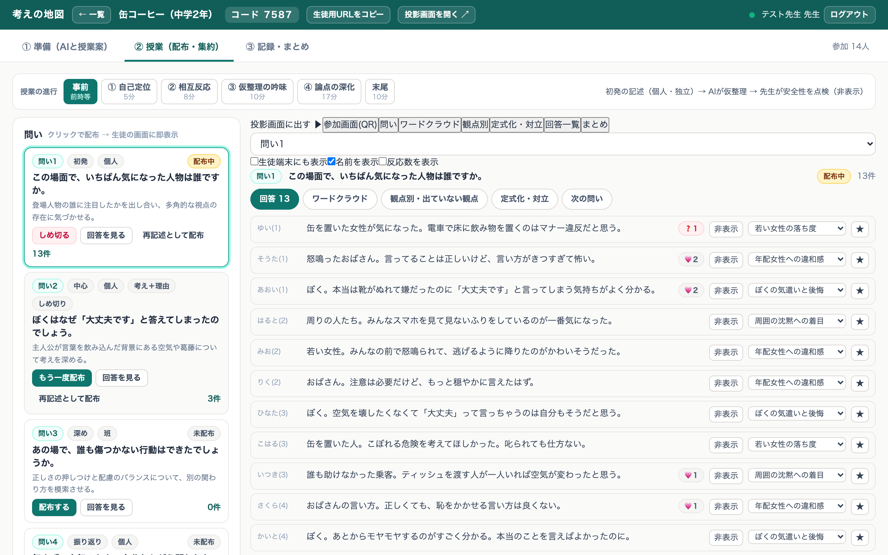
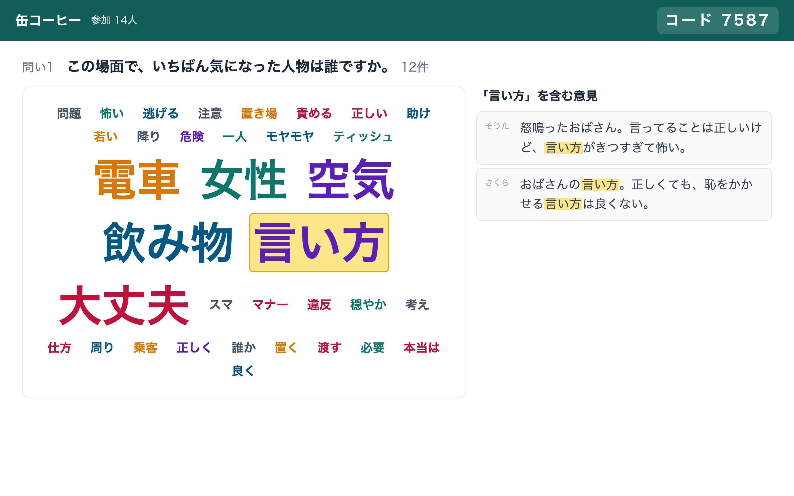
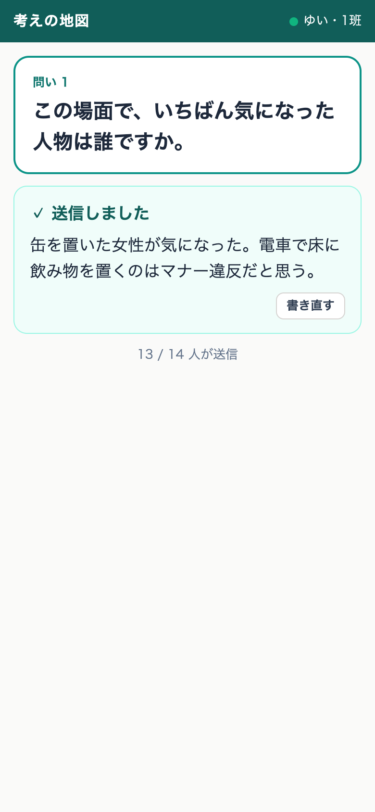

田川 翔千葉大学　2026年9月8日（火）

<!-- 8分。前半は画面遷移をスクショで、後半は設計とセキュリティの懸念。試作はCloud Run上で動いている。 -->

---

ねらい

## 話し合いを含む授業での2つの困難を、生成AIで解決するには？

<svg viewBox="0 0 1160 420" width="1160" height="420" xmlns="http://www.w3.org/2000/svg" font-family="Hiragino Kaku Gothic ProN, Hiragino Sans, Noto Sans JP, sans-serif"><defs><marker id="k2ma" viewBox="0 0 10 10" refX="9" refY="5" markerWidth="7" markerHeight="7" orient="auto"><path d="M0,0 L10,5 L0,10 z" fill="#A6192E"/></marker></defs><rect x="95" y="0" width="360" height="28" fill="#595959"/><text x="275" y="20" text-anchor="middle" class="k2hd">いまの授業での話し合い（口頭）</text><rect x="615" y="0" width="545" height="28" fill="#A6192E"/><text x="887" y="20" text-anchor="middle" class="k2hd">考えの地図</text><text x="0" y="100" class="k2lb">共有</text><text x="0" y="122" class="k2lbs">全員の考え</text><text x="0" y="310" class="k2lb">俯瞰</text><text x="0" y="332" class="k2lbs">議論の的</text><circle cx="140" cy="72" r="9" fill="#fff" stroke="#bfbfbf" stroke-width="1.4"/><circle cx="170" cy="72" r="9" fill="#fff" stroke="#bfbfbf" stroke-width="1.4"/><circle cx="200" cy="72" r="9" fill="#fff" stroke="#bfbfbf" stroke-width="1.4"/><circle cx="230" cy="72" r="9" fill="#A6192E"/><circle cx="260" cy="72" r="9" fill="#fff" stroke="#bfbfbf" stroke-width="1.4"/><circle cx="290" cy="72" r="9" fill="#fff" stroke="#bfbfbf" stroke-width="1.4"/><circle cx="320" cy="72" r="9" fill="#fff" stroke="#bfbfbf" stroke-width="1.4"/><circle cx="350" cy="72" r="9" fill="#fff" stroke="#bfbfbf" stroke-width="1.4"/><circle cx="380" cy="72" r="9" fill="#fff" stroke="#bfbfbf" stroke-width="1.4"/><circle cx="410" cy="72" r="9" fill="#fff" stroke="#bfbfbf" stroke-width="1.4"/><circle cx="140" cy="100" r="9" fill="#fff" stroke="#bfbfbf" stroke-width="1.4"/><circle cx="170" cy="100" r="9" fill="#A6192E"/><circle cx="200" cy="100" r="9" fill="#fff" stroke="#bfbfbf" stroke-width="1.4"/><circle cx="230" cy="100" r="9" fill="#fff" stroke="#bfbfbf" stroke-width="1.4"/><circle cx="260" cy="100" r="9" fill="#fff" stroke="#bfbfbf" stroke-width="1.4"/><circle cx="290" cy="100" r="9" fill="#fff" stroke="#bfbfbf" stroke-width="1.4"/><circle cx="320" cy="100" r="9" fill="#fff" stroke="#bfbfbf" stroke-width="1.4"/><circle cx="350" cy="100" r="9" fill="#fff" stroke="#bfbfbf" stroke-width="1.4"/><circle cx="380" cy="100" r="9" fill="#A6192E"/><circle cx="410" cy="100" r="9" fill="#fff" stroke="#bfbfbf" stroke-width="1.4"/><circle cx="140" cy="128" r="9" fill="#fff" stroke="#bfbfbf" stroke-width="1.4"/><circle cx="170" cy="128" r="9" fill="#fff" stroke="#bfbfbf" stroke-width="1.4"/><circle cx="200" cy="128" r="9" fill="#fff" stroke="#bfbfbf" stroke-width="1.4"/><circle cx="230" cy="128" r="9" fill="#fff" stroke="#bfbfbf" stroke-width="1.4"/><circle cx="260" cy="128" r="9" fill="#fff" stroke="#bfbfbf" stroke-width="1.4"/><circle cx="290" cy="128" r="9" fill="#A6192E"/><circle cx="320" cy="128" r="9" fill="#fff" stroke="#bfbfbf" stroke-width="1.4"/><circle cx="350" cy="128" r="9" fill="#fff" stroke="#bfbfbf" stroke-width="1.4"/><circle cx="380" cy="128" r="9" fill="#fff" stroke="#bfbfbf" stroke-width="1.4"/><circle cx="410" cy="128" r="9" fill="#fff" stroke="#bfbfbf" stroke-width="1.4"/><circle cx="146" cy="153" r="6" fill="#A6192E"/><text x="158" y="158" class="k2sm">発言できた</text><circle cx="272" cy="153" r="6" fill="#fff" stroke="#bfbfbf" stroke-width="1.4"/><text x="284" y="158" class="k2sm">声にならない考え</text><text x="95" y="182" class="k2cap">発言は数人。ほかの考えは表に出ないかも…</text><rect x="500" y="58" width="70" height="22" rx="11" fill="#595959"/><text x="535" y="74" text-anchor="middle" class="k2ph">生徒</text><text x="535" y="99" text-anchor="middle" class="k2arl">同時に書いて送る</text><line x1="470" y1="113" x2="600" y2="113" class="k2ar"/><rect x="741" y="65" width="22" height="15" fill="#F6E3E6" stroke="#A6192E" stroke-width="1.2"/><rect x="771" y="65" width="22" height="15" fill="#F6E3E6" stroke="#A6192E" stroke-width="1.2"/><rect x="801" y="65" width="22" height="15" fill="#F6E3E6" stroke="#A6192E" stroke-width="1.2"/><rect x="831" y="65" width="22" height="15" fill="#F6E3E6" stroke="#A6192E" stroke-width="1.2"/><rect x="861" y="65" width="22" height="15" fill="#F6E3E6" stroke="#A6192E" stroke-width="1.2"/><rect x="891" y="65" width="22" height="15" fill="#F6E3E6" stroke="#A6192E" stroke-width="1.2"/><rect x="921" y="65" width="22" height="15" fill="#F6E3E6" stroke="#A6192E" stroke-width="1.2"/><rect x="951" y="65" width="22" height="15" fill="#F6E3E6" stroke="#A6192E" stroke-width="1.2"/><rect x="981" y="65" width="22" height="15" fill="#F6E3E6" stroke="#A6192E" stroke-width="1.2"/><rect x="1011" y="65" width="22" height="15" fill="#F6E3E6" stroke="#A6192E" stroke-width="1.2"/><rect x="741" y="93" width="22" height="15" fill="#F6E3E6" stroke="#A6192E" stroke-width="1.2"/><rect x="771" y="93" width="22" height="15" fill="#F6E3E6" stroke="#A6192E" stroke-width="1.2"/><rect x="801" y="93" width="22" height="15" fill="#F6E3E6" stroke="#A6192E" stroke-width="1.2"/><rect x="831" y="93" width="22" height="15" fill="#F6E3E6" stroke="#A6192E" stroke-width="1.2"/><rect x="861" y="93" width="22" height="15" fill="#F6E3E6" stroke="#A6192E" stroke-width="1.2"/><rect x="891" y="93" width="22" height="15" fill="#F6E3E6" stroke="#A6192E" stroke-width="1.2"/><rect x="921" y="93" width="22" height="15" fill="#F6E3E6" stroke="#A6192E" stroke-width="1.2"/><rect x="951" y="93" width="22" height="15" fill="#F6E3E6" stroke="#A6192E" stroke-width="1.2"/><rect x="981" y="93" width="22" height="15" fill="#F6E3E6" stroke="#A6192E" stroke-width="1.2"/><rect x="1011" y="93" width="22" height="15" fill="#F6E3E6" stroke="#A6192E" stroke-width="1.2"/><rect x="741" y="121" width="22" height="15" fill="#F6E3E6" stroke="#A6192E" stroke-width="1.2"/><rect x="771" y="121" width="22" height="15" fill="#F6E3E6" stroke="#A6192E" stroke-width="1.2"/><rect x="801" y="121" width="22" height="15" fill="#F6E3E6" stroke="#A6192E" stroke-width="1.2"/><rect x="831" y="121" width="22" height="15" fill="#F6E3E6" stroke="#A6192E" stroke-width="1.2"/><rect x="861" y="121" width="22" height="15" fill="#F6E3E6" stroke="#A6192E" stroke-width="1.2"/><rect x="891" y="121" width="22" height="15" fill="#F6E3E6" stroke="#A6192E" stroke-width="1.2"/><rect x="921" y="121" width="22" height="15" fill="#F6E3E6" stroke="#A6192E" stroke-width="1.2"/><rect x="951" y="121" width="22" height="15" fill="#F6E3E6" stroke="#A6192E" stroke-width="1.2"/><rect x="981" y="121" width="22" height="15" fill="#F6E3E6" stroke="#A6192E" stroke-width="1.2"/><rect x="1011" y="121" width="22" height="15" fill="#F6E3E6" stroke="#A6192E" stroke-width="1.2"/><text x="615" y="182" class="k2cap">全員が同時に書いて送る。提出数と考えの分布が、その場で投影に出る</text><line x1="0" y1="200" x2="1160" y2="200" stroke="#d9d9d9"/><g transform="rotate(-5 195 277)"><rect x="150" y="262" width="90" height="30" fill="#fff" stroke="#8c8c8c" stroke-width="1.2"/><line x1="159" y1="277" x2="231" y2="277" stroke="#bfbfbf" stroke-width="2.4"/></g><g transform="rotate(4 295 271)"><rect x="250" y="256" width="90" height="30" fill="#fff" stroke="#8c8c8c" stroke-width="1.2"/><line x1="259" y1="271" x2="331" y2="271" stroke="#bfbfbf" stroke-width="2.4"/></g><g transform="rotate(-3 393 281)"><rect x="348" y="266" width="90" height="30" fill="#fff" stroke="#8c8c8c" stroke-width="1.2"/><line x1="357" y1="281" x2="429" y2="281" stroke="#bfbfbf" stroke-width="2.4"/></g><g transform="rotate(6 185 319)"><rect x="140" y="304" width="90" height="30" fill="#fff" stroke="#8c8c8c" stroke-width="1.2"/><line x1="149" y1="319" x2="221" y2="319" stroke="#bfbfbf" stroke-width="2.4"/></g><g transform="rotate(-6 285 315)"><rect x="240" y="300" width="90" height="30" fill="#fff" stroke="#8c8c8c" stroke-width="1.2"/><line x1="249" y1="315" x2="321" y2="315" stroke="#bfbfbf" stroke-width="2.4"/></g><g transform="rotate(3 383 323)"><rect x="338" y="308" width="90" height="30" fill="#fff" stroke="#8c8c8c" stroke-width="1.2"/><line x1="347" y1="323" x2="419" y2="323" stroke="#bfbfbf" stroke-width="2.4"/></g><g transform="rotate(-4 235 361)"><rect x="190" y="346" width="90" height="30" fill="#fff" stroke="#8c8c8c" stroke-width="1.2"/><line x1="199" y1="361" x2="271" y2="361" stroke="#bfbfbf" stroke-width="2.4"/></g><g transform="rotate(5 335 357)"><rect x="290" y="342" width="90" height="30" fill="#fff" stroke="#8c8c8c" stroke-width="1.2"/><line x1="299" y1="357" x2="371" y2="357" stroke="#bfbfbf" stroke-width="2.4"/></g><text x="95" y="392" class="k2cap">羅列のまま。どこが対立し、何が抜けているか見えない</text><rect x="500" y="266" width="70" height="22" rx="11" fill="#A6192E"/><text x="535" y="282" text-anchor="middle" class="k2ph">生成AI</text><text x="535" y="307" text-anchor="middle" class="k2arl">教員の観点で分ける</text><line x1="470" y1="321" x2="600" y2="321" class="k2ar"/><rect x="615" y="228" width="124" height="24" fill="#595959"/><text x="677" y="245" text-anchor="middle" class="k2ph">観点A</text><rect x="615" y="262" width="124" height="30" fill="#fff" stroke="#8c8c8c" stroke-width="1.2"/><line x1="625" y1="273" x2="729" y2="273" stroke="#262626" stroke-width="2.4"/><line x1="625" y1="283" x2="695" y2="283" stroke="#bfbfbf" stroke-width="2.4"/><rect x="615" y="300" width="124" height="30" fill="#fff" stroke="#8c8c8c" stroke-width="1.2"/><line x1="625" y1="311" x2="729" y2="311" stroke="#262626" stroke-width="2.4"/><line x1="625" y1="321" x2="695" y2="321" stroke="#bfbfbf" stroke-width="2.4"/><rect x="615" y="338" width="124" height="30" fill="#fff" stroke="#8c8c8c" stroke-width="1.2"/><line x1="625" y1="349" x2="729" y2="349" stroke="#262626" stroke-width="2.4"/><line x1="625" y1="359" x2="695" y2="359" stroke="#bfbfbf" stroke-width="2.4"/><rect x="755" y="228" width="124" height="24" fill="#595959"/><text x="817" y="245" text-anchor="middle" class="k2ph">観点B</text><rect x="755" y="262" width="124" height="30" fill="#fff" stroke="#8c8c8c" stroke-width="1.2"/><line x1="765" y1="273" x2="869" y2="273" stroke="#262626" stroke-width="2.4"/><line x1="765" y1="283" x2="835" y2="283" stroke="#bfbfbf" stroke-width="2.4"/><rect x="755" y="300" width="124" height="30" fill="#fff" stroke="#8c8c8c" stroke-width="1.2"/><line x1="765" y1="311" x2="869" y2="311" stroke="#262626" stroke-width="2.4"/><line x1="765" y1="321" x2="835" y2="321" stroke="#bfbfbf" stroke-width="2.4"/><rect x="895" y="228" width="124" height="24" fill="#595959"/><text x="957" y="245" text-anchor="middle" class="k2ph">観点C</text><rect x="895" y="262" width="124" height="30" fill="#fff" stroke="#8c8c8c" stroke-width="1.2"/><line x1="905" y1="273" x2="1009" y2="273" stroke="#262626" stroke-width="2.4"/><line x1="905" y1="283" x2="975" y2="283" stroke="#bfbfbf" stroke-width="2.4"/><rect x="895" y="300" width="124" height="30" fill="#fff" stroke="#8c8c8c" stroke-width="1.2"/><line x1="905" y1="311" x2="1009" y2="311" stroke="#262626" stroke-width="2.4"/><line x1="905" y1="321" x2="975" y2="321" stroke="#bfbfbf" stroke-width="2.4"/><rect x="895" y="338" width="124" height="30" fill="#fff" stroke="#8c8c8c" stroke-width="1.2"/><line x1="905" y1="349" x2="1009" y2="349" stroke="#262626" stroke-width="2.4"/><line x1="905" y1="359" x2="975" y2="359" stroke="#bfbfbf" stroke-width="2.4"/><rect x="1035" y="228" width="124" height="24" fill="#fff" stroke="#A6192E" stroke-width="1.6" stroke-dasharray="5 3"/><text x="1097" y="245" text-anchor="middle" class="k2phr">抜けている観点</text><rect x="1035" y="262" width="124" height="106" fill="#FDF3F4" stroke="#A6192E" stroke-width="1.6" stroke-dasharray="5 3"/><text x="1097" y="298" text-anchor="middle" class="k2sm">誰も書いていない</text><text x="1097" y="330" text-anchor="middle" class="k2rd">→ 次の問いの案</text><text x="1097" y="352" text-anchor="middle" class="k2sm">先生だけに示す</text><text x="615" y="392" class="k2cap">観点別に並び、抜けが見える。カードは考え（上の線）＋理由（下の線）</text></svg>

「共有」と「俯瞰」の過程に伴走し、深い論点に生徒/教師が到達することを支えるデザイン

<!-- 起点は「7段階モデル」のワードクラウドのデモ。2つの困難は、そのまま設計要件になった。 -->

---

授業モデル

## 局面ごとのアプリが担う点の整理 (藤川先生原稿より)

<svg viewBox="0 0 1160 430" width="1160" height="430" xmlns="http://www.w3.org/2000/svg" font-family="Hiragino Kaku Gothic ProN, Hiragino Sans, Noto Sans JP, sans-serif"><defs><marker id="m" viewBox="0 0 10 10" refX="9" refY="5" markerWidth="8" markerHeight="8" orient="auto"><path d="M0,0 L10,5 L0,10 z" fill="#262626"/></marker></defs><rect x="130" y="0" width="650" height="28" class="band"/><text x="290" y="19" text-anchor="middle" class="bt">上流：どの隔たりを突くかの設計</text><line x1="455" y1="4" x2="455" y2="24" stroke="#bfbfbf"/><text x="620" y="19" text-anchor="middle" class="bt">下流：同調の抑制と吟味の開放</text><text x="0" y="88" class="lb">〔事前〕</text><text x="0" y="198" class="lb">〔本時〕</text><text x="0" y="338" class="lb">〔末尾〕</text><rect x="130" y="48" width="190" height="64" class="bx"/><text x="225" y="75" text-anchor="middle" class="tx">全員が独立して</text><text x="225" y="97" text-anchor="middle" class="tx">初発の記述</text><line x1="322" y1="80" x2="358" y2="80" class="ar"/><rect x="360" y="48" width="190" height="64" class="bxg"/><text x="455" y="75" text-anchor="middle" class="tx">生成AIによる</text><text x="455" y="97" text-anchor="middle" class="tx">「仮の整理」</text><line x1="552" y1="80" x2="588" y2="80" class="ar"/><rect x="590" y="48" width="190" height="64" class="bx"/><text x="685" y="75" text-anchor="middle" class="tx">教師による</text><text x="685" y="97" text-anchor="middle" class="tx">安全性の点検</text><polyline points="780,80 1010,80 1010,138 105,138 105,190 127,190" class="ar"/><rect x="130" y="158" width="190" height="64" class="bx"/><text x="225" y="185" text-anchor="middle" class="tb">① 自己定位</text><text x="225" y="207" text-anchor="middle" class="sm">5分</text><line x1="322" y1="190" x2="358" y2="190" class="ar"/><rect x="360" y="158" width="190" height="64" class="bx"/><text x="455" y="185" text-anchor="middle" class="tb">② 相互反応</text><text x="455" y="207" text-anchor="middle" class="sm">8分</text><line x1="552" y1="190" x2="588" y2="190" class="ar"/><rect x="590" y="158" width="190" height="64" class="bxb"/><text x="685" y="185" text-anchor="middle" class="tb">③ 仮整理の吟味</text><text x="685" y="207" text-anchor="middle" class="sm">10分</text><line x1="782" y1="190" x2="818" y2="190" class="ar"/><rect x="820" y="158" width="190" height="64" class="bx"/><text x="915" y="185" text-anchor="middle" class="tb">④ 論点の深化</text><text x="915" y="207" text-anchor="middle" class="sm">17分</text><polyline points="685,224 685,252 245,252 245,226" class="dd"/><text x="465" y="270" text-anchor="middle" class="sm">意見の原文へ戻る</text><line x1="915" y1="224" x2="915" y2="296" class="ar"/><rect x="820" y="298" width="190" height="64" class="bx"/><text x="915" y="325" text-anchor="middle" class="tb">一人ひとりの再記述</text><text x="915" y="347" text-anchor="middle" class="sm">10分・AIは関与しない</text><rect x="130" y="384" width="250" height="40" class="bxp"/><text x="255" y="409" text-anchor="middle" class="tx">人間先行の原理</text><rect x="405" y="384" width="330" height="40" class="bxp"/><text x="570" y="409" text-anchor="middle" class="tx">可謬的・追認可能な整理の原理</text><rect x="760" y="384" width="250" height="40" class="bxp"/><text x="885" y="409" text-anchor="middle" class="tx">人間回帰の原理</text></svg>

人間が先に書き、AIは整理を支援する。最後は人間に戻る。

<!-- 授業モデルは論文の図。上流で「どの隔たりを突くか」を設計し、下流で同調を抑え、吟味を開く。 -->

---

局面と機能

## 局面ごとのアプリが担う点の整理 (藤川先生原稿より)

| 局面 | 時間 | 主な学習活動 | 考えの地図でのやり方 |
|---|---|---|---|
| 事前 | - | 初発の記述（個人・独立） | 問いを配布。AIが仮整理、先生が点検して非表示にできる |
| ①自己定位 | 5 | 仮の整理と自分の記述の照合 | 生徒端末に観点別を共有。「入りきらない」を押せる |
| ②相互反応 | 8 | 他者の意見の閲覧と反応 | 💗を付ける。反応数は全員の反応後に先生が出す |
| ③仮整理の吟味 | 10 | 分類の妥当性の検討と再分類 | ❓を付ける。先生が付け替え、AIの別案（別の軸）と比べる |
| ④論点の深化 | 17 | 理由・価値・前提の比較 | 定式化と対立の組を投影。対論喚起の問いを配布 |
| ⑤まとめ | 10 | 一人ひとりの再記述 | 初発を見ながら書く（中心の問いでも可）。AIは関与しない |

局面ごとの機能は、アプリの仕様と言える。マルチパス化できる可能性もあり。

<!-- 先生用画面の上に局面バーがあり、押すと投影と生徒端末の共有が推奨の形に切り替わる。 -->

---

全体の流れ

## 3つの種類の画面を、1つのデータベースで繋げばよいのでは？

<svg viewBox="0 0 1160 390" width="1160" height="390" xmlns="http://www.w3.org/2000/svg" font-family="Hiragino Kaku Gothic ProN, Hiragino Sans, Noto Sans JP, sans-serif"><defs><marker id="k3m" viewBox="0 0 10 10" refX="9" refY="5" markerWidth="7" markerHeight="7" orient="auto"><path d="M0,0 L10,5 L0,10 z" fill="#262626"/></marker></defs><rect x="115" y="0" width="250" height="32" fill="#595959"/><text x="240" y="22" text-anchor="middle" class="k3hd">事前（前時）</text><rect x="380" y="0" width="620" height="32" fill="#A6192E"/><text x="690" y="22" text-anchor="middle" class="k3hd">本時（50分）</text><rect x="1015" y="0" width="145" height="32" fill="#595959"/><text x="1087" y="22" text-anchor="middle" class="k3hd">記録</text><text x="436" y="54" text-anchor="middle" class="k3phn">①自己定位</text><text x="436" y="73" text-anchor="middle" class="k3pht">5分</text><text x="563" y="54" text-anchor="middle" class="k3phn">②相互反応</text><text x="563" y="73" text-anchor="middle" class="k3pht">8分</text><text x="690" y="54" text-anchor="middle" class="k3phn">③吟味</text><text x="690" y="73" text-anchor="middle" class="k3pht">10分</text><text x="817" y="54" text-anchor="middle" class="k3phn">④深化</text><text x="817" y="73" text-anchor="middle" class="k3pht">17分</text><text x="944" y="54" text-anchor="middle" class="k3phn">⑤まとめ</text><text x="944" y="73" text-anchor="middle" class="k3pht">10分</text><text x="0" y="112" class="k3lb">先生（PC）</text><text x="0" y="226" class="k3lb">投影</text><text x="0" y="247" class="k3sm">プロジェクタ</text><text x="0" y="340" class="k3lb">生徒</text><text x="0" y="361" class="k3sm">スマホ・PC</text><line x1="0" y1="174" x2="1160" y2="174" stroke="#d9d9d9"/><line x1="0" y1="288" x2="1160" y2="288" stroke="#d9d9d9"/><rect x="115" y="84" width="115" height="66" class="k3bx"/><text x="172" y="112" text-anchor="middle" class="k3tx">教材を読み</text><text x="172" y="133" text-anchor="middle" class="k3tx">AIと授業案</text><line x1="232" y1="117" x2="248" y2="117" class="k3ar"/><rect x="250" y="84" width="115" height="66" class="k3bx"/><text x="307" y="112" text-anchor="middle" class="k3tx">初発を配布し</text><text x="307" y="133" text-anchor="middle" class="k3tx">仮整理を点検</text><line x1="367" y1="117" x2="378" y2="117" class="k3ar"/><rect x="380" y="84" width="112" height="66" class="k3bxa"/><text x="436" y="112" text-anchor="middle" class="k3tx">観点別を</text><text x="436" y="133" text-anchor="middle" class="k3tx">生徒に共有</text><line x1="494" y1="117" x2="505" y2="117" class="k3ar"/><rect x="507" y="84" width="112" height="66" class="k3bx"/><text x="563" y="112" text-anchor="middle" class="k3tx">共感を開放</text><text x="563" y="133" text-anchor="middle" class="k3sm">反応数は後で</text><line x1="621" y1="117" x2="632" y2="117" class="k3ar"/><rect x="634" y="84" width="112" height="66" class="k3bx"/><text x="690" y="112" text-anchor="middle" class="k3tx">分け方を直す</text><text x="690" y="133" text-anchor="middle" class="k3tx">原文へ戻る</text><line x1="748" y1="117" x2="759" y2="117" class="k3ar"/><rect x="761" y="84" width="112" height="66" class="k3bxa"/><text x="817" y="112" text-anchor="middle" class="k3tx">定式化と対立</text><text x="817" y="133" text-anchor="middle" class="k3tx">問いを配布</text><line x1="875" y1="117" x2="886" y2="117" class="k3ar"/><rect x="888" y="84" width="112" height="66" class="k3bx"/><text x="944" y="112" text-anchor="middle" class="k3tx">再記述を配布</text><text x="944" y="133" text-anchor="middle" class="k3sm">AIは関与しない</text><rect x="1018" y="84" width="140" height="66" class="k3bx"/><text x="1088" y="112" text-anchor="middle" class="k3tx">初発と再記述</text><text x="1088" y="133" text-anchor="middle" class="k3tx">の対・CSV</text><text x="240" y="226" text-anchor="middle" class="k3sm">（授業前は使わない）</text><rect x="380" y="198" width="112" height="66" class="k3bx"/><text x="436" y="226" text-anchor="middle" class="k3tx">観点別</text><text x="436" y="247" text-anchor="middle" class="k3sm">仮の整理と明記</text><line x1="494" y1="231" x2="505" y2="231" class="k3ar"/><rect x="507" y="198" width="112" height="66" class="k3bx"/><text x="563" y="226" text-anchor="middle" class="k3tx">回答一覧</text><text x="563" y="247" text-anchor="middle" class="k3sm">共感の数は隠す</text><line x1="621" y1="231" x2="632" y2="231" class="k3ar"/><rect x="634" y="198" width="112" height="66" class="k3bx"/><text x="690" y="226" text-anchor="middle" class="k3tx">観点別＋原文</text><text x="690" y="247" text-anchor="middle" class="k3sm">疑問の数を出す</text><line x1="748" y1="231" x2="759" y2="231" class="k3ar"/><rect x="761" y="198" width="112" height="66" class="k3bx"/><text x="817" y="226" text-anchor="middle" class="k3tx">定式化と対立</text><text x="817" y="247" text-anchor="middle" class="k3sm">対論喚起の問い</text><line x1="875" y1="231" x2="886" y2="231" class="k3ar"/><rect x="888" y="198" width="112" height="66" class="k3bx"/><text x="944" y="226" text-anchor="middle" class="k3tx">問いだけ</text><text x="944" y="247" text-anchor="middle" class="k3sm">共有は切る</text><text x="1088" y="226" text-anchor="middle" class="k3sm">（先生だけが見る）</text><rect x="250" y="312" width="115" height="66" class="k3bx"/><text x="307" y="340" text-anchor="middle" class="k3tx">初発を書く</text><text x="307" y="361" text-anchor="middle" class="k3sm">個人・独立</text><line x1="367" y1="345" x2="378" y2="345" class="k3ar"/><rect x="380" y="312" width="112" height="66" class="k3bx"/><text x="436" y="340" text-anchor="middle" class="k3tx">自分の位置</text><text x="436" y="361" text-anchor="middle" class="k3sm">入りきらない</text><line x1="494" y1="345" x2="505" y2="345" class="k3ar"/><rect x="507" y="312" width="112" height="66" class="k3bx"/><text x="563" y="340" text-anchor="middle" class="k3tx">読んで共感</text><text x="563" y="361" text-anchor="middle" class="k3sm">数は見えない</text><line x1="621" y1="345" x2="632" y2="345" class="k3ar"/><rect x="634" y="312" width="112" height="66" class="k3bx"/><text x="690" y="340" text-anchor="middle" class="k3tx">疑問を付ける</text><text x="690" y="361" text-anchor="middle" class="k3sm">分け方に疑問</text><line x1="748" y1="345" x2="759" y2="345" class="k3ar"/><rect x="761" y="312" width="112" height="66" class="k3bx"/><text x="817" y="340" text-anchor="middle" class="k3tx">理由・前提を</text><text x="817" y="361" text-anchor="middle" class="k3tx">比べて答える</text><line x1="875" y1="345" x2="886" y2="345" class="k3ar"/><rect x="888" y="312" width="112" height="66" class="k3bx"/><text x="944" y="340" text-anchor="middle" class="k3tx">初発を見て</text><text x="944" y="361" text-anchor="middle" class="k3tx">書き直す</text><rect x="1018" y="312" width="140" height="66" class="k3bx"/><text x="1088" y="340" text-anchor="middle" class="k3tx">自分の変化</text><text x="1088" y="361" text-anchor="middle" class="k3tx">を見る</text></svg>

先生の操作は、局面の切り替えのみ。学生の画面が連動。赤い箱は、AIが下書きする場面。

<!-- 横が時間、縦が3画面。赤い箱（観点別の共有・定式化）にだけAIの下書きが入る。ほかは人の操作。 -->

---

事前準備

## 資料から授業案を、AIと一緒に組む

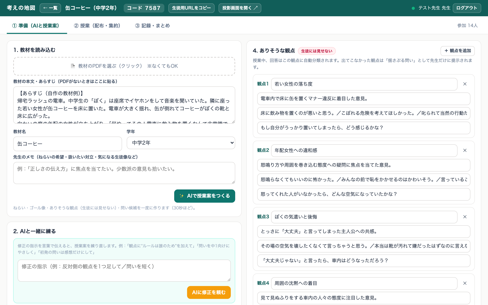

先生用画面「準備」。観点は生徒に見えず、教員だけが俯瞰する。

- **PDFか本文から、案が一度に出る**
  ねらい・ゴール像・観点・問い候補（30秒）。
- **観点には「揺さぶる問い」を持たせる**
  「想定した点」と「授業中の観点」を俯瞰。
- **修正は言葉で指示して反復的に変えられる**
  「反対側の観点を足して」「問いを短く」。
- **授業の流れも事前に組む**
  局面の順番・分数・投影・共有をアレンジ出来る。

授業案は一発生成ではなく、先生の指示で練り直す前提で作った

<!-- 教材は教科書のPDFをそのまま読ませられる。今日の例は自作のあらすじ。ねらいとゴール像は編集できる。 -->

---

授業への生徒の参加

## 生徒はコードとニックネームだけで入れる

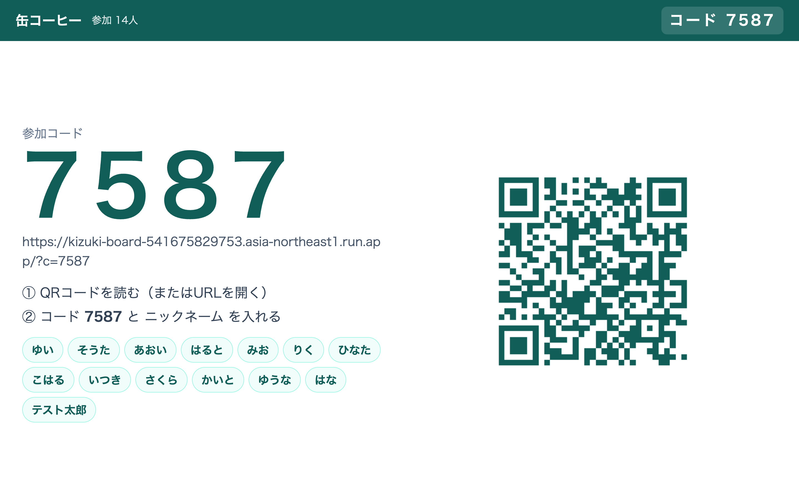

投影：4桁コードとQR。参加者が並ぶ

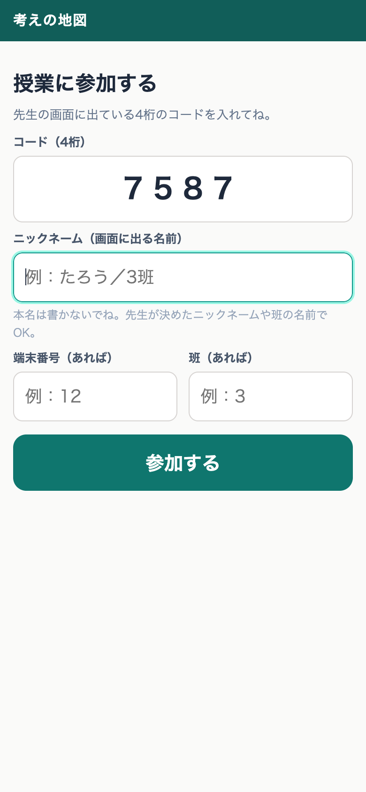

生徒：参加

生徒：送信後

ログインを不要。機密入力不可。端末番号から、再読み込みしても同じ人として認識。

<!-- Slidoと同じ入り方。班活動なら「3班」をニックネームにして1台で送れる。 -->

---

授業・配布

## 教員が配布した瞬間に、生徒の端末の表示が切り替わる

先生：左で配布、右に回答が集まる（観点は自動分類）

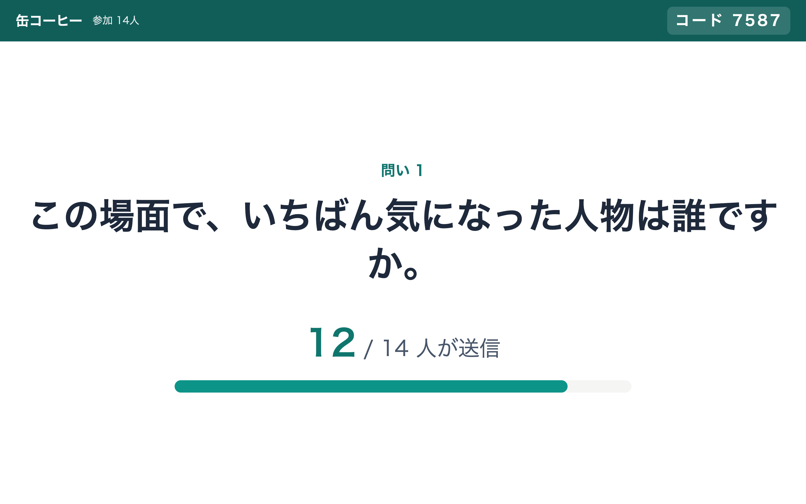

投影：問いと提出数だけを大きく出す

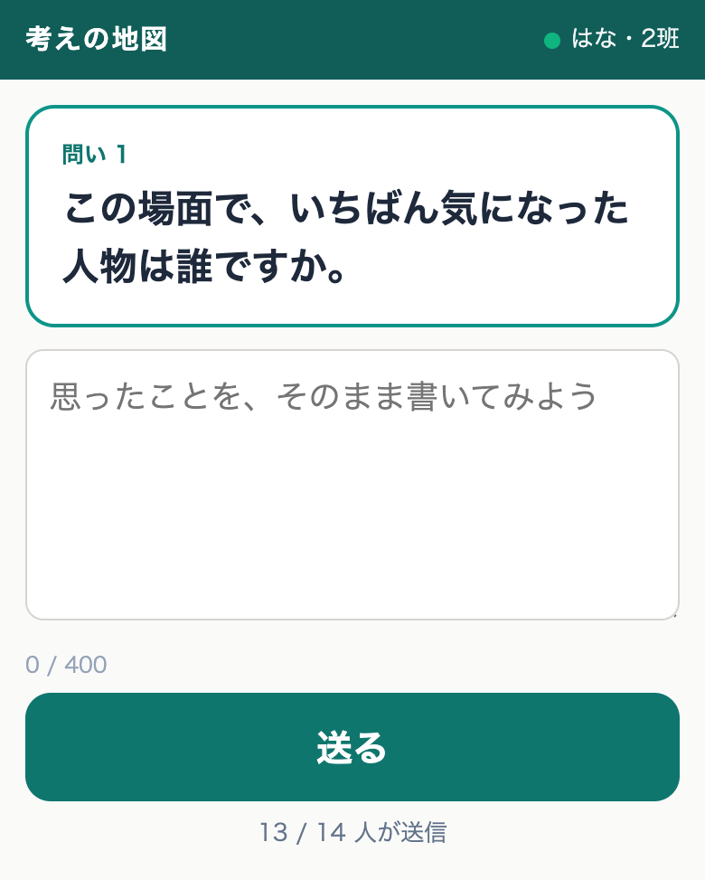

生徒：手元に同じ問いが出る

回答は送られてから数秒で、先生が用意した観点に分類される

<!-- 右の分類は手で直せる。★を付けると投影で目立つ。 -->

---

授業・投影

## ワードクラウドと観点別で、学級全体を見渡す

語をクリックすると、その語を含む意見が右に出る

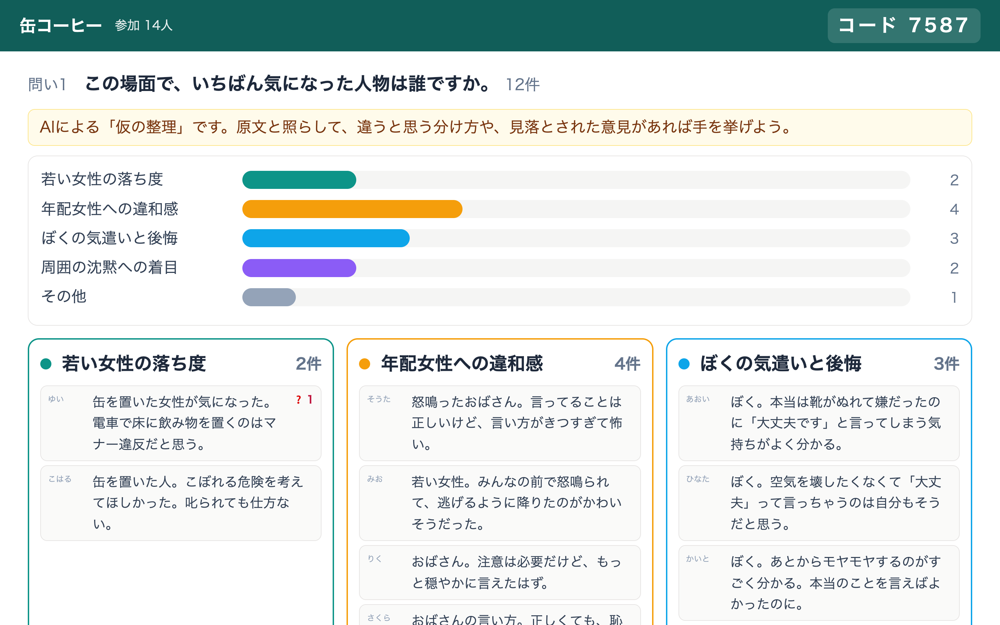

観点別。先生が「投影に含める」と決めた観点だけ映る

生徒に見せる観点は先生が選ぶ。出ていない観点は投影に載らない

<!-- ワードクラウドはブラウザ内の分かち書きで即時。観点別はAI分類の結果。 -->

---

局面 ①〜③ 生徒端末

## 自分の考えを授業の概念の地図上に置き、分け方を疑う

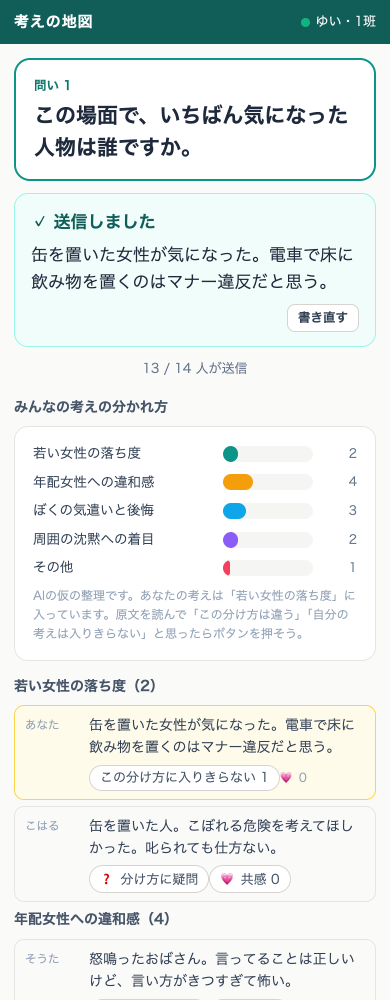

生徒端末に共有した観点別。自分の考えは色付きで示す

- **①自己定位：自分の記述がどこに置かれたか？**
  収まらないと感じたら「この分け方に入りきらない」を押す。
  先生の手元に集まる。
- **②相互反応：配布された投影ページで💗を付ける**
  先生の「投影ページを配布」で生徒端末が投影タブに切り替わる。数は全員の反応後に出す。
- **③仮整理の吟味：分け方に❓を付ける**
  先生は付け替え、原文へ戻る。整理そのものを吟味の対象にする。

複数の観点わけをしつつ、自分の意見や他者の意見から、気づきを形成する

<!-- 生徒端末の共有は先生のチェック1つ。局面バーを押すと推奨の共有に切り替わる。 -->

---

局面 ② 授業・次の問い

## 出てこなかった観点が、先生だけ表示される / 先生は観点を切り替えられる

観点別：0件の観点に「揺さぶる問い」が付く

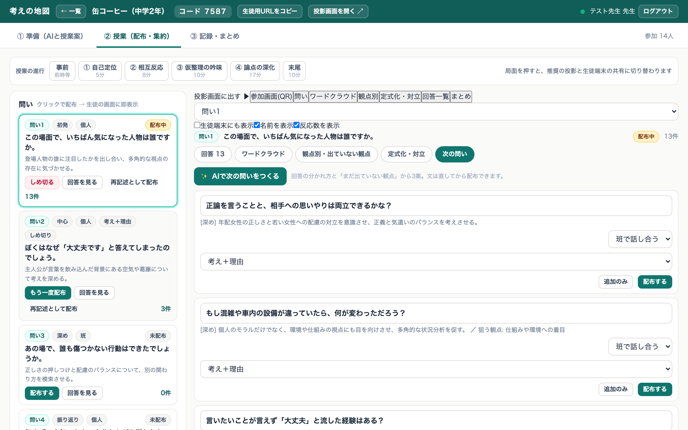

次の問い：分布と未出の観点から3案。直してから配布

想定したのに出なかった観点が、揺さぶる問いとして先生に残る

<!-- 実測では次の問い3案が3秒で返る。文は配布前に直せる。 -->

---

④ 論点の深化

## 定式化した意見を対で投影し、対論喚起の問いを配る

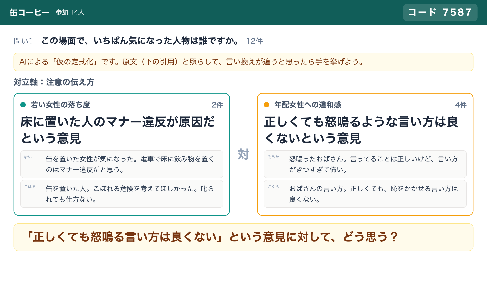

投影：対立する2つの定式化と件数、根拠の原文、「…に対して、どう思う？」

先生：AIの定式化を直し、投影する組を選び、問いを配布する

教師の定式化と対論喚起（森, 2023）の一部を、AIが事前に下書きるつことは可能か？

<!-- 森（2023）の技法：定式化＋発問タグ、「Xに対してどうか」。AIは下書きで、文は先生が直す。少数意見は件数で見える。 -->

---

AIの位置づけ

## AIは対話相手ではなく、意見を仮に整理して人に返す媒介者として機能？

- **生徒はAIと話さない**
  生徒の画面にAIは出てこない。AIは回答を観点に仮分けし、先生の手元に次の問いの案を返すだけ。
- **整理は「仮」で、先生も生徒も直せる**
  先生は付け替え、「その他」から観点を立て、AIに別の軸の案を2つ出させて比べる。生徒は ❓ を付けられる。
- **観点を「落としどころ」にしない**
  観点の一覧は生徒に見せず、期待される答えの推測を招かない。原文と照らして整理そのものを学級で吟味し、より考えたい方向へ教師が発問するのを支える。

AIを疑える設計をどう入れるか？：仮の整理を、原文と照らして学級で吟味する？

<!-- 投影の観点別には「AIによる仮の整理です」と固定で出る。学級で分け方を疑うところまでが授業。 -->

---

⑤ まとめ

## 初発を見ながら、一人ひとりが書き直す

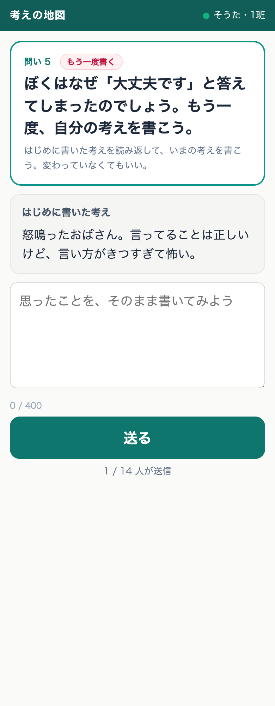

再記述の画面。上に「はじめに書いた考え」、下に書き直す欄

- **AIは関与しない**
  再記述の問いは分類も定式化もしない。人間に戻す。
- **同じ問いでも、中心の問いでもよい**
  先生が配布時に文を決める。初発の記述はどちらでも横に出る。
- **変わっていなくてもよい、と画面に書く**
  期待される方向へ寄せる誘因を減らす。

人間回帰の原理：最後の記述にAIを入れない

<!-- 再記述は「再記述として配布」ボタン1つ。文は中心発問に変えられる。 -->

---

終了後の記録

## 初発と再記述の対を、変化を見る資料にする

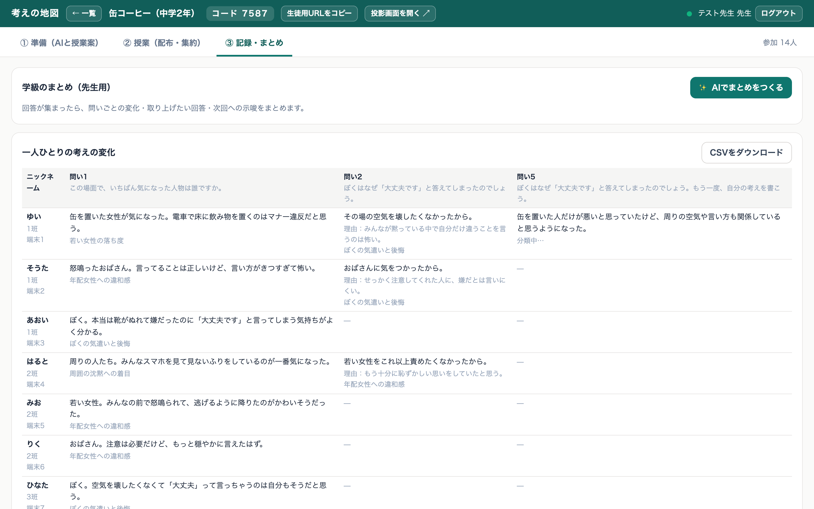

先生用画面「記録」。問い×生徒の一覧とCSV

- **初発と再記述（または中心の問い）を、生徒ごとに並べる**
  一面的な見方から多面的な見方へ動いたかを、本人と学級が読む。
- **序列化や評点には使わない**
  評価を意識すると「落としどころ」へ寄る。CSVも記述だけで、点数は出さない。
- **AIが学級のまとめを作る（先生用）**
  流れの要約、取り上げたい回答、次回への示唆を返す。

初発と再記述の対は、変化を捉える資料であって評価の道具にしない

<!-- 授業データは60日で自動削除。残したいものはCSVで持ち出す。 -->

---

インフラ設計

## Cloud Run と Firestore と Gemini で設計

<svg viewBox="0 0 600 330" width="600" height="330" xmlns="http://www.w3.org/2000/svg" font-family="Hiragino Kaku Gothic ProN, Hiragino Sans, Noto Sans JP, sans-serif"><defs><marker id="m2" viewBox="0 0 10 10" refX="9" refY="5" markerWidth="8" markerHeight="8" orient="auto"><path d="M0,0 L10,5 L0,10 z" fill="#262626"/></marker></defs><rect x="0" y="30" width="150" height="52" class="b"/><text x="75" y="52" text-anchor="middle" class="t">先生（PC）</text><text x="75" y="72" text-anchor="middle" class="s">準備・配布・投影切替</text><rect x="0" y="120" width="150" height="52" class="b"/><text x="75" y="142" text-anchor="middle" class="t">投影（プロジェクタ）</text><text x="75" y="162" text-anchor="middle" class="s">読み取りだけ</text><rect x="0" y="210" width="150" height="52" class="b"/><text x="75" y="232" text-anchor="middle" class="t">生徒（スマホ・PC）</text><text x="75" y="252" text-anchor="middle" class="s">コード＋ニックネーム</text><text x="0" y="300" text-anchor="start" class="s">どれもブラウザだけで動く</text><rect x="220" y="80" width="200" height="140" class="ba"/><text x="320" y="110" text-anchor="middle" class="t">Cloud Run</text><text x="320" y="135" text-anchor="middle" class="s">考えの地図（Node.js）</text><text x="320" y="157" text-anchor="middle" class="s">SSEで3画面を同期</text><text x="320" y="179" text-anchor="middle" class="s">失敗時は2.5秒ポーリング</text><text x="320" y="201" text-anchor="middle" class="s">東京リージョン</text><line x1="152" y1="56" x2="218" y2="120" class="a"/><line x1="152" y1="146" x2="218" y2="150" class="a"/><line x1="152" y1="236" x2="218" y2="180" class="a"/><rect x="450" y="40" width="150" height="80" class="b"/><text x="525" y="66" text-anchor="middle" class="t">Firestore</text><text x="525" y="88" text-anchor="middle" class="s">1授業＝1文書</text><text x="525" y="108" text-anchor="middle" class="s">60日で自動削除</text><rect x="450" y="180" width="150" height="80" class="b"/><text x="525" y="206" text-anchor="middle" class="t">Vertex AI</text><text x="525" y="228" text-anchor="middle" class="s">Gemini 3.8 Flash</text><text x="525" y="248" text-anchor="middle" class="s">JSONで分類・生成</text><line x1="422" y1="120" x2="448" y2="90" class="a"/><line x1="422" y1="180" x2="448" y2="210" class="a"/></svg>

| 項目 | 選んだもの（理由） |
|---|---|
| 同期 | SSE＋ポーリング。学校の回線でも動く |
| 保存 | Firestore。1授業1文書、60日で削除 |
| AI | Gemini 3.8 Flash。分類は数秒（実測） |
| 認証 | 教員名＋合言葉。GWSログイン不要 |
| 費用 | 従量課金。待機中は課金なし |

教員は自分の授業一覧をサーバ側で持つ。同じ教員名と合言葉なら別のPCからも開ける。

ブラウザだけで動く。使わない時間は課金されない

<!-- GCPは自分のアカウント。Cloud Runは1インスタンス固定で、SSEの整合を単純にしている。 -->

---

実装に向けて

## セキュリティの懸念：個人情報を持たない設計を保てるか

- **いまの設計は、ニックネームと端末番号しか預からない**
  氏名・学籍番号・メールを入れない運用にする。授業データは60日で自動削除する。
- **Googleログインをするほうが安全**
  なりすましやいたずら投稿を止められる。しかし、ログイン情報をappがもってしまう。
- **Googleログインし、名前と学籍を与えない限り、個人情報の取り扱いにはならない**
  運用で担保する。参加画面に「本名は書かない」と固定で出す？
- **機密性2の情報を扱うなら、千葉大はクラウドサービスのチェックリストが要る**
  教材と回答が学内限定の情報に当たるかを先に判定する（手続きの正式名称は要確認）。

個人情報を持たない設計を保つか、ログインで統制するかを仕様上決める必要がある

<!-- 公開URL＋4桁コードなので、コードを知れば誰でも入れる。授業中だけ有効にする運用と、ログインの導入を比べて決めたい。 -->

---

<!-- _class: qa -->

おわりに

# ありがとうございました

## 先生用画面　https://kizuki-board-541675829753.asia-northeast1.run.app/t

<!-- 試したい方はQRから。教員名と合言葉を決めるだけで始められる。 -->
