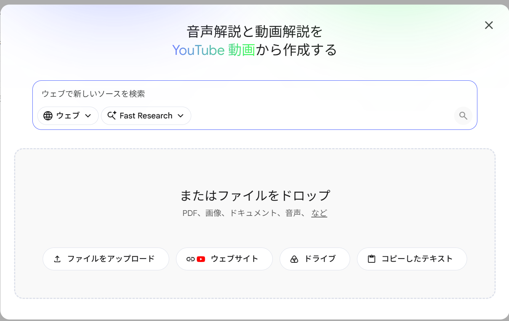
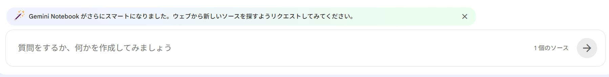
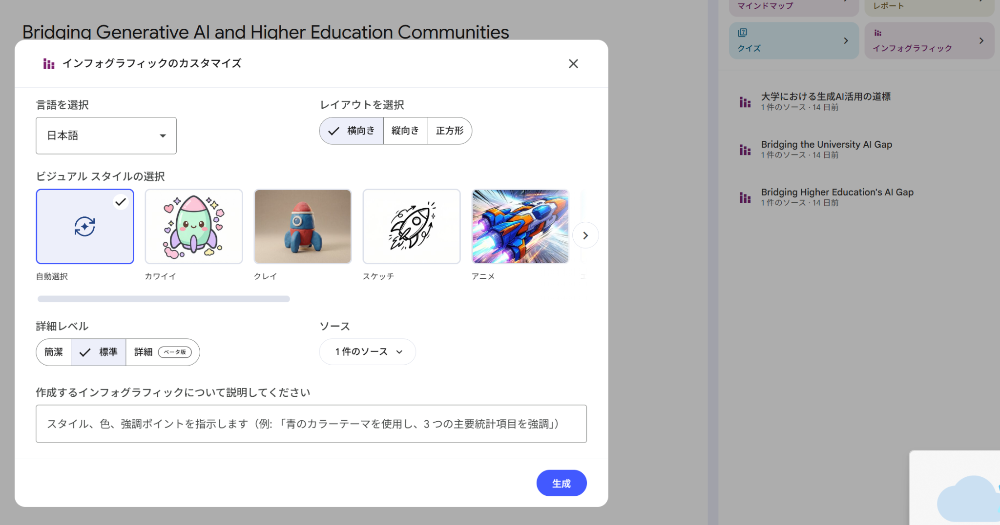

# はじめに（全テーマ共通）

明海大学 不動産学部 FD講習会 #2
生成AIで、授業と業務の「試作」をつくる

2026年10月1日（木）

---

## この時間でつくるもの

グループの方と教え合いながら進めてください。数人で1台のパソコンに入力する形でも、全員がそれぞれ生成AIを使う形でも構いません。

この時間のゴールは、ひとつだけです。

> **12月3日までに自分の授業や業務で実際に試せる「試作品/アイデア/計画」を1つ作って、持ち帰ること。**

完成品でなくて構いません。うまくいかなくても大丈夫です。作りかけでも提出してください。第3回（12月3日）では、この試作を実際に試してみた結果を伺います。

**注意点：機密情報・個人情報は、生成AIにも、共有する資料にも入れないようにお願いいたします。**

---

## いちばん大事なルール：困ったら、この紙をAIに貼って聞く

手が止まったら、この手順書の困っているところを、そのままコピーしてAIに貼ってください。そして、こう聞いてみてください。

```
いまこの手順に取り組んでいます。
〔ここに手順書の該当箇所を貼る〕
〔　　　　　〕のところで詰まりました。
次に何をすればよいか、パソコンに詳しくない人にも分かるように、順番に教えてください。
```

これは「ずるい方法」ではありません。本日、いちばん練習してほしいことです。やりたいことを実現する過程で、AIをどんどん使ってください。

**相談の順番：隣の人に聞く → AIに聞く → 手を挙げる**

AIへの入力とその回答を、周囲の方と一緒に試行錯誤することが、最初期では最もよい学び方だと講師は感じています。そのうち、動画で調べたり、AIに尋ねたりして使えるようになります。講師がいなくてもうまくいくのが、到達点です。

---

## 時間の目安

| 時刻 | すること |
|---|---|
| 13:19 – 13:31 | 全員で：Gemini Notebook に研修資料を入れ、質問し、スライドを作ります（講師と一緒に） |
| 13:31 – 13:34 | ワークの進め方を聞き、テーマごとの班に分かれます |
| 13:34 – 13:40 | 1：テーマの手順書を読み、どのシナリオをやるか決めます |
| 13:40 – 14:00 | 2：実際にAIを使って、試作をつくります |
| 14:00 – 14:10 | 3：共有用のスライドをまとめ、（試作を共有する場合は）リンクを貼って提出します |
| 14:10 | 提出の締切です。手を止めてください |
| 14:10 – 14:24 | 各班から、つくったものと「12/3までに試すこと」を伺います |
| 14:30 – 17:00 | 個別のご相談を承ります（会場に残ります。任意です） |

14:30以降も講師は会場におります。時間内に終わらなかったところ、ご自身の科目に合わせた作り込み、うまく動かなかった設定などは、この時間にご相談ください。

---

## AIへの頼み方の基本（4つの要素）

うまく答えが返らないときは、次の4つが書けているかを確かめてください。

| 要素 | 書くこと | 例 |
|---|---|---|
| 役割（ペルソナ） | AIに何者として答えてほしいか | あなたは、不動産学部の教務に詳しいアドバイザーです。 |
| 課題（タスク） | してほしいこと | 課題文の下書きを作ってください。 |
| 背景情報 | 相手・場面・条件 | 読み手は2年生40名です。到達目標は次のとおりです。〔シラバスを貼る〕 |
| 出力形式 | 長さ・文体・構成 | 800字程度、敬体、最後に評価の観点を3つ。 |

人に仕事を頼むときと同じ書き方です。新任の方に頼むつもりで書くと、ちょうどよい詳しさになります。出力の見本を1つ付けると、さらに安定します。

---

## 今日、AIに入れてはいけないもの

- 学生の個人情報（氏名、学籍番号、連絡先、成績、健康に関する情報）
- 教職員の個人情報、人事に関する情報
- 未公開の学内資料（入試問題、決裁前の文書、契約書）
- 顧客・取引先の氏名や住所、取引条件、未公開の物件情報

今日は、公開されている情報か、ご自身が作った資料か、手順書に印刷してある架空のデータで実施してください。教科書、購入した書籍のPDF、論文の本文、他の先生の資料は入れないでください。会議の録音や議事録も、機密でないもので練習してください。

AIに「入力する」ことは、外部のサーバーに「送信する」ことと同じです。外に出た情報は、取り戻せません。

貴学に生成AIの利用方針があれば、そちらを優先してください。

---

## 全テーマ共通のワーク

### Step 1　使う生成AIの安全性を、自分の目で確かめる

① `https://gemini.google.com/app` を開きます。
→ 画面の下のほうに、文章を打ち込む横長の入力欄が見えていれば、正しい画面です。

② 画面の右上にある丸いアイコン（自分のアカウントのアイコン）を押して、**明海大学のGoogleアカウント**でサインインしているかを確かめます。
→ 大学のメールアドレスが表示されていれば、正しい状態です。
→ 個人のGmailのアドレスが出ていたら、そこから大学のアカウントに切り替えてください。**ここは必ず確かめてください。**

③ 画面の左下にある設定（⚙️のアイコン）を押し、〈アクティビティ〉にあたる項目を開きます。

④ 表示された説明を読みます。
→ 自分の入力が学習に使われない扱いになっていることが読み取れれば、業務で使ってよい状態です。
→ 読んでも判断がつかないときは、その画面の文章をコピーして、Gemini の入力欄に貼り、次のように聞いてください。

```
これは、私が入力した内容がAIの学習に使われる設定ですか。
使われない設定ですか。パソコンに詳しくない人にも分かるように説明してください。
［ここに、いま読んだ画面の文章を貼り付けてください］
```

**［応用］自分が契約している他のシステムを確かめる**

そのサービスのAIポリシー、なければプライバシーポリシーのページを開き、本文をコピーして、次のように聞いてください。

```
このツールに、大学の業務上の情報を入力するのは安全ですか。
プライバシーポリシーを貼り付けますので、確認してください。
判断が分かれる点があれば、「学内で確認が必要です」と書いてください。
［プライバシーポリシーをコピーして貼り付ける］
```

---

### Step 2　研修資料を、質問できる状態にする（全員で一緒に行います）

① `https://notebook.google.com/?icid=home_maincta` を開きます。（Gemini Notebook。以前は NotebookLM という名前でした）
→ ノートブックの一覧と、［新規作成］にあたるボタンが見えていれば、正しい画面です。

② ［新規作成］を押します。

③ ［ソースを追加］を押して、次の2つを入れます。
- 本日の研修資料のPDF（ダウンロードしてから、ドロップまたはファイルを選んでアップロード）
- 第1回（7月2日）の研修資料のPDF（同じ方法で）

→ 左側にソースが2つ並んで見えていれば、正しい状態です。
→ 資料のURLがある場合は、〈ウェブサイト〉を選んでURLを貼るだけでも構いません。

{12.5cm}

④ 下の文をコピーして、チャットの入力欄に貼り、送信します。埋めるところはありません。

{14cm}

```
第1回と第2回の資料をもとに、次の3つを教えてください。出典（どちらの資料の何ページか）も添えてください。
1. 学生に生成AIとどう関わってほしいか、について、資料が勧めていること
2. 生成AIに入れてはいけない情報
3. 課題を「AIがある前提」で作り替えるときの手順
```

→ ソースの中から、出典つきで答えが返ってきます。

Gemini アプリと Gemini Notebook の違いを、先に一言で覚えてください。**Gemini アプリは「その都度、webから検索して答える」、Gemini Notebook は「渡した資料の中だけで答える」**です。根拠がはっきりしていないと困るものは、Gemini Notebook が向いています。

---

### Step 3　スライドを1本つくる（全員で一緒に行います）

① Step 2 のノートブックを開いたまま、画面の右側にある〈スタジオ〉の中の ［スライド］にあたるボタン を押します。
→ カスタマイズの画面が開けば、正しい画面です。

② 指示の欄に、次の文を貼り付けて、送ります。埋めるところはありません。

```
不動産学部の学生に配る「この授業での生成AIとの付き合い方」という復習用スライドを、5枚以内で作ってください。
1枚目はタイトル、2枚目は「使ってよい場面と、使わない場面」、3枚目は「入れてはいけない情報」、
4枚目は「AIの答えを確かめる方法」、5枚目は「困ったときの相談先」にしてください。
文字は大きく、1枚に3項目までにしてください。
```

③ できあがるまで、1〜2分待ちます。
→ 右側にスライドが並んで見えれば、できています。

④ 中身を、ご自分の目で確かめます。資料に無いことが書かれていないか、言い過ぎ・省きすぎがないかを見ます。
→ 直したいところがあれば、指示の欄に「〔直したいこと〕を直して、作り直してください」と入れて、もう一度作ります。

⑤ できあがったスライドを開き、〈ダウンロード〉または〈エクスポート〉にあたるボタンがあれば押して保存します。
→ 見当たらないときは、スクリーンショットで構いません。
→ スクリーンショットの撮り方：Windows の場合は、Windows キー ＋ Shift ＋ S を同時に押し、撮りたい範囲をドラッグで囲みます。Mac の場合は command ＋ shift ＋ 4 です。

ここまでが、全員で一緒に行う部分です。ここから、テーマごとの手順書に進みます。

---

### Step 4　グループワークを進行

→ 各シナリオをご参照下さい。

---

### Step 5　提出用のスライド（またはインフォグラフィック）をつくる（グループワークの最後に行います）

グループワークでつくったものを、同じ Gemini Notebook に入れて、共有用の1枚にします。

① Step 2 のノートブックを開き、［ソースを追加］→〈コピーしたテキスト〉で、グループでつくった文章（課題文・方針文・Gemの指示文など）を貼り付けます。

② 〈スタジオ〉の中の ［インフォグラフィック］（1枚の図にしたいとき）、または ［スライド］（数枚で見せたいとき）を押します。

{14cm}

③ 指示の欄に、次の文を貼り付けて、（　）を埋めます。

```
明海大学 不動産学部 FD講習会で、生成AIを試すワークを行いました。
その結果を、同僚の先生方に共有したいです。

私たちのグループは（　　　　　）です。これは、左上に出してください。
取り組んだお題は（　　　　　　　　　　）です。これは、上部中央に出してください。

左側の上に、課題感とやってみたことを並べてください。
やってみたことは、以下のとおりです。
（　やってみたこと：箇条書き　）
（　やってみたこと：箇条書き　）
（　やってみたこと：箇条書き　）

左側の下に、うまくいったかどうかの結果と、実際に使えると思ったかを書いてください。
（　結果：箇条書き　）
（　結果をみた感想：箇条書き　）

右上に、AIが出力した内容を出してください。適宜、スクリーンショットを活用してください。

右下に、「12月3日までに試すこと」を1行で大きく出してください。
（　12/3までに試すこと：誰が・どの科目や業務で・何をするか　）
```

④ 良いものが出るまで、指示を直しながら何回か作ってみてください。

{15cm}

一発できれいなものにはなりません。伝えたいことを箇条書きで渡さないと、ほしいものは出てきません。他の人に資料作成を頼むのと同じだけの指示が必要です。出てきたものに、言い過ぎ・省きすぎ・事実でない記述がないかを、必ずご自分の目で確かめてください。

うまく出ないときは、紙に（グループ名・お題・やってみたこと・結果・12月3日までに試すこと）を書いて写真を撮り、共有用のスライドに貼るか、下の Drive フォルダに入れたものでも構いません。

---

## 提出するもの

提出していただくのは、**共有用のスライド1枚だけ**です（14:10 締切）。つくった試作そのものは、共有できる形になっていれば、そのスライドの下部にリンクを貼って学内に共有してください（任意）。

### ① 提出物：スライド、またはインフォグラフィック（必須）

Step 5 で作ったものです。**「12月3日までに試すこと」が必ず入っている状態**にしてください。

### ② 試作へのリンク（任意）

つくったものそのものです。文章、課題文、Gem、Gemini Notebook のノート、いずれでも構いません。共有リンクを、提出するスライドの下部に貼ってください。

- **Gem を作った方**：一覧で ［共有］ を押し、範囲は「組織内」、権限は「閲覧者」を選んで ［リンクをコピー］ を押します。
- **Gemini Notebook を作った方**：［共有］ → ［リンクをコピー］ でURLを取ります。
- **文章をつくった方**：Google ドキュメントに貼って、共有リンクを取ります。

→ 共有ボタンが押せない、エラーが出るというときは、深追いしないでください。下のDriveフォルダにファイルを置いていただければ結構です。中身の文章をまるごとコピーしていただく形でも、受け取った方が同じものを作れます。

### 提出先

▶ **提出（必須）：共有用のスライド**
`https://docs.google.com/presentation/d/1bagZ1tpZqjxRxjVeknKsLvwjS4lamCZpr7r1m2y6mW0/edit`

▶ **ファイル置き場（任意）：Drive フォルダ**
`https://drive.google.com/drive/folders/1whY8DF5977zJoFkQZ9HnQi7_-7BvpshY`

ファイルで出される場合は、Drive フォルダの中に班の名前を付けたフォルダを作って入れてください。

---

## 12月3日までに試すこと

提出するスライドの右下に、次の1行を必ず入れてください。第3回は、ここから始めます。

| 欄 | 書くこと | 例 |
|---|---|---|
| 誰が | お名前 | 明海 太郎 |
| どこで | 科目名、または業務名 | 2年次「不動産取引」の第10回 |
| 何を | 今日つくった試作を、どう使うか | 改訂した課題文を配り、AI利用の記録も一緒に提出させる |
| 何を見るか | 試したあとに確かめたいこと | 学生がどこでAIを使ったと書いてくるか |

「何を見るか」だけは、なるべく具体的に書いてください。12月3日に、ここを伺います。

---

本手順書は生成AI（Claude）で下書きし、講師が検証しました。内容の責任は田川にあります。
